# 人工智能在魔法聚会中

> 原文：<https://towardsdatascience.com/artificial-intelligence-in-magic-the-gathering-4367e88aee11?source=collection_archive---------6----------------------->

## [实践教程](https://towardsdatascience.com/tagged/hands-on-tutorials)

## 第一部分:数据科学之旅

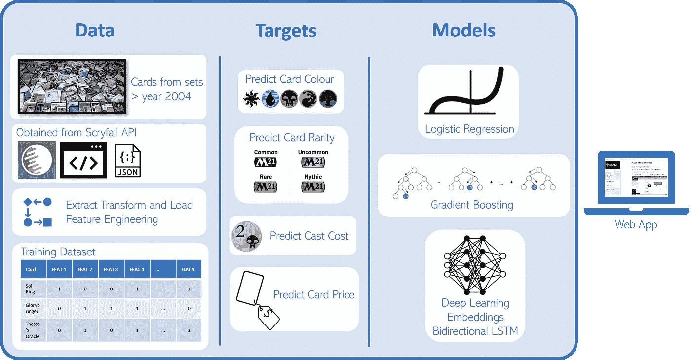

这是一个一页的总结，应该有助于整体方法的解释。图片作者。

请允许我以结尾开始这篇文章**,以展示我最终能够开发的**应用**,来展示**人工智能模型**,这些模型被训练来预测(可以说是)有史以来最伟大的游戏的交易卡的属性。**

作为第一个**最小可行产品**，它是由正在进行的研究的第一组结果构建的，在任何意义上它肯定不是最终版本，但我计划继续改进。另一方面，我对它感到足够自豪，我很乐意与**数据科学社区**和 **Magic The Gathering 社区**分享它。

我相信，这种经验可以帮助数据科学家同事完成他们自己的项目，同时为卡片设计目的、卡片测试、创意、模拟和许多其他与新卡创建过程相关的任务提供一种有趣的工具。

[**这里是链接**](https://share.streamlit.io/gabrielpierobon/magicaimodels/main/app.py) 和一个小视频教程，教你如何使用这个应用程序:

[https://share . streamlit . io/gabrielpierobon/magic aimodels/main/app . py](https://share.streamlit.io/gabrielpierobon/magicaimodels/main/app.py)

作者的 Youtube 视频

# 动机

自从几年前我开始研究**机器学习**以来，最重要的是从我专攻**自然语言处理**的那一刻起，我就一直梦想着将这项技术应用于我在世界上最喜爱的游戏之一的可能性:

> **魔法:聚会**

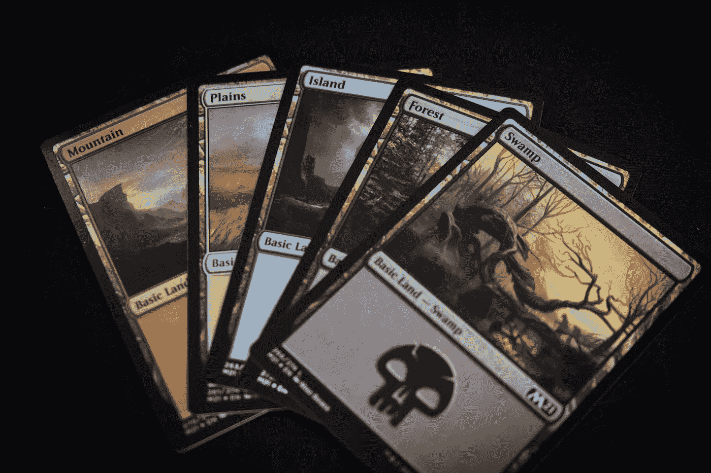

照片由 [Ryan Quintal](https://unsplash.com/@ryanquintal?utm_source=medium&utm_medium=referral) 在 [Unsplash](https://unsplash.com?utm_source=medium&utm_medium=referral) 上拍摄

这篇文章是我计划撰写的系列文章的第一篇**，我的目标是更深入地了解这个持续了大约六个月的过程中每一步的细节。不幸的是，如果我试图在一个镜头中彻底解释我自己，这将是一篇很长的文章。所以，如果我没有马上解释清楚，请不要担心，我会尽快解释清楚的。**

## 这篇文章的目标受众是谁？

首先也是最重要的，我不打算花时间来解释这个聚会是什么魔法以及它是如何玩的。不是因为我不想做，而是因为这可能会让我永远做不完。

我希望点击这篇文章并发现它很有趣的读者，对这个游戏有点熟悉，并且对于有几年游戏经验的人来说(无论是最近的经验还是几年前的经验)会更容易理解。

我还期望至少有一些关于**机器学习**和**数据科学**过程的中级知识，尽管在本文的前半部分这不是必需的(直到*检查点*标题)。

# 快速介绍

作为一个快速介绍，以防你碰巧不知道这个游戏，但仍然想继续阅读:

> 魔术聚会是一种交易纸牌游戏，玩家在单人或多人比赛中制作纸牌并相互竞争。你只(大部分)使用你牌组中的牌，并试图通过召唤生物、施法和攻击对手致死来赢得游戏。

**基本规则**相当容易学习，然而掌握游戏甚至擅长游戏可能非常具有挑战性，但这正是游戏的魅力所在。你可以随意地玩，也可以激烈地玩。如果你还没有玩过一个魔术游戏，我鼓励你去玩。**它需要统计思维、资源分配、不完全信息下的决策、优化和许多其他技能，作为一名数据科学家，你应该不断提高这些技能**。如果你想学习基础知识，你可以观看这些视频:

YouTube 视频魔术聚会官方频道

Tolarian 社区学院频道的 YouTube 视频

> 开始玩和学习基础知识的一个好方法是安装数字客户端: **Magic Arena** 。[这里是下载链接](https://magic.wizards.com/en/mtgo#download-now)。

## 在这种情况下，人工智能面临的挑战是什么？

将人工智能引入这样一个游戏的一个主要挑战是，有一个不断增长的可用卡池，它每年只会变得越来越大。到今天为止，大约有三十张 **和一千张**不同的卡片，每一张都有独特的能力和效果。卡片之间的互动和协同作用几乎是无限的，而不完善的信息(不知道对手手中的卡片)使得游戏中的决策非常困难，以至于它被称为世界上最复杂的[游戏](https://www.technologyreview.com/2019/05/07/135482/magic-the-gathering-is-officially-the-worlds-most-complex-game/)，也是人工智能永远无法真正擅长的游戏。

> 这不应该阻止我们尝试，对不对？

# 我的研究重点

当然，这些前提在某种程度上仍然是正确的。我不会说现在我们还不能教人工智能如何玩好魔法，但是就像生活中的任何难题一样，我们需要把它分成更小的部分，并尝试一个接一个地解决它们。希望这项研究能帮助其他人解决下一步的问题，等等！有一件事对我来说是肯定的:

> 我无法想象一个没有人工智能在聚会上玩神奇游戏的未来

提到这一点，对于这个项目，我决定避免卡片之间的互动和游戏所需的决策顺序所带来的复杂性，而只关注**对个别卡片的解释**。**这意味着我们所做的就是处理我们能从单张牌中获得的最多数据，并对这些牌的其他重要属性做出预测(如其*颜色*，其*稀有度*，其*法力值*，其*市场价格*等属性)。)**。

带着这个目标，我们来谈谈魔法卡…

## 一张神奇的收集卡

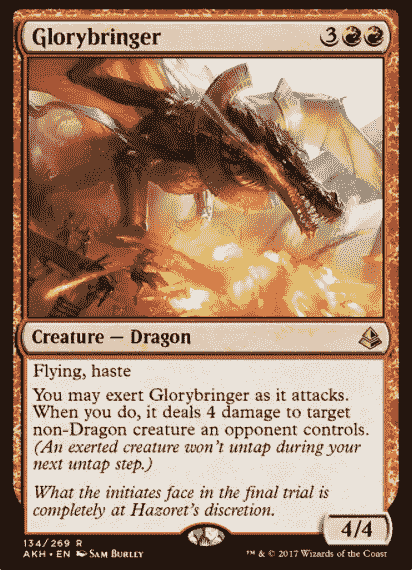

这在我看来是一张非常好的魔术集结卡。一个 4/4 的飞行器花费 5 点法力是很合理的。匆忙让这张卡变得非常好，因为它可以在进入战场的同一个回合进行攻击。它真正的力量在于它的最后一个能力，该能力允许对手在攻击时对目标非龙生物造成 4 点伤害。对一个生物的移除总是很强的。在它的时间标准，这是一个惊人的终结者，它看到了其他格式的发挥，如先锋，历史和指挥官。对于更有效的格式，如现代或传统格式，这还不够好。**图片来自 Scryfall API。**作者:山姆伯利。2017 海岸巫师

**每一张神奇的收集卡都是不言自明的**。这意味着 [*读卡说明了*卡](https://www.youtube.com/user/tolariancommunity)。这句话很简单，但非常有力。

魔法卡就像一个独立的小程序，在游戏的语言(规则)下运行。它的作用和它对黑板的影响可以 100%从黑板上的内容中扣除。

一个经验丰富的玩家可能会阅读一张牌，并试图以较高的置信度预测其许多最重要的属性:

1.  是*强/厉害的*卡吗？
2.  这可能是一张*贵的*卡吗？
3.  这张卡能不能像*现代*或者*指挥官*一样成为某种格式的*订书钉*？

> 你可以看看我对上图中我最喜欢的一张卡片的评价。不同意可以随意！

考虑这些例子:

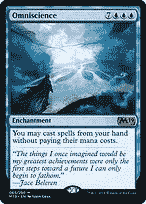

有些牌被认为是*好的*，因为它们的效果在任何*棋盘状态*下都是有效的，并且通常能让你当场赢得游戏*。**全知**让你不用支付资源就能从你手里玩牌。它本身相当昂贵，但是一旦它进入战场，它通常就玩完了。**图片来自 Scryfall API。**作者:陈柏宇。2018 海岸巫师*

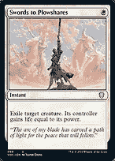

有些牌很强，因为它们便宜(意味着它们使用的资源少)，因此非常节省法力。**剑转犁头**是一个单法力移除法术，以瞬间速度放逐，唯一的缺点是对手赢得一些生命，使其效率极高。**图片来自 Scryfall API。**作者:杰斯珀·埃辛。2021 海岸巫师

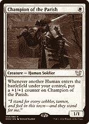

一些*生物*卡比其他类似的卡更强，仅仅是因为它们的*生物类型*不同，因为它们可以适应已经存在的强大*原型* / *部落*(例如*人类*或*精灵*比*巨人或狗*拥有更多的支持)。你玩的人类越多，一个变得越来越大的人类对人类来说是非常好的，但是这张卡在其他缺乏和人类同等水平支持的部落中不起作用。**图片来自 Scryfall API。**作者:斯维特林·韦利诺夫。2016 海岸巫师

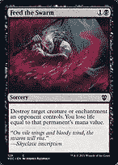

有些卡片非常强大，因为它们能做正常情况下这种颜色做不到的事情，而且它们在 Commander 这样的格式中成为主食。**喂虫群**是一个可以对付附魔的黑色法术，以前没有过。这张白色的牌没有那么强大，因为白色有更好的选择来达到同样的效果。**图片来自克里福尔 API。**作者:安德烈·库金斯基。2021 海岸巫师

我也许可以永远继续这些例子，但是正如你所看到的，一张牌是*好还是坏*、*贵还是便宜*、*一种颜色还是另一种颜色*，这是难以置信地变化着的，并且依赖于牌中的文字和符号的某种分布。

## 真正的智慧能用卡片做什么

想象一下这个**子博弈**。假设我是一名魔法采集设计师，我制作了一张新的卡，这张卡以前并不存在，所以我写下了它的*卡类型*，它的*效果，能力*等等。没有*插图*，没有参考具体的*颜色*，没有参考*铸造成本*。

> **卡类型**:即时
> 
> **甲骨文**:反击目标法术。如果某个非生物咒语以此方式被反击，则此咒语对任何目标造成 2 点伤害。

然后我把这张新卡给一个有经验的玩家看:

*   他们能预测它应该是什么颜色吗？
*   他们能预测卡片的**铸造成本**吗？
*   他们能预测卡片**的稀有度**吗？是*普通*、*生僻*、*稀有*还是*神话*牌？
*   他们能预测那张卡买起来会是**贵**还是**便宜**吗？

> 我的假设是**是的**，**绝对** **他们可以那样做**，而且他们往往是对的而不是错的。

如果你玩高水平游戏的时间够长，并且你非常熟悉池中的许多牌，那么:

1.  **你可以非常合理的区分五种颜色中每一种的不同属性*所谓的颜色派*** 并且明白因为这是一个*反法术*，那么它肯定是**蓝色**，但是它也能造成伤害的事实表明这个法术也被认为是**红色**。
2.  你很可能推断出它的法力值(转换后的法力消耗)，尽管在这里你可能还需要知道它的*稀有度*。我们制作的牌可能是普通稀有*的 *4 法力*费用牌，但也可能是不普通*稀有*甚至*稀有*的 *3 法力*费用牌。*
3.  **你大概明白，牌越强越有可能是*稀有*或者*神话*。知道这张卡可以*对抗一个法术*并且*对任何只有 *3 法力*的目标*造成 2 点伤害可能会让你认为它至少是*稀有*或*不常见*。**
4.  最后，**你可能会熟悉如今推动卡片价格上涨的因素****，并预测有一种新的《指挥官》神话主食会非常受欢迎，供应量非常有限，因此非常昂贵。我们制作的卡不是这样，因为在任何构造的格式中，*反击法术*的 *3 法力*并不是非常有效地成为*钉书钉*(除非那张卡有很多优势，比如*神秘命令*)。**

**无论如何，这些例子都不疯狂。**有些人已经变得非常擅长这种类型的评估。以下是我最喜欢的一些:****

**下面是 MTGGoldfish 团队讨论一些最新卡的电量水平的视频**

**从某种意义上说，**你的大脑会从经验和接触**中了解到，每当在一张纸板上出现一定分布的字符、符号和单词时，那张纸板*就会是一张*好的或坏的纸板*，一张更贵或更便宜的纸板*等等。****

**你的**真实智能**将帮助你发现并理解这些**小模式**，这些**隐藏的信息**，你越多地接触它，并在评估中**从失败和成功**中学习，你最终会变得更好。**

> **这个有力的结论，让人工智能在我们的征途中光彩亮相！**

## **AI 来了！**

**上述结论引发了一些有趣的机会:**

*   **如果我们训练一个**人工智能**(在这种情况下是一系列**监督的机器学习**模型)在**上训练一张卡片**中所有可能可用的 **数据，以及我们有兴趣预测的那张卡片的所有属性(*稀有度*、*成本*、*价格*、*颜色*等)，会怎么样？)?****
*   **我们能否将卡片上的文字和符号转化为**实际数据**好到足以让**机器学习模型**接受训练？**
*   **这些模型 ***能学习*** 到**预测**那些具有**良好确定性**、**准确性**和总体**表现良好**的属性吗？**

> **接受挑战！**

# **C 检查点**

**从现在开始，这篇文章变得更加专业，需要一些关于**机器学习**的知识。但是没有也不用担心。**

**现在你…**

*   **…已经了解研究的前提，**
*   **…已经介绍过这个应用程序，所以你可以清楚地了解我想要完成的任务及其结果。**
*   **…可以跳过文章的其余部分，阅读最后的结论。**
*   **…尽管如此，我还是很高兴被邀请继续这篇文章的讲座，因为你可能会觉得它足够有趣！**

# **该过程**

**该项目的任务执行非常符合**数据科学工作流程**的标准，可以总结在下面的列表中。我计划写一篇关于他们每一个人的详细文章:**

1.  **获取数据 *(5%的工作量)***
2.  **转换数据 *(25%的工作量)***
3.  **特征工程/特征选择 *(35%的工作量)***
4.  **多模型训练 *(20%的努力)***
5.  **模型评估 *(5%的工作量)***
6.  **用于演示目的的 Web 应用程序开发 *(10%的工作量)***

# **在接下来的完整详细文章之前，先简要介绍一下上面的每个任务**

# **获取数据:注释**

*   **我使用 [Scryfall API](https://scryfall.com/docs/api) 和库 [scrython](https://github.com/NandaScott/Scrython) 收集了所有数据，并决定从 2004 年开始制作一个所有魔法卡的数据集。做出这一决定是为了确保有足够大的卡片样本，但同时**避免书写古怪的非常旧的卡片**。我们不希望我们的模特从中吸取教训。**
*   **结果数据集包含 **26，622 张卡**(包括重印)。**

**下面是我们可以从 Scryfall API 获得的一张卡的数据示例:**

**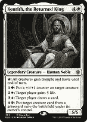**

****图片来自克里福尔 API。**作者:基兰·扬纳。2019 海岸巫师**

```
{'object': 'card',
...
 'name': '**Kenrith, the Returned King**',
 'lang': 'en',
 'released_at': '2019-10-04',
...
 'layout': 'normal',
...
 'image_uris': {'small': 'https://c1.scryfall.com/file/scryfall-cards/small/front/5/6/56c1227e-bea7-47cb-bbec-389a3d585af5.jpg?1637568481',...},
 'mana_cost': '**{4}{W}**',
 'cmc': **5.0**,
 'type_line': '**Legendary Creature — Human Noble**',
 'oracle_text': "**{R}: All creatures gain trample and haste until end of turn.\n{1}{G}: Put a +1/+1 counter on target creature.\n{2}{W}: Target player gains 5 life.\n{3}{U}: Target player draws a card.\n{4}{B}: Put target creature card from a graveyard onto the battlefield under its owner's control.**",
 'power': '**5**',
 'toughness': '**5**',
 'colors': **['W']**,
 'color_identity': **['B', 'G', 'R', 'U', 'W']**,
 'keywords': [],
 'legalities': {'standard': 'not_legal',...},
 'games': ['arena', 'paper', 'mtgo'],
...
 'reprint': False,
 'variation': False,
 'set_id': 'a90a7b2f-9dd8-4fc7-9f7d-8ea2797ec782',
 'set': 'eld',
 'set_name': 'Throne of Eldraine',
 'set_type': 'expansion',
...,
 'rarity': '**mythic**',
...
 'prices': {'usd': '**6.51**',
  'usd_foil': '**6.97**',
  'usd_etched': **None**,
  'eur': **None**,
  'eur_foil': **None**,
  'tix': '**0.17**'},
 'related_uris': {...}
```

# **转换数据:注释**

*   **由于数据源是 **JSON 格式**，我不得不把它转换成一个 ***熊猫数据帧*** 。**
*   **一个非常重要的转换是将来自**单面卡**的数据与来自**双面卡**的数据合并。魔术牌有时有两面，是 API 响应中的不同字段，需要大量的操作。**
*   **将**关键字**列转换为每个关键字的**单列，如下所示。****

**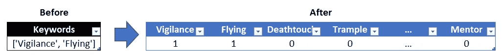**

*   ****将卡类型**分成不同的列，如下所示。**

**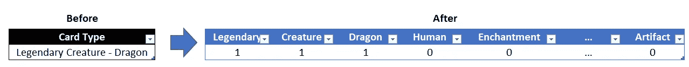**

*   ****固定*劈开*** 。《奈斯特拉:深红誓言》中的*系列*介绍了具有*【括号内】*能力的卡片，这些能力可能适用，也可能不适用，这取决于卡片是如何铸造的。我修好了那个，但是它很复杂。我会在一篇具体的文章中解释。**
*   ****用标准化的“CARDNAME”令牌替换甲骨文中的卡名**。这是最重要的转变之一。它包括用实际的令牌“ **CARDNAME** ”替换神谕文本(写有该卡能力的文本)中的卡名。卡片的名称应该与模型无关，但是标记 **CARDNAME** 的实际存在非常重要，特别是对于 CARDNAME 是句子主语的自然语言模型。**

**例如，卡片**闪电**的甲骨文文字由**

> **"**闪电箭**对任何目标造成 3 点伤害."**

**到**

> **"对任何目标造成 3 点伤害."**

*   ****对甲骨文进行分词**。剧透警报！。稍后我会解释我是如何训练两组不同的模型的。一方面是典型的**分类**模型，另一方面是具有**嵌入层**的**深度学习 NLP** 模型。我用标记化的 oracle 文本(以 TF-IDF 的方式)填充了第一个模型，用标记序列填充了 NLP 模型。分别如下(1)和(2)。**

**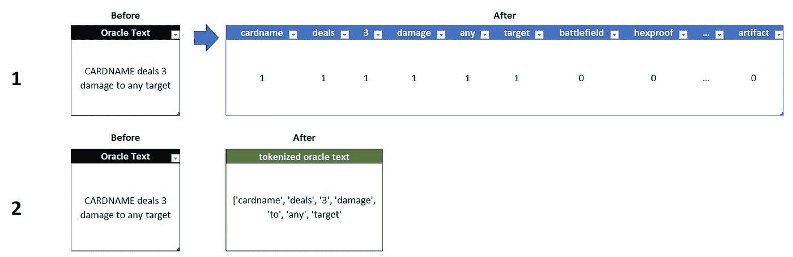**

*   ****移除土地。在这个项目中，我们不包括土地，所以我把它们从数据集中过滤掉了。****
*   ****一个热编码分类列**。将所有分类列转换为单个二进制列。例如:**

**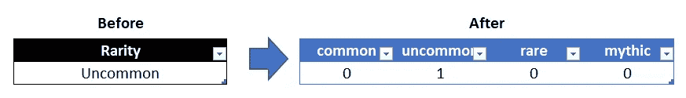**

# **特征工程/特征选择:注释**

*   ****转载**。计算一张卡片的重印数量。如果一张牌出现在 3 组不同的牌中，那么“印数”一栏将是 3。一张卡片重印的次数越多，市场上该卡片的供应量就越多，因此，它的价格就越便宜，这使它成为我们价格预测模型的一个非常有用的特征。**
*   ****计算一张卡中的能力**。这意味着在神谕文本中计算一张卡中不同的*能力块*。例如，我们的朋友 **Glorybringer** 有 2 个能力。"*飞行，急速*"是它第一个能力的一部分，并且"*你可以在它攻击时使用光明使者。当你如此做时，它对目标由对手操控的非龙生物造成 4 点伤害。*“是第二种能力。卡片上的文字越多，卡片上的能力越多，卡片越强大的几率就越高(越稀有，越昂贵，等等。).作为一个规则，任何时候甲骨文有一个“\n”，我认为**是一个能力的结束和下一个能力的开始。****
*   ****创建列“单色”、“单色”、“双色”、…、“五色”**，根据卡片为 1 或 0。**

****

*   ****计算投入**。这是一张牌的施放费用中有多少不同的实际魔法力符号。例如，一张施法成本为 *{2}{W}{W}* 的牌，因为有 2 个白色魔法符号，所以奉献为 2。我在另一个专栏中计算了甲骨文中的奉献。**
*   ****X 咒**。如果卡有一个包括 *{X}* 的施法成本，则此列为 1，否则为 0。**
*   **清点甲骨文中的**法力符号。除了甲骨文中的符号，与上面的奉献相同。****
*   ****包括*多选*和**。对于像 *Prismari 命令*这样的卡，给你多种选择。如果该卡包含此选项，则此栏为 1。**

**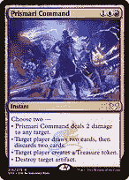**

****图片来自 Scryfall API。**作者:约翰内斯·沃斯。2021 海岸巫师**

*   ****包含*攻技*** 。对于像*法力愚人*或*法力摇滚*这样的牌，或任何横置以做某事的牌。**

**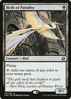**

****图片来自克里福尔 API。**作者:马塞洛·维格纳利。2016 海岸巫师**

*   ****包括风味文本**。风味文字本身是非常没用的，因为它对游戏没有任何影响，它只是故事。然而，还有另一种观点。一张有风味文字的牌是一张不太可能有很多能力的牌，因为风味文字(见上图中斜体部分)和能力文字占据相同的空间。**
*   ****风味文字长度**。计算风味文本的实际字符长度。还是那句话，*味文*越长，能力空间越小。**
*   ****最重要也是最困难的部分:超类型卡片**。**

**我认为**牌的超类型**是玩家非正式分配给他们的任何一种牌。例如，一张卡片可以被认为是一个**“移除咒语”，但那并没有写在卡片的任何地方。然而，我想捕捉所有的**【移除法术】**以及许多其他超类型，因为它可以让模型受益匪浅。其他的例子还有:《魔法石》《魔法石》《愤怒》《坡道》《进入战场触发》等。****

****我通过为每个超类型使用多个正则表达式来实现这一点，这是如此乏味、冗长和复杂，我甚至无法在这里开始展示。现在，您需要知道的是，这些是我包含的所有不同的超类型:****

```
**'counterspell', 'manarock', 'manadork', 'removal', 'wrath', 'ramp', 'tutor', 'cardraw', 'burn', 'discard', 'enters_bf', 'die_trigger', 'attack_trigger', 'pseudo_ramp', 'static_ramp', 'creature_tokens', 'extra_turn', 'plus1_counters', 'graveyard_hate', 'free_spells', 'bounce_spell', 'sac_outlet', 'sac_payoff', 'cant_counter', 'costx_more', 'costx_moreactivate', 'costx_less', 'costx_lessacitivate', 'whenever_opp', 'returnfrom_gy', 'reanimation', 'castfrom_gy', 'lord', 'upkeep_trigger', 'endstep_trigger', 'landfall', 'combat_trigger', 'life_gain', 'treasure_tokens', 'protection', 'cost_reduction', 'mana_multipliers', 'card_selection', 'whenever_cast', 'gain_control', 'unblockeable', 'difficult_block', 'create_copy', 'milling', 'trigger_multiplier', 'untapper', 'static_effects', 'damage_multipliers', 'variable_pt', 'agressive', 'doublers', 'blinker', 'graveyard_tutor', 'play_toplibrary', 'life_lose', 'play_from_graveyard', 'infect', 'disenchant', 'venture', 'animator', 'wish', 'gy_synergies', 'looting_similar', 'cheatinto_play', 'pumped_foreach', 'ritual', 'no_maximum', 'wheel', 'extra_combat', 'ghostly_prison', 'land_destruction', 'win_game', 'lose_game', 'cant_lose'**
```

****例如，我的孩子 *Glorybringer* 有 5 个超类型:****

****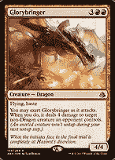****

****移除=1，灼烧= 1，攻击触发= 1，困难格挡= 1，攻击性= 1，所有其他超类型= 0。**图片来自 Scryfall API。**作者:山姆·伯利。2017 海岸巫师****

****这种分配超类型的过程产生了一种惊人的将**卡片聚集在一起的方式，它确实对模型有很大的帮助。******

*   ******创建价格箱**。这是为了离散化连续价格变量(青铜:0–0.25，白银:0.25–1.00，黄金:1.00–5.00，铂金:5.00–10.00，钻石:10.00-)。价格预测既有回归模型的数值预测，也有分类模型的这 5 个类别的预测。****

********

****还有许多其他的转换和特性工程任务，但是由于文章的长度，我不能在这里包括它们。****

## ****训练数据集****

****在执行转换和特性工程步骤之后，我得到了一个由 25K+行和 1K+列组成的巨大数据集。****

****这意味着我能够将一张卡中的信息转换成数百个由 0 和 1 组成的数据点，这就为一些**机器学习**做好了充分的准备！****

******数据集本身就是一个瑰宝，它在 GitHub** 中是开源的，请随意在您自己的模型上使用它！****

****它很大，可以在这里展示，但你可以在我的 GitHub 中找到它:****

> ****[https://raw . githubusercontent . com/gabrielpierobon/magic aimodels/main/datasets/datasets _ vow _ 2021 12 20 _ full . CSV](https://raw.githubusercontent.com/gabrielpierobon/magicaimodels/main/datasets/datasets_vow_20211220_FULL.csv)****

# ****模型训练:注释****

*   ******型号类型**。我按照一个监督过程训练了*二元分类*、*多类分类*和*回归*模型。****
*   ******算法**。我主要使用了来自 *scikit-learn* Python 库的*线性/逻辑回归*和*梯度提升*以及带有 *Keras/Tensorflow* 的*深度学习*。****
*   ****模型市场。这里有一个表格，列出了所有的模型和它们的作用。注意专栏**模拟题**。****

****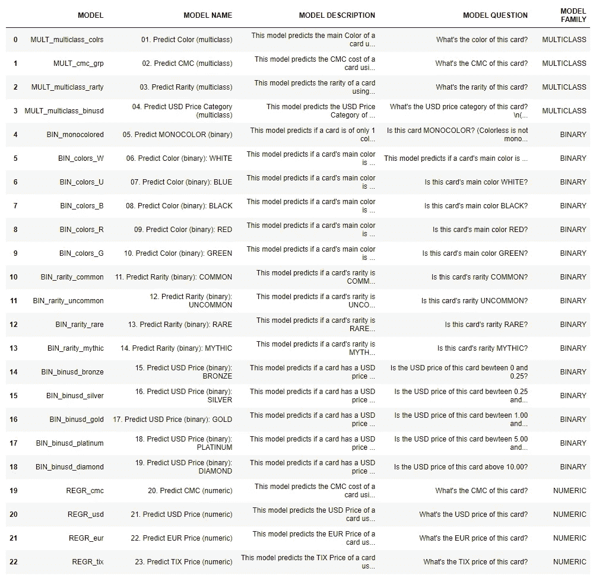****

*   ******降维**。由于我们的数据集中有非常高的维数，所以我研究了 [*多重共线性*](https://en.wikipedia.org/wiki/Multicollinearity) ，并在训练前删除了高度相关的特征。我还研究了 [*递归特征消除*](https://www.scikit-yb.org/en/latest/api/model_selection/rfecv.html#:~:text=Recursive%20feature%20elimination%20(RFE)%20is,number%20of%20features%20is%20reached.&text=RFE%20requires%20a%20specified%20number,how%20many%20features%20are%20valid.) 算法，帮助去除一些无用变量。****
*   ******不平衡问题**。大多数类别是不平衡的，这在机器学习的世界里总是有问题的。有更多的*普通*卡，例如*神话*，所以我不得不 ***每次都上采样*** 数据集，以便获得平衡的类。我只是重复了代表性不足的班级的样本。****
*   ******超参数调谐**。我为所有模型中的超参数调整设计了*网格搜索*空间，并使用了**五重交叉验证**。****
*   ******缩放**。大多数变量是二进制的(1 和 0)，但也有一些数字特征，所以我使用 **MinMaxScaler 缩放所有数字特征。******
*   ******训练/测试/验证分割**。出于评估目的，我将数据集分为训练集和测试集，并省略了最后一个魔术集*“in nistrad:Crimson Vow”*。****
*   ******NLP 深度学习模型**。对于深度学习模型，我**对前面提到的甲骨文文本**进行了标记化，**将标记序列**填充到最大长度，创建了一个具有 100 个维度的**嵌入层，通过一个**双向 LSTM** 层对它们进行处理，然后通过**全连接神经元**的一些隐藏层，使用**丢弃**来避免过多的过拟合。如果测试设置精度没有提高，使用**提前停止**和耐心 3 对模型进行 **100 个时期**的训练。******

**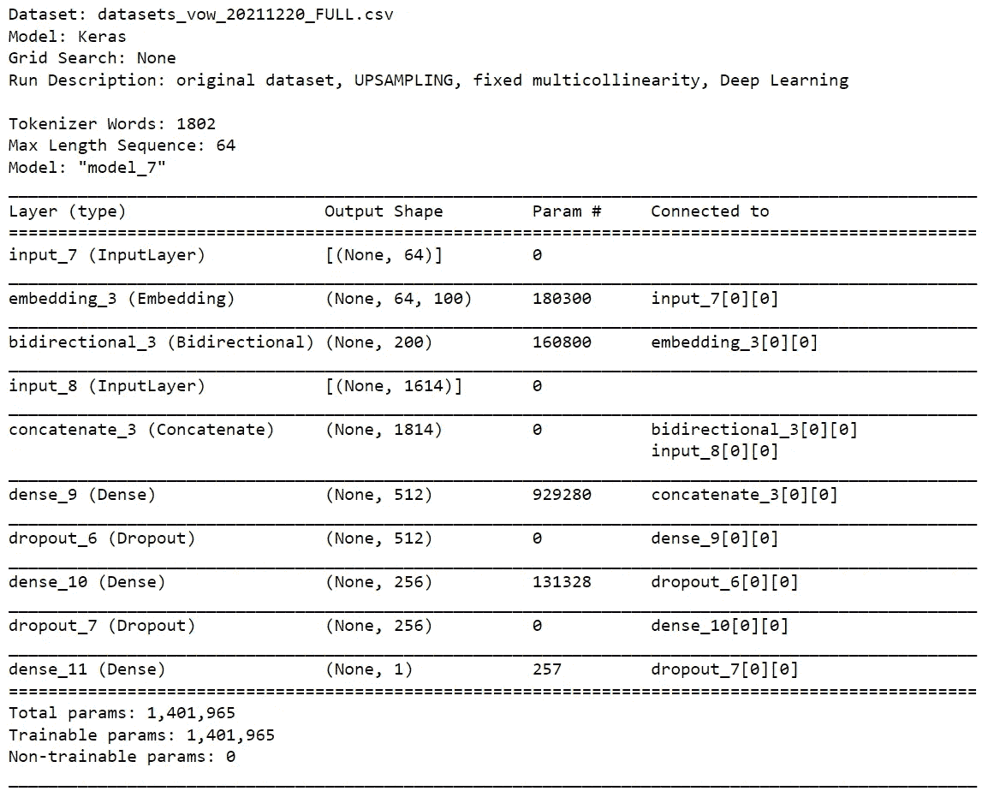**

**这是一个二元分类模型的模型摘要**

# **模型评估:注释**

****

**模型评估总结。作者图片**

*   ****试试 app，自己看！**评估模型的最佳方式是进入[应用](https://share.streamlit.io/gabrielpierobon/magicaimodels/main/app.py)并使用 *Innistrad: Crimson Vow* 集中的卡片进行尝试，这些卡片是训练和测试中遗漏的数据。选择不同的型号，看 app 怎么分类。**
*   ****报告的指标总是使用 set*in nistrad:Crimson vout*。评估模型的决定是在一组不用于训练也不用于测试的模型上进行。以下所有指标都应该是可靠的。****
*   ****二元模型**。对于二元模型，我计算了每个单独模型的*精确度*，还计算了三个模型的**平均预测，在一种**投票分类器**中(见上图)。我的理由是，每个模型本身都是好的，应用程序可以受益于在他们三人之间进行投票的最终决定。结果:****

**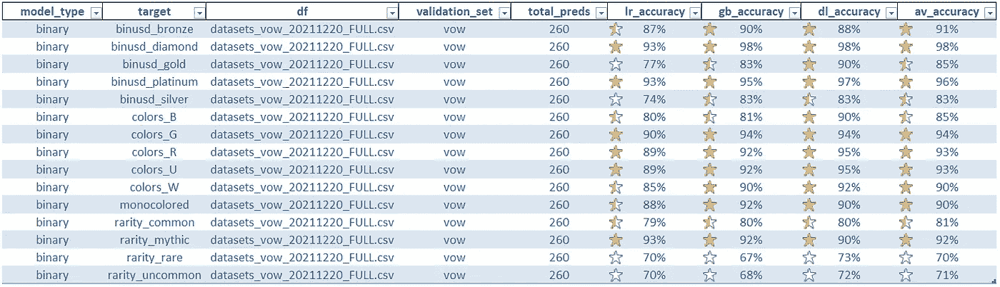**

****二元模型**:我们可以看到，使用单词嵌入和来自数据集的所有特征的深度学习模型的表现优于逻辑回归和梯度增强模型。大多数模型在 Innistrad: Crimson Vow 上的得分都高于 90%，然而，该模型在预测稀有和神话卡片方面有更多的麻烦，准确率仅为约 70%。**

*   ****多类模型**。这些模型给出了每一类的概率。因此，例如，**颜色预测模型**将给出每一类的概率:白色、蓝色、黑色、绿色、红色和无色。**最终预测**将永远是**概率**最高的那个。由于我对 3 种算法之间的*投票*感兴趣，我决定对 3 种算法(逻辑回归、梯度推进和深度学习)中每一种算法的每一类的概率进行求和，并从较高的预测概率到较低的预测概率对各类的求和概率进行排序。这给了我第一次选秀权，第二次选秀权和第三次选秀权。最后，我记录了模特的第一次选择和第二次选择是否正确(见上图)。我对结果非常满意，可以在这里找到:**

**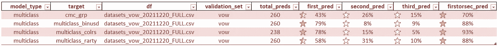**

****多类模型**:只有 multiclass_binusd 模型和 multiclass_colrs 预测模型在第一次挑选时效果不错，得分几乎达到 80%。然而，他们在第一次或第二次选股时都表现不错(见最后一栏)。**

*   ****回归模型**。最后，对于这些数字预测模型，其中我们预测了**转换的法力成本**(法力值)和**美元/欧元/TIX** 的价格，我计算了**平均绝对误差(MAE)** 。这些是结果:**

**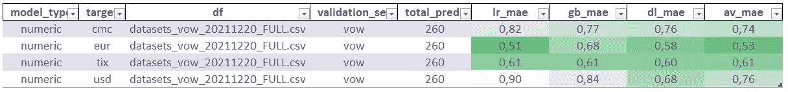**

****数字模型**:欧元价格预测的 MAEs 最低，尽管欧元价格通常低于美元价格。每张卡小于 1.00 的平均偏差并不惊人，但可以接受。对于 CMC 来说，小于 1.00 法力值的偏差也不惊人，但可以接受。**

## **有趣的发现**

**我选择了一些没有被模型正确分类的预测，试图解释它们，因为每次模型失败，都是评估模型被混淆的卡片发生了什么的机会。很多时候，它会导致有趣的解释:**

**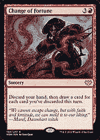**

**蓝色二元模型预测蓝色的概率为 0.55。我知道为什么它会是蓝色的，因为抽牌。**图片来自 Scryfall API。**作者:山姆·瓜伊。2021 海岸巫师**

**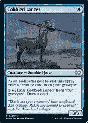**

**二元蓝色模型预测的蓝色概率仅为 0.17，而二元黑色模型预测的黑色概率为 0.67。需要从你的坟墓场驱逐一个生物的僵尸可能绝对是黑色的。**图片来自 Scryfall API。**作者:伊戈尔·基里卢克。2021 海岸巫师。再来看看 app 里对同一张卡的另一个预测:**

**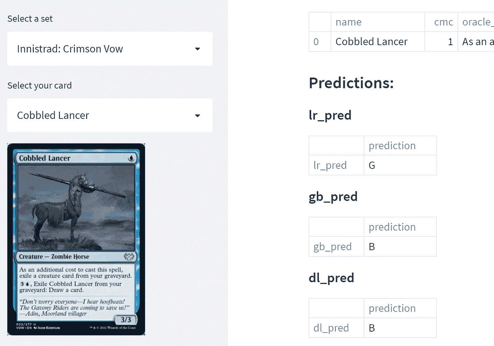**

**其中两个模型预测这张卡片是黑色的，而另一个模型预测是绿色的。需要从你的坟墓场驱逐一个生物的僵尸可能绝对是黑色的。从你的坟墓场驱逐它的最后一个效果是让你抽一张牌，我明白为什么它会是一个绿色的效果了。**图片来自 Scryfall API。**作者:Igor Kieryluk。2021 海岸巫师**

**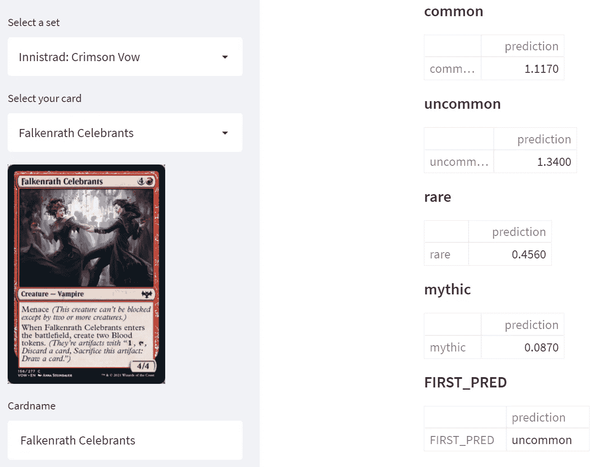**

**在这种情况下，我们的多类模型预测 Falkenrath 庆祝者首先是不常见的，然后是常见的。我认为这完全有道理，因为卡做了很多事情。4/4 换 5 点法力，带威胁，把 2 个血令牌放到战场上是惊人的价值。这是有限的最好的公地之一。**图片来自克里福尔 API。**作者:安娜·斯坦鲍尔。2021 海岸巫师**

**还记得我们之前制作的卡片吗？让我们快速[起草它](http://mtgcardsmith.com)，看看我们的应用程序预测什么颜色:**

**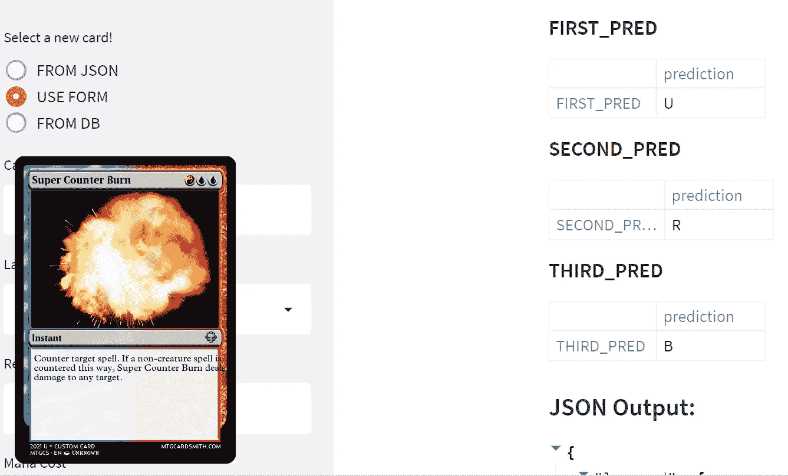**

**应用程序预测它首先是一个**蓝色**法术，其次是一个**红色**法术。这是非常准确的！**来自 Scryfall API 的图像****

****同样，评估该型号的最佳方式是使用应用程序亲自动手！****

**再来看一下链接:**

**[https://share . streamlit . io/gabrielpierobon/magic aimodels/main/app . py](https://share.streamlit.io/gabrielpierobon/magicaimodels/main/app.py)**

# **Web 应用程序开发:注释**

*   ****为胜利而简化！**这个网络应用程序是使用 [Streamlit](https://streamlit.io/) 构建的，它功能强大却简单易用。我怎么推荐都不为过！**
*   ****免费！**我免费使用 Streamlit Cloud 托管应用程序！**
*   ****开源！**这个应用的代码在我这里的 GitHub 上:[https://github.com/gabrielpierobon/magicaimodels](https://github.com/gabrielpierobon/magicaimodels)**

# **结论和后续步骤**

**我非常高兴和满意**，尤其是对过程**，对结果和最终产品(应用程序)也是如此。我在一个个人项目上度过了一段美好的时光，这个项目涉及到我喜欢做的事情和我擅长做的事情。这真的很令人兴奋，也是一种惊人的成就感。**

**事实上，我们可以将卡片上的信息转换成有用的数据，并训练一台机器来识别模式并做出预测，这太令人兴奋了！**

**我仍在计划如何在 2022 年发展这项技术，并与社区分享，看看它能产生多大的影响，能对未来的进一步研究产生多大的影响。**

**至于结果，我认为它们非常好，但我也能看到它们如何能变得更好。这里有一些关于这个主题的注释:**

*   ****更好的算法**。我们可以使用更强大的算法，比如 XGBoost、LightGBM 等。**
*   ****更 tunning** 。我们可以花更多的时间在模型调试阶段，我没有时间去做。**
*   ****变形金刚**。我们可以通过使用 BERT 进行迁移学习来将 NLP 模型提升到下一个级别，并根据魔域对其进行定制。这太不可思议了。**
*   ****更多数据**。我们可以得到更好的数据。我很想从其他网站上获得一些关于该卡可玩性的统计数据。这将允许我创建一个列，可以记录一张牌在特定格式下的播放次数。这将会改变一些结果，尤其是价格。**

**如果有人有兴趣讨论这项研究的内容和成果，你可以在 LinkedIn 上联系我:[https://www.linkedin.com/in/gabrielpierobon/](https://www.linkedin.com/in/gabrielpierobon/)**