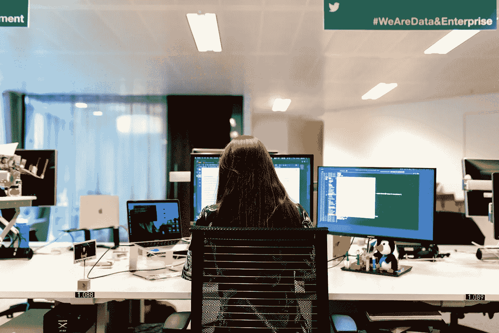

# 人工智能不会很快取代你的编码工作

> 原文：<https://towardsdatascience.com/artificial-intelligence-is-not-taking-your-coding-job-anytime-soon-5bf0df677ee8?source=collection_archive---------29----------------------->

## 为什么像 GitHub Copilot 这样的人工智能编码工具不能做你的工作

照片由[**this is 工程**](https://www.pexels.com/@thisisengineering?utm_content=attributionCopyText&utm_medium=referral&utm_source=pexels) 发自 [**像素**](https://www.pexels.com/photo/woman-sitting-in-front-of-computer-in-office-3861967/?utm_content=attributionCopyText&utm_medium=referral&utm_source=pexels)

我曾经担心人工智能(AI)会抢走我的工作，让我失业。

毫无疑问，围绕人工智能的恐惧正在逐年增加。

但是我写代码越久，对机器学习越深入，我就越不担心。

最近，OpenAI 和微软(拥有 GitHub)发布了 [Copilot](https://copilot.github.com/) ，这是一个 AI 驱动的结对程序员。

来源:[副驾驶](https://copilot.github.com/)

虽然令人印象深刻，但我们离能够自己编写代码的人工智能还很远。

但这并不意味着没有短期影响。

幸运的是，软件工程不仅仅是在电脑上打字。

# 大多数写人工智能的人都没有写过代码

如果你已经编写了任何一个适度复杂的软件，过时的开发者论点很快就会土崩瓦解。

你知道“写代码”不是开发人员真正的工作。

说“软件工程师的工作是写代码”就像说“作者的工作是写段落”虽然这是真的，但它没有抓住要点。不是任何作者都能写出《权力的游戏》。

编写代码是容易的部分。针对规模进行架构设计、满足客户需求以及处理现有的设计约束要复杂得多。

如今，软件开发人员是建筑师、工程师和建筑工人。但随着我们走向未来，我怀疑我们会更多地看到前者，而更少地看到后者。

# 繁重的工作正在消亡

像 Copilot 这样的 AI 驱动的编码工具在做什么？

智能生成样板代码。

他们正在移除我们价值最低的任务。比如编写代码来循环数据、创建单元测试以及查找堆栈溢出的答案。

作为开发人员，我们管理的是能源，而不是时间。每一个走神的想法和谷歌搜索都会消耗一点这种能量。优秀的开发人员希望通过解决具有挑战性的问题，而不是编写基本的代码来获得丰厚的报酬。副驾驶帮助他们做到这一点。

这对大多数开发者来说是个好消息。除非你花时间写垃圾应用程序…

我怀疑我们将在未来十年看到一个转变，随着低价值任务的枯竭，开发人员变得更像技术项目经理。

# 代码的价值会下降

正确生成的代码允许有能力的开发人员在更短的时间内构建更多的技术。

这种价值的大部分将被公司获取。

软件工程师的工资不会少，工作也不会多。他们只会在更短的时间内完成更多的工作。

随着软件开发成本的降低，需求也会增加。

> 在经济学中,“杰文斯悖论”……发生在技术进步或政府政策提高了资源的使用效率(减少了任何一次使用的必要数量),但由于需求增加，资源的消费率上升。
> - [杰文斯悖论，维基百科](https://en.wikipedia.org/wiki/Jevons_paradox)

我们可以看到公司用同样的资源解决更多的问题，或者更多的科技公司被创造出来。

# 成本下降带来新的机遇

您现在可能能够构建那些以前太耗时或太昂贵的辅助项目。

如果建造一件东西花费的时间更少，那么边际效益低的项目现在就变得可行。

以前过于昂贵的机会现在可以追求了。

也许你想构建一个简单的应用程序来聚合一些数据。金钱激励太低，不足以证明 40 小时的努力是值得的。但是现在只需要 20 个小时，你可能会重新考虑。

这同样适用于公司。他们不能在当前工作的基础上追求更低价值的机会。作为一名企业家和程序员，我喜欢这个。

# 人工智能驱动的编码给未来带来了一些风险

现在，Copilot 生成样板代码。它比现有的代码编辑器更智能。但这对任何人都没有风险。

也就是说，我们必须假设工具会继续改进。如果这是真的，我们可以想象一个有以下问题的未来。

## 高级开发人才渠道枯竭

我们都是大三学生，只能编写 CRUD 应用程序。但是，当我们不再需要人类来编写这些简单的应用程序时，会发生什么？新开发人员将如何学到足够的知识来提升价值链？

## 收益只属于最优秀的开发者

在任何职业中，前 1%的人都比其他人赚得多得多。如果顶级开发人员可以完成 10 倍的工作，它可能会消除对其他中等技能开发人员的需求。

## 无代码工具会把软件变成一个黑匣子

如果我们不再写代码，怎么能理解 AI 正在写的代码呢？我们对使用我们不了解的技术感到舒服吗？

这些是我们作为一个行业和社会在某个时候可能需要面对的长期问题。

# 最后的想法

这是我不担心 AI 抢走我工作的最大原因。

**如果 AI 会写软件，那就已经结束了。所有人都过时了。不仅仅是开发商。**

尽管媒体大肆宣传，但没有什么理由害怕人工智能取代你的编码工作。编码主要是一种创造性的职业。就目前的情况来看，神经网络从根本上来说不可能有新的想法。

此外，软件工程师是问题的解决者。我看不到问题的尽头。

因此，尽管技术性失业可能不可避免，但不会持续很长时间。

**剧情转折:**本文由 [GPT-4](https://en.wikipedia.org/wiki/GPT-3) 撰写……开个玩笑。