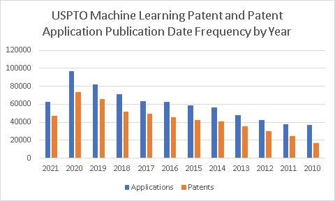
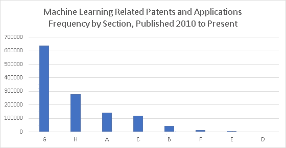
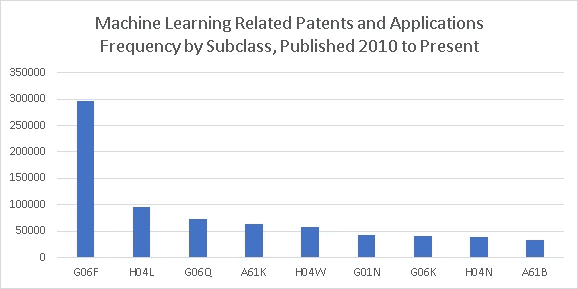
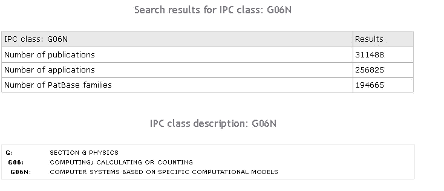
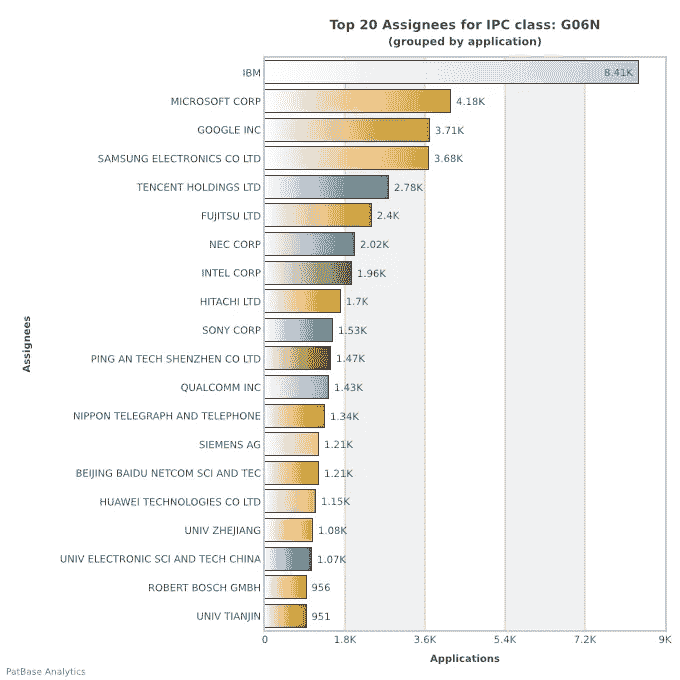
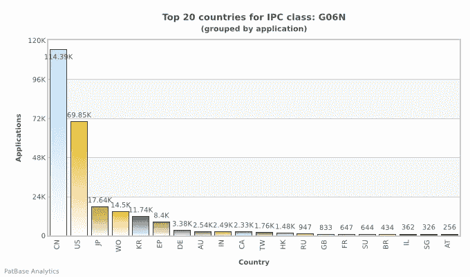
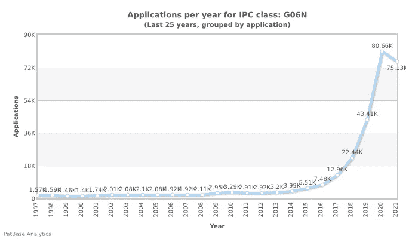

# 人工智能专利 101 项

> 原文：<https://towardsdatascience.com/artificial-intelligence-patent-101-3eebf93f5297?source=collection_archive---------30----------------------->

## 谁在创造专利，你也应该获得专利吗？

天使的小号，作者

## 专利出版趋势

与人工智能和机器学习相关的专利出版物继续以惊人的速度增长，现在美国专利局每年的申请量接近 10 万件。仅在三年前，这个比率接近每年 7 万份申请。使用**patentguru.com**，我查看了美国专利出版物和专利申请出版物标题中的下列术语的出现频率:“机器学习”或“机器学习”或“数据分析”或“分析”或“计算机程序产品”或“人工智能”或“数据科学”或“神经网络”由于只审查了专利标题，而没有审查专利正文，所以包括了更一般的术语“分析”和“计算机程序产品”。

有可能包含少量非人工智能/人工智能专利，但人工检查产生的专利确定这些搜索词给出了良好的结果。专利的最大受让人是 IBM，其次是高通、三星、英特尔、微软、谷歌、华为和苹果。

## 专利是如何组织的？

专利需要被归入一个特定的类别。这些类别是很久以前创建的，那时计算机工作产品还不需要一个类别。出于这个原因，你会发现大多数美国专利局 ML/AI 类型的专利在类别 G:物理学中，但是它们可以在任何类别中找到，这取决于发明应用的领域。

答:人类的必需品

b:执行操作，运输

化学、冶金

d:纺织品、纸张

e:固定结构

机械工程，照明，供暖，武器

物理

h:电力

## 如何获得特定类别专利的更多信息

在每个类别中有子类，G06F 是美国专利局 ML/AI 专利中最常见的。

使用 www.patbase.com 的，我查看了类别 G06N 上的信息。这是我最近提交了机器学习专利申请的一个类别。这里的结果是针对该类中的所有专利和应用，而不仅仅是机器学习相关的专利和应用。

G06N 的 PatBase 分析结果

基于特定计算模型的计算机系统类别的最大受让人是 IBM，其专利数量是紧随其后的受让人微软、谷歌和三星的两倍。在这次评估中，我并不局限于美国专利，因此您将看到全球受让人的分布情况。

这些申请中有许多是中国的专利，其次是美国的专利。

在 2020 年和 2021 年，所有国家的 G06N 专利申请数量都在大幅增长。这只是机器学习和人工智能专利可以申请的多个类别之一。

## 我如何写我自己的专利？

你不知道。你的专利律师会帮你做的。只有专利律师或非常敬业的发明家才会尝试写专利。你的公司可以聘请专利律师来帮助你，如果他们致力于他们的知识产权专利的概念，并希望保护你的项目。成本不是微不足道的，而且完全有可能你的公司可能更愿意将你的工作作为“商业秘密”而不是申请专利。假设你的专利是与雇主相关的工作，你的名字会出现在专利上，但专利的“受让人”将是你的雇主。

出版你的作品，而不是追求专利，是另一条可以选择的道路。如果目标是建立作为专家的声誉，以及传播一般知识，而不是对作品的具体保护，这可能是更可取的。

为了继续为你的作品申请专利，你需要能够证明你的作品是新颖的、非显而易见的和有用的。你应该创建文档，用通俗的语言解释你的发明。它应该清楚地解释你的作品，以及你试图保护作品的哪一方面。你不能给抽象的概念申请专利，你的发明必须有实际应用。你的律师将能够搜索“现有艺术”来证实你的主张。虽然您也可以搜索“现有技术”，但请记住，您需要披露您在此类搜索中的任何发现。当专利被撰写时，它将包含确切的“权利要求”。这些权利要求准确地描述了你的发明是由什么组成的，是专利最重要的部分。他们还将决定你的专利应该提交给哪个类别和子类，以及你将提交的专利类型。

看到你的发明被解析成连你自己都难以理解的法律术语，并伴随着不熟悉的图表，你可能会有点迷惑。显然，这正是专利局正在寻找的，所以在这一点上，你需要相信你的律师。你还需要确保他们在撰写时已经清楚地理解了你的发明，并且权利要求确实代表了你试图申请专利的内容。不同的权利要求可以与不同的发明人相关联，因此您可以在这里指定哪个发明人对整个发明的各个方面做出了贡献。

## 我能从我的专利中赚钱吗？

大概不会。此外，你的雇主可能也不会从中赚钱。专利可以用来增加公司的内在价值，并证明其作为创新领导者的地位，即使具体专利没有实际的货币价值。此外，专利保护你的产品不被别人申请专利。许多专利申请都没有具体的计划来将受保护的发明货币化。

## 美国专利商标局的新人工智能数据

美国专利局最近发布了一个关于人工智能相关专利的数据集。该数据集是基于一种比本文所用的更全面的专利分类方法编制的。在下一篇文章中，我将讨论这个新数据和专利局发布的相关发现。