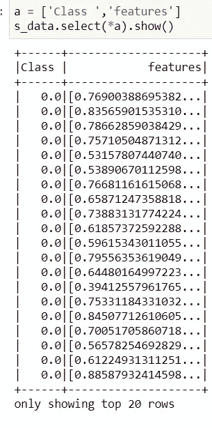

# 使用 PySpark 的人工神经网络

> 原文：<https://towardsdatascience.com/artificial-neural-network-using-pyspark-324cf47e8d0a?source=collection_archive---------15----------------------->

## 使用 PySpark 实现用于二进制类预测用例的神经网络

**简介** :
这是 Pyspark 博客系列的延续。之前我已经分享了使用 PySpark 实现一个基本的[线性回归](/machine-learning-linear-regression-using-pyspark-9d5d5c772b42)。在这篇博客中，我将展示另一个有趣的神经网络实现，它使用 PySpark 作为二进制类预测用例。这篇博客不会有很多预处理步骤，但是会给你一个实现分布式环境的想法，特别是当你在数据块中的集群中运行代码的时候。对于 Databricks 环境，如果您想利用 TensorFlow， [horovod](https://docs.databricks.com/applications/machine-learning/train-model/distributed-training/horovod-runner.html) 对此太方便了，或者您也可以参考[分布式 tensorflow](https://www.tensorflow.org/guide/distributed_training) 。但是如果你在业界工作的时候在 GPU 集群上面使用 Horovod 还是推荐的。然而，我将使这篇博客过于精确，以至于读者无法理解 pyspark 的神经网络实现方式。

# 欢迎，让我们深入主题。

我拍了一张[钞票认证数据集](https://github.com/someshkr/MultiLyerPerceptron-/blob/main/data_banknote_authentication.csv)。数据集中有 5 列，如 f1、F2、F3、F4 作为特征，Class 作为标签。

## 多层感知器分类器:


[media.istockphoto](https://media.istockphoto.com/vectors/neural-network-model-with-thin-synapses-between-neurons-vector-id1156059931?k=6&m=1156059931&s=612x612&w=0&h=rRq6-bwqo1B2tpudH6YcG28sMYTyu8bUEZ6-PiZ4Ypo=)

为了在 PySpark 中实现一个神经网络，我们可以使用[多层感知器分类器。](https://spark.apache.org/docs/latest/ml-classification-regression.html#multilayer-perceptron-classifier)超级好用，从 **pyspark.ml.classification 导入即可**基于[前馈人工神经网络](https://en.wikipedia.org/wiki/Feedforward_neural_network)。输入层中的节点表示输入数据。其余节点通过输入与节点权重`**w**`和偏差`**b**` 的线性组合以及应用激活函数，将输入映射到输出。这可以表示为:


[具有 K+1 层的 MLPC 的矩阵形式](https://spark.apache.org/docs/latest/ml-classification-regression.html#multilayer-perceptron-classifier)

## 特点:

1.  它基于多层感知器。

2.Sigmoid 激活函数用于每一层，Softmax 激活函数用于输出层。


[N 表示类别的数量](https://spark.apache.org/docs/latest/ml-classification-regression.html#multilayer-perceptron-classifier)

3.它使用逻辑损失函数进行优化，使用求解器 L-BFGS 进行优化。但是你可以另一个像 ***gd 这样的求解器。***

> gd 代表梯度下降算法。
> 
> l-bdgs 代表有限内存 Broyden–Fletcher–gold farb–Shanno 算法

缺点:

当您使用 Tensorflow 或 PyTorch 定义 ann 时，它缺少定制功能。

[阅读更多关于 scikit learn 实施的信息。](https://scikit-learn.org/stable/modules/generated/sklearn.neural_network.MLPClassifier.html)

**实施**

加载数据集:

```
dataset = spark.read.csv(“data_banknote_authentication.csv”,header=True)
```


我的电脑

通常，当您使用 pyspark 导入数据时，如果模式不是预定义的，它将采用 string 类型。现在让我们将列类型转换为 double 类型。

```
for col in dataset.columns:
    dataset = dataset.withColumn(col,dataset[col].cast('double'))
```

有几个空值。所以让我们用平均值来估算。

```
imputed_col = ['f_{}'.format(i+1) for i in range(len(input_cols))]model = Imputer(strategy='mean',missingValue=None,inputCols=input_cols,outputCols=imputed_col).fit(dataset)
impute_data = model.transform(dataset)
```


我的电脑

在 PySpark 中，在将数据输入模型之前，我们用向量来表示数据。想法是以矩阵格式表示数据，并在 0，1 之间缩放数据。

```
assemble = VectorAssembler(inputCols=imputed_col, outputCol='assembled_features', handleInvalid='error')
a_data = assemble.transform(impute_data)scaler = MinMaxScaler(min=0.0, max=1.0, inputCol='assembled_features', outputCol='features')
s_data = scaler.fit(a_data).transform(a_data)
```



我的电脑

现在，让我们将数据分为训练和测试数据集，定义模型，并将训练数据放入模型中。我用过的网络层是 4，16，2

4 是因为有 4 个不同的输入要素，2 是输出图层，因为它是二元分类。

```
train_df,test_df = s_data.select('Class ','features').randomSplit([0.7,0.3],1213) mlpc=MultilayerPerceptronClassifier( featuresCol=’features’,labelCol=’Class ‘,layers = [4,16,2],\
 maxIter=1000,blockSize=8,seed=7,solver=’gd’)ann = mlpc.fit(train_df)
```

一旦完成。你可以检查一下准确性。使用方法 multiclasssclassificationevaluator()。

现在转换测试数据，并在 evaluator 方法中定义精度，如 f1、精度等等。

```
pred = ann.transform(test_df)
evaluator = MulticlassClassificationEvaluator(labelCol='Class ',predictionCol='prediction',metricName='f1')
ann_f1 = evaluator.evaluate(pred)
ann_f1
```

运行 1000 次迭代后，f1 值为 0.8309986610958963。

**结论**:

尝试使用不同的数据集，如带超参数调整的 mnist 数据集，并检查模型性能。请在评论区告诉我你的想法。你可以在这里访问代码和数据集[。](https://github.com/someshkr/MultiLyerPerceptron-)

我会带着另一个有趣的话题回来，在那之前祝你阅读愉快！

请在评论区分享你的想法。你可以在 [Linkedln](https://www.linkedin.com/in/somesh-kumar-routray/) 、 [Gmail](http://somesh.routray11@gmail.com) 上帮我联系。