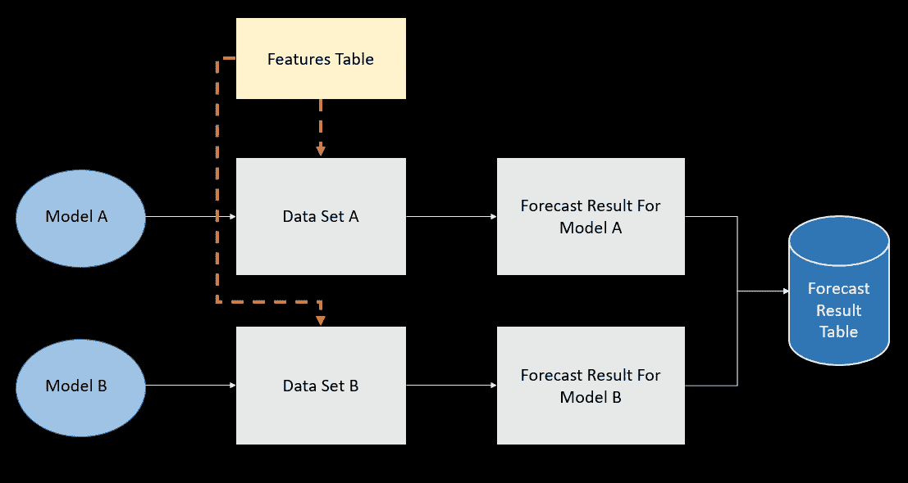
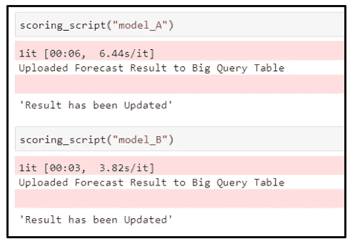

# 作为新手:我了解到在 Python 中使用配置文件可以使开发更高效

> 原文：<https://towardsdatascience.com/as-a-novice-i-learned-that-using-configuration-files-in-python-makes-development-more-efficient-29c75b4eabd5?source=collection_archive---------10----------------------->

## 查看使用配置文件时的区别


费伦茨·阿尔马西拍摄于 [Unsplash](https://unsplash.com/)

## 介绍

在理解配置文件之前，我的脚本通常非常*长，重复，低效*。此外，每次变量发生变化时，我都会花大部分时间在脚本的不同部分进行更改，这非常耗时。然后我注意到其他人正在使用配置文件作为他们开发的一部分，我也开始探索和实现它们，我意识到当使用配置文件时，事情变得更加**高效、灵活和有组织**。

## 那么什么是配置文件呢？

*   配置文件允许我们配置参数和初始设置。
*   配置文件的格式可以是— yaml *，ini，json，xml*

配置文件通常用于存储敏感信息，如数据库凭证、密码、服务器主机名、管理参数等。

在本文中，我将分享在机器学习项目中使用**配置文件与不使用配置文件**的区别。我们将使用的配置文件格式是 YAML 格式。代表另一种标记语言的 YAML 被选中，因为它没有诸如大括号和方括号之类的格式，这使得它因可读性和易写性而受欢迎。

这个用例中的场景是基于不同的预建模型执行评分(预测)。每个模型需要不同的数据集来执行预测，但源表是相同的。下图说明了构建所需的过程:



用例场景说明

评分流程概述:

*   有两个模型:Model_A 和 Model_B，它们已经基于不同的数据集预先构建，但是是从相同的 features 表中检索的。
*   为模型 A 准备评分脚本，根据数据集 A 进行预测，并将预测结果推送到数据库中。
*   为模型 B 准备评分脚本，根据数据集 B 进行预测，并将预测结果推送到数据库中。

*(在这个用例中，开发的模型基于从* [*Kaggle:超市销售数据集*](https://www.kaggle.com/rohitsahoo/sales-forecasting)*)*

现在，让我们来看看如何实现配置文件，以及不使用配置文件时的比较。

## 带有配置文件的评分脚本:

首先，让我们看看 YAML 的配置文件是什么样子的。下面是一个配置文件 **(model_A.yml)** 的示例，它指定了模型 A 执行模型预测所需的段、模型文件名和列。

然后，我们将加载并读取 YAML 文件，作为评分脚本的一部分。下面是一个使用 python 加载 YAML 文件并读取配置文件中的值的示例。注意，配置文件名是用变量***“+模型+”指定的。yml* 而不是*" model_A.yml "****因为我们有多个 YAML 文件要加载到脚本中(model _ a . yml，model_B.yml)。用这种方法指定允许我们为不同的模型重用相同的脚本。*

```
*config_file = ""+model+".yml"with open(config_file, "rb") as file:
        config = yaml.load(file)segment = config['segment']
model_file_name = config['model_file_name']
columns = config['columns']*
```

*在我们的评分脚本中，配置变量在两个不同的区域被调用:*

*(1) **配置变量[' segment ']&[' columns ']**用于从 Google Big Query 中检索模型 A 所需的数据集*

```
*client = bigquery.Client()
table_id = 'sales_data.superstore_sales_data_processed'
sql = "SELECT **{columns}** FROM `sue-gcp-learning-env.sales_data.superstore_sales_data_processed` where segment = ? and year_week = ?;".format(**columns**=",".join(**columns**))job_config = bigquery.QueryJobConfig(
        query_parameters = [
            bigquery.ScalarQueryParameter(None, "STRING" , **segment**),
            bigquery.ScalarQueryParameter(None, "INTEGER" , int(year_week))
        ]
    )*
```

*(2) **配置变量['模型文件名称']** 用于调用加载模型的 pickle 文件*

```
*pickle_file_name = **model_file_name**
with open(pickle_file_name,'rb') as pickle_model:
     model = pickle.load(pickle_model)*
```

*现在让我们看看我们最终的评分脚本是什么样子的:*

*要为模型 A 或模型 B 运行我们的评分脚本，我们可以调用带有指定参数的函数。(型号 _A /型号 _B)。例如，在下图中，通过传递与 YAML 文件(model_A.yml，model_B.yml)同名的参数，可以使用相同的评分脚本为模型 A 和模型 B 运行。*

**

*调用评分脚本函数*

## *没有配置文件的评分脚本:*

*现在让我们看看不使用配置文件时的区别。在下面的脚本中，请注意变量是基于模型 A 所需的细分值硬编码的— **细分=‘消费者’**。*

```
*client = bigquery.Client()
    table_id = 'sales_data.superstore_sales_data_processed'
    sql = "SELECT * EXCEPT(total_sales) FROM `sue-gcp-learning-env.sales_data.superstore_sales_data_processed`  where **segment = 'Consumer'** and year_week =?"job_config = bigquery.QueryJobConfig(
        query_parameters = [
            bigquery.ScalarQueryParameter(None, "INTEGER" , int(year_week))
        ]
    )*
```

*此外，模型 A 的模型文件名也是硬编码的*

```
*pickle_file_name = **'model_A_consumer.pkl'**
with open(pickle_file_name,'rb') as pickle_model:
    model = pickle.load(pickle_model)*
```

*下面是没有配置文件的最终脚本。现在，该脚本只显示了一个模型，如果我们将这种方法用于模型 B，它将是模型 B 变量被硬编码的脚本的副本。随着我们有越来越多的模型，脚本将继续复制。**例如，如果我们有 10 个模型要执行评分，并且没有引入配置文件，那么我们的脚本将是下面脚本长度的 10 倍。***

*如果您想查看包括型号 B 的配置文件在内的完整代码，可在 [**Github**](https://github.com/iamsuelynn/Config_Comparison) 上找到。*

## *结论:*

*将配置文件作为软件开发的一部分来添加，使事情更易于管理，并且无疑使我的生活更加轻松。在我目前的项目中，我们有数百个模型要开发和评分。如果我对所有东西都进行硬编码，将会花费大量的时间，并且可能会达到无法控制的程度。我很高兴我意识到了使用配置文件的重要性，并希望这篇文章可以帮助任何人在他们的下一个项目中开始使用配置文件。*

## ***引用&链接***

*[1][https://www . analyticsvidhya . com/blog/2021/05/reproducible-ml-reports-using-YAML-configs-with-codes/](https://www.analyticsvidhya.com/blog/2021/05/reproducible-ml-reports-using-yaml-configs-with-codes/)*

*[2][https://medium . com/analytics-vid hya/how-to-write-configuration-files-in-your-machine-learning-project-47bc 840 ACC 19](https://medium.com/analytics-vidhya/how-to-write-configuration-files-in-your-machine-learning-project-47bc840acc19)*

*[3][https://www.kaggle.com/rohitsahoo/sales-forecasting](https://www.kaggle.com/rohitsahoo/sales-forecasting)*

*[https://www.tutorialspoint.com/yaml/index.htm](https://www.tutorialspoint.com/yaml/index.htm)*