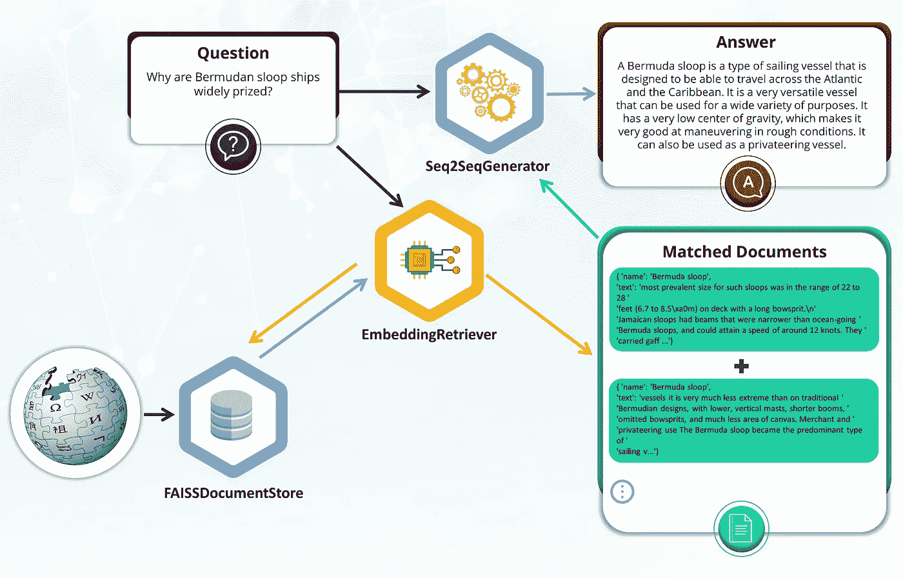

# 使用 Haystack 上的长格式问题回答来问维基百科 ELI5 类的问题

> 原文：<https://towardsdatascience.com/ask-wikipedia-eli5-like-questions-using-long-form-question-answering-on-haystack-32cf1ca6c00e?source=collection_archive---------18----------------------->

## 使用你的文档和 26 行 Python 代码构建一个长形式的问题回答平台

基于自然语言处理的问答系统的最新进展是惊人的。QA 系统建立在最新的语言模型(BERT，RoBERTa 等)之上。)可以相对轻松且精确地回答基于仿真陈述的问题。该任务包括找到包含答案的相关文档段落，并通过扫描正确的单词标记范围来提取答案。

更具挑战性的问答系统涉及所谓的“生成性问答”。这些系统关注于处理这样的问题，其中所提供的上下文段落不仅仅是所提取答案的源标记，而是提供更大的上下文来合成原始答案。

# 长篇问答动机

就在上周，我在复习度量学习，突然想到它和对比学习有一些相似之处。我当时没有时间去做一次深潜来满足我的好奇心，尽管我很想这样做。一个问答平台，我可以问，“度量学习和对比学习的主要区别是什么？”通过迅速提供一个可靠的、详细的答案，会使这个话题变得迅速而富有成效。

还记得上一次你在谷歌上研究一个特定的主题，进行了几十次查询来寻找相关的网页结果，随后，自己煞费苦心地合成了一个长达一段的答案吗？如果 QA 系统能自动为你做这件事会怎么样？

长格式问题回答(LFQA)系统试图复制和自动化这一艰巨的活动。由于这些 QA 系统相对较新，研究人员在一个公开可用的数据集上为它们训练模型——Eli 5(解释一下，就像我五岁一样)。ELI5 来源于 subred dit[/r/explain like im five/](https://www.reddit.com/r/explainlikeimfive/)，它抓住了综合来自多个网络来源的信息并生成五岁儿童能够理解的答案的挑战。

那么，ELI5 数据集中有哪些问题和答案呢？你可以随意看看 r/explainlikeimfive/ subreddit，或者更好的是，在展会上查看 ELI5 专用的[网站](https://facebookresearch.github.io/ELI5/)。

尽管由 Angela Fan、Yacine Jernite 和 Micheal Auli 领导的脸书人工智能研究团队公开发布了 ELI5 数据集和附带的语言模型，但还没有现成的 QA 平台允许用户轻松定制这样的 LFQA 系统。直到现在。

# 干草堆里的 LFQA

[Haystack](https://github.com/deepset-ai/haystack) 是一个端到端的开源框架，使用户能够为各种问答和语义搜索案例构建健壮的生产就绪管道。从 0.9.0 版本开始，Haystack 支持 LFQA 以及之前支持的 QA 和语义搜索场景。

使用 Haystack 创建自己的端到端 LFQA 管道非常简单。Haystack 上的 LFQA 由三个主要模块组成:文档存储、检索器和生成器。让我们更深入地了解这三个模块，以及它们如何适应 LFQA 平台。

Haystack 中的 LFQA 组件和问答流程。图片由作者提供。

# 文档存储

顾名思义，DocumentStore 保存您的文档。Haystack 有几种文档存储解决方案可用于不同的用例。对于 LFQA，我们需要使用一个向量优化的文档存储，其中嵌入的文档向量表示我们的文档。因此，在我们的演示中，我们将使用 FAISSDocumentStore，但我们也可以很容易地使用 Haystack 平台上的任何其他向量优化文档存储，如 Milvus 或最近添加的 Weaviate。

# 取回的人

在为给定的查询生成答案之前，我们的 QA 系统需要找到支持文档。检索器模块的工作是通过计算查询和文档向量之间的相似性来找到最佳候选文档。为了找到与我们的查询最匹配的文档，我们将使用 Haystack 的密集检索器之一 EmbeddingRetriever。检索器首先通过它的语言模型传递查询，以获得查询嵌入。然后，通过比较嵌入查询和文档存储中嵌入文档向量的点积，我们可以快速找到正确的文档并检索它们。

我们将使用已经可用的名为 Retribert 的 BERT 变体，它专门针对这个查询/文档匹配任务进行了优化。Retribert 语言模型在 HuggingFace 模型中心公开可用，其训练的细节可在[这里](https://yjernite.github.io/lfqa.html#4.a---Contrastive-Training-with-ELI5-In-Batch-Negatives)获得。

# 发电机

在检索器返回与我们的查询最相关的文档之后，我们就可以将选择的文档输入到基于 ELI5 BART 的模型中，为给定的查询生成答案。ELI5 BART 语言模型也可以在 HuggingFace hub 上使用，它具有由 Haystack 的 Seq2SeqGenerator 实现的 seq2seq(例如机器翻译)架构。

为了从检索器找到的支持文档中生成一个很长的答案，我们将查询和支持文档连接起来，并将其作为输入通过 ELI5 BART 模型。模型的输出是我们生成的答案。关于如何训练 ELI5 模型的更多细节，请参考此[文档](https://yjernite.github.io/lfqa.html#5.-Generating-Answers-with-a-Sequence-to-Sequence-Model)。

# LFQA 演示

现在，我们对构建 LFQA 系统所必需的重要组件有了更好的理解，让我们使用 Haystack 来构建和测试它吧！

在本文的其余部分，我们将向您展示如何使用上面提到的现成组件快速创建 LFQA 部署场景。我们将使用 HuggingFace Wiki 片段[数据集](https://huggingface.co/datasets/wiki_snippets)(来自 100k 维基百科文档的 100 个单词的段落)作为我们 LFQA 系统的源文档。然后我们将使用类似于 ELI5 的问题来查询系统，看看我们会得到什么样的答案。

为了遵循这一部署场景，您可以使用谷歌的合作实验室[笔记本](https://colab.research.google.com/drive/1gPlb6DWy2f3GmMQ-asWdwr2PFhihc2NJ)进行免费的 GPU 访问。

# 搭建干草堆

我们将从所需库的 pip 安装开始。在我们的例子中，我们需要的只是草堆和拥抱脸数据集。

# 初始化文档存储

现在我们已经安装了所需的库及其依赖项，包括 HuggingFace transformers 等等，我们准备初始化我们的 QA 管道。我们将从 FAISSDocumentStore 开始存储我们的文档。

这个一行程序几乎不需要额外的解释。我们将使用 FAISSDocumentStore 的默认风格和“平面”索引。我们需要将 vector_dim 参数初始化为 128，因为我们的 Retribert 语言模型将查询和文档编码成一个 128 维的向量。

# 将维基百科文档添加到文档存储

在 FAISSDocumentStore 初始化之后，我们将加载并存储我们的维基百科段落。HuggingFace 数据集库提供了一种简单方便的方法来加载像 Wiki 片段这样的大型数据集。例如，Wiki snippets 数据集有超过 1700 万个 Wikipedia 段落，但是我们将流式传输前十万个段落，并将它们存储在 FAISSDocumentStore 中。

现在，让我们对前 100k 个 Wiki 片段进行编写迭代，并将它们保存到我们的 DocumentStore:

现在我们所有的文档都在 FAISSDocumentStore 中，我们需要初始化第二个 Haystack 组件——检索器。对于 LFQA，我们将使用 EmbeddingRetriever，它是用我们简单讨论过的 retriebert-base-un cased 语言模型初始化的。在检索器初始化之后，我们准备计算每个文档的嵌入，并将它们存储在文档存储中。

喝杯咖啡，因为更新 FAISSDocumentStore 中所有维基百科文档的嵌入大约需要 15 分钟。我们可以通过使用专用的 GPU 实例来加速文档嵌入过程，但是，为了演示的目的，即使是 Colab 的 GPU 也可以做得很好。

# 测试寻回犬

在我们盲目地使用 EmbeddingRetriever 获取文档并将其传递给答案生成器之前，让我们首先对其进行经验测试，以确保示例查询找到相关的文档。我们将使用 Haystack 的预制组件进行文档搜索 DocumentSearchPipeline。当你尝试类似 ELI5 的问题时，不要忘记你只是使用了十万个维基片段中的一小部分。在提问之前，使用下面的管道来确保您想要的主题和文档已经在数据库中。

事实上，DocumentSearchPipeline 确实找到了相关文档:

# 发电机

LFQA 堆栈中的最后一个组件是生成器。我们将使用 LFQA 的特定模型初始化 Haystack 的通用 seq 2 seq generator——Bart _ Eli 5 模型除了这个模型，我们将使用其他参数的默认初始化值。您可以使用其他 Seq2SeqGenerator 构造函数参数微调文本生成的各个方面。更多细节请参考 Haystack [文档](https://haystack.deepset.ai/docs/latest/apigeneratormd#Class-Seq2SeqGenerator)。我们需要做的最后一件事是在一个预定义的 Haystack 管道中连接检索器和生成器 GenerativeQAPipeline。

正如您可能已经猜到的那样，GenerativeQAPipeline 结合了检索器和生成器来为我们的查询生成答案。它代表了与我们构建的 LFQA 系统交互的主要 API。

# 运行查询

我们将与 GenerativeQAPipeline 进行交互，以获得我们的查询的答案。除了指定查询本身，我们还将对检索器传递给生成器的匹配文档的数量进行限制。这可以是任何数字，但是对于本演示，我们选择将源限制为 4。让我们先问一个类似于 ELI5 的查询:

我们得到以下答案:

🚀🎇这个答案简直令人震惊。它从百慕大单桅帆船的简要说明开始，并继续阐述使其在帆船类别中广受赞誉的特征。

让我们试试另一个:

答案是:

简明扼要。答案不像上一个例子那样详细。但是，我们可以强制模型生成更长的答案。我们需要在 Seq2SeqGenerator 构造函数中传递可选参数 *min_length* (字数)。

同一问题的新答案是:

太好了，这是我们想要的更详细的答案。随意试验，尝试不同的问题，但不要忘记答案来自我们使用的维基百科的小样本。