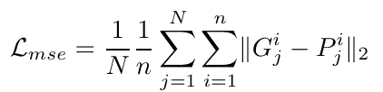

# ASMNet:一种用于人脸对齐和姿态估计的轻量级深度神经网络

> 原文：<https://towardsdatascience.com/asmnet-a-lightweight-deep-neural-network-for-face-alignment-and-pose-estimation-9e9dfac07094?source=collection_archive---------23----------------------->

本文解释了 ASMNet，这是一个轻量级卷积神经网络(CNN ),用于面部标志点检测(也称为面部对齐)和野外面部姿态估计。

代码和预先训练好的模型可以在 Github [这里](https://github.com/aliprf/ASMNet)获得。你也可以在这里阅读[原文。](https://openaccess.thecvf.com/content/CVPR2021W/AMFG/html/Fard_ASMNet_A_Lightweight_Deep_Neural_Network_for_Face_Alignment_and_CVPRW_2021_paper.html)

# 介绍

面部标志点检测是许多面部图像分析和应用中的基本任务。它对于人脸图像对齐、人脸识别、姿态估计和表情识别至关重要。已经提出了几种方法用于面部标志点检测，例如基于约束局部模型的方法[1，2]，AAM [3，4]，部分模型[5]，以及基于深度学习(DL)的方法[6，7]。尽管基于 DL 的方法被认为是最先进的方法，但是对于具有大姿态变化的人脸，人脸标志点检测仍然具有挑战性。因此，实现高精度的代价是计算复杂性的增加和效率的下降。

此外，包含在特征中的信息分层地分布在整个深度神经网络中。更具体地，虽然较低层包含关于边缘和角的信息，因此更适合于定位任务，例如面部标志点检测和姿态估计，但是较深层包含更适合于分类任务的更抽象的信息。受多任务学习思想的启发，我们设计了我们的 CNN 模型以及相关的损失函数来同时学习多个相关的任务。

最近的方法集中于提高精确度，这通常通过引入新的层、增加参数的数量和更长的推断时间来实现。这些方法在桌面和服务器应用中是准确和成功的，但随着物联网、移动设备和机器人技术的发展，人们越来越需要更准确和高效的算法。

我们提出了一种新的网络结构，它受 MobileNetV2 的启发，专门设计用于面部标志点检测，重点是在不损失太多准确性的情况下使网络变得浅而小。为了实现这个目标，我们提出了一个新的损失函数，它使用 ASM 作为辅助损失，并使用多任务学习来提高准确率。图 1 描绘了我们提出的想法的一般框架。我们用具有挑战性的 300W [8]数据集和野外更宽的面部标志(WFLW) [9]数据集测试了我们提出的方法。我们的实验结果表明，在网络规模比 MobileNetV2 小 2 倍的情况下，面部标志点检测和姿态估计的精度与最先进的方法相当。

# ASM 网络


图 1: ASM 网络(图片来自作者)

我们设计了一个比 MobileNetV2 [33]小两倍的网络，在参数和 FLOPs 数量方面都是如此。在设计 ASMNet 时，我们只使用 MobileNetV2 [33]的前 15 个块，而主架构有 16 个块。然而，创建一个浅层网络最终会降低系统的最终精度。为了避免这个问题，我们有目的地添加了一些新的层。图 1 显示了 ASMNet 的架构。

除此之外，在 CNN 中，较低层具有诸如边缘和角之类的特征，这些特征更适合于诸如地标定位和姿态估计之类的任务，而较深层包含更适合于诸如图像分类和图像检测之类的任务的更抽象的特征。因此，为相关任务训练网络同时建立了可以提高每个任务的性能的协同作用。

因此，我们设计了一个多任务 CNN 来检测面部标志，同时估计面部的姿态(俯仰、滚动和偏航)。为了使用不同图层的功能，我们创建了块 1-批量-归一化、块 3-批量-归一化、块 6-批量-归一化、块 10-批量-归一化以及最后块 13-批量-归一化的快捷方式。我们使用全局平均池层将这些快捷方式中的每一个连接到 MobileNetV2 的块 15 的输出，块 15-add。最后，我们连接所有的全局平均池层。这种架构使我们能够使用网络不同层中可用的功能，同时保持触发器的数量较少。换句话说，由于最初的 MobileNetV2 是为图像分类任务而设计的，其中需要更抽象的特征，因此它可能不适合面部对齐任务，因为面部对齐任务既需要在较深层中可用的抽象特征，也需要在较低层中可用的特征，例如边缘和拐角。

此外，我们向网络中添加了另一个相关的任务。如图 1 所示，所提出的网络预测 2 个不同的输出:面部标志点(网络的主要输出)，以及面部姿态。虽然这两个任务之间的相关性和协同作用可以产生更准确的结果，但我们也希望我们的轻量级 ASMNet 能够预测人脸姿态，以便它可以用于更多的应用程序。

# ASM 辅助损失函数

我们首先回顾主动形状模型(ASM)算法，然后解释我们基于 ASM 定制的损失函数，它提高了网络的准确性。

## 活动形状模型检查

活动形状模型是形状对象的统计模型。每个形状被表示为 *n* 个点以及 *S* 集合在等式中定义。1 在以下:


为了简化问题和学习形状分量，将主分量分析(PCA)应用于从一组 K 个训练形状样本计算的协方差矩阵。一旦建立了模型，任何训练样本的近似值都可以使用等式计算。2:


因此，可变形模型的一组参数由向量 b 定义，从而通过改变向量的元素，改变模型的形状。考虑 b 的第 I 个参数的统计方差(即本征值)为λi，为了保证应用 ASM 后生成的图像与地面真实情况比较接近，通常将向量 b 的参数 bi 限定为 3√λi [7]。此约束确保生成的形状与原始训练集中的形状相似。因此，在应用了这个约束后，我们根据等式创建了一个新的形状
。3:


其中 b̃是受约束的 b。我们还根据等式定义 ASM 算子。4:


*ASM* 使用等式将每个输入点(Px i，Py i)转换为新点(Aix，Aiy)。1、2 和 3。


图 2:asmlos(图片由作者提供)

## ASM 辅助损失

我们描述了两种不同任务的损失函数。这些任务负责面部标志点检测和姿态估计。

**人脸标志点检测任务**:人脸标志点检测常用的损失函数是均方误差(MSE)。我们提出了一个新的损失函数，它包括 MSE 作为主要损失，以及利用 ASM 提高网络精度的辅助损失，称为 ASM-LOSS。

所提出的 ASM 损失指导网络首先学习面部标志点的平滑分布。换句话说，在训练过程中，损失函数将预测的面部标志点与它们相应的地面实况以及使用 ASM 生成的地面实况的平滑版本进行比较。考虑到这一点，在训练的早期阶段，与主要损失(即 MSE)相比，我们为 ASM 损失设置了更大的权重，因为平滑的面部标志点的变化比原始标志点低得多，并且作为经验法则，更容易被 CNN 学习。然后，通过逐渐降低 ASM-LOSS 的权重，我们引导网络更多地关注原始标志点。在实践中，我们发现这种方法，也可以被认为是迁移学习，效果很好，可以得到更准确的模型。

我们还发现，虽然人脸姿态估计严重依赖于人脸对齐，但它也可以在平滑的人脸标志点的帮助下获得良好的精度。换句话说，如果面部标志点检测任务的性能是可接受的，这意味着网络可以预测面部标志，使得面部的整个形状是正确的，则姿态估计可以达到良好的精度。因此，使用平滑的标志点和使用 ASM-LOSS 的训练网络将导致姿态估计任务的更高精度。

考虑对于训练集中的每个图像，在称为 G 的集合中存在 n 个标志点，使得(Gxi，Gyi)是第 I 个标志点的坐标。类似地，预测集 P 包含 n 个点，使得(Px i，Py i)是第 I 个标志点的预测坐标。


我们对训练集应用 PCA 并计算特征向量和特征值。然后，我们计算集合 A，它包含 n 个点，每个点都是 G 中对应点的变换，根据等式应用 ASM 运算符
。4:


我们定义主要的面部标志点损失，Eq。7、作为
地面实况(G)和
预测标志点(P)之间的均方差



其中 N 是训练集中图像的总数，Gij = (Gix，Giy)表示训练集中第 j 个样本的第 I 个界标。我们将 ASM 损失计算为 ASM 点(Aset)和预测标志点(Pset)之间的误差，使用等式。8:


最后，我们根据等式计算面部标志任务的总损失。9:


主成分分析的准确性严重依赖于 ASM 点(Aset)，这意味着主成分分析越准确，地面实况(G)和 ASM 点(Aset)之间的差异就越小。更详细地说，通过降低 PCA 的准确度，生成的 ASM 点(Aset)将更类似于平均点集，平均点集是训练集中所有地面真实人脸对象的平均值。因此，预测 Aset 中的点比 Gset 中的点更容易，因为后者的变化低于前者的变化。我们使用这个特征来设计我们的损失函数，使得我们首先引导网络学习平滑的标志点的分布——这更容易学习——并且通过降低 ASM 损失的权重来逐渐硬化问题。我们使用等式将α定义为 ASM-减重。10:


其中 I 是历元数，l 是训练历元的总数。如等式所示。9，在训练开始时，α的值较高，这意味着我们更加重视 ASM-LOSS。因此，网络更关注于预测更简单的任务，并且收敛得更快。然后，在总周期的三分之一之后，我们将α减少到 1，并同等重视主要 MSE 损失 ASM 损失。最后，在总时期的三分之二之后，通过将
α减小到 0.5，我们将网络导向预测主要地面事实，同时考虑使用 ASM 作为辅助生成的平滑点。

**姿态估计任务:**我们使用均方差来计算头部姿态估计任务的损失。情商。11 定义了损失函数 *Lpose* ，其中偏航(yp)、俯仰(pp)和滚转(rp)是预测姿态，而 *yt* 、 *pt* 和 *rt* 是相应的地面实况。


# 实施细节

代码可以在 Github 上找到。关于代码的所有文档也是可用的。

**安装需求**

为了运行代码，您需要安装 python >= 3.5。可以使用以下命令安装运行代码所需的要求和库:

```
pip install -r requirements.txt
```

**使用预先训练好的模型**

您可以使用以下文件中的代码测试和使用预训练模型:[https://github.com/aliprf/ASMNet/blob/master/main.py](https://github.com/aliprf/ASMNet/blob/master/main.py)

```
tester = Test()
  tester.test_model(ds_name=DatasetName.w300,
                     pretrained_model_path='./pre_trained_models/ASMNet/ASM_loss/ASMNet_300W_ASMLoss.h5')
```

## 从零开始的培训网络

**准备数据**

数据需要规范化，以 npy 格式保存。

**常设仲裁法院的创建**

您可以使用 pca_utility.py 类来创建特征值、特征向量和均值向量:

```
pca_calc = PCAUtility()
    pca_calc.create_pca_from_npy(dataset_name=DatasetName.w300,
                                 labels_npy_path='./data/w300/normalized_labels/',
                                 pca_percentages=90)
```

**培训**

培训实现位于 train.py 类中。您可以使用以下代码开始培训:

```
trainer = Train(arch=ModelArch.ASMNet,
                    dataset_name=DatasetName.w300,
                    save_path='./',
                    asm_accuracy=90)
```

# 结果

ASMNet 可以以非常高的视觉精度执行人脸对齐和姿态估计。样本图片请访问我的 GitHub 或原始论文。

# 结论

我们提出了 ASMNet，一种轻量级的 CNN 架构，具有多任务学习功能，用于面部标志点检测和姿态估计。我们提出了使用 ASM 辅助的损失函数来提高网络精度。我们使用 MobileNetV2 的一小部分构建了我们的网络(称为 ASMNet)。所提出的 ASMNet 架构比 MobileNetV2 小大约 2 倍，而精度保持在相同的 rat

# 请将此作品引用为:

```
@inproceedings{fard2021asmnet,
        title={ASMNet: A Lightweight Deep Neural Network for Face Alignment and Pose Estimation},
        author={Fard, Ali Pourramezan and Abdollahi, Hojjat and Mahoor, Mohammad},
        booktitle={Proceedings of the IEEE/CVF Conference on Computer Vision and Pattern Recognition},
        pages={1521--1530},
        year={2021}
  }
```

## 参考

[1] A. Asthana、S. Zafeiriou、S. Cheng 和 M. Pantic。约束局部模型的鲁棒判别响应图拟合。IEEE 计算机视觉和模式识别会议论文集，第 3444–3451 页，2013 年。

[2] D. Cristinacce 和 T. F. Cootes。约束局部模型下的特征检测和跟踪。在 Bmvc，第 1 卷，第 3 页。Citeseer，2006 年。

[3]库茨、爱德华兹和泰勒。主动外观模型。在欧洲计算机视觉会议上，第 484-498 页。斯普林格，1998 年。

[4]马丁斯、卡塞罗和巴蒂斯塔。通过 2.5 维主动外观模型的生成式人脸对齐。计算机视觉和图像理解，117(3):250–268，2013。

[5] X .朱和 d .拉马南。人脸检测、姿态估计、
和野外地标定位。2012 年 IEEE 计算机视觉和模式识别会议，2879-2886 页，2012 年 6 月。

[6]张俊杰、单绍良、简明和陈。用于实时人脸对齐的粗到细自动编码器网络(cfan)。在欧洲计算机视觉会议上，第 1-16 页。斯普林格，2014。

[7]张志军、罗培平、李春春和唐晓明。基于深度多任务学习的人脸标志点检测。在欧洲计算机视觉会议上，第 94-108 页。斯普林格，2014。

[8] C .萨戈纳斯、G. Tzimiropoulos、S. Zafeiriou 和 M. Pantic。野外 300 张脸挑战:第一次面部标志定位挑战。IEEE 计算机视觉研讨会国际会议论文集，397–403 页，2013 年。

[9]吴文伟、钱春弦、杨树国、王庆、蔡玉英和周庆。一种边界感知的人脸对齐算法。IEEE 计算机视觉和模式识别会议论文集，第 2129-2138 页，2018 年。