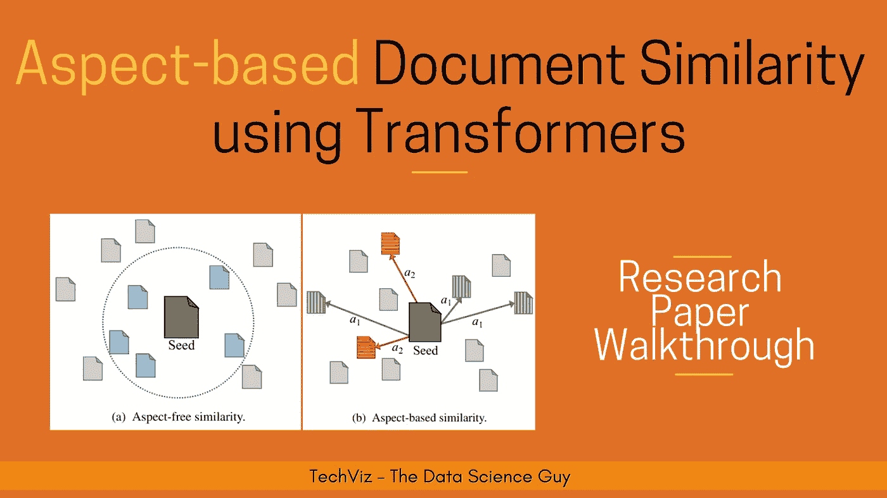
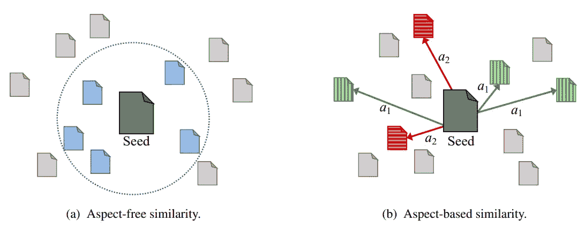
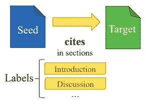
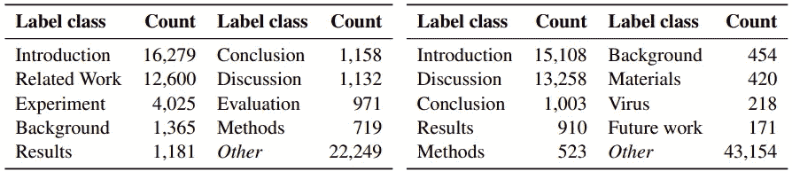
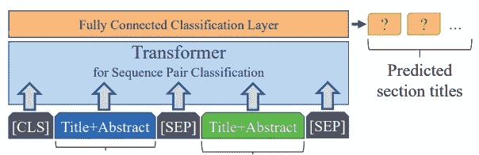

# 基于特征的文档相似度的变换器

> 原文：<https://towardsdatascience.com/aspect-based-document-similarity-using-transformers-8a2f820e5692?source=collection_archive---------22----------------------->

## NLP 研究论文解释

*在这篇博客中，我试图根据我的理解，使用变形金刚* *来总结论文* [*中基于方面的文档相似度。请随时评论你的想法！*](https://www.aclweb.org/anthology/2020.coling-main.545.pdf)

# 问题陈述

当前的[文档相似性](/a-complete-beginners-guide-to-document-similarity-algorithms-75c44035df90)技术主要集中在比较文档，而没有考虑它们固有的文档结构。这种相似性技术被称为**方面无关的相似性**。这里，similarity 函数只返回一个介于 0–1 之间的值，用来衡量两个文档之间的相似程度，这多少有点像一个无法解释的相似性黑盒。此外，这可能会限制像[推荐系统](https://en.wikipedia.org/wiki/Recommender_system)这样的应用程序的性能，这些应用程序主要依赖于文档相似性作为基础。例如，您可能希望设计一个推荐系统，仅基于“方法论”或“数据集”部分返回与现有论文相似的论文，这里的相似性通常被认为是多方面的，而当前的相似性系统无法捕捉这种粒度。

本文正是以此为目标，将与方面无关的相似性扩展到基于方面的相似性。为了结合方面的概念，他们将测量相似性的任务建模为**成对的文档分类任务**。此外，他们使用 [Transformer](https://www.analyticsvidhya.com/blog/2019/06/understanding-transformers-nlp-state-of-the-art-models/) 模型，如 [RoBERTa](https://ai.facebook.com/blog/roberta-an-optimized-method-for-pretraining-self-supervised-nlp-systems/) 和 [BERT](https://en.wikipedia.org/wiki/BERT_(language_model)) 变体，在来自 [ACL](https://acl2020.org/) 和 [CORD-19](https://allenai.org/data/cord-19) 的研究论文数据集上执行和评估他们的方法。

*下图显示了与方面无关和基于方面的相似性的图示视图—*

图片来自[来源](https://www.aclweb.org/anthology/2020.coling-main.545.pdf)

在上图中，给定一个**种子文档**，基于某些**距离度量，如欧几里德距离、余弦距离**等，无特征相似性返回 [k 近邻](https://www.geeksforgeeks.org/k-nearest-neighbours/)。然而，基于方面的相似性方法将只返回那些对于某些方面 *(a1)* 相似的文档，导致低[假阳性](https://en.wikipedia.org/wiki/False_positives_and_false_negatives#:~:text=A%20false%20positive%20is%20an,a%20condition%20when%20it%20is)。

> 如果你想继续享受阅读与数据科学和机器学习相关的精彩文章的乐趣，你可以通过我的[推荐链接](https://prakhar-mishra.medium.com/membership):)购买中级会员资格

# 提议的方法

他们将整个问题建模为**多类多标签分类**问题。在本节中，我们将介绍数据集准备和模型训练方面——

## 数据集准备

在这项任务中，从研究论文中获取人工注释的数据成本很高，如果可能的话，可能仅限于少量数据。因此，作者通过将**引用视为训练信号**来继续并自动化这一过程，即如果任何两篇论文之间存在引用，我们认为这些论文是相似的。此外，为了合并节级别信息*(方面)，*他们选择引用其他文档的种子文档的节的标题作为类标签。例如，在下图中，种子文档引用了介绍和讨论部分下的目标文档。因此，我们将种子和目标作为带有标签介绍和讨论的文档对。因此，分类类型在本质上将是**多类*(因为多个标题)*以及多标签*(同一篇论文在不同章节下的多次引用)*** 。

使用引用信号的数据注释|图片来自[来源](https://www.aclweb.org/anthology/2020.coling-main.545.pdf)

现在，由于对一个章节可以采用什么样的标题没有特定的标准，作者有意识地对某些章节标题进行标准化、分组和划分，以获得所有论文的固定标题集，他们还将离群值或无法识别的章节放在“其他”类别中。下图显示了 **ACL** *(左)***CORD**-**19***(右)*纸张的标签分布-

ACL 和 CORD-19 数据集的标签分布|图片来自[来源](https://www.aclweb.org/anthology/2020.coling-main.545.pdf)

此外，除了只有正信号样本之外，他们还引入了一个名为“ **None** 的新类，它在相同的比例下充当我们正样本的[负对应](http://mccormickml.com/2017/01/11/word2vec-tutorial-part-2-negative-sampling/) 。他们将一组论文归入这一类别的一般经验法则是，论文**首先不应该是正对的，不应该一起被共同引用，不应该共享任何作者，并且不应该在同一地点发表**。

在所有这些步骤和转换之后，我们已经准备好了数据集！

## 模特培训

为了训练相似性模型，作者从 seed 和其他研究论文中提取论文标题和摘要，并将其视为整个文档的代理。提取后，它们用 **cls** 和**分隔符**标记连接这些片段，形成一个大序列。这然后被馈送到变换器模型，并且在输出端，它们在 CLS 表示法上堆叠一个**分类层，并且用[**交叉熵损失**](https://ml-cheatsheet.readthedocs.io/en/latest/loss_functions.html) **作为罚信号**来对照地面真相中存在的标签训练模型。*下图显示的是同一—* 的图示**

模型训练|图片来自[来源](https://www.aclweb.org/anthology/2020.coling-main.545.pdf)

> 如果你愿意，你也可以查看我写的其他研究论文摘要。

所以，是的，这就是我的博客。我有一个同样的多语种字幕视频漫游，如果你喜欢消费视频内容而不是文本(就像我一样:D)，一定要看看—

[多看看这样的视频](https://www.youtube.com/channel/UCoz8NrwgL7U9535VNc0mRPA)

请随意阅读整篇论文，并向作者问好，感谢他们的贡献。

> ***论文标题:*** *基于方面的文档相似度使用变形金刚*
> 
> ***论文链接:***[*https://www.aclweb.org/anthology/2020.coling-main.545.pdf*](https://www.aclweb.org/anthology/2020.coling-main.545.pdf)
> 
> ***作者:*** *马尔特·奥斯坦多夫、特里·鲁斯、蒂尔·布卢姆、贝拉·吉普、格奥尔格·雷姆*

我希望你喜欢读这篇文章。如果你愿意支持我成为一名作家，可以考虑注册[成为一名媒体成员](https://prakhar-mishra.medium.com/membership)。每月只需 5 美元，你就可以无限制地使用 Medium。

*感谢您的宝贵时间！❤*