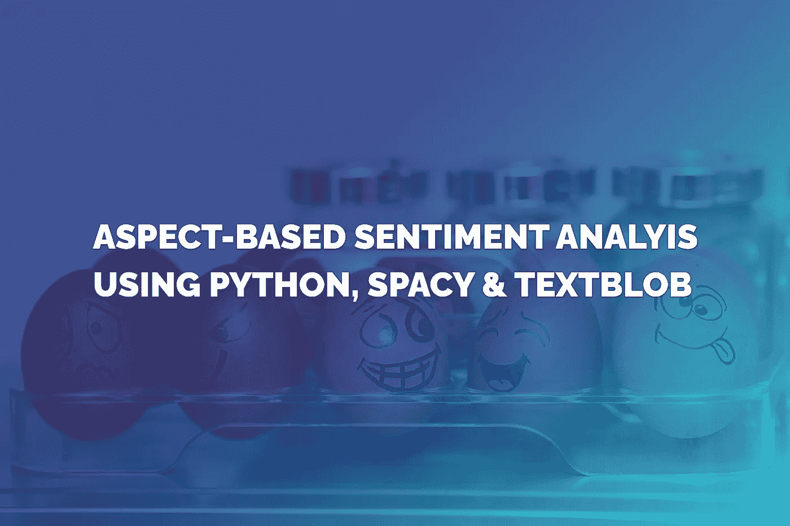
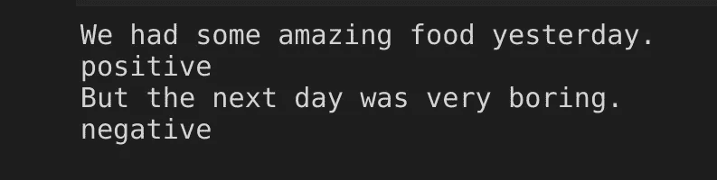
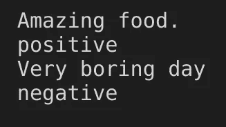
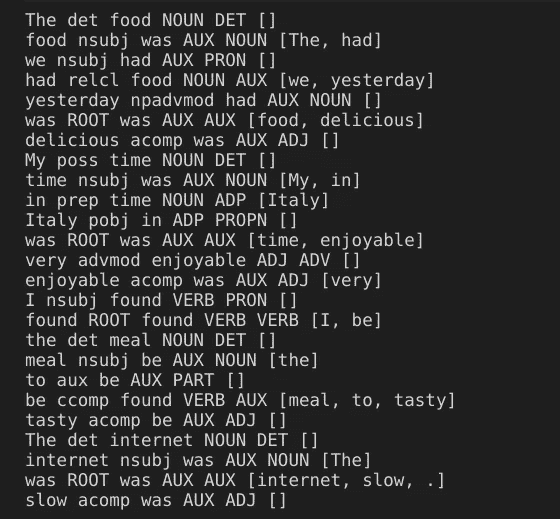
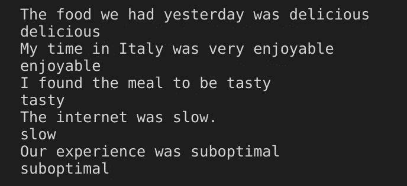
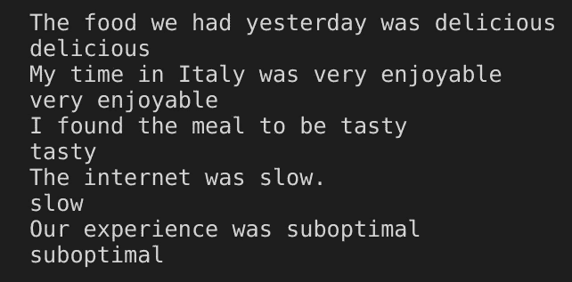
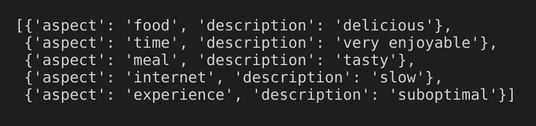
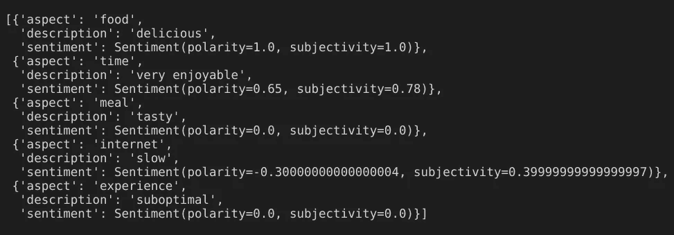
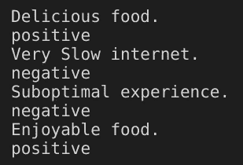

# 使用 Spacy & TextBlob 的基于方面的情感分析

> 原文：<https://towardsdatascience.com/aspect-based-sentiment-analysis-using-spacy-textblob-4c8de3e0d2b9?source=collection_archive---------1----------------------->

## 评估特定主题或属性的情感



NLP 最常见的目标之一是分析文本和提取见解。你可以找到无数关于如何进行情感分析的教程，但是通常使用的方法并不总是足够的。

当你说出这样一句话时。

`We had some amazing food yesterday. But the next day was very boring.`

一个逐句的情感分析算法会产生类似这样的结果。



但是有时候你希望你的情感分析是基于方面的，或者叫做基于主题的。

在本文中，我们将构建一个非常简单的基于方面的情感分析，它能够提取一般概念并理解它们周围的情感。在我们之前的示例中，这意味着类似于:



在这种情况下，方面或主题是**食物**和**天**。通过执行基于方面的情感分析，我们分析大量文本并提取见解。

例如，如果您监控客户评论或电话记录，您可以寻找附加了一些情感的方面，并提取关于如何改进的见解。

对于本文，我们将使用 spacy(Python 中的自然语言处理库)和 Textblob，text blob 提供了用于情感分析和文本处理的简单工具。

```
# We get started by importing spacy
**import** spacy
nlp = spacy.load("en_core_web_sm")
```

如果你还没有，你需要通过执行`python -m spacy download en_core_web_sm`来下载`en_core_web_sm`

我们也来定义几个简单的测试句子。

```
sentences = [
  'The food we had yesterday was delicious',
  'My time in Italy was very enjoyable',
  'I found the meal to be tasty',
  'The internet was slow.',
  'Our experience was suboptimal'
]
```

我们的第一个目标是以某种方式拆分我们的句子，以便我们有目标方面(例如，食物)和他们的情感描述(例如，美味)。

```
**for** sentence **in** sentences:
  doc = nlp(sentence)
  **for** token **in** doc:
    print(token.text, token.dep_, token.head.text, token.head.pos_,
      token.pos_,[child for child in token.children])
```



由于 spacy 的依存解析和 POS(词性)标签，我们可以看到句子中每个标记的依存关系。我们也注意到了孩子的标记，这样我们就可以选择像“非常”、“相当”等强化词。

**免责声明:**我们目前过于简单的算法可能无法提取语义上的重要信息，如“不太好”中的“不”。这在实际应用中至关重要。

让我们先看看如何挑选情感描述。

```
**for** sentence **in** sentences:
  doc = nlp(sentence)
  descriptive_term = ''
  **for** token **in** doc:
    **if** token.pos_ == 'ADJ':
      descriptive_term = token
  print(sentence)
  print(descriptive_term)
```



你可以看到，我们的简单算法选择了所有的描述性形容词，如美味、愉快和可口。但是现在缺少的是强化词，比如“very”。

```
**for** sentence **in** sentences:
  doc = nlp(sentence)
  descriptive_term = ''
  **for** token **in** doc:
    **if** token.pos_ == 'ADJ':
      prepend = ''
      **for** child **in** token.children:
        **if** child.pos_ != 'ADV':
          **continue** prepend += child.text + ' '
      descriptive_term = prepend + token.text
  print(sentence)
  print(descriptive_term)
```



正如你所看到的，这一次我们也非常愉快地学习了。我们的简单算法能够识别副词。它检查每个形容词的子代标记，并挑选出诸如“非常”、“相当”等副词。

在常规场景中，我们还需要捕捉诸如“不”之类的否定，但这超出了本文的范围。但是如果你愿意的话，我们鼓励你练习并在之后做得更好。

我们现在准备识别被描述的目标。

```
aspects = []
**for** sentence **in** sentences:
  doc = nlp(sentence)
  descriptive_term = ''
  target = ''
  **for** token **in** doc:
    **if** token.dep_ == 'nsubj' **and** token.pos_ == 'NOUN':
      target = token.text
    **if** token.pos_ == 'ADJ':
      prepend = ''
      **for** child **in** token.children:
        **if** child.pos_ != 'ADV':
          **continue** prepend += child.text + ' '
      descriptive_term = prepend + token.text aspects.append({'aspect': target,
    'description': descriptive_term})
print(aspects)
```



现在我们的解决方案开始看起来更完整了。我们能够挑选方面，即使我们的应用程序事先不“知道”任何事情。我们还没有对“食物”、“时间”或“用餐”等方面进行硬编码。我们也没有硬编码诸如“美味”、“缓慢”或“愉快”这样的形容词。

我们的应用程序根据我们设置的简单规则来选择它们。

有时候，你可能想先找到主题，然后在文本中识别它们，而忽略那些不常见的主题或方面。为此，在进入解决方案的情感分析部分之前，你需要在**主题建模**上工作。有一个关于数据科学的很好的指南，解释了[潜在的狄利克雷分配](/topic-modeling-and-latent-dirichlet-allocation-in-python-9bf156893c24)，你可以用它来进行主题建模。

既然我们成功地提取了方面和描述，是时候将它们分类为正面或负面了。这里的目标是帮助计算机理解美味的食物是积极的，而慢速互联网是消极的。计算机不懂英语，所以在我们找到可行的解决方案之前，我们需要做一些尝试。

我们将从使用默认的 TextBlob 情感分析开始。

```
**from** textblob **import** TextBlob
**for** aspect **in** aspects:
  aspect['sentiment'] = TextBlob(aspect['description']).sentiment
print(aspects)
```



TextBlob 是一个提供开箱即用的情感分析的库。它有一个单词袋方法，这意味着它有一个单词列表，如“好”、“坏”和“很好”，这些单词都附有一个情感分数。它还能够挑选出影响情绪得分的修饰语(如“不”)和强化词(如“非常”)。

如果我们看看我们的结果，我可以说它看起来绝对不差！我同意他们所有人的观点，但唯一的问题是美味和次优被认为是中性的。似乎它们不是 TextBlob 的字典的一部分，因此，它们没有被选中。

另一个潜在的问题是，一些描述性术语或形容词在某些情况下可能是正面的，而在其他情况下可能是负面的，这取决于它们所描述的单词。TextBlob 使用的默认算法无法知道寒冷的天气可以是中性的，冷食可以是阴性的，而冷饮可以是阳性的。

好的一面是，TextBlob 允许你使用一个非常简单的语法来训练一个 NaiveBayesClassifier，这个语法对任何人来说都很容易理解，我们将使用它来改进我们的情感分析。

为了能够使用它，您需要执行以下命令来下载所需的语料库:`python -m textblob.download_corpora`

```
**from** textblob.classifiers **import** NaiveBayesClassifier
# We train the NaivesBayesClassifier
train = [
  ('Slow internet.', 'negative'),
  ('Delicious food', 'positive'),
  ('Suboptimal experience', 'negative'),
  ('Very enjoyable time', 'positive'),
  ('delicious food.', 'neg')
]cl = NaiveBayesClassifier(train)# And then we try to classify some sample sentences.
blob = TextBlob("Delicious food. Very Slow internet. Suboptimal experience. Enjoyable food.", classifier=cl)**for** s **in** blob.sentences:
  print(s)
  print(s.classify())
```



正如你所看到的，我们传递的句子并不完全是我们在训练示例中使用的，但它仍然能够正确地预测所有短语的情绪。

您可以使用这个解决方案作为更复杂的基于方面的情感分析解决方案的起点。要做到这一点，您需要改进依赖项解析过程，以提取更准确的信息和更多类型的数据。一个很好的方法是使用 spacy 的 [DependencyMatcher](https://spacy.io/usage/rule-based-matching#dependencymatcher) ，它允许你使用自定义规则匹配模式。

至于情感分析部分，理想情况下，您希望标记大量数据，以便可以创建更高级的分类器，具有更高的准确度。你可以使用 [keras](https://keras.io/) 、 [TensorFlow](https://www.tensorflow.org/) 或其他机器学习库和工具来执行大量的二元(或分类)分类。

如果你有预先标记的数据，那会很有帮助。如果你不同意，你可以使用 TextBlob 这样的简单工具创建一个初始分析，然后你可以选择是否同意 TextBlob，而不是决定每个短语的情感，这比从头开始决定情感要快得多。

我真的很感激任何进一步的评论，因为它可以帮助我创建一个更先进的后续文章。感谢您阅读至此！