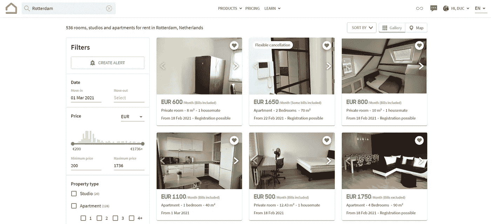
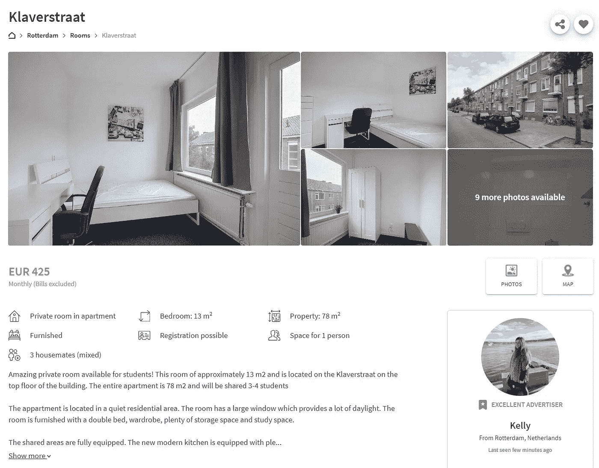
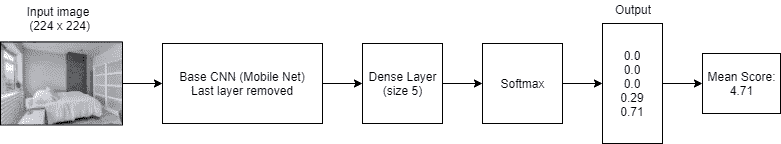
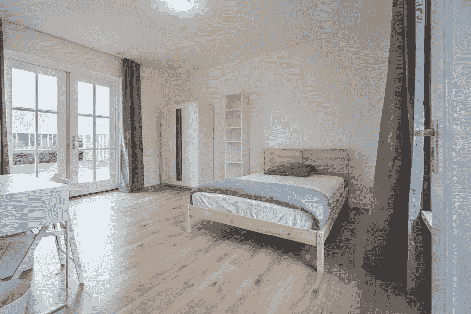
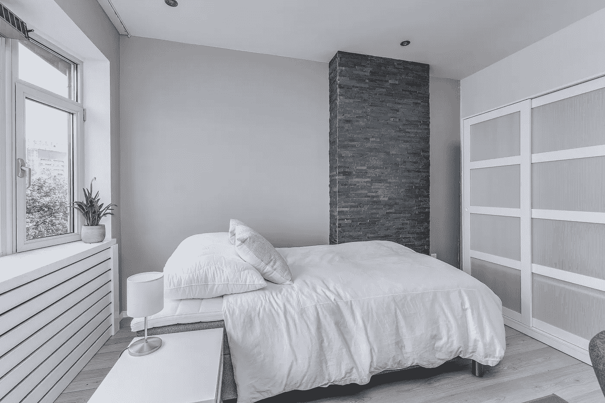
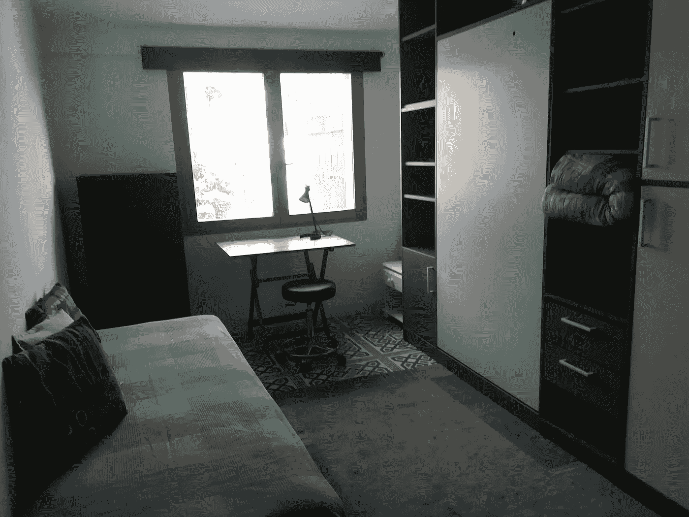
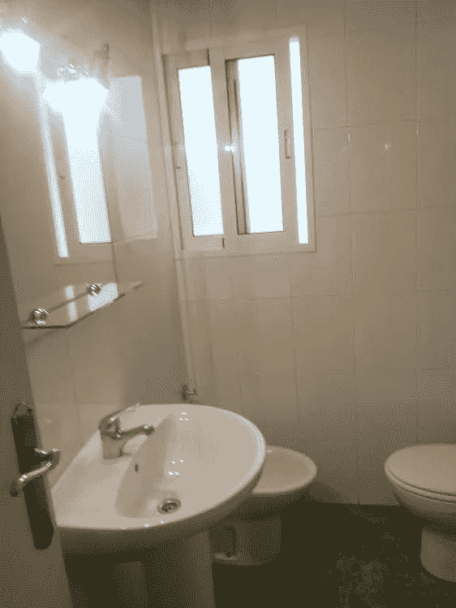
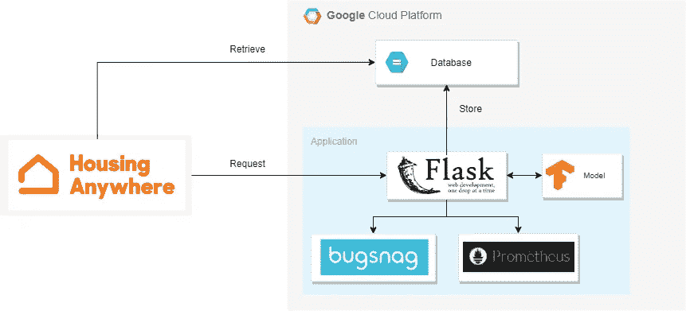
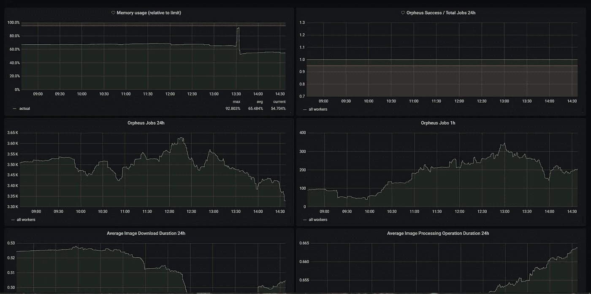

# 按比例评估图像美学质量

> 原文：<https://towardsdatascience.com/assessing-image-aesthetic-quality-at-scale-d7c834fd22de?source=collection_archive---------35----------------------->

## 或者，如何一次使用一个深度学习模型来改进搜索算法


迈尔斯·范德鲁文在 [Unsplash](https://unsplash.com/photos/t-j22ysiAL8) 上的照片

问自己这样一个问题:“*你多久检查一次谷歌搜索的第二页？”。*我猜答案在 20%左右。在 [HousingAnywhere](https://housinganywhere.com) ，我们也注意到同样的模式，84% 的搜索在第一页停止。这意味着成千上万的公寓和房间不会被用户看到。这就是为什么，作为一个中期住宿市场的核心，改进搜索算法是改善任何地方住房用户体验的关键。

# 问题是

在 HousingAnywhere 上，我们的用户首先从登录页面开始，在那里他们会看到一个搜索框，输入他们正在寻找的住宿地点和住宿日期。从那里，他们被定向到搜索页面，在那里他们可以根据更多要求进一步细化他们的搜索。点击任何搜索结果都会将用户引导至该住宿的列表页面。



**搜索页面**(图片作者提供)



**列表页面**(图片由作者提供)

我们在搜索页面上注意到的一个主要问题是，由于搜索算法没有考虑这一因素，图像质量差的列表经常出现在结果的顶部。这是不可取的，因为 HousingAnywhere 的主要使命之一是奖励“好”广告商，即那些提供详细信息、具有吸引力的广告客户。在我们的平台上，房客不需要进行现场查看就可以预订，这使得住宿照片成为决定房间是否被预订的主要因素之一。因此，需要一种模型来评估图像的质量，以便具有高质量图像的列表可以在搜索页面上获得提升。因此，为了获得更多的用户曝光率，图片质量差的列表需要增强它们的图片。

在处理画质的时候，我们衡量画质的方式主要有两个方面:*技术*和*美学*。前者处理像噪声、模糊、压缩这样的退化，而后者处理图片的吸引力*即*图像是否看起来令人愉快并显示房间的清晰概观。

但是你如何创建一个模型来决定一个图像在美学上是有吸引力的呢？幸运的是，有相当多的研究做了这个主题。最值得注意的是，这项由谷歌完成的研究。在研究中，引入了实现深度学习的解决方案来解决该问题。

<https://ai.googleblog.com/2017/12/introducing-nima-neural-image-assessment.html>  

# 解决方案

总之，所提出的架构本身非常简单，我们有一个基线 CNN (MobileNet、Inception 等),其最后一层被大小为 10 的密集层所取代，之后是 Softmax 激活函数。主要成分是建议的损失函数，**地球移动距离**:

> 在统计学中，运土机的距离(EMD)是区域 D 上两个概率分布之间的距离的度量。非正式地，如果分布被解释为在区域 D 上堆积一定量的泥土的两种不同方式，EMD 是将一堆变成另一堆的最小成本；其中成本假定为移动的灰尘量乘以移动的距离。

该论文在美学视觉分析(AVA)数据集上展示了有希望的结果，但由于该数据集包含非常普通的图片(从风景到动物图片到不同物体的图片)，它在只有房间图像的数据集上表现不佳。然后我们决定收集我们自己的数据集来执行[迁移学习](https://en.wikipedia.org/wiki/Transfer_learning)。

我们创建了一个由 5 名注释者组成的团队，每个人负责注释一个包含 1500 张图片的数据集。为了简单起见，我们决定将分数范围从 1-10 降低到 1-5。通过让多个注释者处理同一个数据集，我们试图减少在这个过程中产生的错误数量。例如，对于一个 5 分的图像，如果 4 个人记下了 5，但 1 个人错误地填了 1，则平均分数仍然很高(4.2)，而不是 1。

我们提出了这些评定图像的标准，作为所有注释者遵循的通用指南:

```
The photo quality of the image (i.e. clear and not blurry)
The attractiveness of the room (aesthetic wise)
The relevance of the image (i.e. does it show a good overview of the room)
Try to relate yourself to the tenants, how likely would you book this room if the listing has that image
```

由于 MobileNet 的轻量级架构，我们决定将其作为基线 CNN，并以 90:10 的比例分割训练/测试集。该模型输出一个概率分布，从中计算平均分数。为了评估模型的质量，我们选择使用一个对利益相关者更直观的简单指标(平均绝对误差)。结果是非常有希望的，最好的 epoch 获得了 0.519 的 MAE。所以平均来说，这个模型与真实标签相差大约 0.5 分。



**模型架构**(图片由作者提供)

以下是模型输出的一些示例:



比分: **4.97 / 5** (来源:HousingAnywhere.com)



比分:【HousingAnywhere.com】4.71/5(来源:中国)



得分: **2.02 / 5** (来源:HousingAnywhere.com)



比分: **1.94 / 5** (来源:HousingAnywhere.com)

# 结果呢

在我们最初的 A/B 测试后，我们发现使用考虑了质量分数的搜索算法，治疗组从搜索页面到列表页面的转化率有了 **5%** 的提高。我们对结果非常满意，因为这是我们对搜索算法进行的为数不多的实验之一，达到了统计学意义。

# 建筑

为了生产模型，我们使用 *Flask* 和 *Gunicorn* 构建了一个 RESTful API。这种架构设置简单，性能相当好。发送给我们的服务的请求将包含图像 URL，然后服务将提取并发送给这些模型。该服务作为一个容器部署在谷歌云平台 Kubernetes Engine 上。这种架构虽然非常简单，但仍然允许我们根据需要进行扩展，以处理来自平台的流量。



**应用架构**(图片由作者提供)

为了让我们晚上睡得安稳，我们使用 *Bugsnag* 进行错误监控，使用 *Prometheus* 跟踪指标。当服务失败太多请求或请求处理时间超过阈值时，我们会设置警报。

Bugsnag 为 Flask 提供了[本地支持](https://docs.bugsnag.com/platforms/python/flask/)，这使得调试错误变得非常简单。跟踪有关错误的详细信息，包括代码失败的位置和请求包含的内容。



从普罗米修斯收集到的数据会显示在 Grafana 上(图片由作者提供)

# 结论

就这样，我希望我已经成功地展示了如何在 HousingAnywhere 使用数据科学智能地解决一个复杂的业务用例。该模型的性能非常有前途，它有助于我们完成我们的使命，帮助租户找到最适合他们的住所。

最后，我要特别感谢 BI 团队和 [Simone Pouw](https://medium.com/u/b56a12451b52?source=post_page-----d7c834fd22de--------------------------------) 校对了这篇文章，感谢 [Idealo](https://medium.com/idealo-tech-blog/using-deep-learning-to-automatically-rank-millions-of-hotel-images-c7e2d2e5cae2) 团队展示了迁移学习是解决这个问题的关键。