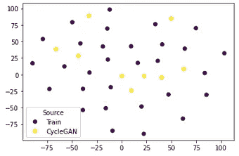

# 使用 Inception V3 和 FID 评分评估图像相似性

> 原文：<https://towardsdatascience.com/assessing-similarity-between-two-images-groups-using-inception-v3-and-fid-score-4b0367a74e67?source=collection_archive---------10----------------------->

## 衡量人工智能生成的图像与训练图像相似性的最佳方法是什么？

在过去的几年中，生成敌对网络或 gan 被广泛用于生成类似于训练集中给出的新图像(你可以使用[动漫](/generating-anime-characters-with-stylegan2-6f8ae59e237b)或[自行车](/how-to-train-stylegan2-ada-with-custom-dataset-dc268ff70544)和[许多](https://thispersondoesnotexist.com/) [其他](https://medium.com/analytics-vidhya/these-football-clubs-dont-exist-sharing-my-experience-with-stylegan-7d02e4b34914)来查看一些很酷的例子)。根据生成图像的数量及其用途，对生成图像的质量进行视觉评估可能并不充分，并且单独的 FID 分数可能并不充分。在这里，我将尝试说明一种方法，以便更深入地分析生成的结果。

照片由[现代灵感的灰烬](https://unsplash.com/@modernafflatusphotography?utm_source=unsplash&utm_medium=referral&utm_content=creditCopyText)在 [Unsplash](https://unsplash.com/?utm_source=unsplash&utm_medium=referral&utm_content=creditCopyText) 上拍摄

例如，考虑一个应用程序，其中为过采样生成新图像，以帮助从不平衡数据开始训练分类模型。在这种情况下，我们希望能够评估过采样图像和原始训练数据之间的相似性。理想情况下，它们应该与训练集足够相似，但也足够多样，覆盖原始数据集的整个领域，以便真正有助于模型训练。

在这个例子中，我不会训练任何模型，我将使用现有的图像集来说明该方法。为了简单起见，我将评估从 [Kaggle fruits 数据集](https://www.kaggle.com/moltean/fruits/version/22)中提取的几种苹果之间的相似性。数据集包含在白色背景下的 100×100 像素的水果图像

我考虑了 7 类苹果，总共 1173 张图片:

数据集中每个苹果类别的图片数量(图片由作者提供)

数据集中的样本图像:

作者图片

为了评估图像之间的相似性，我将从计算苹果参考类别(例如红苹果 1 号)和所有其他类别之间的 FID 分数开始。FID 或弗雷歇初始距离是在训练生成模型(如 StyleGAN)时可以使用的度量之一。它是基于使用在 ImageNet 数据集上训练的 Inception V3 模型从每个图像提取的特征来计算的。

# 1.图像准备

在计算 FID 分数之前，输入图像需要经历一些转换，以使它们达到预训练的 Inception V3 模型所期望的良好格式:

1.  大小为 299x299px 像素的 RGB 图像。简单地调整原始图像的大小会使它们变得太模糊，所以我选择用白色填充每个图像，直到达到预期的大小
2.  将图像转换为张量(将像素值从 0–255 缩放到 0–1)
3.  使用 ImageNet 训练集的平均值和标准偏差标准化图像

# 2.预训练的 Inception V3 模型和特征提取

首先实例化一个 inception v3 模型，并加载在 ImageNet 数据集上训练的现有模型的权重(它可以作为 pth 文件直接从 p [ytorch](https://download.pytorch.org/models/inception_v3_google-0cc3c7bd.pth) 下载) :

Inception V3 模型已经被训练来执行分类，但是因为我们只对使用它来从我们的图像中提取特征感兴趣，所以我们需要移除计算分类概率的最后一层:

Inception V3 网络中的层(图片由作者提供)

为了访问中间层的输出，我们可以使用 torch vision 的特征提取模块:

现在，我们可以简单地使用特征提取器从任何批量图像中获取特征。结果应该是一个大小为 2048 的向量。

# 3.FID 计算

在这篇[文章](https://arxiv.org/abs/1706.08500)中已经介绍了计算弗雷谢特初始距离的公式。对于我的 Python 实现，我使用了[这个教程](https://machinelearningmastery.com/how-to-implement-the-frechet-inception-distance-fid-from-scratch/)作为灵感

我评估了 7 组水果和我的参考类别苹果红 1 之间的 FID 距离。红苹果 1 及其本身的 FID 为零，我们可以看到，除了蛇果看起来更不一样之外，其他类型苹果的得分非常相似:

苹果红 1 和其他类型苹果之间的 FID(图片由作者提供)

对于未受过训练的眼睛来说，所获得的结果不容易解释，因为在视觉上，蛇果和红色 1 之间的差异对我来说似乎不如红色、黄色 2 和红色 1 之间的差异重要。

作者图片

# 4.主成分分析和 TSNE 投影

为了进一步深入分析提取的特征，我们可以执行主成分分析或 PCA 来获得降维数据集。主成分分析表明，我们可以从 2048 个特征传递到 60 个特征，同时仍然保持数据集中 95%以上的方差。

累积解释差异(作者图片)

通过在 PCA 降维数据集上使用 TSNE，可以获得数据的 2D 可视化。

作者图片

我们可以看到，在每个类别中没有太多的可变性，但每个类别似乎都由 3-4 个子组组成。这并不奇怪，因为考虑的数据集包含从不同角度拍摄的苹果图像，可以解释观察到的行为。

作者图片

基于使用 Inception V3 模型提取的特征，苹果的每个类别似乎也可以与其他类型区分开来。

理想情况下，在我们分析由训练模型生成的合成图像的情况下，我们应该以生成的图像为目标，这些图像的特征实际上与训练集中的图像的特征没有区别:

作者图片

我希望这篇文章给你一些关于如何分析图像组之间的相似性和使用生成模型评估图像质量的想法。