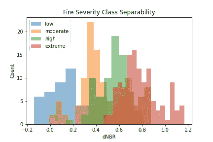
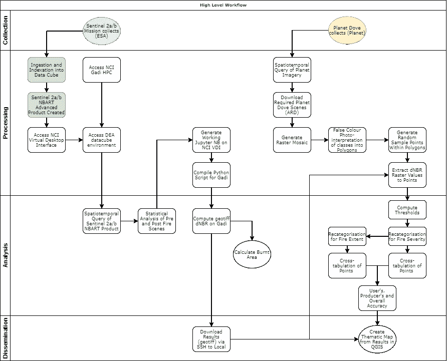
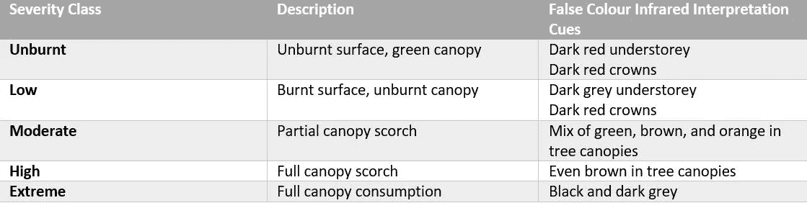

# 评估森林火灾严重程度和范围绘图的准确性

> 原文：<https://towardsdatascience.com/assessing-the-accuracy-of-bushfire-severity-and-extent-mapping-ce18215f4f42?source=collection_archive---------41----------------------->

## 使用 Python 3、GeoPandas 和“正常”Pandas 评估火灾严重程度和范围分类的准确性，数据来自 Planet，分析就绪数据来自 Sentinel-2，通过开放数据立方体。

使用 matplotlib 生成的火灾严重程度和范围直方图显示了类别可分性。图片作者。

在我的上一篇文章[“用开放数据立方体绘制 2019-2020 年澳大利亚森林火灾”](/mapping-the-2019-2020-australian-bushfires-with-the-open-data-cube-ec680060bf15)中，我介绍了使用 Sentinel-2 分析就绪数据生成差分标准化燃烧比(dNBR)的过程。dNBR 是一种非常有用且简单的算法，仅需要两个波段(红色和近红外)，因此降低了计算资源方面的处理成本，进而降低了时间成本。有关 dNBR 算法的更多信息，请参见我以前的文章。

然而，如果没有某种形式的准确性评估来提供所生成结果的置信度，则任何结果都是无用的。下面是一个高层次的工作流程图，显示了我的结果的整个过程。在左侧，您可以看到创建 dNBR 栅格图层的 Sentinel-2 影像的处理过程。右侧是使用 Planet Dove 影像生成精确数据的过程(根据 Planet Education and Research 许可证)。

整个流程的高级工作流程。图片作者。

Gibson 等人在 2020 年对 dNBR 结果的准确性评估方法进行了描述[1]。该方法在图像上随机采样 n 个点，并基于错误彩色图像的特定视觉问题将它们视觉地解释为火灾严重程度等级:

图片作者。

设置准确度数据时要记住的是，要确保所有图像都可以进行分析，包括但不限于:

*   在相同的坐标系和数据中进行空间校正和投影，最好 RSME 小于 0.5 像素
*   随机样本的最小间隔或间距至少为 15 米(Sentinel-2 图像的空间分辨率为 15 米)
*   每节课至少 50 分，以尽可能减少统计偏差(或在合理范围内尽可能多)
*   随机采样您的坐标-选择“易于分类”的区域可能会导致错误的评估
*   我将结果 dNBR 值附加到实际分类观察的形状文件中。你可以选择把它们分开，但是我个人觉得这样更容易。

Python、GeoPandas 和普通熊猫的美妙之处在于，一旦汇编了准确的数据，我们就可以重复且超快速地运行这一过程。但是你为什么会问？我们不是只生成一个准确度值(例如，所有类别的准确度为 60%)，而是可以通过随机抽取 n 个准确度点并将它们与实际结果交叉列表，基于多次运行该过程来提供一个范围。让我们看一下代码:

## 步骤 1 —加载必要的模块并读入数据

## 步骤 2-分离并绘制实际的课堂观察

## 步骤 3-将 dNBR 值映射到分类值

## 步骤 4 —随机抽取每个班级的 n=40 名学生

## 步骤 5-生成实际火灾严重程度与测量的分类火灾严重程度结果的交叉表格

## 步骤 6-计算火灾范围精确度

同样，这种方法的优点是可重复的随机抽样，以产生一个精度范围。该过程的准确性被评估为火灾严重性结果的 60-64%(分为未燃烧、低、中、高和极端的严重性类别)和火灾范围的 88-92%(分为未燃烧和燃烧的类别)。如果你想找到完整的笔记本，请访问位于[https://github.com/yobimania/dea-notebooks](https://github.com/yobimania/dea-notebooks)的仓库。有关我如何生成原始结果的更多信息，请访问我的文章[‘用开放数据立方体绘制 2019-2020 澳大利亚森林火灾’](/mapping-the-2019-2020-australian-bushfires-with-the-open-data-cube-ec680060bf15)。

## 参考资料:

[1]:吉布森，R 等。艾尔(2020)。*使用 sentinel 2 和 random forest 绘制澳大利亚东南部火灾严重程度的遥感方法。*环境遥感 240，111702。