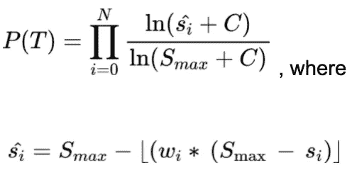

# 评估研究和数据科学项目的可行性

> 原文：<https://towardsdatascience.com/assessing-the-feasibility-of-research-and-data-science-projects-dcd8fe3215ae?source=collection_archive---------24----------------------->

## 客观项目评估—得出 ORA 分数

阿迪·戈尔茨坦的照片

**第 1 部分—技术成功的概率**

你正在提议一个项目，该项目具有有希望的投资回报、对业务的积极影响以及可以使公司在竞争中脱颖而出的营销潜力。目前为止还不错。你继续澄清，在项目完成之前，不知道哪些技术障碍可能会破坏项目。而且即使完成了，你也明白你的公司可能不会选择采用。但是不管后一种可能性，你能在预算中增加几十万美元来完成这个项目吗？嗯？一个和善的老板可能会让你回到办公桌前做些功课。典型的老板可能只是困惑地盯着你。但是他们会吗？事实证明，许多数据科学、人工智能、物联网和其他“性感”的技术项目都是在这些情况下获得批准的。

有序科学已经走进了一些这样的项目。他们的领导者从健康的乐观和被过度的“内部观点”驱动的高期望值开始(参见丹尼尔·卡内曼，*思考，快与慢*)。但他们的愿景最终无法在糟糕的数据、不成熟的先驱技术、专业知识不足以及抵制创新的公司文化的严酷现实中存活下来。

最初为什么要启动这些项目？答案并不简单。我们遇到的大多数公司都进行了评估，试图量化和衡量风险。但这种评估无法评估最近才出现的人工智能和数据科学技术。这些公司缺乏客观的措施和机制来阻止低成功概率的项目。最终，他们被竞争对手被夸大的成功所诱惑，尽管有时是可疑的。由于害怕被落在后面，这些公司不顾谨慎，蹒跚着走向发展。

在这篇文章的剩余部分，我将讨论序数科学用来评估技术和商业成功概率的客观标准。我将介绍由此产生的 ORA 分数，该分数旨在为启动或放弃一个项目的决策插入一个客观性的度量。这涉及到一些数学问题，但这没有发挥作用的思想和原则重要。数据科学、人工智能和应用数学带来了丰厚的回报，但你选择做什么项目，在什么章程下决定了它们为你的公司做了多少。

# 可行性研究。

可行性研究决定了项目成功的可能性。它提供了这种概率的单一测量，但包括两个独立的评估。第一个是技术成功的概率——P(T)。它侧重于项目原型或概念证明。第二个因素决定了商业成功的可能性——P(C)。它评估的可能性，原型可以扩大到生产和采用的公司或其客户。这两个度量的乘积就是成功的概率:P(S) = P(T)P(C)。我们将每个测量值视为一个独立变量。当评估商业成功的可能性时，我们假设原型已经被成功开发。

在解开每个分数的推导之前，我应该澄清我们的方法很少是静态的。大多数数据科学和研究项目都有共同的特征，并受益于一致的风险评估方法。然而，通常有必要使评估的细节适应项目的组织特性，并考虑行业垂直市场的细微差别。请考虑，就像我们必须考虑每个项目一样，什么适合您的需求。这样做的目的是保持客观，并避免调整评估参数的诱惑，以便您最喜欢的项目返回一个更好的，但膨胀的分数。

# 技术成功评估。

估计技术成功的概率(从现在开始指定为 P(T ))是一种识别突出风险因素的练习，然后在将值代入数学函数之前，以一致的尺度对每个因素进行单独评分。简单。但究竟什么是“技术成功”？

P(T)的定义如下:在给定现有数据、可用技术、所需研究和开发的情况下，原型将完成并在精心设计的实验室或受限生产环境中执行规定功能的可能性。P(T)以百分数给出。

定义很重要，因为它设定了对可交付成果的期望。我们将 P(T)的范围限制在为测试技术而设计的原型上，并让一个温和的怀疑者相信这种方法是可行的。测试应该在有限但有代表性的情况下运行，并使用经过审查的数据集。为什么会有限制？它们减少了开发原型所需的时间，而不影响评估。它们通过促进微小的、持续的调整来减少与最终目标不一致的机会。它们降低了投资风险。同时，该过程仍然验证生产解决方案所需的困难组件和算法。

我们在前期的项目阶段定义了原型的细节:概念开发。这是另一篇文章的主题，我们将假设我们的原型有明确的目的、相关的用户角色、功能定义和不可接受的故障模式。

现在，我们评估构建原型需要什么。我将把这个过程压缩成一系列的问题，这些问题引出调查，并给出一个从 1 到 10 的分数，其中 1 是绝对否定，10 是绝对肯定。我们将评估分为四个同等权重的类别:数据、技术、业务和专业知识。

**数据:**

1.我们拥有所有必需的数据特征

2.每个特征的数据都是完整的

3.每个特征的数据都清晰而准确

4.我们有能力综合模拟样本数据

5.我们可以在没有官僚障碍的情况下访问数据

**技术:**

6.大多数所需技术的技术准备水平(TRL)。(见 NASA[https://www . NASA . gov/directorates/heo/scan/engineering/technology/technology _ readiness _ level](https://www.nasa.gov/directorates/heo/scan/engineering/technology/technology_readiness_level))

7.单个必需组件的最低 TRL

8.我们可以访问相关解决方案的源代码或库

9.我们可以获得低 TRL 成分的综合文件。

10.我们有计算能力来获得足够的结果

11.我们有一个清晰的路径来验证结果的正确性

**业务:**

12.这个项目有一个强大的内部拥护者

13.这个项目有很高的内部投资回报率

14.项目团队有明确的章程

15.该项目有充足的预算

**专长:**

16.客户有一名内部主题专家

17.该团队(序数科学)的专业知识与低 TRL 成分完全一致

18.该团队已经成功地完成了在概念上相似的空间中的研究和原型开发

19.该团队可以利用外部资源，就低 TRL 组件进行咨询

20.在最初的研究阶段，该团队被授予一定程度的独立性

我们给 20 个参数中的每一个赋值，然后把数字代入我们开发的公式。我们将得出的数字称为“ORA 得分”——有序风险评估得分。

ORA 评分

***S*** 是单个参数分数的数组，其中 ***s*** 是 1 到 10 之间的整数

***N*** 是一组参数，在我们的例子中 ***N*** = 20

***C*** 是压缩系数， ***C = aN*** ，其中 ***a*** = 3(凭经验选择)

***W*** 是确定每个参数关键程度的参数权重数组，其中 ***s*** 是 1 到 6 之间的整数。 ***w = 6*** 对于单个参数当 ***s = 1*** 时会有将 *P(T)* 压制在 0.5 以下的效果。

***w*** 对于所有的 ***W*** 是最安全的，除非特别权重的原因很好理解。

如果你说“啊？”对于以上所述，不要担心——给我们打电话，我们会为您做可行性评估。这是我们的职责。如果你跟着走，那么在重量上要小心。它们非常重要，必须在您的业务环境中有意义。对于所有特征，它们始终不等于 1。我们如何得到我们的权重向量是一个商业秘密，但是通过大量的实验，你可以得到一个适合你的环境的合理的集合。

定义 P(T)的主要目的是决定是否继续下一阶段。前进的正确门槛是什么？我不知道。我们通常以 70%的技术成功可能性来启动我们的项目，但是环境和客户的风险承受能力同样重要。应该通过与利益相关者的业务讨论来确定适当的阈值。

我将在这里结束可行性文章的第一部分，在下一篇文章中继续“第二部分——商业成功的可能性”。

最初发表在我们的序数科学博客上:https://www . Ordinal Science . com/post/assessing-the-probability-of-research-and-data-Science-projects