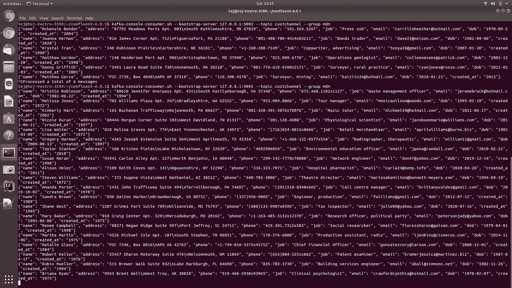

# 例如，评估数据流的质量对于数字化至关重要

> 原文：<https://towardsdatascience.com/assessing-the-quality-of-data-in-streams-2c6352bcbb5b?source=collection_archive---------29----------------------->

## [意见](https://towardsdatascience.com/tagged/opinion)

为了方便企业客户，我们必须不断将客户旅程数字化。因此，从客户渠道和服务接触点产生了大量数据。这些数据要么是客户自愿提供的信息，要么是从系统及其处理过程中作为日志生成的大量数据。

逐渐地，在物联网世界中，我们看到机器做出决策。这些决策要么让客户对什么更好产生深刻的认识，要么减少他们对服务关系的焦虑。为了使机器模型产生可操作的见解，需要实时获得各种高质量的数据。

# **管理数据质量的经典模型**

1960 年代的数据被认为是在孤岛中管理的，通常是物理上的，同时也有有限的技能组合来产生见解。然而，投资于管理高质量信息的人获得了更好的收入。

然后是商业智能解决方案的出现，它可以被称为今天的复古功能。然而，是一种为报告和分析模型使用数据的有效方式。多年来，组织一直专注于将数据移动到单个参考存储中，如具有提取-转换-加载(ETL)功能的仓库。这是公司普遍采用的第一代数据质量模型。

在将数据加载到仓库中之前，会针对质量的上下文维度(如有效性)对数据质量进行评估。这种模型可以称为第一代数据质量管理模型。


图 1:EDW 或仓库的第一代数据质量管理

由于需要处理往往过于庞大且结构多样的数据集，大数据作为一种能力已经发展起来。虽然 lake 使用提取、加载和转换的概念，但是在提取数据并将其加载到登陆存储时，会对数据的质量进行评估。

# **物联网数据质量管理高级模型**

我们不能不强调运动数据的质量，这些数据经常被用于实时人工智能模型，包括欺诈检测和其他消费活动和分析过程。第一个数据质量挑战通常是为机器学习企业用例获取正确的数据。

**错误数据** — *即使业务目标明确，数据科学家也可能无法找到正确的数据作为 ML 服务/算法的输入，以实现预期的结果。*

正如任何数据科学家都会告诉你的，开发模型没有理解和以正确的方式处理问题/用例复杂。确定适当的数据可能是一个巨大的挑战。你必须有“正确的数据”

# **作为数据质量维度的数据覆盖率，用于 ML 用例**

术语“覆盖”用于描述是否包含所有正确的数据。例如，在一家投资管理公司中，可能存在不同的客户群以及与这些客户相关联的不同子产品。如果不包括描述客户和相关产品的所有交易(行)，您的机器学习结果可能会有偏见或完全误导。众所周知，收集所有数据(通常来自不同的子实体、销售点系统、合作伙伴等。)可能很难，但它对你的结果至关重要。

# **流媒体数据质量管理的新生模型——第二代**

当务之急是查看由外部参与者(包括客户、外部合作伙伴和传感器等)流入环境的数据的质量。发现数据质量问题的方法可能与某些维度特别相关。

1.  完整性—数据是否符合您对完整性的预期？
2.  一致性—确保结构、语义的一致性并实施业务策略
3.  及时性—数据是系统滞后还是手动滞后？
4.  有效性—数据是否以指定的格式传输，是否符合标准
5.  唯一性——相似的数据是否已经作为实例存在于生态系统中？

# **流数据质量架构是什么样的？**

让我们来看一个甚至在数据落地之前就自动处理数据以保证质量的架构。这与数据通过管道传输到着陆区并按传统方式进行质量评估的选择截然不同。通常数据以更高的速度进入，因为它需要实时处理。同时，高速度的特征可以与质量管理相结合。

*   创建一个捕获客户人口统计详细信息的客户应用程序
*   声明两个消费应用程序——一个用于 MDM，另一个用于分析沙箱。
*   对从客户注册产品的在线门户获得的数据进行增量质量分析
*   使用一致性和有效性数据质量规则，使用 ksql 对到达的数据运行数据质量测试
*   根据验证结果向客户发回通知
*   捕捉仪表板中的指标以便可视化

注意—堆栈的选择是本机的，而不是使用 Kafkaconnect。


图 2:评估流中的数据质量。礼貌:Tejasvi Addagada

1.  **使用 Python 实例化客户数据流**

我使用 Faker 生成客户数据，同时也使用属性姓名、地址、电话号码、工作、电子邮件、出生日期。我使用 IntelliJ 来运行脚本。

*注意:在项目结构中，将项目 SDK 修改为 Python 3.6。还要安装软件包——Faker 5 . 8 . 0，coverage 5.4，kafka-python 2.0.2，pip 21.0.1，pymongo 3.11.2，python-dateutil 2.8.1，setuptools 52.0.0，six 1.15.0，text-unidecode 1.3 1.3*

启动一个名为 *data.py* 的新 Python 脚本，并导入 Faker

```
from faker import Faker

fake = Faker()

def get_registered_user():
    return {
        "name": fake.name(),
        "address": fake.address(),
        "phone": fake.phone_number(),
        "job": fake.job(),
        "email": fake.email(),
        "dob": fake.date(),
        "created_at": fake.year()
    }

if __name__ == "__main__":
    print(get_registered_user())
```

2 **。安装汇流卡夫卡&创建主题**

融合平台试用版可从链接下载—[https://docs . confluent . io/platform/current/quick start/ce-quick start . html](https://docs.confluent.io/platform/current/quickstart/ce-quickstart.html)

```
confluent local services start
```

您的输出应该如下所示

```
Starting Zookeeper
Zookeeper **is** [UP]
Starting Kafka
Kafka **is** [UP]
Starting Schema Registry
Schema Registry **is** [UP]
Starting Kafka REST
Kafka REST **is** [UP]
Starting Connect
Connect **is** [UP]
Starting KSQL Server
KSQL Server **is** [UP]
Starting Control Center
Control Center **is** [UP]
```

启动服务的第一步是创建一个主题 *custchannel。*

```
kafka-topics — bootstrap-server localhost:9092 — topic custchannel — create
```

3.**使用 Python 创建一个生产者，持续发送数据**

创建一个名为 *producer_cust_ch.py* 的新 Python 脚本，并从我们全新的 Kafka-Python 库中导入 *JSON* 、 *time.sleep、*和 *KafkaProducer* 。

```
from time import sleep
from json import dumps
from kafka import KafkaProducer
```

然后**初始化一个卡夫卡制作人**

*   *bootstrap _ servers =[' localhost:9092 ']*:设置生成器应该联系的主机和端口，以引导初始集群元数据。
*   *value _ serializer = lambda x:dumps(x)。encode('utf-8')* :声明数据在发送到代理之前序列化方式的函数。这里，我们将数据转换为 JSON 文件，并将其编码为 utf-8。

```
producer = KafkaProducer(bootstrap_servers=['localhost:9092'],
                         value_serializer=lambda x: 
                         dumps(x).encode('utf-8'))
```

下面的代码将使用 Faker 在步骤 1 中定义的方法创建客户记录。让我们在一个无限循环中生成客户记录，而您可以随时从 UI 中终止生成器。在同一个循环中，数据将使用 send 方法通过管道传输到*生成器*。

```
if __name__ == "__main__":
    while 1 == 1:
        registered_user = get_registered_user()
        print(registered_user)
        producer.send("custchannel", registered_user)
        time.sleep(10)
```


图 3:生产者使用 python，在 IntelliJ。礼貌:Tejasvi Addagada

在屏幕底部，由 Faker 功能创建并发送给生产者的客户记录被打印出来，正如我在向*生产者发送数据的循环中所指示的那样。*

4.**拥有一个包含数据库和集合的名称空间，用于在 MongoDB 上存储传入的客户记录**

MongoDB 进入这个行业才 5 年，但是它的能力可以很好地与 OLTP 和 OLAP 一起工作。对于这个例子，我将它用作客户数据存储。这将是与第一个消费应用程序相关联的数据库。

命令*使用*将创建一个新的数据库，如果它不存在

```
>use custchannel
switched to db custchannel
```

我将创建一个具有相同名称 *custchannel* 的集合，并插入示例记录。


图 4: Mongo，创建数据库，收集和插入样本记录。礼貌:Tejasvi Addagada

**5。为消费者数据创建 2 个消费者群体(应用程序)**

我使用 Python 实例化了第一个消费应用程序和相关的消费者以及 Kafka 中的一个组。

现在，让我们创建一个新文件 *consumer_cust_ch.py* 并从 *pymongo* 导入 *JSON.loads* 、 *KafkaConsumer* 类和 *MongoClient* 。

```
from kafka import KafkaConsumer
from pymongo import MongoClient
from json import loads
```

作为下一个逻辑片段，我将创建一个 KafkaConsumer 并使用下面的参数

*   第一个参数是题目， *custchannel* 。
*   *bootstrap _ servers =[' localhost:9092 ']*
*   *auto _ offset _ reset = ' earliest '*:该参数处理用户在集群关闭后重新开始读取，可以设置为 *earliest* 或 *latest* 。当设置为 *latest* 时，**消费者**接收在订阅主题之后或从最后提交的偏移量到达主题的消息。如果您想从头重新阅读所有消息，请选择最早的*。*
*   **enable _ auto _ commit = True*:确保消费者提交其读取以补偿每个间隔。*
*   **auto _ commit _ interval _ ms = 1000 ms*:设置两次提交的时间间隔。*
*   **group_id='custdq'* :一个重要的方面是，我们需要定义一个组，因为我们有多个消费应用程序接收相同的流。*
*   *值反序列化器将数据反序列化为 JSON 格式，这与值序列化器执行的功能相反。*

```
*consumer = KafkaConsumer(
    'custchannel',
    bootstrap_servers=['localhost:9092'],
    auto_offset_reset='latest',
    enable_auto_commit=True,
    group_id='custdq',
    value_deserializer=lambda x: loads(x.decode('utf-8')))*
```

*在相同的消费者代码中，我们将连接到一个名为 custchannel 的 MongoDB。我已经用一个示例文档创建了一个集合，并将该集合命名为 custchannel。*

```
*client = MongoClient('localhost:27017')
collection = client.custchannel.custchannel*
```

*消费者会一直听经纪人的话。可以使用 value 属性访问消息的值。然后，我们将数据插入到集合 *custchannel* 中，同时当值作为文档插入到集合中时，我们还打印一个确认*

```
*for message in consumer:
    message = message.value
    collection.insert_one(message)
    print('{} added to {}'.format(message, collection))*
```

*当您运行消费者组 *custdq，*时，消息将被存储到 Mongo 数据库 *custchannel 中。*在运行窗口中，我们可以看到存储的消息。*

**

*图 5:消费者，在 Intellij 中使用 Python。礼貌:Tejasvi Addagada*

*在图 2 中，我们可以看到记录计数随着消息被插入到集合 *custchannel* 中而增加。*

*6.**创建另一个消费者群体来阅读相同的信息***

*我们可以让多个消费者读取来自同一个生产者的消息，只要它们与不同的组相关联。属于同一个群体的消费者将不能整体消费同一个话题。*

*由于汇合服务已经启动，下面的代码将创建一个消费者组 *mdm* 。*

```
*kafka-consumer-groups.sh --bootstrap-server localhost:9092 --topic custchannel --group mdm*
```

*我们可以看到这个消费群体 *mdm* 订阅了同一个话题 *custchannel。*生产者生成的信息现在显示在终端上。为了会话的目的，您可以将偏移设置为最早的*。**

**

*图 6:创造第二个消费群体。礼貌:Tejasvi Addagada*

***7。让我们来看看 KSQL，从主题**中声明一个流*

*我已经定义了一个流 *custdqdemo，来自步骤 2，custchannel 中创建的主题。*消息的格式可以在参数 VALUE_FORMAT 中指定为 JSON。客户记录 name、address、job、email dob 中的属性用它们的数据类型指定给 KSQL。*

```
*ksql> CREATE STREAM custdqdemo (name VARCHAR, address VARCHAR, phone VARCHAR, job VARCHAR, email VARCHAR, dob VARCHAR, created_at VARCHAR) \>>WITH (VALUE_FORMAT = 'JSON', KAFKA_TOPIC = 'custchannel');*
```

*在执行上述语句时，流 *custdqdemo* 被创建，如下面的屏幕截图所示*

**

*图 7: Ksql 流创建。礼貌:Tejasvi Addagada*

*我们可以查看来自主题 *custchannel* 的消息，这些消息在我们查询流时显示。*

**

*图 8:查询来自主题的消息流。礼貌:Tejasvi Addagada*

***8。通过数据质量验证评估流并创建异常流***

*当我们到达模拟的最后一站时，我们将查看针对流中的每个消息验证的两个数据质量规则。这些规则将以查询的形式持续运行。*

```
*CREATE STREAM custexcep AS
SELECT name,
       CASE
         WHEN dob < '1980-01-01'      THEN 'Policyexception'
         WHEN job = 'Arboriculturist' THEN 'Not standard profession'
         ELSE                                      'Correct'
       END AS Quality
  FROM CUSTDQDEMO;*
```

**

*图 9:在流上使用 Ksql 脚本评估异常。礼貌:Tejasvi Addagada*

*在 ksql 脚本中，我使用一个简单的 case 语句来检查*

*a.如果客户的出生日期在 1980 年之后，政策例外。*

*b.有效的职业/工作名称。*

*有一个新的属性 quality，它在运行数据质量规则时捕获预定义的异常消息，如上面的屏幕截图所示。一个名为 *custexcep 的新流被创建。*该持久性源可用于监控动态数据的数据质量问题。*

*Ksql 中有更成熟的功能来减轻监控开销，我们可以在接下来的博客中看到。*

# *来源*

*[Kafka-Python 文档](https://kafka-python.readthedocs.io/en/master/index.html)*

*[阿帕奇卡夫卡文献](https://kafka.apache.org/documentation/)*

*[介绍 KSQL](https://www.confluent.io/blog/ksql-streaming-sql-for-apache-kafka/)*

*[使用 Apache Kafka:构建流媒体平台实用指南](https://www.confluent.io/blog/stream-data-platform-1/)*

*[介绍 Kafka 消费者:开始使用新的 Apache Kafka 0.9 消费者客户端](https://www.confluent.io/blog/tutorial-getting-started-with-the-new-apache-kafka-0-9-consumer-client/)*

*[MongoDB 命令](https://docs.mongodb.com/manual/reference/command/)*