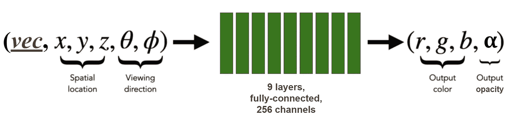

# Asset2Vec:将 3D 对象转化为矢量，然后再转化回来

> 原文：<https://towardsdatascience.com/asset2vec-turning-3d-objects-into-vectors-and-back-8335496b756d?source=collection_archive---------5----------------------->

## [行业笔记](https://towardsdatascience.com/tagged/notes-from-industry)

## 我们如何使用 NeRF 将我们的整个 3D 对象目录嵌入到一个共享的潜在空间中，这对图形的未来意味着什么

在我目前担任人工智能研究主管的 [Datagen](https://www.datagen.tech/) ，我们创建常见 3D 环境的合成照片级真实感图像，用于训练计算机视觉算法。例如，如果你想教一个房屋机器人在一个脏乱的卧室中导航，就像下面这样，这将花费你相当多的时间来收集足够大的训练集的真实图像[人们通常不喜欢外人进入他们的卧室，他们肯定不会喜欢给他们的混乱拍照]。

凌乱卧室的合成图像(图片由作者提供)。

我们使用图形软件生成了上面的图像。一旦我们(在软件中)建立了环境和其中所有东西的 3D 模型，我们就可以使用它的光线跟踪渲染器在我们想要的任何光照条件下，从我们喜欢的任何相机视点生成场景的图像。我们已经完全控制了。

现在，如果你认为*收集*真实图像很难，那么等到你尝试*标记*这些图像。你需要启动一个漫长而昂贵的标记操作，教人类如何根据你的标准标记这些像素。当然，使用合成图像，我们可以轻松地为图像的任何方面生成像素完美的标签，包括人类无法评估的东西，如深度和表面法线贴图。

从左上顺时针方向:不同光照条件下渲染的场景，表面法线贴图，深度贴图，对象类标签(图片由作者提供)。

## 收集资产

为了帮助我们的用户训练她的机器人，我们需要生成成千上万个像上面这样的卧室，我们需要用东西填满它们:家具、布、书、用过的杯子、遥控器等等。因此，我们维护了一个艺术家制作的 3D 对象的大型目录(我们称之为*资产* ) *。*我们的产品目录涵盖 100 多万件商品，我们对此深感自豪。

每个资产对象由一个详细的 3D 网格(由三角形组成的多边形结构，它定义了对象的**形状**)和一个纹理贴图(一个图像，它定义了对象的**外观**，就好像它是一个用来覆盖网格表面的毯子)。

资源(左)由网格结构(中)和纹理贴图(右)表示。图片作者。

除了在视觉上定义对象的网格和纹理贴图之外，为每个资产存储的其余信息是 3D 艺术家决定放入文本元数据文件中的任何内容，如对象的类型(“餐椅”)，以及当时似乎相关的任何标签。

因此，在目录中搜索(例如，“给我所有有三条腿的表”)只能使用它们的元数据属性来完成。如果艺术家没有写下每张桌子的腿数，那么要知道哪些桌子是三条腿的，唯一的方法就是一个一个地打开它们的 3D 模型文件去看。

## 资产-2-Vec

相反，我们建议*在嵌入空间中编码*每个资产，这将封装整个资产的形状和外观。与 Word2Vec 非常相似，它为字典中的每个单词提供一个“代码”向量，该向量对应于一个 *n* 维空间中的一个位置，这样语义相似的单词就彼此靠近，我们希望为我们的每个资产分配一个向量，这样我们就可以通过查看向量来判断资产的所有视觉属性。

将我们所有的 3D 资产编码成向量。图片作者。

理想情况下，我们还希望将形状属性(例如，腿的数量)与外观属性(如颜色或材料)分离开来。我们怎么知道向量确实抓住了物体的全部本质？最终的方法是能够从向量回到资产的 3D 模型。

您可以想象一个神经网络，它将学习读取向量作为输入，并输出资源的原始网格和纹理贴图。然而，这将是困难的。每个资源的网格都有完全不同的拓扑:不同数量的三角形，每个节点的不同含义，纹理贴图和网格之间不同的映射格式。我们还需要其他东西，一种适合*所有*资产的替代 3D 表示。

## NeRF 来救援了

这就是 NeRF 的用武之地。正如你所记得的，在[我之前的文章](/nerf-and-what-happens-when-graphics-becomes-differentiable-88a617561b5d)中，我展示了如何使用大约 40 张从不同角度拍摄的物体图像，我们可以训练一个神经网络来学习物体周围的整个空间。经过训练的神经网络将空间中的点 *(x，y，z)* 作为输入，并返回该点中材质的颜色 *(r，g，b)* 和不透明度(α)。网络对空间了解得如此之好，以至于渲染器可以拍摄对象的“照片”，只需通过沿着来自模拟“相机”的光线的点查询该网络。

NeRF 中心的神经网络(图片由作者提供)。

我们可以轻松获得 40 张图片，涵盖我们目录中的每项资产。我们简单地使用图形软件从它们的原始网格模型渲染它们(所以我们也可以渲染 80)。然后，我们可以使用这些图像来训练 NeRF 网络，以对物体周围的空间进行编码。网络训练完成后，我们可以生成一个短片，从各种新的角度展示物体，其中每一帧都是通过查询训练好的 NeRF 网络来渲染的。

左图:来自图形软件 Blender 的截图，其中我们从各个方向渲染了该资产的 80 幅合成图像(每个金字塔是一个模拟相机)，用于训练 NeRF 网络。右图:通过查询训练好的 NeRF 网络，从 80 个**新**视点渲染的对象，跨越 360 度。作者图片。

我们接下来要做的是，使用单个 NeRF 网络，不仅对单个资产进行编码(就像上面的椅子)，而且对我们目录中的所有椅子进行编码**。这个单一网络将拥有与 NeRF 网络完全相同的架构。唯一的区别是它将有一个额外的输入:分配给每把椅子的(潜在)向量，它将在训练期间*学习*。我们将像训练 NeRF 网络一样训练这个网络，除了我们将使用从我们目录中的所有**椅子上拍摄的照片。****

****

**NeRF 网络，以潜在向量作为附加输入。在训练期间，资产的潜在向量也与全连接层的权重一起被学习(图片由作者提供)。**

**这种训练不同于普通训练，在某种意义上，除了其自身的权重之外，网络还学习与每把椅子相关联的一组特殊变量——其潜在向量(类似于嵌入层的学习方式)。当我们反向传播从渲染椅子图像获得的误差时，不仅更新了 NeRF 网络的权重，而且更新了分配给特定椅子的**的潜在向量中的值(例如 *vec* 输入)。****

**一旦我们训练了这个网络，我们就可以用它来制作产品目录中所有椅子的电影！要渲染任何特定的椅子，我们只需要在查询时将椅子的潜在代码作为输入提供给 NeRF 网络。**

****

**通过查询一个**单个** NeRF 网络呈现的椅子资产示例。图片作者。**

## **潜在探索**

**我们不需要将自己局限于为当前目录中的资产学习的向量。我们还可以探索当我们任意改变潜在向量，或者混合和匹配来自两个不同资产的潜在向量时会发生什么。或许在不久的将来，我们能够通过以下方式用新资产丰富我们的产品目录:**

****

****混合潜在向量**:当 NeRF 网络的输入将椅子 ***i*** 的潜在向量的 ***形状*部分**与椅子 **j** 的**外观部分**组合时，产生位置(I，j)的椅子。图片由作者提供。**

**为了直观地了解资产潜在空间的样子，我们可以使用 TSNE 算法将我们的资产放置在 2D 平面上(根据它们的潜在向量):**

****

**我们 522 个资产的向量的 T-SNE 图。对象类和子类之间的清晰分离。图片由作者提供。**

**我们可以看到，椅子的不同子类之间的区别是明显的，即使在一个子类中(即*扶手椅*)，我们也可以很容易地找到椅子共享视觉属性的区域(即带木质扶手的扶手椅与带软垫扶手的扶手椅)。**

**这就是重点，不是吗？因为这意味着我们可以很容易地训练一个线性分类器(像 SVM 一样)来识别我们关心的任何视觉属性，只需给它提供少数正面和负面资产的向量，然后用它来标记其余的 100 万资产目录，而无需加载这些资产。这种特别的分类可以节省我们大量的时间！**

## **潜伏是未来**

**最后，这种分析不仅适用于椅子，也适用于我们产品目录中的所有其他资产系列。我们可以想象一个未来，我们渲染的每个场景都将被这些潜影完全描述:每个资产的潜影，背景的潜影，姿势的潜影，相机角度，灯光。如果我们敢，我们可以想象一个未来，传统的网格和纹理贴图将不再被用来渲染合成但逼真的图像，就像上图中凌乱的卧室场景。**

****

**通过查询一个**单个** NeRF 网络，我们的*表*资产的一个示例。图片作者。**

# **附录:解耦形状和外观**

**NeRF 网络有两个分支，一个用于不透明度(α),另一个用于颜色。为了分离潜在向量中的形状和外观部分，我们将输入的潜在代码分成两部分，并且仅向颜色分支显示外观部分，如下所示。这个技巧来自最近的 GIRRAFE 论文(尼迈耶和盖格，CVPR 2021)。**

****

**我们修改后的 NeRF 网络架构(图片由作者提供)。**

**为了更好地理解形状和外观子空间，我们对潜在向量的相关部分进行了 PCA 分析:**

********

**形状空间(上)和外观空间(下)的前 10 个 PCA 组件的图示。作者图片。**

**我们可以看到这些是如何控制椅子的各个方面的，如座位的大小，宽度，靠背的高度等。在外观空间中，我们可以看到 PCA 方向如何控制颜色，以及它们的饱和度、亮度和光照条件。**