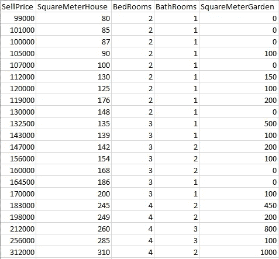
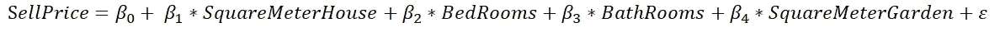
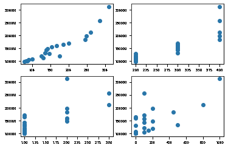
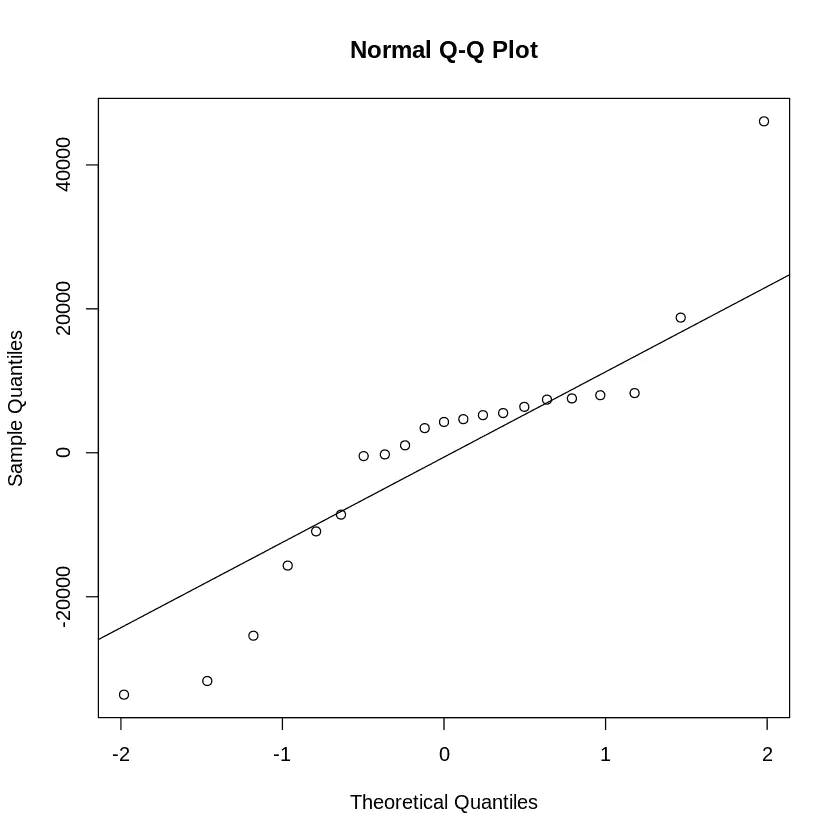
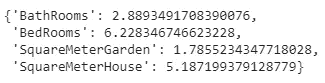
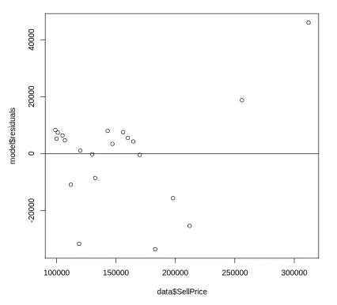
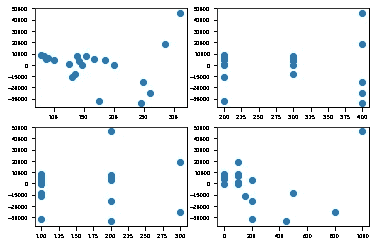
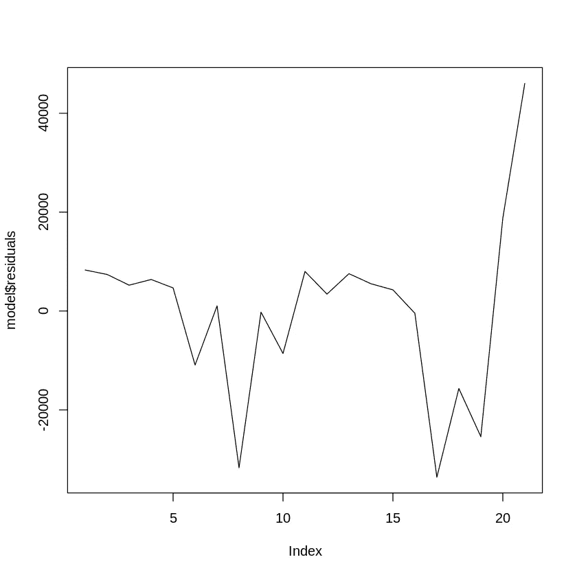

# 线性回归的假设

> 原文：<https://towardsdatascience.com/assumptions-of-linear-regression-fdb71ebeaa8b?source=collection_archive---------1----------------------->

## 用 R 和 Python 实现

线性回归的假设—照片由[陈丹妮](https://unsplash.com/@denmychan?utm_source=unsplash&utm_medium=referral&utm_content=creditCopyText)在 [Unsplash](https://unsplash.com/s/photos/colorful?utm_source=unsplash&utm_medium=referral&utm_content=creditCopyText) 上拍摄

线性回归是一种统计模型，允许根据一个或多个独立变量(标为 **x** )的变化来解释因变量 **y** 。这是基于自变量和因变量之间的线性关系。

在本文中，我将快速浏览一遍线性回归模型，并涵盖进行线性回归时需要检查的五个假设。我将用 R 和 Python 讲述理论和实现。

# 线性回归基础—示例

让我们从描述线性回归的一个常见用例开始。我们将研究一个模型，在这个模型中，我们根据房屋的一些物理标准来解释和预测未来房屋销售的价格。

## 数据

我制作了一个模拟数据集，对这个练习非常有用。当然，既然数据不真实，解读就不会有价值。数据如下所示:

我们线性回归的数据

您可以使用 R 或 Python 通过以下代码片段从 S3 导入数据。

**用 Python 从 S3 导入 CSV 文件:**

使用 Python 从 S3 导入 CSV

**从 S3 导入带有 R:** 的 CSV 文件

从 S3 用 R 导入 CSV

# 线性回归模型

现在，我们感兴趣的是解释房价和其他变量之间的关系。为了对此进行建模，我们将进行线性回归，对以下公式进行建模:

在这个等式中，我们有:

*   β0，截距系数，给出所有解释变量都为 0 的假设情况下的卖出价格值。
*   贝塔系数的 1 到 4，即斜率系数，给出了特定变量增加 1 步时的销售价格的增加。
*   ε:模型无法解释的销售价格变化(这可能是随机变化或由于一些解释变量引起的变化)

# 拟合线性回归模型

进入假设之前的最后一步是拟合模型。对于 R 代码，我们将使用`lm`函数，它是线性模型的定位函数。在 Python 实现中，我们将使用`statsmodels`库。

用 Python 拟合线性回归

用 R 拟合线性回归

# 线性回归假设

因为本文的重点是涵盖假设检查，所以让我们跳过模型解释，直接进入您需要检查的假设，以确保您的模型构建良好。

# 线性回归假设 1 —观察值的独立性

线性回归的第一个假设是观测值的**独立性。独立性意味着不同的例子之间没有关系。这不是看数据就能推断出来的:**数据收集**过程更有可能对此给出答案。**

一个明显的**依赖观察** *(这是我们不想要的！)* 可以在使用**时间序列**时发生。想象一下某个值的日常数据测量。在这种情况下，今天的价值比很久以前的价值更接近昨天的价值。

一个清晰的**独立观测** *(这正是我们想要的！)*是**实验研究**，参与者被随机分配到治疗组。在这种情况下，**分配是随机和强制的**这一事实确保了观察值之间没有隐藏的关系。

# 线性回归假设 2 —没有隐藏或缺失的变量

线性回归模型的第二个假设是，你已经在你的模型中使用了**所有相关的解释变量**。如果你不这样做，你最终会得到一个错误的模型，因为模型会试图将系数赋给数据集中确实存在的变量。这通常被称为模型的**错误设定**。

如果在模型中加入一个变量会有很大的不同，那就意味着没有这个变量，模型是不正确的，没有用的。在这种情况下，你唯一能做的就是**回到你的数据收集中**去寻找必要的数据。

# 线性回归假设 3 —线性关系

线性回归的第三个假设是自变量和因变量之间的关系必须是线性的。

尽管这一假设并不总是在文献中被引用，但是检查它是合乎逻辑的并且是重要的。毕竟，如果你的关系不是线性的，你不应该使用线性模型，而应该使用大量存在的非线性模型。

您可以通过绘制每个自变量和因变量的散点图来轻松检查线性关系。您可以使用下面的 R 和 Python 代码来做到这一点。

## 使用 Python 检查线性关系

线性回归的假设-线性关系 Python

## 检查与 R 的线性关系

线性回归的假设—线性关系— R

虽然有许多其他方法来做散点图，这种方法是简单的，足够好地检查假设。

Python 代码生成的散点图

要搞清楚 1 对 1 的关系是否是线性的，需要判断数据点是或多或少在一条直线上，还是在一条直线周围。清晰的反模式是当你看到曲线、抛物线、指数或者基本上任何可以识别为非直线的形状时。

这些图没有显示完美的直线，但这不是问题。也没有任何明确的非线性模式，线性模型可能在这方面工作得很好。

# 线性回归假设 4 —残差的正态性

线性回归的第四个假设是残差应该遵循正态分布。从模型中获得残差后，使用直方图或 QQ 图进行测试相对容易。QQ 图有点难读，但解释起来更精确，所以让我们看看如何使用 R 和 Python 制作残差的 QQ 图。

## 使用 Python 检查残差的正态性:

线性回归的假设-残差中的正态分布 Python

## 使用 R 检查残差的正态性:

线性回归假设—残差中的正态分布— R

由 R 代码产生的 QQ 图

在 QQ 图中，您需要查看的是这些点是否在从左下方到右上方的直线上。当偏差发生时，它们通常位于线的低端或高端，而中间的偏差不太可能发生。

如果您看到任何类型的 S 形、指数曲线或直线以外的其他形状，这意味着您有问题:您的模型可能没有正确指定。可能你遗漏了一些变量，或者你的关系实际上不是线性的！您可能想要尝试非线性模型或线性模型的其他规格(使用不同的变量或变量的不同准备)。

在当前的例子中，显然有一个倒置的 S 形，这意味着模型可能有问题。

# 线性回归假设 5-没有或很少多重共线性

线性回归的第五个假设是不存在或很少存在多重共线性。多重共线性是指多个解释变量高度相关的现象。

那么为什么我们希望每个自变量和因变量之间有很强的相关性，而自变量之间没有相关性呢？原因是，如果两个独立变量相关，它们解释了相同的信息。该模型将无法知道两个变量中的哪一个实际上对因变量的变化负责。

您可以使用方差膨胀因子(简称 VIF)来测试多重共线性问题。VIF 表示一个自变量与其他自变量的相关程度。您可以使用以下代码在 R 和 Python 中计算 VIF。

## 使用 R 检查多重共线性:

线性回归的假设—使用 VIF 检验多重共线性

## 使用 Python 检查多重共线性:

线性回归的假设-使用 VIF-Python 检查多重共线性

Python 生成的 VIFs

VIF 从 1 开始，没有上限。VIF 为 1 是最佳值，因为这表示该变量不存在多重共线性。高于 5 或 10 的 VIF 表明模型中的自变量有问题。

在当前的模型中，浴室、卧室和平方米屋这些变量肯定有问题。它们之间似乎非常相关，因此有必要考察这些变量中的哪一个是解释销售价格所真正需要的。

# 线性回归假设 6 —同方差

线性回归的第六个假设是同方差。模型中的同方差意味着误差沿着因变量的值是恒定的。检验同方差的最好方法是用残差对因变量做一个散点图。您可以使用下面的 R 和 Python 代码来实现这一点。

## 使用 R 检查同质性:

线性回归的假设—同方差— R

## 使用 Python 检查同质性:

线性回归的假设-同方差 Python

线性回归的假设—同方差图

同方差意味着一个恒定的误差，你在寻找点与零线的恒定偏差。在当前情况下，您可以在右上角清楚地看到两个异常值。在其余的点中，你也看到顶部的点多，底部的点少。这显然不像零线附近的恒定方差。

如果你违反了同质异方差，这意味着你有异方差。您可能希望对输入数据做一些工作:可能需要添加或删除一些变量。另一个解决方案是进行转换，比如对因变量应用逻辑或平方根转换。

如果这不能改变什么，你也可以切换到**加权最小二乘模型。**加权最小二乘法是一种模型，c *可以处理非恒定方差*，因此异方差不是问题。

# 线性回归假设 7 —所有独立变量与误差项不相关

线性回归模型的第七个诊断检查用于检查任何自变量和误差项之间是否存在相关性。如果发生这种情况，很可能是型号指定错误。你可能忘记了一个重要的解释变量。

您可以使用以下 R 和 Python 代码获得散点图:

## 在 Python 中检查 IVs 和残差之间的相关性:

线性回归的假设-独立变量和残差之间没有相关性 Python

## 检查 iv 和 R 中残差之间的相关性:

线性回归的假设—独立变量和残差之间没有相关性— R

线性回归的假设—独立变量和残差之间没有相关性

在这些散点图中，我们看不到任何明显的相关性。右下图可能是一个有争议的案例，但它也不是一个非常清晰和令人信服的问题。

# 线性回归假设 8 —误差项的观测值彼此不相关

我们要看的最后一个模型诊断是，误差项的观测值内部是否存在相关性。如果发生这种情况，您肯定违反了假设 1:观察值不是随机抽取的。

您可以通过绘制残差与残差阶数的关系来进行直观检查。以下代码片段允许您这样做:

## 在 Python 中检查残差自相关:

线性回归的假设-残差中的自相关 Python

## 检查 R 中的剩余自相关:

线性回归假设—残差中的自相关— R

线性回归假设-残差中没有自相关

如果出现一个模式，很可能是一个错误指定的模型。你可能忘记了一个重要的解释变量。或者您可能更适合使用另一系列模型。如果你有自相关，你可能想看看时间序列模型，如自回归移动平均或 ARMA。

# 如果你的线性回归假设被违反了怎么办？

下一个大问题当然是，如果你发现你的一个假设不成立，该怎么办？！不要担心:对于大多数无效假设的情况，你都可以做一些事情。以下概述了在假设无效的情况下可以采用的替代方法:

*   通过转换或添加缺失变量来处理输入数据可以解决许多问题
*   当你发现你有一个错误的设定时，非线性回归是一个很好的方法
*   如果观察到多重共线性，您可能希望在模型中使用较少的变量。你有强相关的解释变量，最好在它们之间进行选择。一种替代方法是使用例如主成分分析将它们制成一个复合变量。
*   如果您观察到同方差，您可以转向加权最小二乘模型，这是 OLS 的替代方案，可以处理
*   如果你的自变量与误差相关，你很可能处于一个错误指定的模型中，你应该选择正确的变量来包含在你的研究中
*   如果误差项彼此相关，您可能处于自相关存在的情况下，并且您可能擅长使用时间序列模型。

我希望这篇文章对你有用。感谢阅读，不要犹豫，继续关注更多！