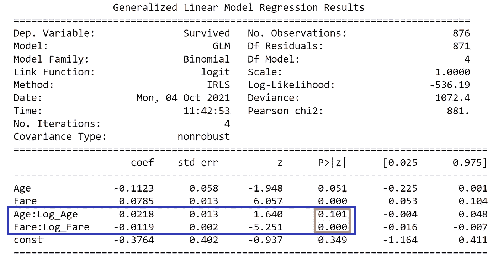
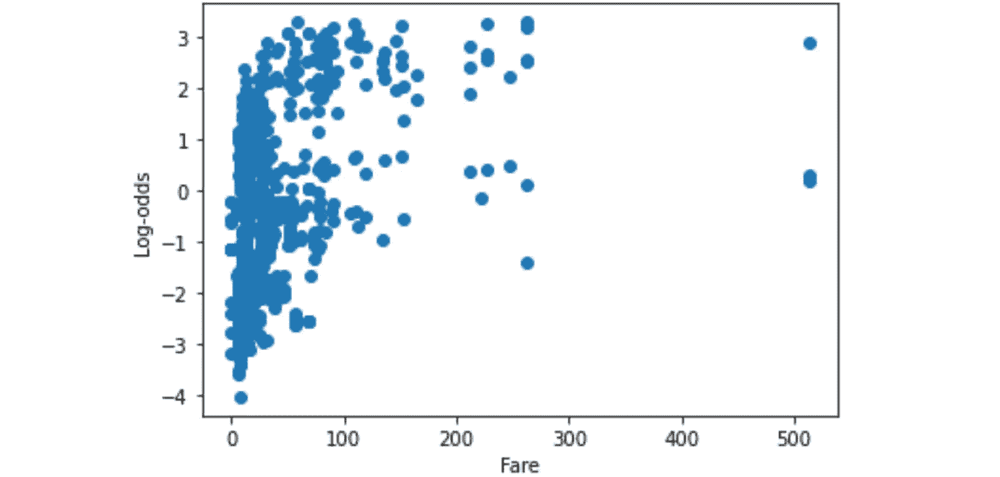
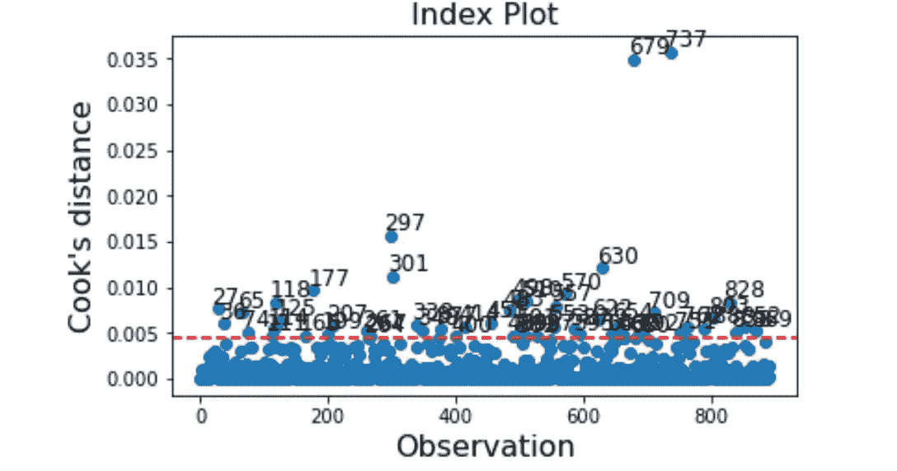
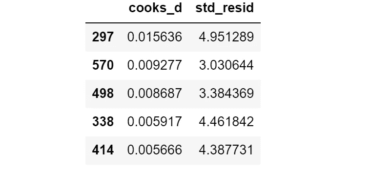
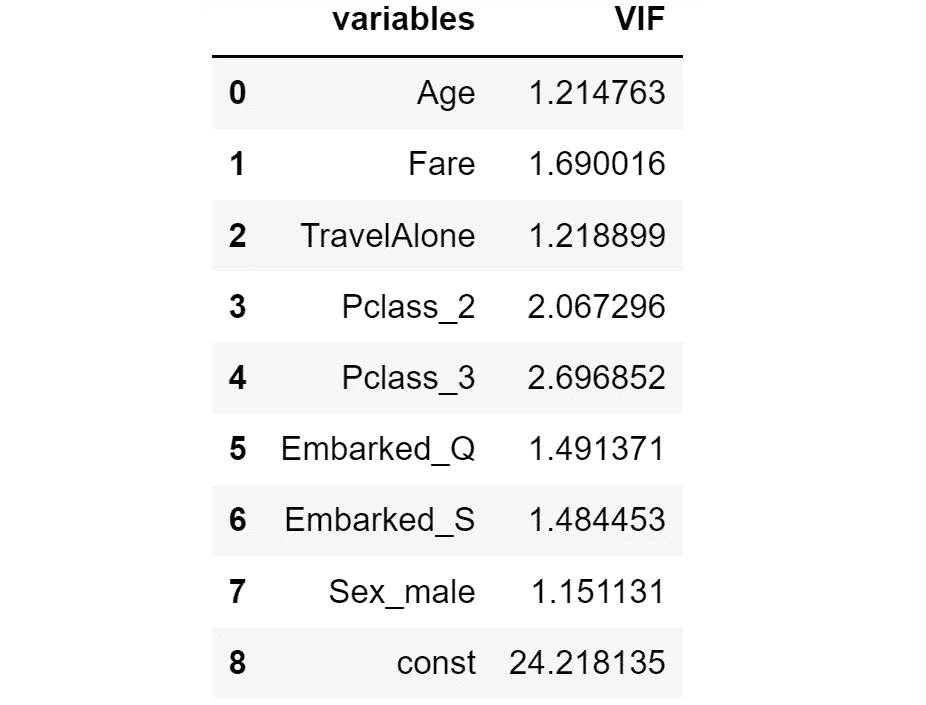
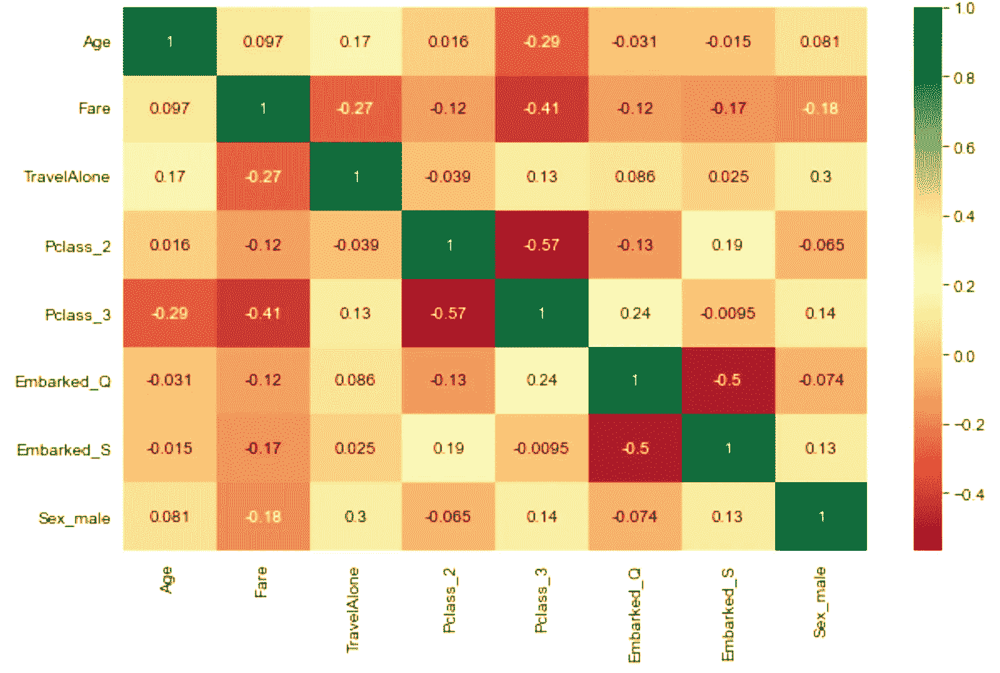
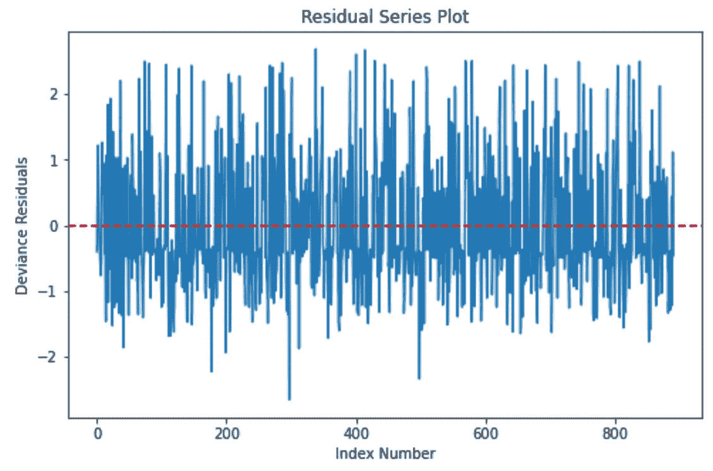

# 逻辑回归的假设，解释清楚

> 原文：<https://towardsdatascience.com/assumptions-of-logistic-regression-clearly-explained-44d85a22b290?source=collection_archive---------0----------------------->

## 理解并实现假设检验(用 Python ),这是最重要的数据科学建模技术之一

塞巴斯蒂安·斯坦尼斯在 [Unsplash](https://unsplash.com?utm_source=medium&utm_medium=referral) 上的照片

逻辑回归是一种非常有效的建模技术，自 20 世纪 40 年代发展以来，一直是统计学中的主流。

考虑到它的普及性和实用性，数据从业者应该在使用它处理数据和业务问题之前理解逻辑回归的基本原理。

在本文中，我们将通过**理论**解释和**实践**假设检验的 Python 实现来探索逻辑回归的关键假设。

## 内容

> ***(1)****[*理论概念&实践检验*](#d91b) ***(2)***[*与线性回归*](#b004) ***(3)***[*总结与 GitHub 回购链接*](#293b)*

**

*照片由[格伦·卡斯滕斯-彼得斯](https://unsplash.com/@glenncarstenspeters?utm_source=medium&utm_medium=referral)在 [Unsplash](https://unsplash.com?utm_source=medium&utm_medium=referral) 拍摄*

# **理论概念&实践检验**

*为了在 Python 中实现假设检查，我们将使用经典的 [**泰坦尼克号**数据集](https://www.kaggle.com/c/titanic/data)。完整的代码请看一下这个项目 **的 [**GitHub repo。**](https://github.com/kennethleungty/Logistic-Regression-Assumptions)***

# *假设 1—适当的结果类型*

*逻辑回归通常用作分类器，因此所用的逻辑回归类型(二元、多项式或有序)必须与数据集中的结果(因变量)相匹配。*

*默认情况下，逻辑回归假设结果变量为**二元**，其中结果的数量为两个(例如，是/否)。*

*如果因变量有三个或更多结果，则应使用**多项式或顺序**逻辑回归。*

> ***如何检查？***

*我们可以通过获得因变量中不同结果的数量来检验这一假设。如果我们要使用**二元**逻辑回归，那么在结果变量中应该只有**两个**唯一结果。*

# *假设 2 —独立变量和对数优势的线性*

*逻辑回归的一个关键假设是，结果的 [**logit**](https://en.wikipedia.org/wiki/Logit) (又名 **log-odds** )与每个**连续**自变量之间的关系是*线性*。*

***logit** 是**比值比**的对数，其中 ***p*** =积极结果的概率(例如，在泰坦尼克号沉没中幸存)*

**

> ***怎么查？***

****(一)Box-Tidwell 测试****

***盒形井** **测试**是用于检查预测值和逻辑值之间的线性。这是通过将**连续独立**变量与其对应的**自然对数**之间的对数转换**交互** **项**添加到模型中来实现的。*

*例如，如果你的一个连续自变量是`**Age**`，那么作为新变量添加的交互项将是`**Age * ln(Age)**`。*

*作为 Box-Tidwell 测试的一部分，我们对数据集进行过滤，只保留连续的独立变量。*

**注意:虽然 R 有* `*car*` *库来用一行代码执行 Box-Tidwell，但我找不到任何可以做类似事情的 Python 包。**

*如果你有一个以上的连续变量，你应该在模型中包括相同数量的相互作用项。包含交互项后，我们可以重新运行逻辑回归并查看结果。*

**

*涉及 Box-Tidwell 变换的 Logit 回归结果示例|图片由作者提供*

*我们需要做的是根据它们的 **p 值**检查交互项*年龄:Log_Age* 和*费用:Log_Fare* 的**统计显著性。***

**年龄:Log_Age* 交互项的 p 值为 0.101 ( **不是**统计显著，因为 p >为 0.05)，这意味着自变量*年龄*与结果变量的 logit 线性相关**，并且假设得到满足。***

*相反， *Fare:Log_Fare* 为**统计显著**(即 p≤0.05)，表明 *Fare* 与 logit 之间存在**非线性**。*

*一种解决方案是通过结合高阶多项式项来执行变换，以捕捉非线性(例如， *Fare* )。*

****(二)目测****

*我们可以检查 logit 线性的另一种方法是通过目视检查每个预测值和 logit 值之间的散点图。*

**

**费用*变量与结果的对数概率的散点图|图片由作者提供*

*上述散点图显示了*费用*与对数优势比的清晰非线性模式，从而暗示违反了**logit 线性假设**。*

# *假设 3—没有强烈影响的异常值*

*逻辑回归假设不存在**或**具有高度影响力的异常数据点，因为它们会扭曲模型的结果和准确性。*

*请注意，并非所有异常值都是有影响的观察值。相反，离群值有*潜在的*影响力。为了评估这一假设，我们需要检查是否满足两个标准，即有影响的**和**异常值。*

> ***怎么查？***

****(一)影响****

*我们可以用[库克距离](https://en.wikipedia.org/wiki/Cook%27s_distance)来确定一个数据点的**影响**，它是根据它的[残差和杠杆](https://online.stat.psu.edu/stat462/node/170/)来计算的。它总结了当特定的( *i* th)观察值被移除时回归模型中的变化。*

*关于使用什么截止值，有不同的意见。一个标准阈值是 **4/N** (其中 N =观察次数)，意味着具有**库克距离> 4/N** 的观察被认为是有影响的。*

*`statsmodel`包还允许我们可视化 [GLMs](https://en.wikipedia.org/wiki/Generalized_linear_model) 的影响图，例如影响属性的指数图(`[influence.plot_index](https://www.statsmodels.org/stable/generated/statsmodels.genmod.generalized_linear_model.GLMResults.get_influence.html)`):*

**

*库克距离的指数图示例。红色虚线表示厨师的距离界限，上面是作者认为有影响的点|图片*

****(二)离群值****

*我们使用**标准化残差**来确定一个数据点是否是异常值。**绝对标准化残差值大于 3** 的数据点代表可能的极端异常值。*

****(三)把两者放在一起****

*我们可以根据之前为库克距离和标准化残差定义的阈值，通过查找顶部观察值来识别具有强烈**影响的异常值**数据点。*

*当检测到异常值时，应该对它们进行相应的处理，例如删除或转换它们。*

**

*前 5 名最具影响力的异常值(以及相应的指数)|作者图片*

# *假设 4-不存在多重共线性*

*多重共线性对应于数据包含高度相关的独立变量的情况。这是一个问题，因为它**降低了估计系数**的精度，削弱了逻辑回归模型的统计能力。*

> ***如何检查？***

***方差膨胀因子(VIF)** 测量一组独立变量中多重共线性的程度。*

*从数学上来说，**等于整个模型方差与**一个只包含单个自变量的模型的方差之比。*

*VIF 的最小可能值是 1(即完全没有共线性)。根据经验，超过 5 或 10 的 **VIF 值表示多重共线性的数量有问题。***

*以下是计算出的 VIF 值的示例。由于没有 VIF 值超过 **5** ，假设成立。*

**

*VIF 价值观|作者图片*

*另一种检查方法是生成关联矩阵热图:*

**

*相关矩阵|作者图片*

*这种方法的问题是，当存在许多独立变量时，热图可能难以解释。*

*更重要的是，三个或更多变量之间可能存在共线性，即使没有一对变量被视为具有异常高的相关性。因此， **VIF 是评估多重共线性的更好方法。***

* [## 通过我的推荐链接加入媒体-梁建华

### 以一杯咖啡的价格访问我所有的内容(和所有的媒体文章)!

kennethleungty.medium.com](https://kennethleungty.medium.com/membership)* 

# *假设 5——观察的独立性*

*观察值必须彼此**独立**，也就是说，它们不应该来自重复或成对的数据。这意味着每个观察不受其余观察的影响或与之相关。*

> ***怎么查？***

*对于我们的 Titanic 示例数据集来说，这种独立性假设是自动满足的，因为数据由单个乘客记录组成。*

*在处理时间序列数据时，这种假设更值得关注，因为时序观测值之间的相关性(*自相关*)可能是一个问题。*

*尽管如此，仍然有方法来检查非时间序列数据的观测值的独立性。在这种情况下,“时间变量”是观察的顺序(即指数)。*

*特别是，我们可以创建**残差序列图**，其中我们绘制了 logit 模型的[偏差残差](https://stats.stackexchange.com/questions/166585/pearson-vs-deviance-residuals-in-logistic-regression)与观察值的指数。*

**

*剩余系列图|作者图片*

*由于上图中的残差似乎随机分布在**零点**的中心线周围，我们可以(直观地)推断该假设得到满足。*

**注:如果您希望了解更多关于逻辑回归中传统残差 vs .****fit****图的解释，请查看文章* [*此处*](https://freakonometrics.hypotheses.org/8210) *和* [*此处*](https://bookdown.org/jefftemplewebb/IS-6489/logistic-regression.html#fn40) *。**

# *假设 6 —足够大的样本量*

*对于数据集中的每个独立变量，应该有足够数量的观察值，以避免创建过度拟合的模型。*

> ***怎么查？***

*像库克的距离一样，有许多关于经验法则的观点来确定“足够大”的数量。*

*一个经验法则是，对于每个独立变量，至少应该有 **10 个观察值，且结果**最不频繁。我们可以通过检索每个变量的*值计数*来检查这一点。*

*另一种确定大样本量的方法是，**的总观测数应大于** [**500**](https://www.ncbi.nlm.nih.gov/pmc/articles/PMC6422534/) 。我们可以通过获得整个数据帧的长度*来检查这一点。**

# *与线性回归的比较*

*尽管逻辑回归的假设不同于线性回归，但这两种技术都有几个假设。*

## *差异*

*   *逻辑回归**不**要求因变量和自变量之间存在线性关系。然而，它仍然需要独立变量与结果的**对数概率线性相关。***
*   ***线性回归需要同方差**(常方差)，但逻辑回归不需要。*
*   *误差项(**残差**)必须为**正态**分布，用于线性回归，但在逻辑回归中不需要。*

## *类似*

*   *多重共线性缺失*
*   *观察是相互独立的*

**

*罗伯特·阿纳施在 [Unsplash](https://unsplash.com?utm_source=medium&utm_medium=referral) 上拍摄的照片*

# *摘要*

*以下是我们已经讨论过的假设的回顾:*

1.  *适当的**结果**类型*
2.  ***自变量的线性**和**对数比***
3.  *无强烈**影响的异常值***
4.  *缺少**多重共线性***
5.  ***观察值的独立性***
6.  *足够大的**样本量***

*我还推荐探索附带的[**GitHub repo**](https://github.com/kennethleungty/Logistic-Regression-Assumptions)**查看这六个假设检查的完整 Python 实现**。*

*如果你对这个话题有任何反馈或建议，我期待在评论区听到你的意见。*

# *在你走之前*

*欢迎您**加入我的数据科学学习之旅！**点击此[媒体](https://kennethleungty.medium.com/)页面，查看我的 [GitHub](https://github.com/kennethleungty) ，了解更多精彩的教育数据科学内容。同时，享受运行逻辑回归的乐趣！*

* [## 为什么自举真的有效

### 一个简单的门外汉解释为什么这种流行的技术在数据科学中有意义](/why-bootstrapping-actually-works-1e75640cf172)  [## 用字符错误率(CER)和单词错误率(WER)评估 OCR 输出质量

### 测量光学字符识别输出质量的关键概念、示例和 Python 实现](/evaluating-ocr-output-quality-with-character-error-rate-cer-and-word-error-rate-wer-853175297510)  [## 垂死的雷鲁问题，解释得很清楚

### 通过理解 ReLU 的缺点来保持你的神经网络的活力。](/the-dying-relu-problem-clearly-explained-42d0c54e0d24) 

## 参考

*在* [*GitHub repo 自述文件*](https://github.com/kennethleungty/Logistic-Regression-Assumptions/blob/main/README.md#References) 中整理的参考资料完整列表*