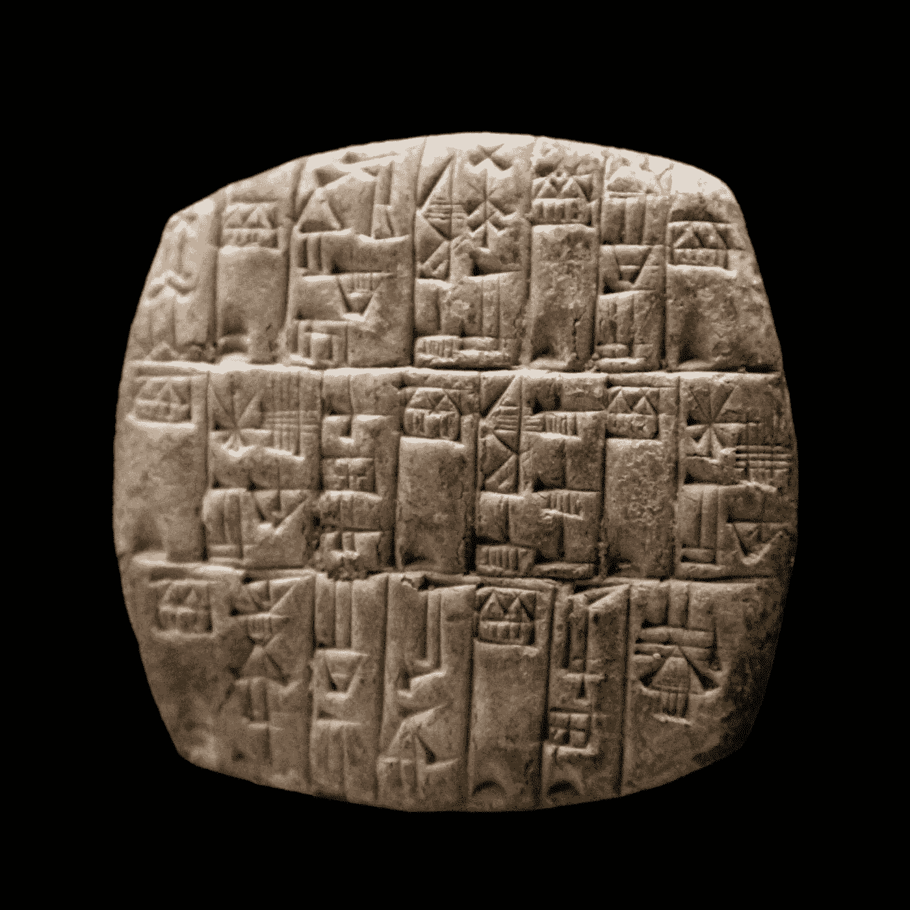

# 亚述人还是巴比伦人？楔形文字中的语言识别

> 原文：<https://towardsdatascience.com/assyrian-or-babylonian-language-identification-in-cuneiform-texts-4f15a14a5d70?source=collection_archive---------21----------------------->

## [实践教程](https://towardsdatascience.com/tagged/hands-on-tutorials)

## 古代美索不达米亚方言的语言模型

楔形文字泥板。来源: [Rama](https://commons.wikimedia.org/wiki/File:Cuneiform_tablet-MAHG_15856-IMG_9472-black.jpg) ，维基共享

[美索不达米亚](https://en.wikipedia.org/wiki/Mesopotamia)是幼发拉底河和底格里斯河之间地区的一个古老名称，位于今天的伊拉克和土耳其、叙利亚和伊朗的部分地区。现代社会的“现代性”很大程度上归功于美索不达米亚人在农业、数学或冶金等领域的发明。在这些发明中，古代美索不达米亚人最伟大的成就之一是发展了 [*楔形文字*手稿](https://en.wikipedia.org/wiki/Cuneiform)，并由此发展出最早的书写系统之一。这是公元前第三个千年，历史才刚刚开始。

楔形文字由印在新鲜泥板上的楔形符号组成。粘土是一种可以抵抗时间流逝而不会显著退化的材料。因此，考古学家设法找到了大量保存完好的石碑。该地区的粘土也非常便宜和丰富。这使得这种形式的经文非常受欢迎，不同的民族在很长一段时间里根据他们的语言改编了这种文字。因此，我们对美索不达米亚几千年来(书面)语言的演变有一个很好的记录。事实上，我们有这么多的记录跨越了这么长的时间，它们几乎是无法管理的。这就是数据科学的用武之地。

古代美索不达米亚地图。来源: [Goran tek-en](https://commons.wikimedia.org/wiki/File:N-Mesopotamia_and_Syria_english.svg) ，维基共享

本文的目的是展示如何编写一个简单的定制语言模型来识别楔形文字文本中的美索不达米亚语言和方言。为此，我们使用来自 Kaggle data challenge 的数据集<https://www.kaggle.com/wilstrup/cuneiform-language-identification>**识别楔形文字。*该数据集包含大约 139，000 个楔形文字片段，还提供了语言或方言标签。有七个标签，包括[夏季语](https://en.wikipedia.org/wiki/Sumerian_language) (SUX)，一种孤立的语言，以及[阿卡德语](https://en.wikipedia.org/wiki/Akkadian_language)的六种方言:新亚述语(NEA)，标准巴比伦语(STB)，晚期巴比伦语(LTB)，新巴比伦语(NEB)，中巴比伦外围语(MPB)，以及旧巴比伦语(OLB)。*

*如果你想知道这些字符的样子，下面的图片显示了我们的数据集的一个样本。很漂亮，对吧？*

**

*我们数据的子集。来源:作者对 Kaggle [数据集](https://www.kaggle.com/wilstrup/cuneiform-language-identification)的分析*

*接下来，如果您想在本地机器上复制这个分析，我建议您下载这些字体中的一种。虽然这不会影响您复制分析的能力，但否则文本将无法正确呈现。*

# *语言模型*

*一般来说，[语言模型](https://en.wikipedia.org/wiki/Language_model)是单词序列的概率分布。在这个宽泛的定义中，我们可以找到不同类型的模型。一些最常见的使用 *n-gram* 的概念，即 n 个连续字符(单词)的序列，我们在其中分割文本。N-gram 模型在 NLP 文献中相当常见。它们的应用包括语音和手写识别以及机器翻译。因此，Python 中有一些众所周知的包，比如 [NLTK](http://www.nltk.org/) ，用它们我们可以很容易地构建一个 N 元模型。*

*对于这项任务，我使用一个 N-gram 模型来预测楔形文字 N-gram 序列属于特定的古代美索不达米亚语言或方言的概率。在这个实现中，我们假设每个字符是一个单字。从技术上讲，楔形文字可以是一个完整的单词，也可以只是一个声音，但是我们会忽略这个事实。现在，你可能已经猜到了，如果我遵循这个挑战的简单路径，我就不会写这篇文章。相反，在这里我将向您展示如何从零开始构建一个 N 元模型*。事实上，我在代码中使用的唯一 Python 库是`numpy`和`pandas`。我决定这样做有两个原因:首先，标准的 NLP 库是为处理拉丁字符而设计的，所以让它们适应楔形文字有点痛苦。第二，好玩！我坚信测试你在一个主题上的知识的最好方法是从基础开始，看看你是否能用尽可能少的专业库来编码它。**

**我提出的 N-gram 模型实现受到了使用[概率链规则](https://en.wikipedia.org/wiki/Chain_rule_(probability))和[马尔可夫假设](https://en.wikipedia.org/wiki/Markov_property)的[经典 N-gram 模型](/the-beginners-guide-to-language-models-aa47165b57f9)的启发。简单来说，这个假设说明了一个 n 元文法在位置 *t* 的概率只取决于前面的 *k* n 元文法(其中 *k* 通常为 1)。因此，可以通过取其 n 元文法的条件概率的乘积来计算序列的概率，直到 *t-k* 。**

**嗯，我的代码并没有完全做到这一点，而是更接近和更简单。它实际上是计算每种语言的训练集中所有 n 元语法的无条件概率。然后，它通过乘以序列中出现的所有 n 元语法的无条件概率来估计观察到的序列属于每种语言的概率。选择概率最高的语言作为预测标签。**

**显然，可以开发更复杂的方法。然而，我发现这个非常简单的模型在测试集上已经表现得非常好了。**

# **履行**

**现在我们对语言模型有了更好的理解，让我们看看如何为楔形文字编写自定义实现。就代码而言，这一部分有点重，但是请相信我:付出的努力是值得的！或者，您可以转到结果部分，了解故事的结局。**

**我们从一些辅助函数开始。第一个，我们称之为`preprocess`，将楔形文字的字符串转换成对我们来说更方便的格式。它执行两个操作:首先，它添加一个句子开头和结尾的标记(我们分别称之为 B 和 E)，然后它在字符之间添加一个空格。b 和 E 是有用的标记:它们帮助我们计算一个句子以给定字符开始和结束的概率。**

**预处理功能。来源:作者**

**现在，我们需要计算 n-grams！下面的两个函数是我们实现的核心，因为它们将文本分割成 n 个字母，并计算每个字母在我们的示例中出现的次数。**

**N-gram 计数函数。来源:作者**

**我们的最后一个帮助函数`logprob`，将用于计算 n 元文法的整个序列的对数概率。在这种类型的问题中，我们通常处理非常小的概率，所以取对数通常是跟踪我们的数字的好主意。这里我们有另一个关于经典语言模型的简化。通常，N-gram 模型会在其词汇表中包含一个“未知”单词标记，以估计找到真正不常见单词的概率。然而，在我们的例子中，我们将简单地假设找到这样的字符的概率是 0.00001(比我们最稀有的一些字符低大约 10 倍)。**

**计算一个序列的对数概率。来源:作者**

**就是这样！这些都是我们需要的辅助函数。现在轮到定义一个类来包装我们的模型，您可以在下面的代码片段中看到。因为没有更好的名字，就叫它`CuneiPy`吧。我们的包装类遵循经典的 Scikit-Learn 结构，包含两个方法:`.fit()`和`.predict()`。`.fit()`方法计算每个 n 元语法和语言的无条件概率(记住，我们有七个)。这就是 n 元语法在 n 元语法总数中出现的次数。`.predict()`方法获取楔形文字字符序列，并计算该序列属于我们的一种语言的概率。然后，它取概率最高的语言，选择它作为预测标签。**

**CuneiPy —模型的包装类。来源:作者**

# **结果**

**如果你现在还和我在一起，你可能会想这个东西到底有没有用。你可能已经猜到了答案:是的！虽然肯定有改进的空间，但我们的简单模型在 1000 个观察值的测试集上表现得非常好，加权 f 1 分数约为 0.8(取决于训练-测试划分)。**

**测试`CuneiPy`就像这样简单:**

**测试 CuneiPy。来源:作者**

**正如我们在`.fit()`部分看到的，我们使用的是二元模型(因此 *n = 2* )。列“楔形文字”是我们语言模型的输入，我们的目标列由数据集中的“lang”定义。下面的分类报告为我们提供了一个模型性能最佳的细分。也许不足为奇的是，该模型更善于识别新亚述语(NEA)和索姆利语(SUX)，这两种最常见的语言。该模型也很好地识别了晚期巴比伦语(LTB ),尽管只有 11%的文本属于这种阿卡德方言。中巴比伦周边语(MPB)是我们的模型最难对付的方言。这与我们在样本中对这种语言的表述是如此之少(占所有观察结果的 3.9%)是一致的。**

****

**分类报告。来源:作者对 Kaggle [数据集](https://www.kaggle.com/wilstrup/cuneiform-language-identification)的分析**

# **主要外卖**

**在本文中，我们看到了如何创建一个定制的 N-gram 语言模型来预测古代美索不达米亚楔形文字的方言或语言。该模型是经典 N 元模型的一个版本，利用了概率链规则和马尔可夫假设。虽然简单，但该模型实现了 0.8 的 F1 分数。**

**我希望你喜欢这篇文章。如果你喜欢，你可以访问这个 [Github 库](https://github.com/AlvaroCorrales/Cuneiform-classification)中的代码。**

**如有任何反馈，请通过 LinkedIn[或电子邮件联系我！](https://www.linkedin.com/in/alvaro-corrales-cano/)**