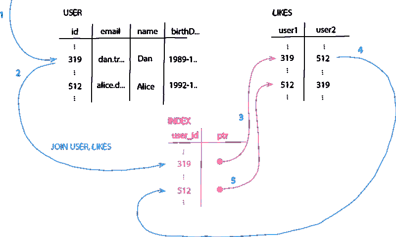
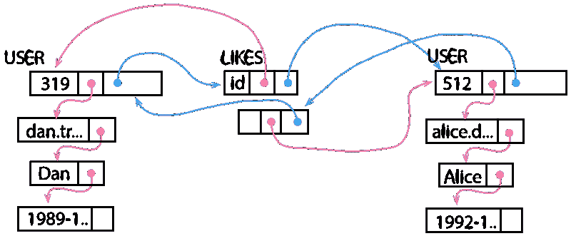

# 其核心是:图形数据库与关系数据库有什么不同？

> 原文：<https://towardsdatascience.com/at-its-core-hows-a-graph-database-different-from-a-relational-8297ca99cb8f?source=collection_archive---------2----------------------->

## 通过谷歌搜索这个话题很容易找到一些答案，然而，正如我发现的，大多数答案只是简单地列出了好处

在当今永不停息的世界中，新数据不断产生，是大多数企业的基本资产。系统全天候可用，并且每天每秒都在生成数据。此外，数据生成和处理系统的复杂组合协作向用户提供服务。我最近多次遇到的一个问题——也是我仔细思考的结果——是:图形数据库有什么问题，它们有什么不同？通过谷歌搜索这个话题很容易得到一些答案，然而，正如我发现的，大多数答案只是简单地列出了好处。在这篇文章中，我想简单描述一下我对它们真正价值的理解——独立于大公司和技术影响者的营销幻灯片。

# 数据库维护和保存所有进入我们系统的先前处理过的事件的物化状态。

事件是进入我们系统的一个独立的、不变的信息。当我们建立一个数据库来处理和存储这样的事件时，我们必须做出各种设计决策:

*   我们想要存储什么数据？
*   是如何表现的？
*   我们在哪个抽象层存储数据？
*   我们希望处理哪些事件，以及如何将它们应用到我们的数据中？

例如:我们可以存储进入系统的原始事件，或者应用它们来更新我们的数据。

# 数据库有以特定方式存储数据的目的和原因。

例如，如果数据库充当面向用户的应用程序的持久层，以实时服务于用户请求，那么它应该包含一个表示，该表示保存可被特定请求集快速访问的数据。相反，对于需要考虑大量历史数据的统计业务问题，这可能不是最佳方法。

那么，图数据库和关系数据库有什么区别呢？随着图形数据库越来越受到许多公司的关注，并且大多数公司也有传统的关系数据库，我想在这里重点介绍这两个。

作者图片

# 关系数据库是实体优先的。

让我们从关系模型开始。关系数据库将数据存储在表中。表格代表一个实体。我称之为实体优先。方法是为一个表定义一个模式，然后在该表中只存储该特定类型的对象。因此，结构相似的数据存储在一起。

# 关系模型将关系存储为用户域中的数据。

在关系模型中，数据之间没有关系的概念。也就是说，您不能定义表之间的关系。为了在关系模型中链接数据，您必须显式地将关系建模到您的数据中。您无法区分实际数据和仅用于表示关系的数据。对关系建模的唯一方法是将其建模为表中的外键——作为实体的属性(一对一、多对一)或与附加表一起(一对多、多对多)。可以将映射表视为关系表，因此将关系视为实体。然而，它并不隐含在支持关系的技术中，而是我们在创造新的数据。这导致了一个基本的含义:关系数据库将外键存储为用户数据，即引用实体表中的另一个条目。因为引用是用户域中的数据，所以数据库不能有自动机制来管理它们——它们受制于用户逻辑。

作者图片

# 图形数据库是关系优先的。

相比之下，图模型对于实体(节点)和关系(边)有一个明确的概念，这使得它与众不同。因为我们可以直接定义实体之间的关系，所以我们不需要关心如何在我们的模式中显式地对它们建模。我们不需要了解外键，也不必编写如何存储它们的逻辑。我们定义一个实体和关系的模式，系统会处理它。如果我们想要对高度关联的数据建模，这有一个巨大的好处:实现可以有效地处理引用。图形数据库系统可以存储指向下一个相关实体的真实内存指针，而不是将额外的数据(引用)作为属性显式地存储在我们的数据表中。大多数图形数据库系统以类似于链表的结构存储数据。它们存储的是与相关数据的直接链接，而不是相似的对象。我会说他们是关系第一。

# 这两种方法中的上述差异导致了关于每一种都可以很好服务的用例的一些暗示。

# 图形数据库像面向对象语言一样存储数据。

由于关系数据库不包含关系的概念，我们需要将它们作为数据显式地建模到我们的模式中。这导致了与我们在大多数编程语言中使用的面向对象建模的差异。每个对象可以维护与其相关的其他对象的集合。这些引用通常是指向内存中对象的指针，我们不必显式地存储它们。我们也不需要在内存中找到具有外键属性的对象。因此，进行所谓的对象关系映射需要相当大的开销。

图形数据库像面向对象的语言一样存储数据——我们有指向相关对象的直接指针。因此，对象关系映射更加简单。

# 单个关系的遍历可以在恒定的时间内完成。

由于图数据库可以通过跟随内存指针从一个实体跳到一个相关的实体，我们称之为无索引邻接。我们不必在不同的表中查找外键(使用索引),或者更糟的是，在映射表中查找一个键，然后在第三个表中查找结果外键来跟踪关系。因此，单个关系的遍历可以在恒定的时间内完成。也就是说，它与存储在图形数据库中的数据大小无关。而我们必须扫描关系型索引中的一个——可能是多个——索引，而关系型索引随着数据的增长而增长。

# 就是感觉用 SQL 写多跳查询不对。

虽然确实可以在关系模型中对连接的数据和关系进行建模，但是一旦我们尝试使用 SQL 查询语言沿着多跳的路径前进，我们可能会觉得我们写下的东西并不是我们想要完成的事情。我们必须在某些条件下连接表，我们必须手动指定这些条件来查找相邻的数据——可能需要多次连接，因此会编写难看的嵌套查询。感觉很大，好像有很多开销正在发生。如果发生这样的事情，这通常是一个强烈的信号，表明我们正在使用一种不完全符合其设计的技术。我们不想连接整个表—我们想查找一个特定的数据点。

在图形数据库中，这看起来不同。因为它们被设计成基于连接结构来查询相关数据，所以它们提供了一种简洁而直观的语法来做到这一点。我们可以准确地指定我们想要查找的路径。没有连接条件或复杂的嵌套查询，没有映射表——只是我们想要找到的最简单的描述。

# 结论

图形和关系数据库在一个基本设计原则上是不同的:图形有关系的概念，而关系数据库没有。这就是为什么图形数据库可以更有效地管理相互关联的数据。尽管如此，两者都有其存在的理由:当分析接近单个数据点的整个上下文时，图形表现更好，使用起来更直观——可能有多次跳跃。但是，如果不需要探索高度连接和紧密连接的数据，关系模型可能同样可以很好地满足需求。