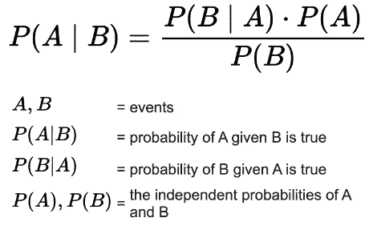
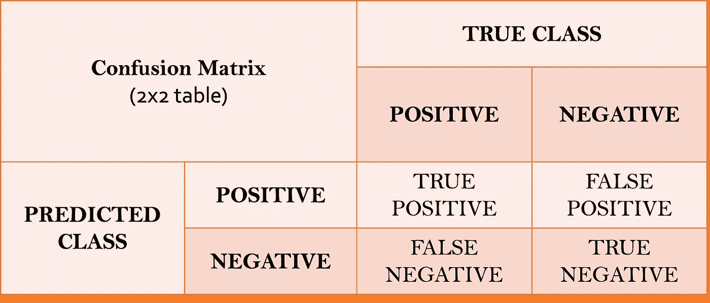
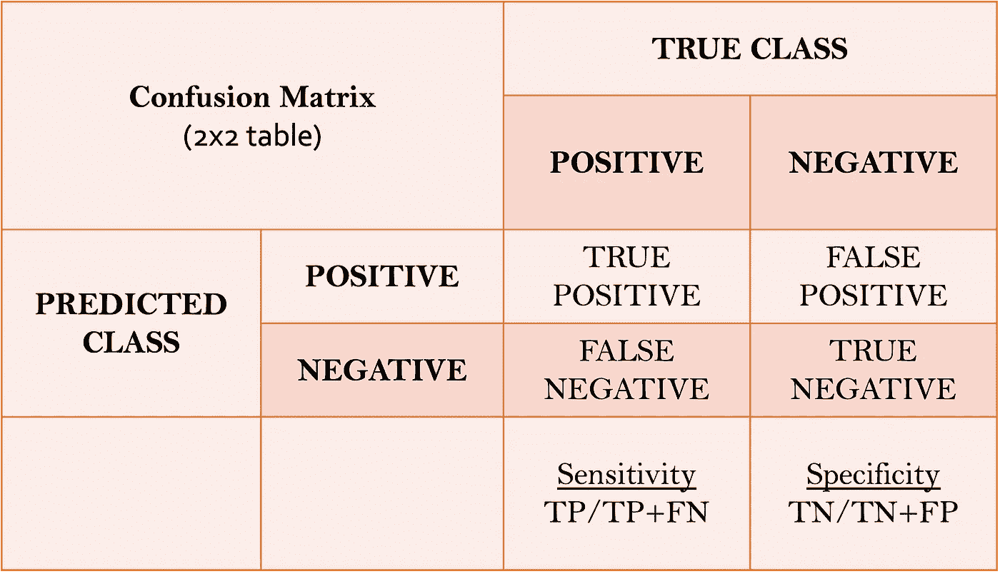
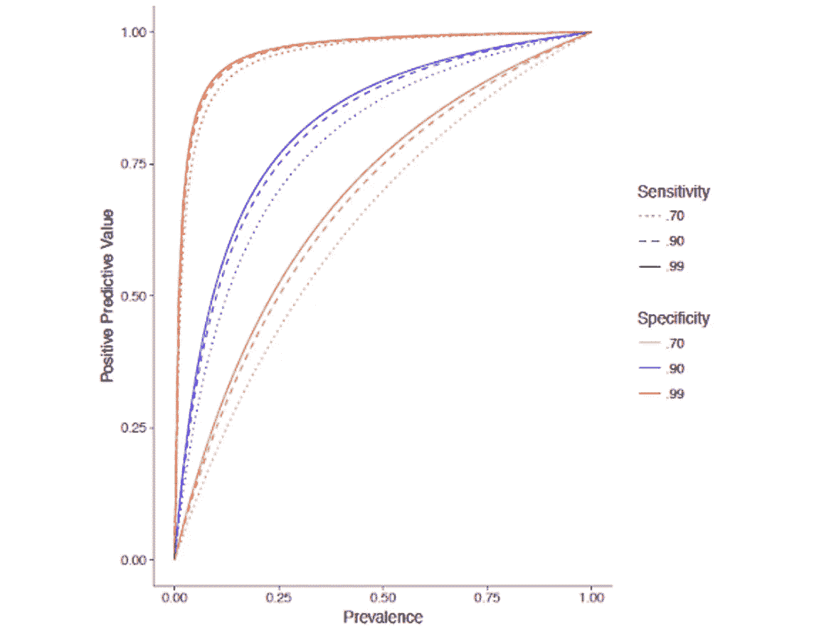
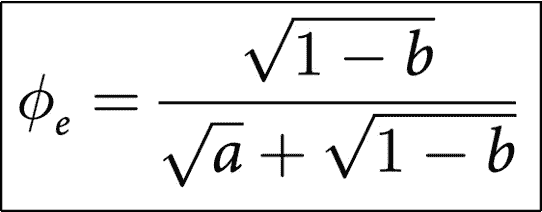

# 执掌数据科学、认识论和可知事物

> 原文：<https://towardsdatascience.com/at-the-helm-of-data-science-epistemology-and-what-is-knowable-a-primer-on-the-prevalence-d52da5452aa5?source=collection_archive---------30----------------------->

## 流行阈值和贝叶斯定理入门

作者图片

*   宇宙是一个巨大而充满敌意的地方。作为人类，我们只能在这个无限小的空间中生存。我们的生存在一定程度上依赖于我们运用自己的智慧，做出理性选择以最好地适应环境的能力。
*   在很大程度上，智力是分类的自觉实践。
*   我们对事物、人、想法、感觉和实体进行分类，以避免危险，最大化我们的幸福，从而提高我们的生存能力。
*   我们的分类能力是归纳性的，因此受到贝叶斯定理的限制，这就造成了一个生存困境。
*   因此，鉴于我们对支配我们宇宙的规则的有限知识，当我们探索自然时，我们应该问这个问题:*“我们所看到的，到底是什么？”*

上面的序言，虽然过于简单和简化，但说明了一个无可争议的事实，即我们茁壮成长和生存的能力至少部分取决于我们的智力。尽管根植于我们的遗传密码及其在进化过程中提炼的潜力，我们的智力主要是通过对我们的世界进行推断并得出让我们能够最有效地导航的结论而获得的。但是这种推理过程有多准确和精确呢？事实证明——这取决于我们使用的推理类型。一方面，演绎推理声称，基于遵循明确定义和详尽的逻辑规则的前提，得出必然为真的结论。这种“自上而下”的推理在纯科学和应用科学中有许多应用——特别是逻辑和数学——从一系列基本原理中发展出一个完整的领域，并以绝对确定性得出内在一致的结论。虽然哥德尔的不完全性定理限制了第一性原理集的完备性、一致性和可判定性，但演绎推理中得到的结论是确定的。不幸的是，鉴于我们对支配我们宇宙和我们存在经验的基本原则的有限知识，生活很少是演绎的。相反，归纳推理是我们得出关于世界的结论的方法。归纳逻辑是一种推理方法，通过这种方法，一组观察结果被综合起来，得出一个普遍的原则——在这种情况下，结论是可能的——甚至经常是可能的——尽管*不*确定。这些结论的不确定程度取决于几个因素——但考虑到它们固有的不确定性——描述它们的语言本质上是统计的和概率的。将这一论点引向其逻辑结论——我们推测，我们绝对确定地了解任何事物的能力很可能是无法达到的。

**贝叶斯定理**

条件概率的贝叶斯定理方程。图片作者。

贝叶斯定理描述了基于与特定事件或观察相关的条件的先验知识的事件或观察发生的概率。贝叶斯方法的本质是提供一个数学模型，解释现有的信念如何根据新的证据而改变。值得注意的是，贝叶斯定理在生活的无数领域和方面都有应用，它是我们如何观察和与我们的世界互动的核心。

贝叶斯定理通过引入归纳逻辑的形式框架彻底改变了现代哲学，归纳逻辑是一种认知合理性的实用方法，作为一种扩展演绎逻辑定律的证明的方式，包括对归纳逻辑定律的证明。形式结构本身有两个主要元素:使用概率法则作为对理性信任度(或置信度)的约束，以及引入概率推理规则，即所谓的条件概率。

从数学上来说，贝叶斯定理的等式转化为给定事件或状态 B 时事件 A 的条件概率。上述关系等于给定事件 A 时事件 B 的概率乘以事件 A 与事件 B 的独立概率之比。虽然上述概念有些抽象，但应用于日常生活情况的具体示例可能有助于说明这一概念。

例如:

*   假设今天是九月的一个普通的星期二。在不知道其他情况下，今天下雨的概率有多大？你可以大胆猜测。就保证精度而言，这将是最糟糕的情况。同样，您可以根据您所在地理区域过去(比如说 10 年)的平均降雨天数来推断降雨的基准风险，然后根据今年迄今为止的降雨天数以及今年的剩余天数来推断今天的降雨可能性。现在——估计可能会非常不精确，因为有许多自由度我们没有考虑——但它仍然比猜测要好。毕竟，我们正在使用*一些*数据来获取知识。现在让我们通过引入新的“证据”或新的“数据”来“更新”我们的估计。说外面是阴天。今天下雨的可能性有多大*？当然，知道今天多云会增加下雨的可能性。使用贝叶斯方法，评估进一步的改进，直到我们能够获得更准确的信息，做出更精确的预测。这是贝叶斯方法的精髓——更多的信息等于更多(或更好、更精确)的知识。正如我们马上会看到的，流行阈值[1]限制了得出准确结论所需的必要证据数量——因此检索信息和新数据的过程不必是无限的。*

*我们还可以描述一个医学筛查的常见例子:*

*   *根据居住国家的不同，女性从 40 岁或 50 岁开始接受乳房 x 光片和/或乳房超声波的定期乳腺癌筛查。乳房 x 光检查发现疑似乳腺癌病变的可能性有多大？在没有任何进一步信息的情况下，我们可以说，乳房 x 光片被解读为乳腺癌阳性的几率等于人群中乳腺癌的患病率。但是这种方法并没有考虑到女性的个体风险因素或症状。如果接受乳房 x 光检查的人有乳腺癌家族史怎么办？如果她感觉乳房或腋下有肿块怎么办？乳房 x 光片显示病变的机会随之增加。它增加的数量可以使用贝叶斯定理来计算。在这里，我们也观察到，当我们获得更多信息时，我们会更新我们的先验概率以检索新的风险估计，这无非是通过获得更准确的知识来完善我们的理解和更新我们的信念。*

***分类和混淆矩阵***

*混淆矩阵是一种总结分类算法性能的技术。它最基本的形式是画出一张 2x2 的表格，将我们试图了解的事物的真实状态/性质与我们观察到的预测进行比较。*

**

*混淆矩阵或 2x2 表。图片作者。*

*我们估计的“预测值”或“精确度”取决于几个变量:我们用来观察和预测的工具有多好，但更重要的是，我们试图了解的东西有多普遍。后一点就是所谓的基础利率谬误，它直接来自贝叶斯统计。*

***观察工具***

*我们用来探索世界的观察工具是无限的。给定适当的上下文，任何东西都可以用作获取知识的工具。比方说，你发现自己在一片土地上——一眼望不到边，空无一物。你会被问到这样一个问题:在过去的某个时候，你站的地方附近有一栋建筑的可能性有多大？甚至尝试一个猜测可能看起来令人生畏。如果在第二种情况下，除了你面前有一堵砖墙之外，一切都是一样的，那会怎么样呢？这能保证那里曾经有过建筑吗？不。这是否增加了曾经有过的可能性？是的，它确实如此，尽管砖墙在阐明建筑物的存在方面缺乏敏感性和特异性。从这个意义上说，这堵墙是一种观察工具，尽管它提供的信息质量很差，但它增加了人们了解世界的潜力。*

*从逻辑上讲，并不是每个工具都能有效地提供有用或准确的信息。这些工具的特征可以最好地描述为它们区分真实情况和虚假情况的能力，以及它们在预测中在各组之间产生多少重叠。他们的表现最好通过混淆矩阵来观察。*

*下面给出一个混淆矩阵的例子。尽管这个例子试图在医学筛查的背景下对疾病状态进行分类，但是对任何个人、概念、想法、主题或物理实体的任何分类都遵循相同的规则。用于观察的工具的灵敏度或“真阳性率”(在信息检索中也称为*回忆*)被定义为总阳性(真预测和假预测)中真阳性的数量，而特异性或“真阴性率”(在信息检索中称为*选择性*)被定义为总阴性(真预测和假预测)中真阴性的数量。作为一个工具，混淆矩阵作为一个二元分类系统，允许我们计算上述参数。*

**

*混淆矩阵中灵敏度(真阳性率)和特异性(真阴性率)参数的方程式。图片作者。*

***一个极限问题***

*在评估分类工具的有效性时，如果我们只考虑其敏感性和特异性参数，就会出现一个重大问题，因为这必然要求您在参与分类过程之前了解您试图分类的任何内容的真实状态。这种障碍在机器学习(ML)和人工智能(AI)中经常观察到。例如，你向计算机提供一组不同颜色的圆形水果的图像。你试图开发一个神经算法，在这个场景中的分类工具，来识别这个数据集中的苹果。即使算法非常优秀，它也需要一个黄金标准来比较它的发现。这产生了两个问题——首先，如上所述，您需要提前知道哪些水果是真正的苹果，以确定算法是否得出了正确的结论，这逆转了分类过程，并使其变得没有意义(如果您已经知道哪些是真正的苹果，为什么需要对它们进行分类？).但是第二，也许更重要的是，这些参数没有解释基本利率谬误。因此，我们需要其他参数来进行正确的认知归纳推理，并获得关于世界的更准确的知识。*

***精度/预测值***

*基本比率谬误被定义为在主观判断事件的条件概率时，没有考虑事件的基本比率或先验概率的认知失误，为了解释基本比率谬误，需要不同的参数。这里是阳性和阴性预测值进入等式的地方。这些新的参数是流行率相关的，并通过以下问题在其适当的年表中处理分类过程:*在预测观察值的数量中，有多少对那些观察值的确认将被证明是正确的？*不要问敏感度问的是什么:*在确认的观察结果中，有多少是首先被正确预测的？*前一个问题的答案是所谓的正预测值，或*精度。观察工具的精度取决于它试图观察的事物有多普通。**

**

*混淆矩阵中阳性(精确度)和阴性(选择性)预测值参数的方程式。图片作者。*

*我们试图观察的事物的普遍性与其观察工具的精确度(阳性预测值)之间的比例由以下等式给出——贝叶斯定理的另一个直接结果:*

**

*其中ρ(ϕ)is 是精确度，a 是灵敏度，b 是特异性，ϕ是流行率。图片作者。*

*很容易观察到，上述比例不是线性的。换句话说，普及率的提高并不意味着精确度的同等提高。也许用不同的灵敏度和特异性值来图示这种关系更有用。*

**

*作为患病率函数的分类工具的精确度或阳性预测值。曲线下的面积越大，工具的性能越好。在这种情况下，红色的工具比蓝色的好，而蓝色本身又比黄色的工具好。图片由尼尔·d·戈尔茨坦提供。许可用于商业用途。([https://www . goldsteinepi . com/blog/relationships-between-observed-outcomes-and-true-prevention/](https://www.goldsteinepi.com/blog/relationships-between-observed-outcomes-and-true-prevalence/))。*

*上述曲线的一个显著特征是，每条曲线上都有一个拐点，在拐点以下，精度下降最快。在这些低流行水平下，该测试可能并不那么可靠——在其预测中产生更多的假阳性而不是真阳性。我们把这个拐点称为“流行阈值”，它在决定世界上什么是可知的方面起着至关重要的作用。*

***流行阈值***

*如上所述，流行阈值[1]指的是流行水平，低于该水平时，测试的精确度下降得更快。从认知的角度来看，这意味着什么？这意味着，在这种情况下，对于一个真实的信号，我们会得到大量的噪声，或者假阳性预测。根据我们试图观察或分类的东西的流行程度，我们不会获得主要是纯信号——因此不可避免的问题是:鉴于贝叶斯限制将流行程度与我们的预测能力联系起来，以及鉴于我们试图观察的东西的低流行程度而做出的错误观察的数量——我们能够绝对确定地真正知道任何事情吗？答案很可能是否定的——除非在一个非常特殊的情况下，观察工具的特异性是 100%,在这种情况下，根据上面的等式，精度将等于 1。有多少观察工具的特异性是 100%？考虑到口译翻译过程中工具功能的自然变化、人为错误和信号丢失(机器的输出需要由得出这些结论的人来解释——这个过程也容易出错)，很可能没有。上述事实很有趣，并且对我们观察可知世界的确定性有重要的哲学和认识论意义。然而，硬币的另一面(或在这种情况下，阈值)同样有趣。注意第一条红色曲线中超过患病率阈值的几乎水平的红线。图表的这一部分是什么意思？超过流行阈值，对于具有足够好的灵敏度和特异性参数的工具来说，增加流行对提高精确度只有很小的影响。也就是说，当我们已经收集了足够的信息来做出准确的预测时，增加信息量可能不会以显著的方式增加精确度。针对流行阈值校正信息检索的过程可以减少计算时间并减少不必要的资源使用。有鉴于此，计算工具流行阈值的等式如下，其中 *a* 是灵敏度， *b* 是特异性:*

**

*患病率阈值的等式(a =敏感性，b =特异性)。图片作者。*

*从图形上看，流行阈值可描述如下:*

**

*流行阈值线(绿色)将图形分为两个区域。在它之下，精确度水平随着流行程度的降低而下降。它上面的区域表明，添加额外的信息可能不会显著提高精度。图片作者。*

*请注意绿色垂直线是如何在图形的拐点或最大曲率点处截取图形的。这是流行阈值。在它之下，精确度水平随着流行程度的降低而下降。上面的区域表明，添加额外的信息可能不会显著提高精度[2]。*

***结论***

*哲学、认识论和贝叶斯理论之间的关系提供了一个奇妙的——也是令人谦卑的——工具来最好地理解我们对世界的推理理解的局限性。基于数学，我们得出一个不可避免的事实:我们不可能绝对确定地知道任何事情。也就是说，尽管有巨大的影响，流行阈值是一个简单的指标，它决定了工具的精确度以及我们对现实的理解开始失效的流行水平。开发更好的观察工具并获得足够的信息以保持在流行阈值以上，对于我们在世界上的观察得出更可靠的结论是必要的。*

***参考文献***

1.  *Balayla，2020。患病率阈值(ϕ e)和筛查曲线的几何形状。 *Plos one* ， *15* (10)，p.e0240215*
2.  *巴拉伊拉，j . 2021。论筛选悖论的形式主义。 *Plos one* ， *16* (9)，p.e0256645。*