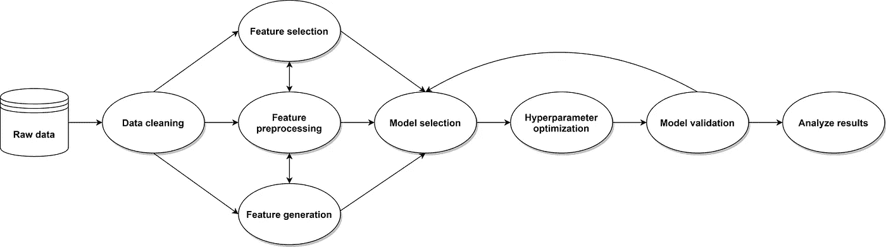

# ATOM:一个用于快速探索机器学习管道的 Python 包

> 原文：<https://towardsdatascience.com/atom-a-python-package-for-fast-exploration-of-machine-learning-pipelines-653956a16e7b?source=collection_archive---------12----------------------->


照片由[迈克·本纳](https://unsplash.com/@mbenna?utm_source=medium&utm_medium=referral)在 [Unsplash](https://unsplash.com?utm_source=medium&utm_medium=referral) 上拍摄

优化建模自动化工具(ATOM)是一个开源的 Python 包，旨在帮助数据科学家对受监督的机器学习管道进行快速探索和实验。

# 介绍

在项目的探索阶段，数据科学家试图为他的特定用例找到最佳的管道。这通常包括应用标准的数据清理步骤、创建或选择有用的特性、尝试不同的模型等。测试多个管道需要许多行代码，将所有代码都写在同一个笔记本上通常会使代码变得冗长而混乱。另一方面，使用多台笔记本电脑会增加比较结果和保持概览的难度。最重要的是，为每个测试重构代码可能会很耗时。您执行过多少次相同的操作来预处理原始数据集？有多少次你从一个旧的存储库中复制并粘贴代码，以便在一个新的用例中重用它？

ATOM 旨在帮助解决这些常见问题。该包充当整个机器学习管道的包装器，帮助数据科学家快速找到解决其问题的好模型。避免无休止的导入和文档查找。避免反复重写相同的代码。只需几行代码，现在就可以执行基本的数据清理步骤，选择相关功能，并在给定数据集上比较多个模型的性能，从而快速了解哪种管道最适合当前任务。



原子可能采取的步骤示意图。

# 装置

通过`pip`轻松安装 ATOM 的最新版本:

`$ pip install -U atom-ml`

或者通过`conda`:

`$ conda install -c conda-forge atom-ml`

# 使用

理解软件包能为您做什么的最简单的方法是通过一个例子。在本例中，我们将:

*   加载数据集。我们将要使用的数据是来自 Kaggle 的[澳大利亚天气数据集](https://www.kaggle.com/jsphyg/weather-dataset-rattle-package)的变体。可以从[这里](https://github.com/tvdboom/ATOM/blob/master/examples/datasets/weatherAUS.csv)下载。这个数据集的目标是预测明天是否会下雨，在目标列`RainTomorrow`上训练一个二元分类器。
*   分析要素的分布
*   估算缺失值
*   对分类列进行编码
*   对数据进行逻辑回归和随机森林模型拟合
*   比较两种模型的性能

我们将用不到 15 行代码完成所有这些工作！让我们开始吧。

**加载数据集**

我们开始从 csv 文件加载数据。

```
import pandas as pdX = pd.read_csv("weatherAUS.csv")
X.head()
```


ATOM 有两个主要的类，用于初始化管道:

*   ATOMClassifier:用于二进制或多类分类任务。
*   ATOMRegressor:用于回归任务。

对于这个例子，我们使用 ATOMClassifier。这里，我们用加载的数据集初始化一个 atom 实例。

```
from atom import ATOMClassifieratom = ATOMClassifier(X, y="RainTomorrow", test_size=0.3, verbose=2)
```

此外，我们指定 atom 应该以 70%-30%的比率分离训练和测试集中的数据集。

```
<< ================== ATOM ================== >>
Algorithm task: binary classification.

Dataset stats ====================== >>
Shape: (142193, 22)
Scaled: False
Missing values: 316559 (10.1%)
Categorical features: 5 (23.8%)
Duplicate samples: 45 (0.0%)
---------------------------------------
Train set size: 99536
Test set size: 42657
---------------------------------------
|    | dataset      | train       | test        |
|---:|:-------------|:------------|:------------|
|  0 | 110316 (3.5) | 77205 (3.5) | 33111 (3.5) |
|  1 | 31877 (1.0)  | 22331 (1.0) | 9546 (1.0)  |
```

我们收到的输出是数据集的简短摘要。我们可以立即看到数据集中缺少值和分类列。

**分析数据集**

将数据集加载到 atom 实例后，我们就可以开始分析它了。ATOM 为此提供了各种情节和方法。例如，为了绘制特征相关矩阵，我们可以键入。

`atom.plot_correlation()`


请注意，该图会自动忽略分类列。我们还可以使用[Kolmogorov–Smirnov](https://en.wikipedia.org/wiki/Kolmogorov%E2%80%93Smirnov_test)测试来调查特性的分布。

`atom.distribution("Temp3pm")`

```
 ks  p_value
weibull_max  0.0173   0.0053
beta         0.0178   0.0036
pearson3     0.0215   0.0002
gamma        0.0216   0.0002
lognorm      0.0217   0.0002
norm         0.0230   0.0001
invgauss     0.0649   0.0000
triang       0.0696   0.0000
uniform      0.1943   0.0000
expon        0.3376   0.0000
weibull_min  0.7675   0.0000
```

让我们绘制特征分布图，看看它是否确实符合*威布尔 _ 最大值*分布。

`atom.plot_distribution("Temp3pm", distribution="weibull_max")`


**数据清理**

既然我们已经了解了如何使用包来快速分析数据集，我们可以继续清理它。既然 sklearn 模型不接受缺失值，我们就应该去掉它们。我们可以使用 atom 的 impute 方法做到这一点。

`atom.impute(strat_num="median", strat_cat="most_frequent")`

所选择的参数规定，对于数字特征，我们用列的中位数进行估算，对于分类特征，我们用列的最频繁值(众数)进行估算。将数据集作为实例的一部分的好处之一是，我们不需要调用 fit 或 transform。基础转换器将自动适应定型集，并转换整个数据集。

```
Fitting Imputer...
Imputing missing values...
 --> Dropping 702 samples for containing less than 50% non-missing values.
 --> Imputing 351 missing values with median (12.0) in feature MinTemp.
 --> Imputing 169 missing values with median (22.6) in feature MaxTemp.
 --> Imputing 1285 missing values with median (0.0) in feature Rainfall.
 --> Imputing 60160 missing values with median (4.8) in feature Evaporation.
 --> Imputing 67131 missing values with median (8.5) in feature Sunshine.
 --> Imputing 8667 missing values with most_frequent (W) in feature WindGustDir.
 --> Imputing 8609 missing values with median (39.0) in feature WindGustSpeed.
 --> Imputing 9402 missing values with most_frequent (N) in feature WindDir9am.
 --> Imputing 3106 missing values with most_frequent (SE) in feature WindDir3pm.
 --> Imputing 2096 missing values with median (21.1) in feature Temp3pm.
 --> Imputing 1285 missing values with most_frequent (No) in feature RainToday.
```

为了对分类列进行编码，我们使用 atom 的编码方法。我们可以从[类别编码器](https://contrib.scikit-learn.org/category_encoders/)包中选择任何估计器来进行转换。

`atom.encode(strategy="LeaveOneOut")`

```
Fitting Encoder...
Encoding categorical columns...
 --> LeaveOneOut-encoding feature Location. Contains 49 classes.
 --> LeaveOneOut-encoding feature WindGustDir. Contains 16 classes.
 --> LeaveOneOut-encoding feature WindDir9am. Contains 16 classes.
 --> LeaveOneOut-encoding feature WindDir3pm. Contains 16 classes.
 --> Ordinal-encoding feature RainToday. Contains 2 classes.
```

就这样，所有缺失值都被估算，分类特征用数值编码。atom 管道中的数据可以通过`dataset`属性随时访问。

`atom.dataset.head()`


**模特培训**

既然数据集已经清理完毕，我们就可以开始拟合模型了。在这个例子中，我们将评估一个[逻辑回归](https://en.wikipedia.org/wiki/Logistic_regression)和一个[随机森林](https://en.wikipedia.org/wiki/Random_forest)模型在分类问题上的表现。所有可用的型号及其相应的缩写可在[文档](https://tvdboom.github.io/ATOM/user_guide/#models)中找到。同样，一个简单的命令就足够了。

`atom.run(models=["LR", "RF"], metric="f1")`

**注意:**这是一个极简的例子。此外，还可以指定模型参数、使用多个指标、执行超参数调整和训练定制模型。详见[文件](https://tvdboom.github.io/ATOM/user_guide/#training)。

```
Training ===================================== >>
Models: LR, RF
Metric: f1 Results for Logistic Regression:         
Fit ---------------------------------------------
Train evaluation --> f1: 0.4716
Test evaluation --> f1: 0.4658
Time elapsed: 0.201s
-------------------------------------------------
Total time: 0.201s Results for Random Forest:         
Fit ---------------------------------------------
Train evaluation --> f1: 0.9999
Test evaluation --> f1: 0.5434
Time elapsed: 14.976s
-------------------------------------------------
Total time: 14.976s Final results ========================= >>
Duration: 15.177s
------------------------------------------
Logistic Regression --> f1: 0.4658
Random Forest       --> f1: 0.5434
```

这里发生了几件事。使用所提供的度量，在训练集上训练这两个模型，并在测试集上评估这两个模型。然后，为每个模型创建一个对象，并作为属性附加到`atom`实例。它们通过模型的首字母缩略词(如随机森林模型的`atom.RF`)来调用，并可用于进一步分析结果。

**评估结果**

最后，我们想要比较模型的性能。为了分析单个模型，我们使用前面提到的 model 子类。例如，为了检查随机森林的特征重要性，我们键入。

`atom.RF.plot_feature_importance(show=10)`


用于拟合数据的实际估算器(来自 [scikit-learn](https://scikit-learn.org/stable/) 包)，可通过模型的`estimator`属性访问。

`atom.RF.estimator`

```
RandomForestClassifier(n_jobs=1)
```

但 ATOM 的真正强大之处在于，我们可以轻松地比较其管道中所有模型的性能。例如，通过绘制 [ROC 曲线](https://en.wikipedia.org/wiki/Receiver_operating_characteristic)。

`atom.plot_roc()`


或者评估他们在多个指标上的表现。

`atom.evaluate()`


# 结论

ATOM 在机器学习项目的探索阶段协助数据科学家。它能够分析数据，应用标准的数据清理步骤，并在几行代码中比较多个模型的性能。但这还不是全部！ATOM 还可以帮助机器学习中的其他常见任务，例如:

*   检测并移除异常值
*   处理不平衡的数据集
*   比较在不同管道上训练的模型
*   执行超参数调谐
*   使用集成技术组合模型
*   还有更多…

欲了解更多信息，请查看该项目的 [GitHub](https://github.com/tvdboom/ATOM) 或[文档](https://tvdboom.github.io/ATOM/)页面。对于 bug 或特性请求，请不要犹豫，在 GitHub 上打开问题或给我发电子邮件。