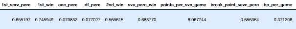
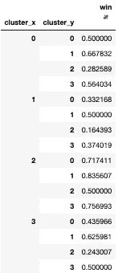
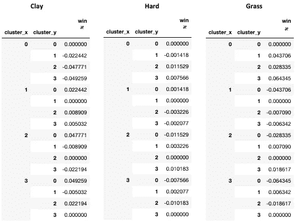

# ATP 网球聚类分析

> 原文：<https://towardsdatascience.com/atp-tennis-cluster-analysis-91bbcce61595?source=collection_archive---------25----------------------->

## 利用聚类分析分割网球运动风格

瑞安·塞尔在 [Unsplash](https://unsplash.com/s/photos/tennis?utm_source=unsplash&utm_medium=referral&utm_content=creditCopyText) 上的照片

近年来，几乎所有的运动都是分析革命的一部分。《Moneyball》是奥克兰运动家队总经理比利·比恩的故事，他开创了一种数学方法来进行球探，随着这部电影进入公众视野，分析已经广泛传播到各种体育运动中:三分革命的篮球，迈克尔·洛佩兹(Michael Lopez)举办的“大数据碗”等活动的足球，甚至是英超联赛，利物浦在分析方面成为联盟领导者，帮助利物浦夺得联盟冠军。棒球是这项运动的自然起点，因为它的特点是 1 对 1 的比赛，投手对击球手，这使得量化个人价值和分离队友的积极和消极影响更加容易。人们可能会认为类似的创新也发生在网球上，这是另一项以 1 对 1 互动为特征的游戏，然而，网球在分析方面远远落后于其他运动。网球迷最近接触到的唯一先进的分析方法是 IBM Watson 的“比赛关键”,它强调了每个球员确保胜利的最重要的统计数据，可能来自基于树的方法。网球分析在公共领域的进步可以完全归功于杰夫·萨克曼，网球分析的比尔·詹姆斯。

萨克曼多年来孜孜不倦地收集比赛统计数据，使用定制的编码程序绘制比赛图表，并在 GitHub 和他的网站 Tennis Abstract 上发布数据集。此外，当诺瓦克·德约科维奇将宣扬数据在这项运动中的价值的策略教练克雷格·奥肖内西(Craig O'Shaughnessy)加入他的团队时，他给了那些过去追求网球分析激情项目的人一个象征性的推动。像其他涉及一对一比赛的游戏一样，ELO 分数被用来寻找玩家的相对实力。然而，许多参加过网球比赛的人都知道，网球是一项受比赛独特影响的运动。作为一名 6 英尺 7 英寸的大个子发球手，我在大学里打过网球，我讨厌遇到一个身材较小的“磨工”，他站在底线后面，打尽可能多的球，但不打算获胜。我假设，通过萨克曼的数据集和 K-Means 聚类分析，我将能够找到表征网球运动的不同风格的模式，并最终得出哪些聚类比其对手更有优势的结论。

萨克曼的基本“盒子得分”数据集为每场比赛提供了一个单独的行，最早可以追溯到 1968 年。我选择从 2011 年开始分析文件，作为一个相对随意的起点，但也是为了保持分析的相关性，因为游戏在过去 20 年里发生了重大变化。统计数据提供了每场比赛的基本情况，包括得分、第一发球权、双误等。该数据集不提供任何对打指标，如对打长度，该点是否是在赢家身上赢得的，强迫或非强迫失误，或是否是在网上赢得的。然而，基本的统计数据，如第一发球的百分比，发球得分的百分比，回球得分的百分比，可以让我们了解每个球员的比赛风格和相对实力。在将数据加载到 Python 中之后，我删除了任何相关统计数据的空值行。接下来，我为每个匹配创建了两行。第一行包含获胜者的统计数据，带有 Sackman 为获胜者提供的唯一 id，第二行将遵循相同的过程，但针对失败者。这一步是必要的，有两个原因，首先，统计数据是由赢家和输家组织的(即 w_ace 是胜利者 ace 的列，l_ace 是失败者 ace 的列),所以为了获得每个球员的统计数据，我必须创建单独的映射来对应他们在比赛中的统计数据，而不管结果如何。其次，我必须按日期和每个球员的 ID 进行排序，以便计算累计总数，然后用于计算统计数据，如每场比赛后的第一发球百分比。为了让你对数据有一个感觉，下面是德约科维奇在 ATP 巡回赛决赛对阵多米尼克·蒂姆的最后一场比赛后的职业生涯发球统计截图。

诺瓦克·德约科维奇在对阵多米尼克·蒂姆时的职业统计(2020 年 11 月 21 日)

我对每位玩家的复赛计算了相同的统计数据，以及总的统计数据，如所有获胜点数的百分比和每分钟点数，因为我认为这可能与对打长度相关(如上所述，这不在数据中)。令人惊讶的是，即使像诺瓦克·德约科维奇这样的球员也只赢得 55%的分数，这表明最佳球员和一般球员之间的差距相对较小，一般球员根据定义会赢得 50%的分数。这意味着 1%的改进对许多玩家来说可能是几十万美元的差别。

接下来，我利用 Scikit-Learn 的预处理库来标准化数据，然后将它提供给 Scikit-Learn 中的小批量集群功能。我尝试了不同的集群大小，从 2 到 10 不等，同时在图中寻找“肘部”(看起来有 4 个集群)。“肘”方法是一种非常主观的最佳集群度量方法，但对我的分析来说已经足够了(如果您需要对集群进行调整，请在这里检查)。

聚类的魔力又一次得到了回报，我能够在数据中找到四种不同的演奏风格。第一类的特征是最高的 ace 百分比、最高的个体和最高的第一发球获胜概率。他们赢得了大约 50%的分数，在硬地和草地球场打了最多的比赛，这是意料之中的。下一个集群似乎将平庸的玩家聚集在一起。从百分比来看，他们赢得的分数最少，在所有表面上的比赛分布比较均匀，赢得的比赛最少(38%)。虽然这是最大的群体，但球员在数据集中平均参加的比赛最少，这可能意味着这些球员往返于挑战者巡回赛和职业巡回赛之间，他们一直在努力做大。如果我选择增加集群大小，我想这个组将在更细粒度的级别上被分解。接下来，我们有了“全能选手”，这实质上是网球界对最佳个人选手的另一种说法。像费德勒、纳达尔和德约科维奇这样的球员很可能在这个组中，因为这个群体集体赢得了他们 53%的分数，每场比赛放弃了最少的破发点机会，并在第二次发球时赢得了最多的分数。最后，我们有红土场研磨机。他们有 37%的比赛是在红土上进行的，最高的是 5%，第一次发球的百分比和得分最低，但通过在回球时每场比赛创造最多的破发点来弥补这一点。下面是每个集群的各种汇总统计信息的详细图表。

根据我能够捕获的信息，汇总每个集群的统计信息

接下来，我检查了每个团队在总体上以及在不同表面上的不同胜率。

集群 X 对集群 Y 的胜率

集群 2，“全能选手”对所有参赛选手都是最公平的，我对玩研磨机的恐惧是不合理的，因为大型服务器实际上赢得了他们对集群 3 对手的 56%的比赛。同样有趣的是，在第 0 组中，“大人物”比其他组更有可能颠覆第 2 组。直觉上，这是有道理的，因为我们已经看到像约翰·伊斯内尔或凯文·安德森这样的球员在锦标赛中变得'热'，他们的力量似乎对任何人都太大了。另一方面，那些通常无法压倒对手而不得不依靠战术的磨炼者在结果上更加一致。下面是对应于硬地、红土和草地的图表，每组相对于总胜率的相对优势(特定场地胜率%-总胜率%)，这也进一步说明了大发球者在硬地和草地球场上的专业知识以及研磨者在红土上的熟练程度。

图表可以被解读为在上述表面上集群 X 相对于集群 Y 的提高或降低的胜率

虽然这是一个起点，但 Jeff Sackman 还公布了 2011 年以来大满贯赛事的逐点数据，这些数据将进一步深入了解拉力赛指标，有望进一步将集群分为更具进攻性和净思维的群体，以及那些从基线拉力赛 10+杆的内容。在接下来的几周里，请在第 2 部分中寻找答案。

1.  布鲁斯·舍恩菲尔德。数据(和一些激动人心的足球)如何将利物浦带到荣耀的风口浪尖。[https://www . nytimes . com/2019/05/22/magazine/soccer-data-Liverpool . html](https://www.nytimes.com/2019/05/22/magazine/soccer-data-liverpool.html)
2.  萨克曼杰夫。Gitbub 主页。【https://github.com/JeffSackmann 
3.  网球摘要 Elo 评分。[http://tennisabstract.com/reports/atp_elo_ratings.html](http://tennisabstract.com/reports/atp_elo_ratings.html)
4.  萨克曼杰夫。*衡量断点的影响。*[http://www . tennis abstract . com/blog/2019/01/04/measuring-the-impact-of-break-points/](http://www.tennisabstract.com/blog/2019/01/04/measuring-the-impact-of-break-points/)