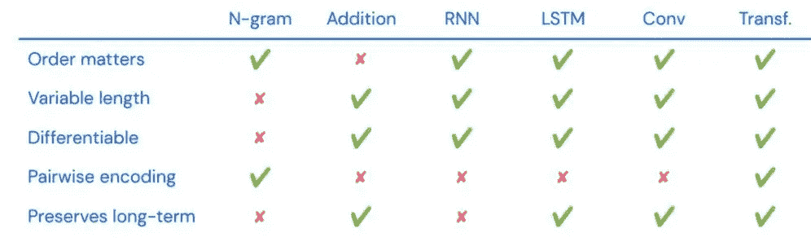
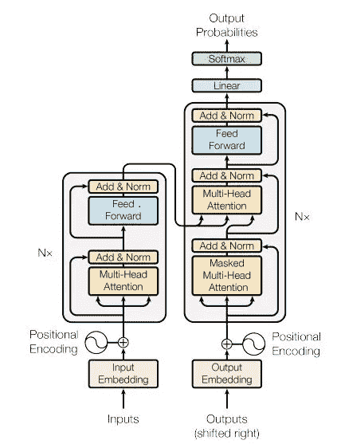
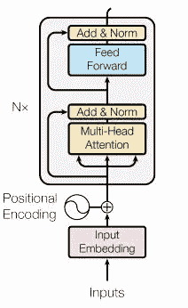
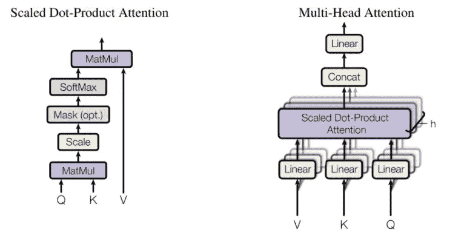
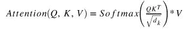
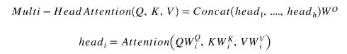
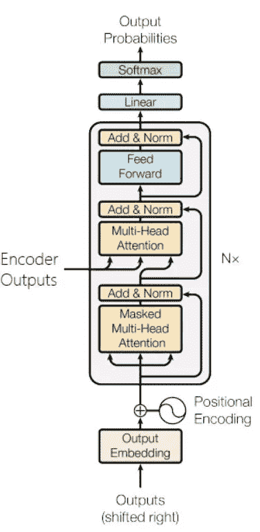

# 全神贯注

> 原文：<https://towardsdatascience.com/attending-to-attention-eba798f0e940?source=collection_archive---------12----------------------->

## 一篇革命性论文“注意力是你所需要的”的摘要和使用 PyTorch 实现转换器

文森特·梵高*带灰色毡帽的自画像*，1887/88 年冬。([来源](https://en.wikipedia.org/wiki/Portraits_of_Vincent_van_Gogh))

我成为机器学习工程师已经快 4 年了，我从现在所谓的“经典模型”，逻辑，基于树，贝叶斯等开始，从去年开始进入神经网络和深度学习。我会说我做得很好，直到我的注意力集中在“注意”上。我试着通过教程、讲座、指南来阅读，但没有什么能完全帮助我抓住核心思想。

所以我决定是时候正面面对公牛了，坐下来看了 arxiv 的论文，通过 Python 和 PyTorch 写了我的 [*实现*](https://github.com/akash-agni/ReadThePaper) 。这帮助我充分理解了核心概念。现在，正如他们所说，检查你的学习的最好方法是试着向别人解释，所以在这里我试着把我学到的东西分解。

# 历史

NLP 设计之间的比较[来源](https://deepmind.com/learning-resources/deep-learning-lecture-series-2020)

要理解为什么变形金刚在今天被大肆宣传，我们必须理解在它出现之前发生了什么。主导方法是使用 LSTM 或 GRU 等递归神经网络来实现序列到序列模型，其中编码器用于创建包含源序列所有信息的上下文向量，然后解码器将使用该上下文向量来逐序列生成新的令牌。

如上表所示，这种方法的问题是它不能将成对编码编码到上下文向量中。这意味着，当我们需要查看序列中的多个标记来预测时，基于 RNN 的模型做得不好，因为它们不能编码成对的关系。

# 体系结构

变压器的架构([来源](https://arxiv.org/abs/1706.03762))

2016 年 12 月，谷歌大脑团队提出了一种新的方法来模拟序列，这种方法在他们的论文[中提出，注意力是你所需要的全部](https://arxiv.org/abs/1706.03762)。随着大多数语言模型使用这种方法，包括一些业界最喜欢的方法，如 BERT 和 GPT-2，本文的影响还在继续

转换器设计由编码器和解码器组成，两者都包括多头注意模块和前馈模块，模型使用残差连接来连接结果并归一化以改进训练。然后，对于编码器和解码器，注意模块和前馈模块的子层重复 N 次。

## 编码器

编码器架构([来源](https://arxiv.org/pdf/1706.03762.pdf))

> 编码器由 N = 6 个相同层的堆叠组成。每层有两个子层。第一个是**多头自关注**机制，第二个是简单的**位置式全连接前馈网络**。我们在两个子层的每一个周围使用剩余连接，然后进行层归一化。即每个子层的输出是 LayerNorm(x + Sublayer(x))，其中 Sublayer(x)是子层本身实现的函数。为了促进这些剩余连接，模型中的所有子层以及嵌入层产生维度 512 的输出。([来源](https://arxiv.org/pdf/1706.03762.pdf))

输入令牌通过令牌嵌入层，由于模型不使用递归层，因此它使用位置嵌入来获取令牌的位置信息，这两者相加在一起。位置嵌入层不关心标记，而是关心标记的位置。来自令牌嵌入和位置嵌入的结果被逐元素地求和，然后通过模型的隐藏维度的平方根来缩放所得到的向量。

进行缩放是为了减少嵌入向量中的方差，因为这使得模型难以训练。该丢失被应用于最终的嵌入向量。然后通过 N 个编码层应用嵌入向量，以获得解码器使用的最终上下文向量。源掩码类似于源向量，当标记不是<pad>时包含 1，否则包含 0，这样做是为了避免注意力层聚焦在填充标记上。</pad>

首先，嵌入向量通过多头关注层，结果连同剩余连接被逐元素求和并通过层归一化。多头注意力作为**键**、**值、**和**查询**传递给源句子(稍后将详细介绍)，这样做是为了让注意力网络关注源句子本身，因此得名**自我注意力**。

然后，产生的向量通过位置前馈网络，并与归一化层及其剩余连接一起传递。然后，结果被传递到下一层。

# 注意力

在这篇论文出现之前，注意力就已经在使用了，但是它在这里的实现方式对它的成功和广泛采用至关重要。这种体系结构不是作为增强上下文向量的支持模块，而是在其核心作为专家系统使用它。

注意机制([来源](https://arxiv.org/pdf/1706.03762.pdf)

## 单点产品注意

单个注意头取 3 个值作为输入，即查询(Q)、键(K)和值(V)。人们可以把注意力看作是将给定查询映射到键-值对的函数，相应的结果可以看作是描述哪个键-值对查询更重要的加权值。然后，将该值传递给 softmax 函数，以获得归一化权重，然后与值进行点积。

## 多头注意力

我们将维度划分为 *h* 组件，而不是通过单个点积注意力来应用查询、键和值。计算是并行进行的，然后将结果连接起来得到最终结果。这允许模型一起学习多个概念，而不是集中在单个概念上。

帮助我理解这一点的一个类比是这样的。想象一个由专家组成的房间，我们目前不知道谁是哪个主题的专家，所以我们将一个问题传入房间，并从每个专家那里获得结果，每个专家有一个置信概率。现在，最初每个专家对任何和每个主题都有相同的置信度得分。但是当我们反向传播和学习例子时，我们会发现哪个专家的回答对哪个主题更有用。

例如，当我提出一个关于汽车的问题时，每个专家都会提供他们的建议，但随着时间的推移，我们知道谁的答案对这个主题更有用，同样，其他一些专家对其他主题也有用。在这个例子中，单点产品注意力是专家，我们的多头注意力层是充满专家的房间，我们的查询、键和值是我们提出的问题。

# 解码器

解码器架构([来源](https://arxiv.org/pdf/1706.03762.pdf))

解码器的工作方式类似于编码器，并对目标令牌而不是源令牌使用注意机制。除了它有两个多头注意力层的部分。第一种使用目标嵌入，第二种使用编码器输出作为键值对，前面的层输出作为查询。

在解码器模块之前，我们通过标准嵌入传递目标，并使用位置编码嵌入执行元素求和，这些执行与编码器中类似的工作。然后，结果通过 N 个解码器层，这里要注意的一点是，论文从未规定编码器和解码器中的层数必须相同。

解码器层由两个*多头关注*层组成，一个*自关注*，另一个*编码器关注*。第一个将目标令牌作为查询和键值对并执行自关注，而另一个将*自关注*层的输出作为查询，将*编码器输出*作为键值对。

第一个注意模块使用目标序列掩码，这样做是为了防止模型能够在我们并行处理所有令牌时看到序列中的下一个令牌。第二关注层使用自关注层的输出作为查询，编码器输出作为键值对，该模块还提供有源掩码，这样做是为了防止模型关注<pad>令牌。</pad>

两个多头注意力层之后是剩余连接和丢弃层，其被馈送到层标准化模块。然后，将结果作为位置前馈网络和另一组残差连接和层归一化模块传递。然后，将结果传递到下一层。

# 结论

理解这篇论文让我理解了最近出版的新变形金刚，如伯特，罗伯塔，GPT-3 等。这也让我有信心自己去阅读和实现更多的论文。我希望这是对你有用的完整阅读。如果我有任何错误，请告诉我，因为这将有助于我提高对这个概念的理解。

希望你喜欢这篇文章。

> 你可以在我的 [*GitHub*](https://github.com/akash-agni/ReadThePaper/blob/main/Attention%20Is%20All%20You%20Need.ipynb) 上找到实现
> 
> 可以关注我 [*Linkedin*](http://www.linkedin.com/in/agni25)
> 
> 你可以在 [*中*](https://agniakash25.medium.com/) 上阅读我的其他文章