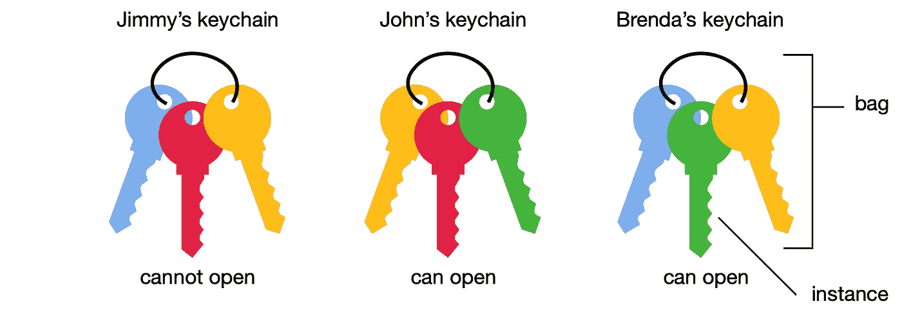
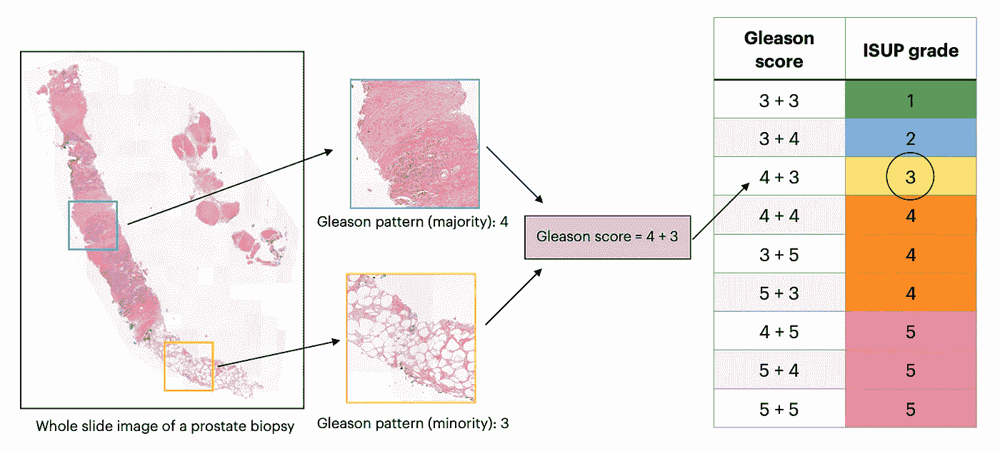
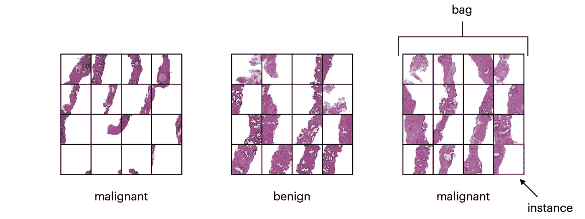
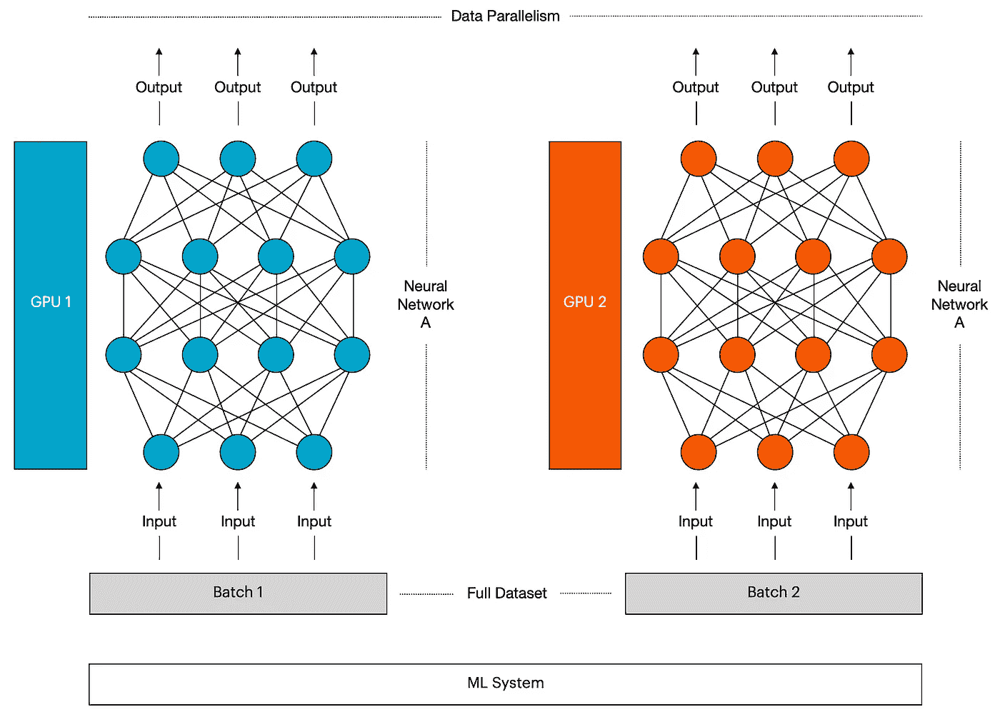

# 基于注意力的深度多示例学习

> 原文：<https://towardsdatascience.com/attention-based-deep-multiple-instance-learning-1bb3df857e24?source=collection_archive---------5----------------------->

## *使用 PyTorch 和 AWS SageMaker 数据并行进行前列腺癌诊断*

# 介绍

该帖子由以下部分组成:

[**第 1 部分**](#7081) 概述了为什么人工智能被定位于改变医疗保健行业。

[**第 2 部分**](#e163) 解释了一种称为多实例学习的机器学习技术，以及它为什么适合病理学应用。

这些作为 [**第 3 部分**](#8935) 的基础，概述了使用 PyTorch 和 AWS SageMaker 的数据并行工具包实现基于注意力的深度多实例学习模型用于前列腺癌诊断。

这篇文章的节略版已经发表在[今日](https://www.captodayonline.com)美国病理学家学会 2021 年 11 月刊上:[见此](https://www.captodayonline.com/newsbytes-1121/)。

# 第 1 部分—为什么人工智能定位于改变医疗保健行业

在深入研究代码之前，让我们后退一步，考虑一下为什么人工智能被定位于改变医疗保健。

人工智能今天的势头很大程度上可以归功于深度神经网络的成功，如果没有以下四种驱动力的完美风暴，这是不可能的:

1.  越来越多的大规模数据集可用，例如 ImageNet 的 1500 万张带标签的图像，脸书的数十亿张图像库，YouTube 的视频库，每分钟增加 300 小时的视频，以及 Tesla 的驾驶数据集合，每小时增加 100 万英里的数据。
2.  图形处理单元(GPU)的使用，以及后来更多的称为张量处理单元(TPU)的人工智能专用硬件，这些硬件针对训练深度学习模型进行了优化。TPU 由许多内核组成，这使它们能够处理大量数据并并行执行多个计算。OpenAI 在 2018 年的一份报告中提出，在 2012 年之前，人工智能计算的增长密切遵循摩尔定律，每两年翻一倍，而在 2012 年之后，计算每三到四个月翻一倍。总体而言，自 2012 年以来，这一计算指标已经增长了 300，000 多倍，而两年的翻倍期只会产生 16 倍的增长。
3.  云计算的可用性使得存储大型数据集并使用它们来训练模型的能力变得更加容易获得和经济。
4.  开源算法开发模块，如脸书的 PyTorch、谷歌的 TensorFlow、微软的 Cognitive Kit 等。

这种蓬勃发展的丰富资源推动了人工智能的快速发展，而此时医生们比以往任何时候都更加不知所措。在美国，尽管医疗保健从业人员的数量从 1975 年的 400 万增加到今天的 1600 万，但是新患者就诊的平均就诊时间已经从 1975 年的 60 分钟下降到今天的 12 分钟。除了面对不断增长的人口，医生还越来越多地被电子健康记录、管理式医疗、健康维护组织和相对价值单位所淹没，这转移了他们与患者建立有意义关系的注意力。与病人脱节的精疲力竭的医生更有可能做出带有认知偏见的判断。结果，他们条件反射性地安排不正确的测试，并随后曲解它们，导致误诊。2014 年的一项审查得出结论，美国每年面临大约 1200 万例误诊。

正如斯克里普斯研究转化研究所(Scripps Research Translational Institute)创始人兼主任埃里克·托普(Eric Schmidt)等医学博士所断言的那样，人工智能令人兴奋的前景在于使用相关患者数据的深度和全面收集，以改善决策，减少误诊和不必要的程序，指导测试的选择和解释，并推荐最安全的治疗方案。然而，医疗保健在多大程度上融入了人工智能，需要受到该行业对临床医生和患者之间的同理心和联系的内在需求的影响。医生给病人一种道德观念和核心价值观，这两者都是计算机无法复制的。有人断言，人工智能将很快变得足够复杂，足以导致其他行业的完全自动化，这引发了医疗专业人士的担忧，即人类参与医学是否将成为过去。然而，人工智能导致医学完全自动化的可能性仍然很遥远。那些参与人工智能的人有时间在医生和机器之间取得正确的平衡。

一个适当的平衡可能涉及到一个扮演数字助理角色的人工智能系统，它向医生发出最可能的诊断和最佳行动方案的警报，并让医生负责做出最终决定。“人在回路中”的方法符合弗里德曼的基本定理，即人类与计算机合作将永远优于人类单独工作，并保证了算法如何达到特定预测的透明度。⁴可解释人工智能是一套提供这种洞察力的流程或方法，对于在依赖人工智能系统的人之间建立信任，同时确保准确性、公平性和符合监管标准至关重要。可解释性为临床医生提供了质量控制和制衡，并可以帮助他们对依靠算法做出最终诊断更加自信。

稳健的模型需要开发出令人满意的可解释水平。但是如果做得正确，由此增加的工作流程和效率可以为临床医生提供更多的时间与患者联系。矛盾的是，机器的兴起可以恢复医学中的人性，并允许医学专业人员重新接触到他们最初追求医学生涯的动机。

# **第二部分——病理学中的人工智能**

人工智能在医疗保健领域最有效的应用之一是医学成像。放射学、病理学和皮肤病学是依赖于视觉模式分析的专业，因此，由于与人工智能的集成，它们将经历快速而戏剧性的转变。

病理学家在癌症诊断中发挥着至关重要的作用，他们的报告有助于指导患者的治疗策略。通常，病理学家在显微镜下观察苏木精和伊红(H&E)染色的组织样本，并描述他们看到的细胞类型，它们是如何排列的，它们是否异常，以及任何其他对诊断重要的特征。一个世纪以来，使用显微镜检查含有组织样本的载玻片的做法基本上没有改变。然而，近年来，越来越多地使用数字载玻片扫描仪来数字化载玻片，以产生可以在计算机上检查的完整载玻片图像(WSIs)。然而，病理学家在采用 WSIs 和其他数字技术方面进展缓慢，这导致人工智能对病理学的入侵比预期的要慢。然而，WSIs 为将神经网络图像处理纳入病理学奠定了基础，从而使该领域的新人工智能辅助时代即将到来。


[国家癌症研究所](https://unsplash.com/@nci?utm_source=medium&utm_medium=referral)在 [Unsplash](https://unsplash.com?utm_source=medium&utm_medium=referral) 上拍摄的照片

人工智能可用于执行通常由病理学家执行的常规工作流程，例如检测活检样本中的肿瘤组织，并根据形态学确定肿瘤亚型，从而提高效率和准确性。AI 在病理学方面的一个重要里程碑是 CAMELYON16 挑战，该挑战设定了开发算法的目标，以在淋巴结活检的 WSIs 中检测转移性乳腺癌。提供的数据集由 400 个 WSI 组成，病理学家在其中人工圈定转移癌的区域，是最大的标记病理数据集之一。这使得提交排名第一的团队(其算法表现与病理学家不相上下)能够利用监督学习。⁶

一般来说，监督学习是一种机器学习方法，其中向算法显示许多输入数据及其相应输出标签的序列，直到它可以检测到揭示这些输入和输出之间关系的潜在模式。这种技术允许它准确地标记以前没有见过的数据，并可用于分类(将输入分类到给定数量的类别中)或回归(给定输入，预测目标数值)任务。

监督学习的一个主要缺点是，它通常需要训练数据集由领域专家手工标记。在处理 WSIs 时尤其如此:就规模而言，大约 470 幅病理图像包含的像素数量与整个 ImageNet 数据集大致相同。此外，尽管 CAMELYON16 数据集是病理学中最大的数据集之一，但 400 个 WSI 不足以捕获临床中定期出现的各种病例。因此，获得一个适当大的数据集将是非常昂贵和耗时的，该数据集的数十亿像素的处理对于训练来说也是计算要求很高的。因此，在病理学中设计日常使用的监督学习模型是非常不切实际的。⁷

## **多实例学习(MIL)及其对病理学应用的适用性**

MIL 是监督学习的一种变体，更适合于病理学应用。该技术包括为一组输入分配一个类标签——在这种情况下，称为实例包。虽然假设包中的每个实例都有标签，但是无法访问这些标签，并且它们在训练期间是未知的。如果行李中的所有实例都是阴性，则通常将行李标记为阴性；如果至少有一个阳性实例，则标记为阳性(称为标准 MIL 假设)。下图显示了一个简单的例子，在这个例子中，我们只知道一个钥匙串是否包含可以打开给定门的钥匙。这让我们可以推断绿色钥匙可以开门。



使用钥匙链的多实例学习的简化说明(作者提供的图片——灵感来自[ [来源](https://www.youtube.com/watch?v=pizZ2fzyYeA&t=163s))

MIL 公式自然适合基于成像的患者诊断的任务:类似于标准 MIL 假设，患病组织样本具有异常和健康区域，而健康组织样本仅具有健康区域。因此，可以将 WSIs 划分为多个区块，其中每个区块集合可以被标记为“恶性”或“患病”这些弱标记比强标记(即，由专家手动提供的患病区域的轮廓)更容易获得，因此将病理学家从必须自己注释 WSI 的艰苦任务中解救出来。MIL 模型也可以被制作成高度可解释的，这迎合了前面讨论的人工智能系统在医疗保健中的可解释性要求。⁸

此外，在病理学中使用 MIL 的一个特别令人兴奋的部分是，它可以集成到深度学习模型中，该模型允许创建一个平滑的端到端管道，其中 WSI 作为输入输入，诊断作为输出返回。作为副产品，深度加工模型可以从 WSIs 中自动发现新的抽象特征，这些特征在确定存活率、治疗反应和遗传缺陷方面比传统特征表现得更好。值得注意的是，可以直接从病理学实验室容易获得的 H&E 载玻片中获得这些见解，而不是进行可能昂贵的额外测试。⁹深磨形成了[佩奇的基础。美国食品和药物管理局于 2021 年 9 月授权使用的 AI 公司前列腺癌软件](https://www.wsj.com/articles/fda-authorizes-ai-software-designed-to-help-spot-prostate-cancer-11632780683)。⁰

# 第 3 部分——使用 PyTorch 和 AWS SageMaker 的数据并行性工具包实现前列腺癌诊断的基于注意力的深度密值模型

在我的[上一篇文章](https://jmg764.medium.com/an-introduction-to-deep-multiple-instance-learning-4a8bdcddb77)中，我进一步讨论了将 MIL 公式化为深度学习问题的优点。我还概述了在[基于注意力的深度多示例学习](https://arxiv.org/abs/1802.04712) (Ilse 等人)中描述的模型的数学基础，该模型允许使用深度密耳进行 WSI 分类。⁸该模型使用了注意力机制的修改版本作为其聚合运算符，这比依赖于典型聚合运算符(如均值和最大值)的模型具有更大程度的可解释性。换句话说，这种基于注意力的 MIL 汇集算子提供了对每个实例对预测的包标签的贡献的洞察。

在这里，我们使用[前列腺癌等级评估(PANDA) Kaggle 挑战赛](https://www.kaggle.com/c/prostate-cancer-grade-assessment)中提供的数据集，包含 11，000 个数字化 H & E 染色前列腺活检的 WSI，来训练一个基于注意力的深度 MIL 模型，以根据 Ilse 等人的方法来诊断前列腺癌。目标是概述如何使用 PyTorch 和 AWS SageMaker 的数据并行工具包来实现这一点。

## 资料组

熊猫挑战数据集中的每个组织样本根据肿瘤的结构生长模式被分类为格里森模式，以及相应的 1-5 级 ISUP 等级。Gleason 评分是基于白色分支腔或腺组织在整个组织样本中的持续程度来确定的。腺体组织损失的增加意味着更严重，并且对应于更高的 Gleason 评分。如果在一次活组织检查中出现多个 Gleason 模式，则可以根据病理学家的判断，将其分为最常出现的模式和第二常出现的模式(分别为多数和少数)。



包含前列腺的前列腺癌活检示例的 Gleason 分级流程图(作者提供的图片——受[ [来源](https://www.kaggle.com/c/prostate-cancer-grade-assessment/overview/description) ]的启发)

为了在深度模型中使用数据集，我参考了 Kaggle 笔记本后面的[，以便将 WSIs 划分为每个 16x128x128 图块的集合。如 Ilse 等人所述，眼袋被标记为恶性或良性。ISUP 等级为 1、2、3、4 或 5 的载玻片被标记为“恶性”，而 ISUP 等级为 0 的载玻片被标记为“良性”⁸](https://www.kaggle.com/iafoss/panda-16x128x128-tiles/comments?select=train.zip)



每个 16 块瓷砖的集合可以被重构为一个由 16 个实例组成的袋子(图由作者提供)

## 模型

在下面的代码中，我们实现了 Ilse 等人使用的模型的修改版本，它考虑了上面描述的数据集。

```
import torch
import torch.nn.functional as F
import torch.nn as nn 
class Attention(nn.Module):
    def __init__(self):
        super(Attention, self).__init__()
        self.L = 512 # 512 node fully connected layer
        self.D = 128 # 128 node attention layer
        self.K = 1 self.feature_extractor_part1 = nn.Sequential(
            nn.Conv2d(3, 36, kernel_size=4),
            nn.ReLU(),
            nn.MaxPool2d(2, stride=2),
            nn.Conv2d(36, 48, kernel_size=3),
            nn.ReLU(),
            nn.MaxPool2d(2, stride=2)
        )

        self.feature_extractor_part2 = nn.Sequential(
            nn.Linear(48 * 30 * 30, self.L),
            nn.ReLU(),
            nn.Dropout(),
            nn.Linear(self.L, self.L),
            nn.ReLU(),
            nn.Dropout()
        ) self.attention = nn.Sequential(
            nn.Linear(self.L, self.D),
            nn.Tanh(),
            nn.Linear(self.D, self.K)
        ) self.classifier = nn.Sequential(
            nn.Linear(self.L * self.K, 1),
            nn.Sigmoid()
        ) def forward(self, x):
        x = x.squeeze(0) H = self.feature_extractor_part1(x)
        H = H.view(-1, 48 * 30 * 30)
        H = self.feature_extractor_part2(H) A = self.attention(H) # NxK
        A = torch.transpose(A, 1, 0) # KxN
        A = F.softmax(A, dim=1) # softmax over N M = torch.mm(A, H) # The probability that a given bag is malignant or benign
        Y_prob = self.classifier(M)        # The prediction given the probability (Y_prob >= 0.5 returns a Y_hat of 1 meaning malignant)
        Y_hat = torch.ge(Y_prob, 0.5).float() return Y_prob, Y_hat, A.byte()
```

## 使用 AWS SageMaker 数据并行性(SDP)进行模型训练

一般来说，神经网络是通过在减少预测误差的方向上系统地调整它们的参数来训练的。一种常见的技术是随机梯度下降，其中这些参数变化使用称为小批量的相同大小的样本迭代发生。可以通过在一组独立的机器上平均分配小批量来加快训练时间，每台机器都有自己的模型、优化器和其他基本组件。这里，我们使用 AWS SageMaker 的数据并行工具包，该工具包已被证明比 PyTorch DistributedDataParallel 具有更好的性能。



数据并行性的示意图(作者提供的图片—灵感来自[ [来源](https://frankdenneman.nl/2020/02/19/multi-gpu-and-distributed-deep-learning/))

## SageMaker 笔记本设置

为了准备 SDP 培训，我们可以将上述数据上传到亚马逊 S3 桶中，并使用 SageMaker 预建的 PyTorch 容器启动一个 Jupyter 笔记本实例。对于这个项目，通过从 Amazon SageMaker Python SDK 调用 PyTorch 估计器来初始化训练。值得注意的是，我们传递训练脚本，指定实例计数和类型，并启用 SDP 分发方法，如下所示:

```
**import** **sagemaker** sagemaker_session = sagemaker.Session()
role = sagemaker.get_execution_role()**from** **sagemaker.pytorch** **import** PyTorch
estimator = PyTorch(base_job_name='pytorch-smdataparallel-histopathology-mil',
                        source_dir='code',
                        entry_point='train.py',
                        role=role,
                        framework_version='1.8.1',
                        py_version='py36',
                        instance_count=2,
                        instance_type= 'ml.p3.16xlarge',
                        sagemaker_session=sagemaker_session,
                        distribution={'smdistributed':{
                                            'dataparallel':{
                                                    'enabled': **True**
                                                 }
                                          }
                                      },
                        debugger_hook_config=**False**,
                        volume_size=40)
```

ml.p3.16xlarge 是 SageMaker 数据并行工具包支持的三种实例类型之一，AWS 建议至少使用 2 个实例来获得最佳性能和最大收益。这种类型的一个实例包含 8 个 NVIDIA V100 GPUs，每个都有 16 GB 的内存。在这里，这相当于运行我们模型的 16 个独立副本。

然后，我们可以通过上传到 S3 的数据来拟合 PyTorch 估计值。这将我们的数据导入到训练集群的本地文件系统中，以便我们的 train.py 脚本可以简单地从磁盘中读取数据。

```
channels = {
    'training': 's3://sagemaker-us-east-1-318322629142/train/',
    'testing': 's3://sagemaker-us-east-1-318322629142/test/'
}
estimator.fit(inputs=channels)
```

## 入口点脚本

在我们的 train.py 入口点脚本中，我们定义了如下所示的 train 函数:

```
def train(model, device, train_loader, optimizer, epoch):
    model.train() train_loss = 0.
    train_error = 0.
    predictions = []
    labels = [] for batch_idx, (data, label) in enumerate(train_loader):

        bag_label = label
        data = torch.squeeze(data)
        data, bag_label = Variable(data), Variable(bag_label)
        data, bag_label = data.to(device), bag_label.to(device) # reset gradients
        optimizer.zero_grad() # calculate error
        bag_label = bag_label.float()
        Y_prob, Y_hat, _ = model(data)
        error = 1\. - Y_hat.eq(bag_label).cpu().float().mean().data
        train_error += error # calculate loss
        Y_prob = torch.clamp(Y_prob, min=1e-5, max=1\. - 1e-5)
        loss = -1\. * (bag_label * torch.log(Y_prob) + (1\. - bag_label) * torch.log(1\. - Y_prob))
        train_loss += loss.data[0] # Keep track of predictions and labels to calculate accuracy after each epoch
        predictions.append(int(Y_hat))
        labels.append(int(bag_label)) # backward pass
        loss.backward() # step
        optimizer.step() # calculate loss and error for epoch
    train_loss /= len(train_loader)
    train_error /= len(train_loader) print('Train Set, Epoch: {}, Loss: {:.4f}, Error: {:.4f},
 Accuracy: {:.2f}%'.format(epoch, train_loss.cpu().numpy()[0],
 train_error, accuracy_score(labels, predictions)*100))
```

我们还创建了一个函数，用于在训练完成后保存我们的模型:

```
def save_model(model, model_dir):
    with open(os.path.join(model_dir, 'model.pth'), 'wb') as f:
        torch.save(model.module.state_dict(), f)
```

在[主守卫](https://docs.python.org/3/library/__main__.html)中，我们加载我们的数据集(详见[仓库](https://github.com/jmg764/Histopathology-Multiple-Instance-Learning))，训练超过 10 个历元，并保存我们的模型:

```
device = torch.device("cuda")
model = DDP(Attention().to(device))
optimizer = optim.Adam(model.parameters(), lr=0.0001, betas=(0.9, 0.999), weight_decay=0.0005)print('Start Training')
for epoch in range(1, 10 + 1):
    train(model, device, train_loader, optimizer, epoch)save_model(model, args.model_dir)
```

## 部署、预测和评估

训练完成后，我们可以使用 PyTorch estimator 部署一个端点，该端点运行 SageMaker 提供的 PyTorch 模型服务器并托管我们训练好的模型。一般来说，部署用于在客户端应用程序上执行实时预测，但是这里我们部署是为了演示的目的。

```
**import** **sagemaker**
role = sagemaker.get_execution_role()

**from** **sagemaker.pytorch** **import** PyTorchModel
model = PyTorchModel(model_data=model_data, source_dir='code',
                        entry_point='inference.py', role=role, framework_version='1.6.0', py_version='py3')
```

现在，我们可以使用预测器来预测测试数据的标签，并确定我们的准确度分数:

```
predictions = []
true_labels = []for batch_idx, (data, label) in enumerate(test_loader):
    _, Y_hat, _ = predictor.predict(data)
    predictions.append(int(Y_hat))
    true_labels.append(int(label))**from** **sklearn.metrics** **import** accuracy_score
accuracy_score(true_labels, predictions)
```

根据我在上述实施中的经验，我实现了 67.2%的准确率，比 Ilse 等人报告的准确率低了大约 7.5%。这可能是因为我选择了最大限度地降低 AWS SageMaker 培训成本:在这里，我只使用了数据集中 11，000 个 WSI 中的 624 个 WSI。此外，虽然文献中的模型被训练了超过 100 个时期，但是该模型仅被训练了 10 个时期。如果有更多的资金投入，我预计更大的训练数据集和更长的训练时间将导致更接近论文中看到的结果。

[**储存库**](https://github.com/jmg764/Histopathology-Multiple-Instance-Learning)**(2021 年 10 月更新包含单元测试)**

# **参考**

**1.托普·EJ。深度医学:人工智能如何让医疗保健再次人性化。基础书籍；2019.**

**2.Amodei D，Hernandez D. AI 和 compute。OpenAI。2018 年 5 月 16 日。[https://openai.com/blog/ai-and-compute](https://openai.com/blog/ai-and-compute)**

**3.辛格 H，迈耶安，托马斯 EJ。"门诊护理中诊断错误的频率:来自三项涉及美国成年人群的大型观察性研究的估计."BMJ 质量安全保险公司。2014.23(9): 727–731.**

**4.弗里德曼(2009 年)。生物医学信息学的一个“基本定理”。美国医学信息学协会杂志，16(2)，169–170。[https://doi.org/10.1197/jamia.m3092](https://doi.org/10.1197/jamia.m3092)**

**5.坎帕内拉 G，汉纳 MG，Geneslaw L，等。在整个幻灯片图像上使用弱监督深度学习的临床级计算病理学。 *Nat Med* 。2019;25(8):1301–1309.**

**6.王博士、科斯拉博士、加尔盖亚博士、博士、贝克博士(2016 年)。用于识别转移性乳腺癌的深度学习。arXiv 预印本 arXiv: 1606.05718。**

**7.坎帕内拉，g .，汉娜，M. G .，Geneslaw，l .，米拉弗洛尔，a .，韦内克克劳斯席尔瓦，v .，布萨姆，K. J .，布罗吉，e .，路透，V. E .，克林姆斯特拉，D. S .，&富克斯，T. J. (2019)。在整个幻灯片图像上使用弱监督深度学习的临床级计算病理学。自然医学，25(8)，1301–1309。[https://doi.org/10.1038/s41591-019-0508-1](https://doi.org/10.1038/s41591-019-0508-1)**

**8.伊尔泽，硕士，托姆扎克，法学硕士，韦林，硕士(2018)。基于注意力的深度多示例学习。第 35 届国际机器学习会议录，瑞典斯德哥尔摩，PMLR 80。[https://arxiv.org/abs/1802.04712.](https://arxiv.org/abs/1802.04712.)**

**9.Rajpukar P，Saporta A. *人工智能健康播客*。PathAI 的 Aditya Khosla 博士的病理学人工智能和企业家精神。2020 年 12 月 16 日。[https://theaihealthcpodcast . com/episodes/path olgy-ai-and-entrepreneurs-with-path ais-aditya-khosla](https://theaihealthpodcast.com/episodes/patholgy-ai-and-entrepreneurship-with-pathais-aditya-khosla)。**

**10.麦考密克，J. (2021 年 9 月 27 日)。FDA 授权人工智能软件帮助识别前列腺癌。华尔街日报。**

**11.韦伯，e . &克鲁尚，O. (2020 年 12 月 9 日)。在 Amazon SageMaker [web log]上使用两个新的分布式培训库扩展深度学习。[https://towards data science . com/scale-neural-network-training-with-sage maker-distributed-8 cf 3 aefcff 51。](/scale-neural-network-training-with-sagemaker-distributed-8cf3aefcff51.)**

**12.Aws。(未注明)。*AWS/亚马逊-sagemaker-examples* 。GitHub。[https://github . com/AWS/Amazon-sage maker-examples/blob/35 e 2 faf 7 D1 cc 48 cced f 0 B2 ede 1 da 9987 a 18727 a 5/training/distributed _ training/py torch/data _ parallel/Mn ist/py torch _ smdataparallel _ Mn ist _ demo . ipynb .](https://github.com/aws/amazon-sagemaker-examples/blob/35e2faf7d1cc48ccedf0b2ede1da9987a18727a5/training/distributed_training/pytorch/data_parallel/mnist/pytorch_smdataparallel_mnist_demo.ipynb.)**