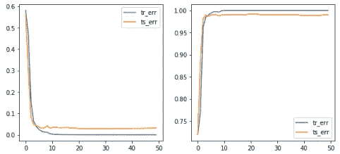

# 计算机视觉中的注意力

> 原文：<https://towardsdatascience.com/attention-in-computer-vision-fd289a5bd7ad?source=collection_archive---------4----------------------->

## [实践教程](https://towardsdatascience.com/tagged/hands-on-tutorials)

## 在 PyTorch 中实现多头和 CBAM 注意模块


照片由[像素](https://www.pexels.com/photo/grayscale-photo-of-computer-laptop-near-white-notebook-and-ceramic-mug-on-table-169573/)上的[负空间](https://www.pexels.com/@negativespace)拍摄

自从 Transformer 在作品“[Attention is all you needle](https://arxiv.org/abs/1706.03762)”中引入以来，NLP 领域出现了一种向用基于注意力的网络取代递归神经网络(RNN)的转变。在目前的文献中，已经有很多很棒的文章描述了这种方法。下面是我在评测中发现的最好的两个: [*带注释的变形金刚*](https://nlp.seas.harvard.edu/2018/04/03/attention.html) 和 [*可视化解释的变形金刚*](/transformers-explained-visually-part-3-multi-head-attention-deep-dive-1c1ff1024853) 。

然而，在研究了如何在计算机视觉中实现注意力(最佳找到的文章: [*理解注意力模块*](https://medium.com/visionwizard/understanding-attention-modules-cbam-and-bam-a-quick-read-ca8678d1c671) 、 [*CBAM*](https://blog.paperspace.com/attention-mechanisms-in-computer-vision-cbam/) 、 [*带代码的论文——注意*](https://paperswithcode.com/methods/category/attention-modules) 、[自我注意](https://peltarion.com/blog/data-science/self-attention-video)、[自我注意和 Conv](http://jbcordonnier.com/posts/attention-cnn/#:~:text=The%20main%20difference%20between%20CNN,is%20always%20the%20full%20image.) )后，我注意到其中只有少数几篇清楚地描述了注意力机制，并在理论的同时包含了干净的代码。因此，本文的目标是详细描述计算机视觉中两个最重要的注意模块，并使用 PyTorch 将它们应用到一个实际案例中。文章的结构如下:

1.  注意力模块介绍
2.  计算机视觉中的注意方法
3.  基于注意的网络的实现和结果
4.  结论

## 1.注意力模块介绍

在机器学习的背景下，**注意力**是一种模仿认知注意力的技术，被定义为选择和专注于相关刺激的能力。换句话说，注意力是一种试图增强重要部分，同时淡出不相关信息的方法。

尽管这种机制可以分为几个家族([注意？立正！](https://lilianweng.github.io/lil-log/2018/06/24/attention-attention.html#a-family-of-attention-mechanisms))，我们关注*自我注意力*，因为这是计算机视觉任务中最流行的注意力类型。这是指将单个序列的不同位置相关联来计算同一序列的表示的机制。

为了更好的理解这个概念，我们来想一下下面这个句子:*河岸*。如果我们看不到单词 *River* 我们是否同意单词 *Bank* 失去了它的上下文信息？这实际上是自我关注背后的主要思想。它试图给出每个单词的上下文信息，因为单词的单个含义并不代表它们在句子中的含义。

正如[自我关注的直观解释](/an-intuitive-explanation-of-self-attention-4f72709638e1)中所解释的，如果我们考虑上面给出的例子，自我关注的工作方式是将句子中的每个单词与其他每个单词进行比较，并重新加权每个单词的单词嵌入，以包括上下文相关性。输出模块的输入是没有上下文信息的每个单词的嵌入，而输出是具有上下文信息的类似嵌入。

## 2.计算机视觉中的注意方法

[此处](https://paperswithcode.com/methods/category/attention-modules)列出了持续更新的关注模块列表。从列出的几个中，我们重点介绍两个最受计算机视觉任务欢迎的:[多头注意力](https://paperswithcode.com/method/multi-head-attention)和[卷积块注意力模块(CBAM)](https://paperswithcode.com/method/spatial-attention-module) 。

***2.1。多头关注***

多头注意力是注意力机制的一个模块，它并行运行一个注意力模块若干次。因此，要理解它的逻辑，首先需要理解注意力模块。两个最常用的注意力函数是<https://paperswithcode.com/method/additive-attention>*和 [*点积注意力*](https://paperswithcode.com/method/dot-product-attention) ，后者是本工作感兴趣的一个。*

*关注模块的基本结构是有两个向量列表 *x1* 和 *x2* ，一个是关注的，另一个是出席的。向量 *x2* 生成“查询”，而向量 *x1* 创建“键”和“值”。关注函数背后的思想是将查询和设置的键值对映射到输出。输出计算为值的加权和，其中分配给每个值的权重由查询与相应关键字的兼容性函数计算"T17 注意是您所需要的全部 T18"。输出计算如下:*

**

*正如在本[讨论](https://stats.stackexchange.com/questions/421935/what-exactly-are-keys-queries-and-values-in-attention-mechanisms)中提到的，键/值/查询概念来自检索系统。例如，当在 Youtube 上键入一个查询来搜索一些视频时，搜索引擎会将您的**查询**映射到一组**键**(视频标题、描述等)。)与数据库中的候选视频链接。然后，它会为您呈现最匹配的视频(**值**)。*

*在进入多头注意力之前，让我们运行这个点积注意力，多头注意力是本模块的一个扩展。下面是 PyTorch 中的实现。输入是`[128, 32, 1, 256]`，其中 128 对应的是批次，32 对应的是序列长度，1 对应的是头数(对于多个关注头我们会增加)，256 是特征数。*

*输出是:*

```
*attn_output: [128, 32, 1, 256], attn_weights: [128, 1, 32, 32]
attn_output: [128, 32, 1, 256], attn_weights: [128, 1, 32, 16]*
```

*从这个基本实现中可以得到一些启示:*

*   *输出将具有与查询输入大小相同的形状。*
*   *每个数据的注意力权重必须是一个矩阵，其中行数对应于查询的序列长度，列数对应于键的序列长度。*
*   *点积注意力中没有可学习的参数。*

*所以，回到多头注意力，这个人并行运行这个解释过的注意力模块几次。独立的注意力输出然后被连接并线性转换成期望的维度。下面是实现过程:*

*输出是:*

```
*attn_output: [128, 32, 256], attn_weights: [128, 8, 32, 32]
attn_output: [128, 32, 256], attn_weights: [128, 8, 32, 32]*
```

*从代码中可以看出:*

*   *例如，查询的线性层的输入是`[128, 32, 256]`。然而，正如在这篇[文章](https://stackoverflow.com/questions/58587057/multi-dimensional-inputs-in-pytorch-linear-method)中提到的，`Linear`层接受任意形状的张量，其中只有最后一个维度必须与你在构造函数中指定的`in_features`参数相匹配。输出将具有与输入完全相同的形状，只有最后一个维度将改变为您在构造函数中指定的`out_features`。对于我们的例子，输入形状是一组`128 * 32 = 4096`和`256`特征。因此，我们将密集网络应用于序列长度的每个元素和批次的每个数据。*
*   *此外，我们添加了残余连接和层规范化，因为它是在变压器神经网络中实现的。但是，如果你只是想实现多头注意力模块，这些应该被排除在外。*

*因此，在这一点上你可能会疑惑，为什么我们要实现多头注意力而不是一个简单的注意力模块？根据论文[注意力是你所需要的全部](https://arxiv.org/abs/1706.03762)，*“多头注意力允许模型共同注意来自不同位置的不同表征* ***子空间*** *的信息。用单一的注意力头，平均化抑制了这一点。”*换句话说，将特征划分为头部允许每个注意力模块仅关注一组特征，从而提供更大的能力来编码每个单词的多种关系和细微差别。*

> *如果在这一点上你还想深入了解这种类型的注意力，我鼓励你阅读这篇[文章](https://theaisummer.com/self-attention/)，它用很棒的插图详细解释了所有这个模块。*

*在结束之前，我只想提一下，我们已经使用了这个注意力模块，就好像我们在处理序列一样，但是这篇文章是关于图像的。如果你理解了这一点，序列和图像之间唯一的区别就是输入向量。对于图像来说，与序列长度相对应的是像素。因此，如果输入是`[batch=128, no_channels=256, height=24, width=24]`，一个可能的实现可能是:*

*输出是:*

```
*attn_output: [128, 256, 24, 24], attn_weights: [128, 8, 576, 576]*
```

****2.2。卷积块注意模块(CBAM)****

*在 2018 年， [S. Woo 等人(2018)](https://www.google.com/search?q=CBAM+attention&oq=CBAM&aqs=chrome.0.69i59j69i57j46i175i199j46i10i433j46i10i175i199j69i60l3.2289j0j7&sourceid=chrome&ie=UTF-8) 发表了一个新的注意力模块，名为卷积块注意力模块(CBAM)，它和卷积运算一样，强调了沿通道和空间轴的有意义的特征。与多头注意力相比，这种类型的注意力是针对前馈卷积神经网络有意制造的，并且可以应用于深度网络中的每个卷积块。*

*CBAM 包含两个连续的子模块，称为通道注意模块(CAM)和空间注意模块(SAM)。这两个概念可能是谈论卷积时最重要的两个概念。通道是指每个像素的特征或通道的数量，而空间是指维度(h x w)的特征图。*

*   **空间注意模块(SAM)* :该模块由三重顺序操作组成。它的第一部分称为通道池，它包括对输入(*c*×*h*×*w*)应用跨通道的最大池和平均池，以生成具有 shape (2 × *h* × *w* )的输出。这是卷积层的输入，卷积层输出一个单通道特征图(1 × *h* × *w* )。在通过 BatchNorm 和可选的 ReLU 传递这个输出之后，数据进入 Sigmoid 激活层。*
*   **通道注意模块(CAM)* :该模块首先将输入张量分解成由全局平均池(GAP)和全局最大池(GMP)生成的 2 个后续维度向量( *c* × 1 × 1)。此后，输出通过完全连接层，然后是 ReLu 激活层。*

> *想了解更多关于 CBAM 的信息，我推荐阅读这篇伟大的[帖子](https://blog.paperspace.com/attention-mechanisms-in-computer-vision-cbam/)，里面有很棒的解释图片。*

*下面是实现过程:*

*输出是:*

```
*attn_output: [128, 256, 24, 24]*
```

## *3.基于注意的网络的实现和结果*

*在上述理论部分之后，本节将重点介绍两个注意层在一个实际案例中的实现。*

*具体来说，我们选择了 STL 数据集，并在一些图像中添加了白色补丁，如下图所示。任务是创建一个神经网络来分类这两种类型的图像。*

**

*STL 图像。那些标记为 1 的图像属于其图像具有白色斑块的类别，而那些标记为 0 的图像是没有白色斑块的图像。*

*然后，我们创建了三个类。第一个只是一个 CNN，而第二个包含多头注意力层，第三个包括 CBAM 模块。*

*下面是运行培训的代码。*

*这些是输出结果:*

*   **CNN* :*

```
*Min train error: 0.0011167450276843738
Min test error: 0.05411996720208516*
```

**

*   **CNN +多头关注*:添加关注层后性能有所提高，但关注图没有突出显示图像中带有白色斑块的部分。*

```
*Min train error: 9.811600781858942e-06
Min test error: 0.04209221125441423*
```

****

*由于有一些过度拟合和注意力层没有做它应该做的，我用卷积层重新实现了这一层。如果有人有什么建议，请在评论中留下。*

*   **基于 CNN + 1DConv 的多头关注*:这一次稳定性和性能明显提高。此外，还可以观察到注意力层的输出是如何为包含它的图像高亮显示白色斑块的。*

```
*Min train error: 0.00025470180017873645
Min test error: 0.014278276459193759*
```

****

*   *CNN + CBAM 注意:这一个呈现了最好的结果。显然可以在注意力层的输出中观察到白色斑块，并且训练非常稳定，实现了所有模型中最低的验证损失。*

```
*Min train error: 2.786791462858673e-05
Min test error: 0.028047989653949175*
```

****

## *4.结论*

*总之，本文介绍了多头注意力和 CBAM 模块，这是计算机视觉中最流行的两个注意力模块。此外，它还包括 PyTorch 中的一个实现，其中我们对包含白色补丁(手动添加)的 CIFAR 数据集中的图像进行分类。*

*对于未来的工作，我认为将位置编码和注意力结合起来是很有趣的。在这里，我为感兴趣的人留下了一个链接。*

****如果你喜欢这篇文章，请考虑*** [***订阅***](https://javiferfer.medium.com/membership) ***。你将获得我所有的内容+所有其他来自牛逼创作者的文章！****