# 你需要的只是关注

> 原文：<https://towardsdatascience.com/attention-please-85bd0abac41?source=collection_archive---------4----------------------->

## 解释机器翻译的变压器架构

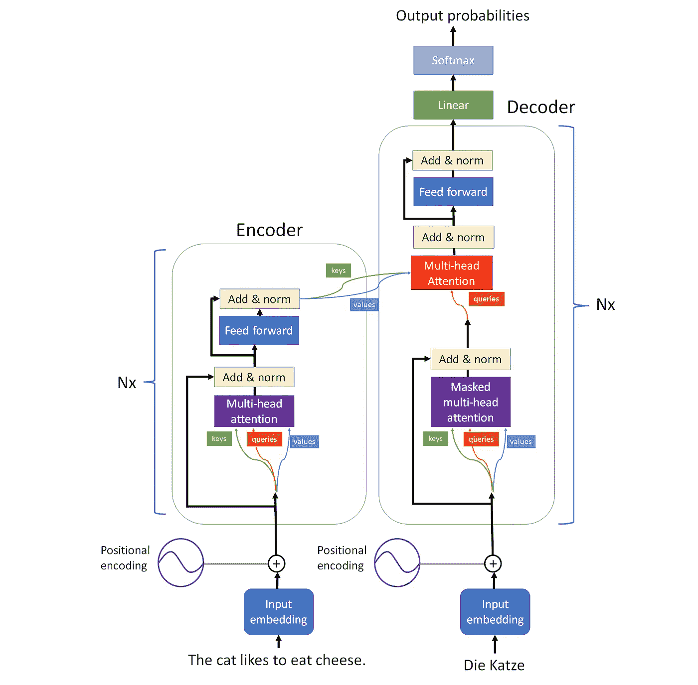

# 动机

假设我们想把英语翻译成德语。

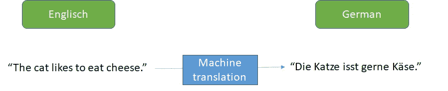

(图片由作者提供)

我们可以清楚地看到，我们不能通过单独翻译每个单词来翻译这个句子。例如，英语单词“the”可以翻译成“der”或“die ”,这取决于与其相关的名词的性别。同样，单词“to”根本没有被翻译成德语，因为在德语句子中没有不定式。还有更多例子可以说明一个单词的上下文是如何影响其翻译的。

我们需要将整个输入句子的信息输入到我们的机器翻译模型中，这样它才能理解单词的上下文。

由于大多数机器翻译模型一次输出一个单词，我们也要给模型关于它已经翻译了哪些**部分的信息**。

过去，机器翻译主要是通过使用 LSTM 或 GRU 这样的递归神经网络来完成的。然而，他们很难学习单词之间的依赖关系，因为单词之间的计算步骤数随着距离的增加而增加，所以单词在句子中距离很远。

为了解决这个问题，引入了变形金刚，它消除了重复现象，代之以注意机制。我将介绍著名论文[“你所需要的只是注意力”](https://arxiv.org/pdf/1706.03762.pdf)中提出的架构的内部运作。

# **编码器解码器**

transformer 模型可以一次预测一个单词/单词。它将我们想要翻译的源句子和它已经翻译的句子部分作为输入。然后，变压器输出下一个字。

变压器有两个不同的部分，称为“编码器”和“解码器”。输入的句子被输入编码器，而已经翻译的部分被输入解码器，解码器也产生输出。

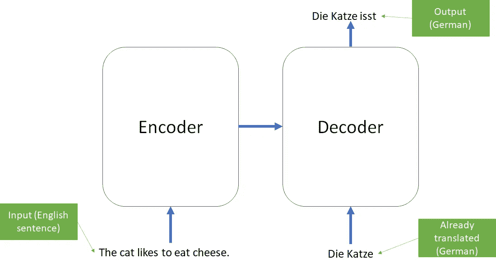

# 注意机制

注意力机制是 Transformer 架构的核心，其灵感来自于人脑中的[注意力](http://citeseerx.ist.psu.edu/viewdoc/download?doi=10.1.1.465.3727&rep=rep1&type=pdf)。想象你在一个聚会上。即使你的名字被淹没在其他的噪音中，你也能听出在房间的另一边有人在喊你的名字。你的大脑可以专注于它认为重要的事情，过滤掉所有不必要的信息。

在查询、键和值的帮助下，变压器中的注意力变得更加容易。

**Key:**Key 是一个单词的标签，用来区分不同的单词。

**查询:**检查所有可用的键，并选择最匹配的一个。所以它代表了对特定信息的主动请求。

**值:**键和值总是成对出现。当查询匹配一个键时，不是键本身，而是单词的值被进一步传播。值是一个单词包含的信息。

在 Transformer 架构中有三种不同的注意机制。一个是编码器和解码器之间的 T2。这种类型的关注被称为**交叉关注**，因为键和值是由不同于查询的序列生成的。

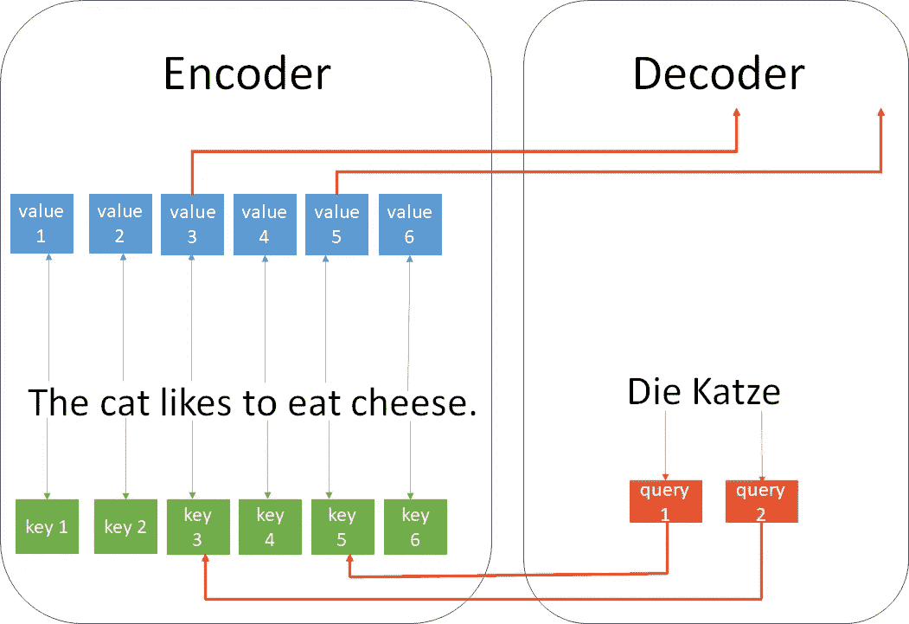

(图片作者

如果键、值和查询是从相同的序列中生成的，那么我们称之为**自关注**。在编码器和解码器中各有一种自我关注机制。

自我注意在下图中用紫色表示，交叉注意用红色表示。

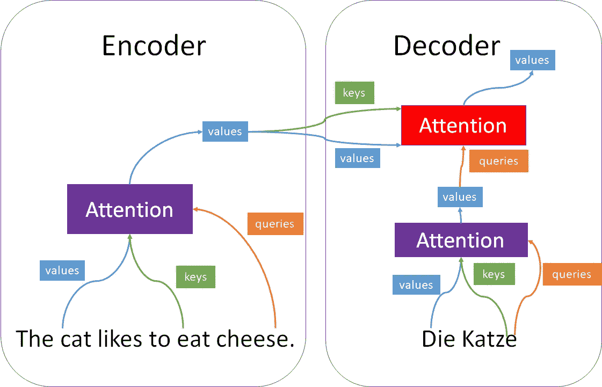

(图片由作者提供)

"那么，在数字上是如何做到的呢？"，你可能会问。一种方法是使用成比例的点积注意力。

# 比例点产品关注度

首先，我们必须注意，我们通过使用嵌入层将单词表示为向量。这个向量的维数可以变化。例如，小型的 GPT-2 记号赋予器使用每个单词/记号 768 的嵌入大小。

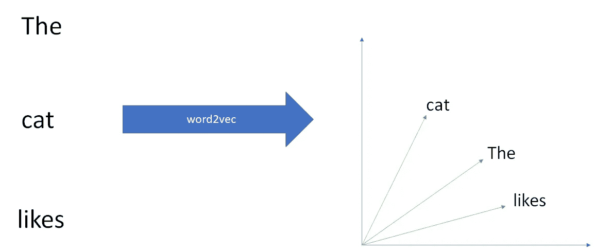

(图片由作者提供)

从这些单词向量中，查询( **q** )、键( **k** )和值( **v** )向量通过[矩阵乘以学习矩阵](/illustrated-self-attention-2d627e33b20a)来计算。我们把这些矩阵叫做 **M** 。

在以下示例中，矩阵的形状为(3，2)。3 是单词向量的长度，2 是一个查询、键或值向量的长度。

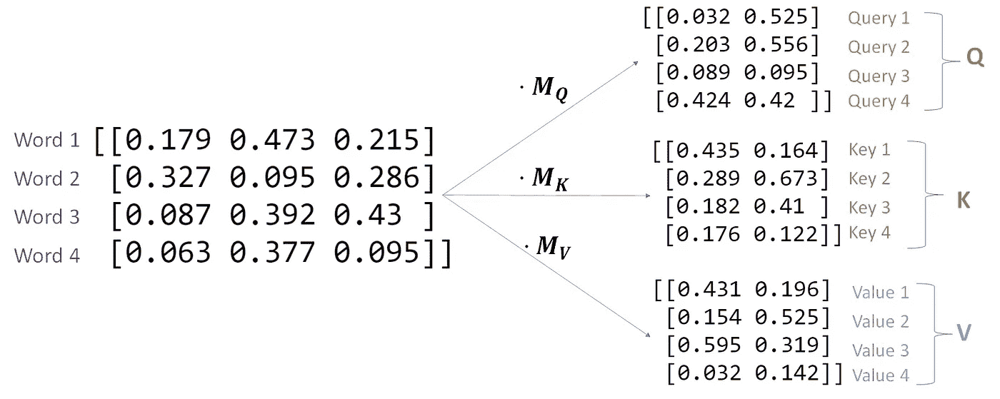

(图片由作者提供)

我们将查询放在矩阵 **Q** 中，将键放在矩阵 **K** 中，将值放在矩阵 **V** 中。

注意力是这样计算的:

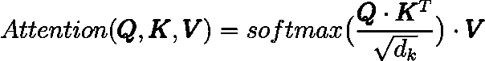

(图片由作者提供)

为了简化，我们考虑 3 个键、3 个值和 1 个查询。当在 **Q** 和转置的 **K，**之间取点积时，这与在每个键和查询之间取标量积是一样的。标量积越大，键和查询之间的角度越小。

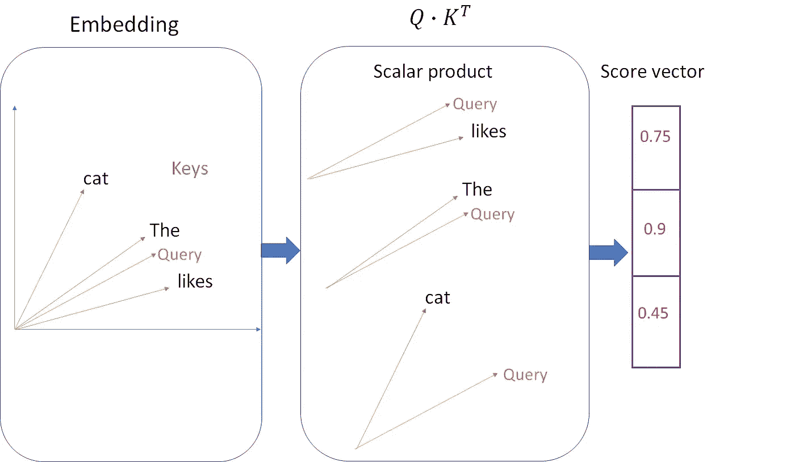

(图片由作者提供)

然后，softmax 函数缩放分数向量，使其总和等于 1。然后分数向量乘以值向量。

(图片由作者提供)

使用这个过程，我们从值中选择更多的信息，其中键和查询更相似。

为了提高变压器的性能，我们可以引入多头关注。

# 多头注意力

多头注意力意味着我们有多个并行运行的点积注意力机制。这有助于网络同时处理多条信息。

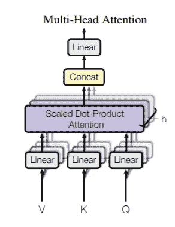

摘自论文[“注意力是你所需要的一切”](https://arxiv.org/pdf/1706.03762.pdf)

线性层是简单的学习权重矩阵。对于每个头部，我们通过不同的学习权重矩阵 **W** 来缩放 **V** 、 **K** 和 **Q** 。并且对于整个多头也有一个输出权重矩阵。

(图片由作者提供)

# 位置编码

因为转换器没有循环元素，所以当我们输入一个完整的句子时，转换器没有办法知道哪个单词在哪个位置。因此，我们必须对位置进行编码。一种方法是将不同频率的正弦波和余弦波附加到字向量上。

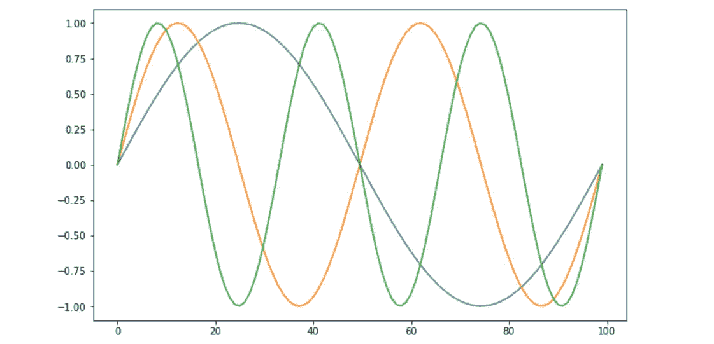

(图片由作者提供)

由于每个位置都有唯一的值组合，因此变压器能够准确地学习位置。

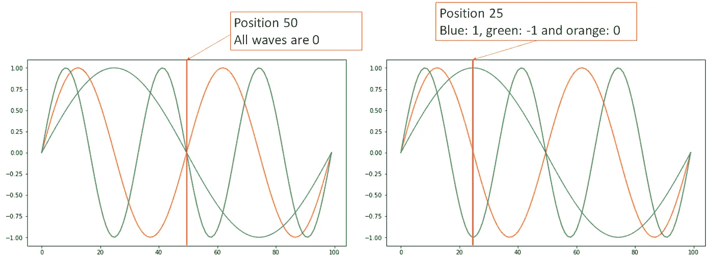

(图片由作者提供)

假设通过使用正弦波和余弦波作为位置编码，变换器应该能够知道超出训练样本大小的位置。

# 剩余连接和图层标准化

我们还在我们的架构中引入了剩余连接。这是通过在图层之后将输入添加到输出来完成的。

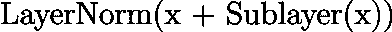

(图片由作者提供)

它们用于[允许梯度直接流经网络](https://discuss.pytorch.org/t/intuition-for-residual-connections-in-transformer-layers/99851)，因此也被称为跳过连接。

执行层标准化以保持每个训练样本的[平均值接近 0，标准偏差接近 1](https://keras.io/api/layers/normalization_layers/layer_normalization/) 。这有助于[稳定训练，从而减少训练时间](https://arxiv.org/pdf/2002.04745.pdf)。

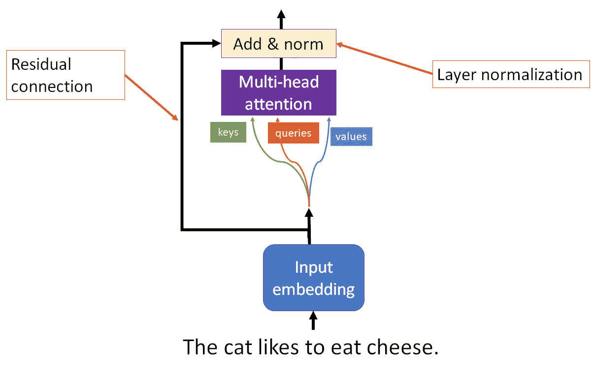

(图片由作者提供)

# **整体架构**

下图是变压器的整体架构。编码器和解码器可以重复 N 次。

(图片由作者提供)

我们还没有提到架构的前馈部分。这是一个点式前馈网络。它是一个简单的神经网络，具有相同的输入和输出维度。

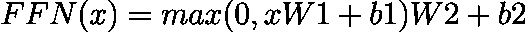

(图片由作者提供)

# 摘要

Transformer architecture 去掉了递归，代之以一种关注机制，这种机制使用查询来选择它需要的信息(值)，基于键提供的标签。如果键、值和查询是从同一个序列中生成的，就叫自注意。在交叉注意中，查询是由不同于键值对的序列生成的。多头注意力有助于变形金刚同时处理多件事情。

关于源文本的信息被提供给编码器，关于目标句子的已翻译部分的信息被提供给解码器，解码器还输出下一个单词/单词。网络从以不同频率的正弦波和余弦波的形式提供的位置编码中学习句子中单词的顺序。

# 作者相关文章

 [## 如何使用 GPT J

### GPT J 解释了 3 种简单的方法，你可以如何访问它

towardsdatascience.com](/how-you-can-use-gpt-j-9c4299dd8526)  [## 神经网络中的反向传播

### 从零开始的神经网络，包括数学和 python 代码

towardsdatascience.com](/backpropagation-in-neural-networks-6561e1268da8) 

# 作者撰写的其他文章

 [## 深度 Q 学习不是火箭科学

### 用 pytorch 解释和编码的深度 Q 和双 Q 学习

towardsdatascience.com](/deep-q-learning-is-no-rocket-science-e34912f1864)  [## 爱因斯坦指数符号

### 爱因斯坦求和、指数符号和数值

towardsdatascience.com](/einstein-index-notation-d62d48795378)  [## 具有策略梯度的 Snake 深度强化学习

### 策略梯度深度强化学习在蛇游戏中的应用

towardsdatascience.com](/snake-with-policy-gradients-deep-reinforcement-learning-5e6e921db054) 

## 想联系支持我？

领英
[https://www.linkedin.com/in/vincent-m%C3%BCller-6b3542214/](https://www.linkedin.com/in/vincent-m%C3%BCller-6b3542214/)
脸书
[https://www.facebook.com/profile.php?id=100072095823739](https://www.facebook.com/profile.php?id=100072095823739)
推特
[https://twitter.com/Vincent02770108](https://twitter.com/Vincent02770108)
中等
[https://medium.com/@Vincent.Mueller](https://medium.com/@Vincent.Mueller)
成为中等会员并支持我(你的部分会员费直接归我)
[https://medium.com/@Vincent.Mueller/membership](https://medium.com/@Vincent.Mueller/membership)

# 参考

[图文并茂的 GPT-2](https://jalammar.github.io/illustrated-gpt2/)

[人脑中的注意力](http://citeseerx.ist.psu.edu/viewdoc/download?doi=10.1.1.465.3727&rep=rep1&type=pdf)

[《注意力是你所需要的全部》论文](https://arxiv.org/pdf/1706.03762.pdf)

[Yannik Kilchers 关于“关注是你所需要的一切](https://www.youtube.com/watch?v=iDulhoQ2pro)”的视频

[谷歌的变形金刚代码库](https://github.com/tensorflow/tensor2tensor)

[py torch 中的变压器](https://pytorch.org/docs/stable/generated/torch.nn.Transformer.html)

[解释的键、查询和值](https://stats.stackexchange.com/questions/421935/what-exactly-are-keys-queries-and-values-in-attention-mechanisms)

[关键字、查询和值的数学运算](/illustrated-self-attention-2d627e33b20a)

[Tensor2Tensor 笔记本](https://colab.research.google.com/github/tensorflow/tensor2tensor/blob/master/tensor2tensor/notebooks/hello_t2t.ipynb)

[剩余连接上的堆栈溢出](https://stats.stackexchange.com/questions/321054/what-are-residual-connections-in-rnns)

[变压器架构中的层标准化](https://arxiv.org/pdf/2002.04745.pdf)

K [纪元层归一化](https://keras.io/api/layers/normalization_layers/layer_normalization/)