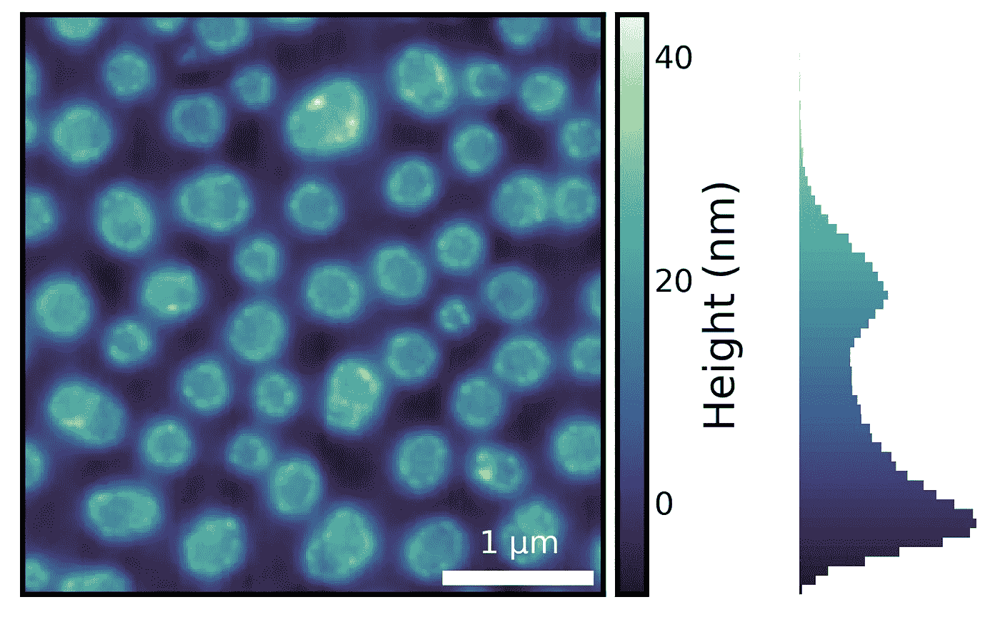
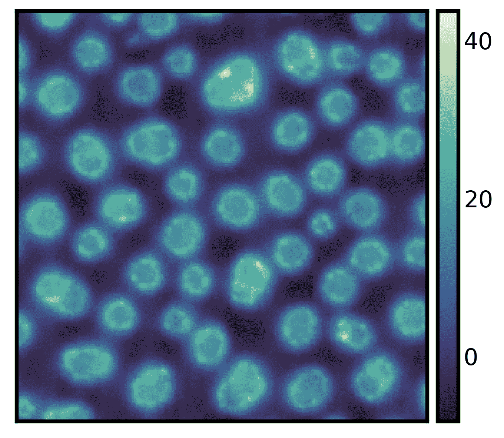
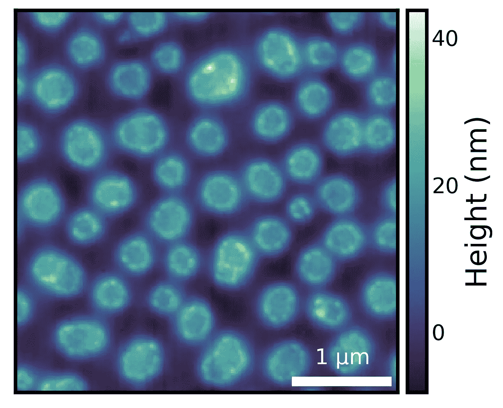
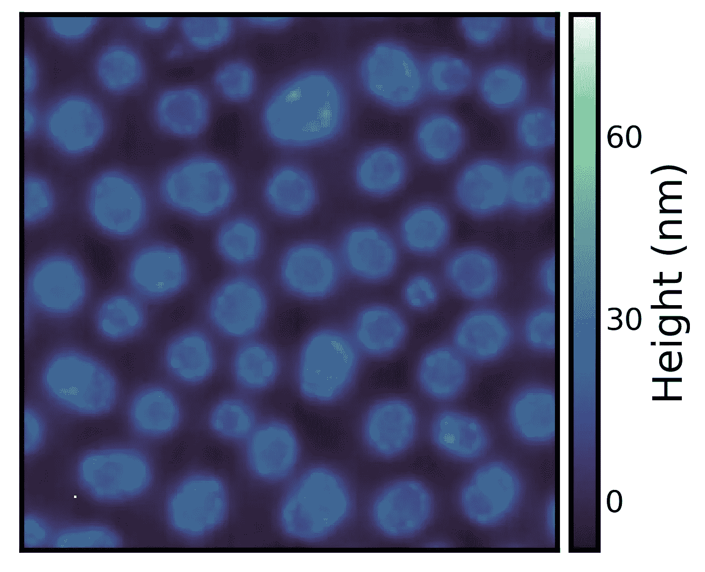
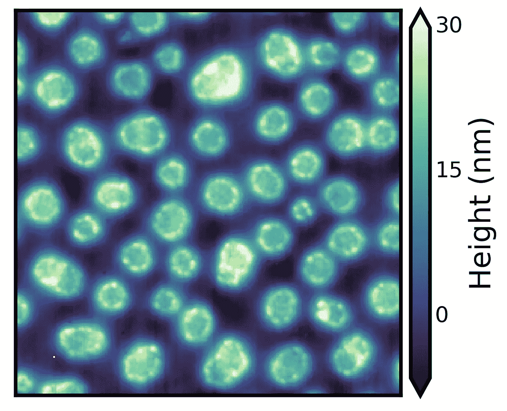
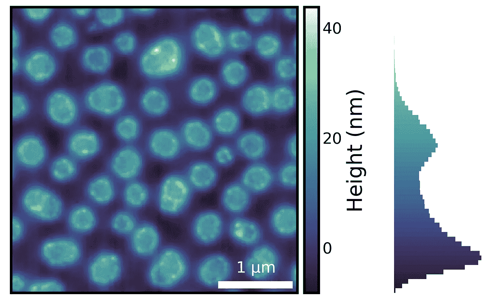

# Python 中吸引人的、有效的和描述性的图像可视化

> 原文：<https://towardsdatascience.com/attractive-effective-descriptive-image-visualization-in-python-aa6831d716dc?source=collection_archive---------32----------------------->

## *添加比例尺、可视化图像分布、纠正异常值等。*



作者图片

[Seaborn-image](https://github.com/SarthakJariwala/seaborn-image) 是一个基于 [matplotlib](https://matplotlib.org/) 的开源 Python 可视化图像库。它旨在提供一个高级 API 来可视化图像数据，类似于 [seaborn](https://seaborn.pydata.org/) 提供高级 API 来可视化表格数据。顾名思义，`seaborn-image`很大程度上受到了`seaborn`库的启发。

# 装置

让我们从安装`seaborn-image`开始

```
$ pip install --upgrade seaborn-image
```

然后将`seaborn-image`导入为`isns`。

```
*import* seaborn_image *as* isns*# set context* isns.set_context("notebook")*# set global image settings* isns.set_image(*cmap*="deep", *origin*="lower")*# load sample dataset* polymer = isns.load_image("polymer")
```

`seaborn-image`中的所有函数都在一个平面名称空间中可用。

`isns.set_context()`帮助我们全局改变显示上下文(类似于`seaborn.set_context()`)。

除了上下文，我们还使用`isns.set_image()`全局设置绘制图像的属性。稍后，我们还将看看如何使用`isns.set_scalebar()`来全局设置图像比例尺属性。

这些功能使用 [matplotlib rcParams](https://matplotlib.org/tutorials/introductory/customizing.html) 定制显示。关于`seaborn-image`中设置的更多细节，您可以参考[文档](https://seaborn-image.readthedocs.io/en/latest/api/_context.html)。

最后，我们从`seaborn-image`加载一个样本聚合物数据集。

> 在这篇文章中，我们将使用这个聚合物图像数据集进行可视化。

# 二维图像

可视化图像就像用我们的聚合物图像数据调用`imgplot()`函数一样简单。`imgplot()`在幕后使用 [matplotlib imshow](https://matplotlib.org/3.2.1/api/_as_gen/matplotlib.pyplot.imshow.html) ，但是提供了对许多定制的简单访问。我们将在这篇博文中看看一些定制。

默认情况下，它会添加一个`colorbar`并关闭轴记号。然而，这仅仅是开始触及表面！

我们可以通过设置`describe=True`得到一些关于我们图像数据的基本描述性统计。

```
ax = isns.imgplot(polymer, *describe*=True)  *# default is False*No. of Obs. : 65536
Min. Value : -8.2457214
Max. Value : 43.714034999999996
Mean : 7.456410761947062
Variance : 92.02680396572863
Skewness : 0.47745180538933696
```



作者图片

> *也可以使用* `*imshow*` *，*的别名`*imgplot*`

# 画一个比例尺

虽然我们知道一些关于我们的聚合物图像数据的基本信息，但是我们仍然没有关于图像中特征的物理尺寸的任何信息。我们可以画一个比例尺来校正它。

要添加比例尺，我们可以指定单个像素的大小`dx`和物理的`units`。这里，单个像素的物理尺寸是 15 纳米。所以，我们设置`dx=15`和`units="nm"`。

```
ax = isns.imgplot(
    polymer,
    *dx*=15,  *# physical size of the pixel
    units*="nm",  *# units
    cbar_label*="Height (nm)"  *# add colorbar label to our image* )
```



作者图片

> *注意:我们仅指定了单个像素的大小和单位，并绘制了适当大小的比例尺。*
> 
> *提示:您可以更改比例尺属性，如比例尺位置、标签位置、颜色等。全局使用* `[*isns.set_scalebar()*](https://seaborn-image.readthedocs.io/en/latest/api/_context.html#seaborn_image.set_scalebar)` *。*

# 异常值校正

真实的数据从来都不是完美的。它通常充满了异常值，这些异常值会影响图像显示。

```
# sample data with outliers  
pol_outliers = isns.load_image("polymer outliers")ax = isns.imgplot(pol_outliers, cbar_label= "Height (nm)")
```



作者图片

上述示例数据集有一个影响图像显示的异常像素。我们可以使用所有`seaborn-image` [函数](https://seaborn-image.readthedocs.io/en/latest/reference.html)中的`robust`参数来校正异常值。

```
ax = isns.imgplot(
    pol_outliers,
    *robust*=True,  *# set robust plotting
    perc*=(0.5, 99.5),  *# set the percentile of the data to view
    cbar_label*="Height (nm)"
)
```



作者图片

这里，我们设置`robust=True`并绘制 0.5 到 99.5%的数据(使用`perc`参数指定)。这样做可以根据指定的健壮百分比适当地缩放色彩映射表，还可以在没有任何附加代码的情况下绘制色彩条扩展。

> *注意:您可以指定* `*vmin*` *和* `*vmax*` *参数来覆盖* `*robust*` *参数。详见* `*imgplot*` [*文档示例*](https://seaborn-image.readthedocs.io/en/latest/api/imgplot.html)

# *图像数据分发*

*图像可视化的一个最重要的方面是知道底层图像数据的分布。在这里，我们使用`imghist`绘制一个直方图以及我们的聚合物图像。*

```
*fig = isns.imghist(polymer, *dx*=15, *units*="nm", *cbar_label*="Height (nm)")*
```

**

*作者图片*

> **注意:不需要新的参数。**

*使用直方图和适当的色彩映射表提供了关于图像数据的附加信息。例如，从上面的直方图中，我们可以看到大部分数据的值小于 30 纳米，只有极少数值接近 40 纳米，如果我们不看直方图，这一点可能不明显。*

> **提示:您可以使用* `*bins*` *参数更改条柱的数量，使用* `*orientation*` *参数更改彩条和直方图的方向。详见* `*imghist*` [*文档示例*](https://seaborn-image.readthedocs.io/en/latest/api/imghist.html) *。**

*重要的是，生成完整的图形，包括与颜色条级别匹配的直方图、描述图像中要素物理大小的比例尺、颜色条标签、隐藏轴刻度等。—只用了一行代码。本质上，这就是`seaborn-image`的目标——为 ***吸引人的、描述性的和有效的图像可视化*** 提供一个高级 API。*

*最后，这篇文章只介绍了`seaborn-image`为图像可视化提供的一些高级 API。更多细节可以查看详细的[文档](https://seaborn-image.readthedocs.io/en/latest/)和[教程](https://seaborn-image.readthedocs.io/en/latest/tutorial.html)以及 [GitHub](https://github.com/SarthakJariwala/seaborn-image) 上的项目。*

*感谢阅读！*

**原载于 2021 年 2 月 26 日*[*https://sarthakjariwala . github . io*](https://sarthakjariwala.github.io/posts/introducing-seaborn-image/)*。**