# 音频深度学习变得简单:自动语音识别(ASR)，它是如何工作的

> 原文：<https://towardsdatascience.com/audio-deep-learning-made-simple-automatic-speech-recognition-asr-how-it-works-716cfce4c706?source=collection_archive---------0----------------------->

## [动手教程](https://towardsdatascience.com/tagged/hands-on-tutorials)，直观音频深度学习系列

## 语音到文本的算法和架构，包括 Mel 频谱图，MFCCs，CTC 损失和解码器，在平原英语

由[拍摄的照片](https://unsplash.com/@soundtrap?utm_source=medium&utm_medium=referral)在 [Unsplash](https://unsplash.com?utm_source=medium&utm_medium=referral) 上

在过去的几年里，随着 Google Home、Amazon Echo、Siri、Cortana 等的流行，语音助手变得无处不在。这些是自动语音识别(ASR)最著名的例子。这类应用程序从某种语言的语音片段开始，并提取所说的单词作为文本。因此，它们也被称为语音转文本算法。

当然，像 Siri 和上面提到的其他应用程序走得更远。他们不仅提取文本，而且还解释和理解所说内容的语义，以便他们可以根据用户的命令做出响应或采取行动。

在这篇文章中，我将重点关注使用深度学习的语音到文本的核心功能。我的目标是不仅要理解事物是如何工作的，还要理解它为什么会这样工作。

我的音频深度学习系列中还有几篇文章，你可能会觉得有用。他们探索了这一领域的其他有趣主题，包括我们如何为深度学习准备音频数据，为什么我们将 Mel 光谱图用于深度学习模型，以及它们是如何生成和优化的。

1.  [最先进的技术](/audio-deep-learning-made-simple-part-1-state-of-the-art-techniques-da1d3dff2504) *(什么是声音，它是如何数字化的。音频深度学习在解决我们日常生活中的哪些问题。什么是光谱图，为什么它们都很重要。)*
2.  [为什么 Mel Spectrograms 表现更好](/audio-deep-learning-made-simple-part-2-why-mel-spectrograms-perform-better-aad889a93505) *(用 Python 处理音频数据。什么是 Mel 光谱图以及如何生成它们)*
3.  [数据准备和扩充](/audio-deep-learning-made-simple-part-3-data-preparation-and-augmentation-24c6e1f6b52) *(通过超参数调整和数据扩充增强光谱图特征以获得最佳性能)*
4.  [声音分类](/audio-deep-learning-made-simple-sound-classification-step-by-step-cebc936bbe5) *(端到端的例子和架构对普通声音进行分类。一系列场景的基础应用。)*
5.  [波束搜索](/foundations-of-nlp-explained-visually-beam-search-how-it-works-1586b9849a24) *(语音到文本和 NLP 应用程序常用的增强预测的算法)*

# 语音转文本

我们可以想象，人类的语音是我们日常个人和商业生活的基础，语音到文本的功能有大量的应用。人们可以用它来记录面向语音的聊天机器人的客户支持或销售电话的内容，或者记录会议和其他讨论的内容。

基本音频数据由声音和噪声组成。人类语言是一个特例。因此，我在文章中谈到的概念，如我们如何将声音数字化，以及为什么我们要将音频转换成频谱图，也适用于理解语音。然而，语音更复杂，因为它对语言进行编码。

像音频分类这样的问题从一个声音片段开始，并从一组给定的类别中预测该声音属于哪个类别。对于语音转文本问题，您的训练数据包括:

*   输入特征( *X* ):口语的音频剪辑
*   目标标签( *y* ):所说内容的文本副本

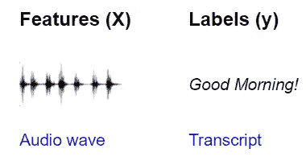

自动语音识别使用音频波作为输入特征，使用文本抄本作为目标标签(图片由作者提供)

该模型的目标是学习如何获取输入音频并预测说出的单词和句子的文本内容。

# 数据预处理

在[声音分类](/audio-deep-learning-made-simple-sound-classification-step-by-step-cebc936bbe5)文章中，我一步一步地解释了用于处理深度学习模型的音频数据的转换。对于人类语言，我们也遵循类似的方法。有几个 Python 库提供了这样的功能，librosa 是最流行的一个。

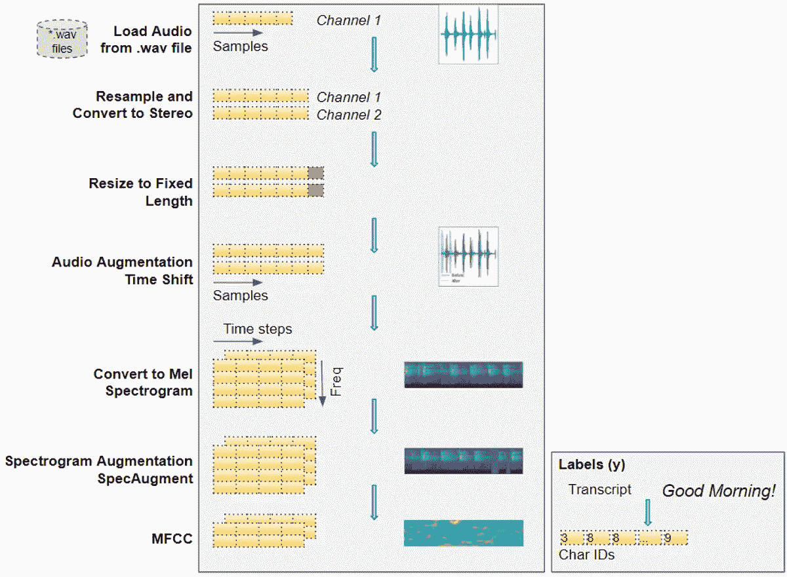

将原始音频波转换为频谱图图像，以输入到深度学习模型(图片由作者提供)

## 加载音频文件

*   从输入数据开始，输入数据由音频格式的口语语音的音频文件组成。wav”或“. mp3”。
*   从文件中读取音频数据，并将其加载到 2D Numpy 数组中。这个数组由一系列数字组成，每个数字代表特定时刻声音的强度或振幅。这种测量的次数由采样率决定。例如，如果采样速率为 44.1kHz，则 Numpy 数组对于 1 秒钟的音频将具有单行 44，100 个数字。
*   音频可以有一个或两个通道，俗称单声道或立体声。对于双声道音频，第二个声道会有另一个类似的幅度数字序列。换句话说，我们的 Numpy 数组将是 3D 的，深度为 2。

## 转换为统一维度:采样率、通道和持续时间

*   我们的音频数据项可能会有很多变化。片段可能以不同的速率采样，或者具有不同数量的通道。剪辑很可能具有不同的持续时间。如上所述，这意味着每个音频项的尺寸将是不同的。
*   由于我们的深度学习模型期望我们所有的输入项都具有相似的大小，因此我们现在执行一些数据清理步骤来标准化我们的音频数据的维度。我们对音频进行重新采样，以便每个项目都具有相同的采样率。我们将所有项目转换到相同数量的频道。所有项目也必须转换为相同的音频持续时间。这包括填充较短的序列或截断较长的序列。
*   如果音频质量很差，我们可以通过应用噪声去除算法来消除背景噪声，以便我们可以专注于语音音频。

## 原始音频的数据扩充

*   我们可以应用一些数据扩充技术来增加输入数据的多样性，并帮助模型学习概括更广泛的输入。我们可以随机地将音频向左或向右移动一个小的百分比，或者少量地改变音频的音高或速度。

## 梅尔光谱图

*   这个原始音频现在被转换成 Mel 光谱图。频谱图通过将音频分解为包含在其中的一组频率，将音频的本质捕捉为图像。

## MFCC

*   特别是对于人类语音，有时采取一个额外的步骤并将梅尔频谱图转换成 MFCC(梅尔频率倒谱系数)会有所帮助。MFCCs 通过仅提取最基本的频率系数来产生 Mel 频谱图的压缩表示，这些频率系数对应于人类说话的频率范围。

## 光谱图的数据扩充

*   我们现在可以使用一种称为 SpecAugment 的技术，对 Mel 光谱图图像应用另一个数据扩充步骤。这包括随机屏蔽掉垂直(即时间掩模)或水平(即频率屏蔽)来自频谱图的信息频带。注:我不确定这是否也适用于 MFCCs，是否会产生好的结果。

经过数据清理和扩充，我们现在已经将原始音频文件转换为 Mel 声谱图(或 MFCC)图像。

我们还需要从抄本中准备目标标签。这只是由单词的句子组成的常规文本，所以我们从脚本中的每个字符构建一个词汇表，并将它们转换成字符 id。

这给了我们输入特征和目标标签。这些数据已经准备好输入到我们的深度学习模型中。

# 体系结构

ASR 的深度学习架构有很多变体。两种常用的方法是:

*   一种基于 CNN(卷积神经网络)和 RNN(递归神经网络)的架构，使用 CTC Loss 算法来区分语音中单词的每个字符。百度的深度语音模型。
*   基于 RNN 的序列到序列网络，将声谱图的每个“切片”视为序列中的一个元素，例如 Google 的 Listen Attend Spell (LAS)模型。

让我们选择上面的第一种方法，并更详细地探讨它是如何工作的。概括地说，该模型由以下模块组成:

*   由几个残余 CNN 层组成的常规卷积网络，处理输入频谱图图像并输出这些图像的特征图。

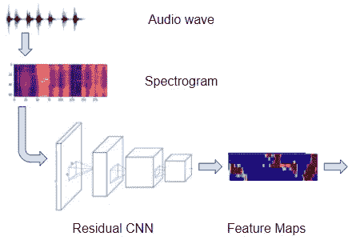

光谱图由卷积网络处理以生成特征图(图片由作者提供)

*   由几个双向 LSTM 层组成的规则循环网络，将特征地图作为一系列不同的时间步长或“帧”进行处理，这些时间步长或“帧”与我们所需的输出字符序列相对应。(LSTM 是一种非常常用的循环层，它的完整形式是长短期记忆)。换句话说，它采用连续表示音频的特征图，并将它们转换成离散表示。

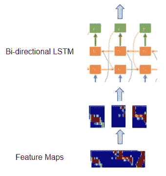

递归网络处理来自特征图的帧(图片由作者提供)

*   带有 softmax 的线性图层，使用 LSTM 输出为输出的每个时间步长生成字符概率。

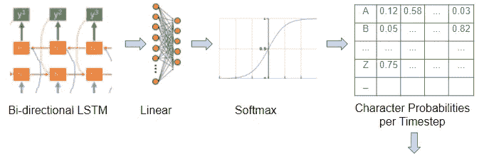

线性层为每个时间步长生成字符概率(图片由作者提供)

*   我们还有位于卷积和递归网络之间的线性层，有助于将一个网络的输出整形为另一个网络的输入。

因此，我们的模型获取频谱图图像，并输出该频谱图中每个时间步长或“帧”的特征概率。

# 对齐序列

如果你稍微思考一下这个问题，你会意识到我们的拼图中还缺少一个重要的部分。我们的最终目标是将这些时间步或“框架”映射到我们的目标脚本中的单个字符。

该模型解码字符概率以产生最终输出(作者的图像)

但是对于一个特定的声谱图，我们怎么知道应该有多少帧呢？我们如何确切地知道每一帧的边界在哪里？我们如何将音频与文本脚本中的每个字符对齐？

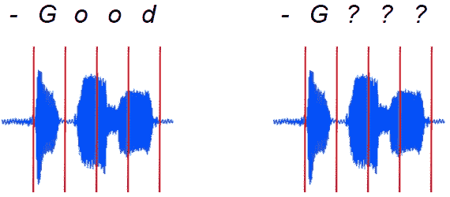

左边是我们需要的排列。但是我们如何得到它呢？？(图片由作者提供)

音频和声谱图图像没有被预先分割以给我们这个信息。

*   在口语音频中，因此在声谱图中，每个字符的声音可以具有不同的持续时间。
*   这些字符之间可能会有间隔和停顿。
*   几个字符可以合并在一起。
*   有些字符可以重复。例如，在单词“apple”中，我们如何知道音频中的“p”实际上是否对应于文字记录中的一个或两个“p”？

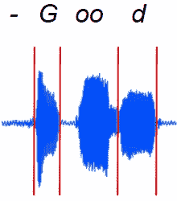

事实上，口语对我们来说并不整齐一致(图片由作者提供)

这实际上是一个非常具有挑战性的问题，也是为什么 ASR 如此难以正确解决的原因。这是 ASR 区别于分类等其他音频应用的显著特征。

我们解决这个问题的方法是使用一种巧妙的算法，它有一个听起来很好听的名字，叫做连接主义时间分类，简称 CTC。由于我不是“喜欢幻想的人”,而且很难记住这个长名字，我就用反恐委员会这个名字来指代它😃。

# CTC 算法——训练和推理

当输入是连续的而输出是离散的，并且没有清晰的元素边界可用于将输入映射到输出序列的元素时，CTC 用于对齐输入和输出序列。

它的特别之处在于它会自动执行这种对齐，而不需要您手动提供这种对齐作为标记的训练数据的一部分。这将使创建训练数据集变得极其昂贵。

如上所述，在我们的模型中，卷积网络输出的特征映射被分割成单独的帧，并输入到递归网络。每一帧对应于原始音频波的某个时间步长。但是，在设计模型时，帧数和每帧的持续时间是由您选择作为超参数的。对于每一帧，线性分类器后面的递归网络预测词汇表中每个字符的概率。

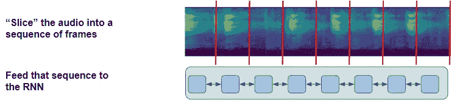

连续的音频被分割成离散的帧并输入到 RNN(图片由作者提供)

CTC 算法的工作就是获取这些字符概率并导出正确的字符序列。

为了帮助它处理我们刚刚讨论过的对齐和重复字符的挑战，它在词汇表中引入了“空白”伪字符(用“-”表示)的概念。因此，网络输出的字符概率也包括每帧空白字符的概率。

请注意，空白与“空格”不同。空格是一个真正的字符，而空白意味着没有任何字符，有点像大多数编程语言中的“null”。它仅用于划分两个字符之间的界限。

CTC 以两种模式工作:

*   **CTC 丢失**(在训练期间):它有一个地面真实目标抄本，并试图训练网络以最大化输出那个正确抄本的概率。
*   **CTC 解码**(推断中):这里我们没有目标抄本可以参考，必须预测最可能的字符序列。

让我们更深入地研究一下，以理解算法的作用。我们将从 CTC 解码开始，因为它稍微简单一些。

## CTC 解码

*   使用字符概率为每一帧选择最可能的字符，包括空格。例如，" *-G-o-ood* "

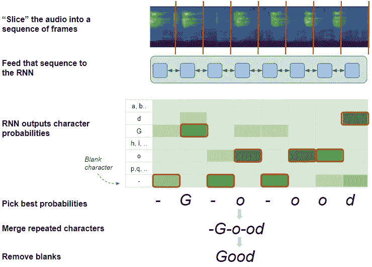

CTC 解码算法(图片作者提供)

*   合并任何重复的字符，并且不用空格分隔。例如，我们可以将“ *oo* ”合并成一个“ *o* ”，但是我们不能合并“ *o-oo* ”。这就是 CTC 能够区分有两个单独的“o”并产生由重复字符拼写的单词的方式。例如，" *-G-o-od* "
*   最后，因为空格已经达到了它们的目的，所以它删除了所有的空格字符。例如“*好的*”。

## CTC 损失

损失被计算为网络预测正确序列的概率。为此，该算法列出了网络可以预测的所有可能的序列，并从中选择与目标转录本匹配的子集。

为了从可能序列的全集中识别该子集，该算法如下缩小可能性:

*   只保留出现在目标脚本中的字符的概率，而丢弃其余的。它只保留“G”、“o”、“d”和“-”的概率。
*   使用过滤的字符子集，对于每一帧，只选择那些以与目标抄本相同的顺序出现的字符。尽管“G”和“o”都是有效字符，但“Go”的顺序是有效序列，而“oG”是无效序列。

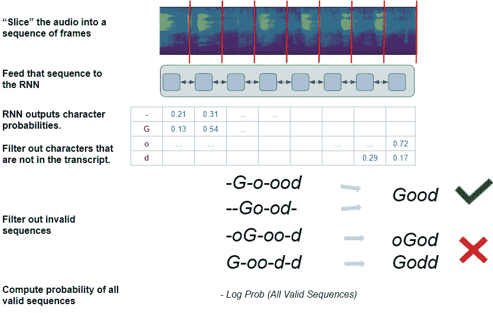

CTC 丢失算法(图片由作者提供)

有了这些约束，算法现在有了一组有效的字符序列，所有这些都将产生正确的目标转录本。例如，使用推理过程中使用的相同步骤，“*-G-o-ood”*和“*-Go-od-*”都将导致“好”的最终输出。

然后，它使用每一帧的单个字符概率来计算生成所有这些有效序列的总概率。网络的目标是学习如何最大化该概率，并因此降低产生任何无效序列的概率。

严格地说，由于神经网络*使*损失最小化，所以 CTC 损失被计算为所有有效序列的*负*对数概率。由于网络在训练期间通过反向传播最小化了这种损失，所以它调整其所有的权重以产生正确的序列。

然而，实际做到这一点比我在这里描述的要复杂得多。挑战在于有大量可能的字符组合来产生一个序列。就我们这个简单的例子来说，每帧可以有 4 个字符。有 8 个帧，所以我们有 4 * 8 个组合(= 65536)。对于任何有更多角色和更多画面的真实剧本，这个数字会呈指数增长。这使得简单地穷尽列出有效组合并计算它们的概率在计算上是不切实际的。

高效地解决这个问题是 CTC 如此创新的原因。这是一个迷人的算法，非常值得理解它如何实现这一点的细微差别。这本身就值得一篇完整的文章，我打算很快就写出来。但是现在，我们已经把重点放在建立对 CTC 做什么的直觉上，而不是深入它是如何工作的。

# 指标—单词错误率(WER)

在训练我们的网络之后，我们必须评估它的表现如何。语音到文本问题的一个常用度量是单词错误率(和字符错误率)。它一个字一个字地(或一个字符一个字符地)比较预测的输出和目标抄本，以计算出它们之间的差异。

差异可以是存在于转录本中但在预测中缺失的单词(被计为删除)、不在转录本中但已被添加到预测中的单词(插入)、或者在预测和转录本之间改变的单词(替换)。

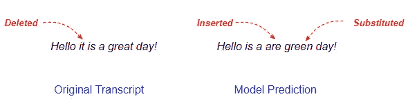

统计转录本和预测之间的插入、删除和替换(图片由作者提供)

度量公式相当简单。它是差异相对于总字数的百分比。

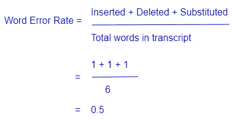

单词错误率计算(图片由作者提供)

# 语言模型

到目前为止，我们的算法只把语音当作某种语言的字符序列。但是当把这些字符组合成单词和句子时，它们真的有意义吗？

自然语言处理(NLP)中的一个常见应用是建立语言模型。它捕捉了在一种语言中如何使用单词来构建句子、段落和文档。它可以是关于语言(如英语或韩语)的通用模型，也可以是特定于特定领域(如医学或法律)的模型。

一旦有了语言模型，它就可以成为其他应用程序的基础。例如，它可以用来预测句子中的下一个单词，辨别一些文本的情绪(例如，这是一篇积极的书评吗)，通过聊天机器人回答问题，等等。

因此，当然，它也可以用于通过引导模型生成更有可能符合语言模型的预测来选择性地提高我们的 ASR 输出的质量。

# 波束搜索

当在推理过程中描述 CTC 解码器时，我们隐含地假设它总是在每个时间步长选择一个概率最高的单个字符。这就是所谓的贪婪搜索。

然而，我们知道使用一种叫做波束搜索的替代方法可以得到更好的结果。

虽然波束搜索通常用于 NLP 问题，但它并不是特定于 ASR 的，所以我在这里提到它只是为了完整。如果你想知道更多，请看看我的文章，其中详细描述了波束搜索。

 [## 自然语言处理的基础直观解释:波束搜索，它是如何工作的

### 波束搜索如何增强预测的简明指南

towardsdatascience.com](/foundations-of-nlp-explained-visually-beam-search-how-it-works-1586b9849a24) 

# 结论

希望这能让您对用于解决 ASR 问题的构建模块和技术有所了解。

在早期的深度学习之前，通过经典方法解决这类问题需要理解音素等概念，以及大量特定领域的数据准备和算法。

然而，正如我们刚刚看到的深度学习，我们几乎不需要任何涉及音频和语音知识的功能工程。然而，它能够产生出色的结果，不断给我们带来惊喜！

最后，如果你喜欢这篇文章，你可能也会喜欢我关于变形金刚、地理定位机器学习和图像字幕架构的其他系列。

 [## 直观解释的变压器(第 1 部分):功能概述

### NLP 变形金刚的简明指南，以及为什么它们比 rnn 更好，用简单的英语。注意力如何帮助…

towardsdatascience.com](/transformers-explained-visually-part-1-overview-of-functionality-95a6dd460452)  [## 利用地理位置数据进行机器学习:基本技术

### 简明的地理空间数据特征工程和可视化指南

towardsdatascience.com](/leveraging-geolocation-data-for-machine-learning-essential-techniques-192ce3a969bc)  [## 具有深度学习的图像标题:最先进的架构

### 图像特征编码器、序列解码器、注意和多模态架构的简明指南，用简单的英语编写

towardsdatascience.com](/image-captions-with-deep-learning-state-of-the-art-architectures-3290573712db) 

让我们继续学习吧！