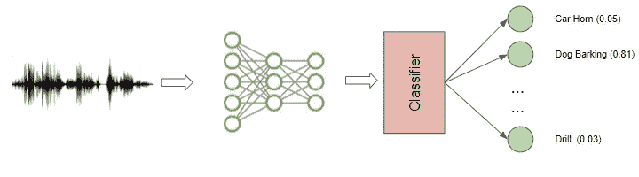

# 音频深度学习变得简单(第一部分):最新技术

> 原文：<https://towardsdatascience.com/audio-deep-learning-made-simple-part-1-state-of-the-art-techniques-da1d3dff2504?source=collection_archive---------0----------------------->

## 直观音频深度学习系列

## 颠覆性深度学习音频应用和架构世界的温和指南。以及为什么我们都需要了解光谱图，用简单的英语。

杰森·罗斯韦尔在 [Unsplash](https://unsplash.com?utm_source=medium&utm_medium=referral) 上的照片

尽管计算机视觉和 NLP 应用获得了最多的关注，但也有许多突破性的音频数据深度学习用例正在改变我们的日常生活。在接下来的几篇文章中，我的目标是探索音频深度学习的迷人世界。

下面是我计划在这个系列中发表的文章的简要概述。我的目标是不仅要理解事物是如何工作的，还要理解它为什么会这样工作。

1.  **最先进的技术——本文** *(什么是声音，它是如何数字化的。音频深度学习在解决我们日常生活中的哪些问题。什么是光谱图，为什么它们都很重要。)*
2.  [为什么 Mel Spectrograms 表现更好](/audio-deep-learning-made-simple-part-2-why-mel-spectrograms-perform-better-aad889a93505) *(用 Python 处理音频数据。什么是 Mel 光谱图以及如何生成它们)*
3.  [特性优化和增强](/audio-deep-learning-made-simple-part-3-data-preparation-and-augmentation-24c6e1f6b52) *(通过超参数调整和数据增强增强光谱图特性以获得最佳性能)*
4.  [音频分类](/audio-deep-learning-made-simple-sound-classification-step-by-step-cebc936bbe5) *(端到端例子和架构对普通声音进行分类。一系列场景的基础应用。)*
5.  [自动语音识别](/audio-deep-learning-made-simple-automatic-speech-recognition-asr-how-it-works-716cfce4c706) *(语音转文本算法和架构，使用 CTC 丢失和解码进行序列对齐。)*
6.  [波束搜索](/foundations-of-nlp-explained-visually-beam-search-how-it-works-1586b9849a24)

在这第一篇文章中，由于这一领域可能不为人们所熟悉，我将介绍这个主题，并概述音频应用的深度学习前景。我们将了解什么是音频，以及它是如何以数字形式呈现的。我将讨论音频应用对我们日常生活的广泛影响，并探索它们使用的架构和建模技术。

# 什么是声音？

我们都记得在学校时，声音信号是由气压的变化产生的。我们可以测量压力变化的强度，并随时间绘制这些测量值。

声音信号经常以规则的间隔重复，因此每个波都具有相同的形状。高度表示声音的强度，称为振幅。

显示振幅对时间的简单重复信号(经马克·利伯曼教授许可)

信号完成一个完整波所用的时间就是周期。信号在一秒钟内产生的波数称为频率。频率是周期的倒数。频率的单位是赫兹。

我们遇到的大多数声音可能不遵循这样简单而有规律的周期模式。但是不同频率的信号可以被加在一起以创建具有更复杂重复模式的复合信号。我们听到的所有声音，包括我们人类的声音，都是由这样的波形组成的。例如，这可能是乐器的声音。

带有复杂重复信号的音乐波形([来源](https://www.phys.uconn.edu/~gibson/Notes/Section4_2/Image93.gif)，经乔治·吉布森教授许可)

人耳能够根据声音的“质量”(也称为音色)来区分不同的声音。

# 我们如何用数字方式表现声音？

为了将声波数字化，我们必须将信号转换成一系列数字，这样我们就可以将它输入到我们的模型中。这是通过在固定的时间间隔测量声音的振幅来实现的。

定期进行样本测量([来源](https://commons.wikimedia.org/wiki/File:Signal_Sampling.png)

每个这样的测量称为一个样本，采样率是每秒的样本数。例如，常见的采样率大约是每秒 44，100 个样本。这意味着一个 10 秒钟的音乐片段将有 441，000 个样本！

# 为深度学习模型准备音频数据

直到几年前，在深度学习出现之前，计算机视觉的机器学习应用曾经依赖于传统的图像处理技术来进行特征工程。例如，我们会使用算法来检测角、边和面，从而生成手工制作的特征。对于 NLP 应用程序，我们也将依赖于诸如提取 N 元语法和计算词频之类的技术。

类似地，音频机器学习应用过去依赖于传统的数字信号处理技术来提取特征。例如，为了理解人类语音，可以使用语音学概念来分析音频信号，以提取像音素这样的元素。所有这些都需要大量特定领域的专业知识来解决这些问题，并调整系统以获得更好的性能。

然而，近年来，随着深度学习变得越来越普遍，它在处理音频方面也取得了巨大的成功。有了深度学习，不再需要传统的音频处理技术，我们可以依赖标准的数据准备，而不需要大量的手动和自定义生成特征。

更有趣的是，通过深度学习，我们实际上不会处理原始形式的音频数据。相反，常用的方法是将音频数据转换成图像，然后使用标准的 CNN 架构来处理这些图像！真的吗？把声音转换成图片？这听起来像科幻小说。😄

答案当然是相当普通和平凡的。这是通过从音频生成频谱图来完成的。首先让我们了解什么是光谱，并用它来理解光谱图。

## 范围

如前所述，不同频率的信号可以叠加在一起，形成复合信号，代表现实世界中出现的任何声音。这意味着任何信号都由许多不同的频率组成，可以表示为这些频率的总和。

频谱是组合在一起产生信号的一组频率。这幅图显示了一段音乐的频谱。

该频谱描绘了信号中存在的所有频率以及每个频率的强度或振幅。

频谱显示了构成声音信号的频率([来源](https://www.sfu.ca/sonic-studio-webdav/handbook/Graphics/Spectrum2.gif)，经 Barry Truax 教授许可)

信号中的最低频率称为基频。基频的整数倍频率称为谐波。

例如，如果基频为 200 赫兹，那么其谐波频率为 400 赫兹、600 赫兹等等。

## 时域与频域

我们之前看到的显示振幅与时间关系的波形是表示声音信号的一种方式。由于 x 轴显示了信号的时间值范围，因此我们是在时域中查看信号。

频谱是表示同一信号的另一种方式。它显示的是幅度与频率的关系，由于 x 轴显示的是信号的频率值范围，*在*时刻，我们看到的是频域中的信号。

时域和频域([来源](https://commons.wikimedia.org/wiki/File:FFT-Time-Frequency-View.png)

## 光谱图

由于信号随时间变化会产生不同的声音，因此其组成频率也随时间变化。换句话说，它的光谱随时间而变化。

信号的频谱图绘制了其随时间变化的频谱，就像信号的“照片”。它在 x 轴上绘制时间，在 y 轴上绘制频率。这就好像我们在不同的时间点一次又一次地获取光谱，然后将它们全部结合成一个单一的图。

它用不同的颜色来表示每个频率的幅度或强度。颜色越亮，信号的能量越高。频谱图的每个垂直“切片”实质上是该时刻信号的频谱，并显示了信号强度在该时刻信号中的每个频率上的分布。

在下面的例子中，第一张图片显示的是时域信号。幅度与时间的关系它让我们知道在任何时间点一个剪辑有多大声或安静，但它给我们提供的关于存在哪些频率的信息很少。

声音信号及其声谱图(图片由作者提供)

第二张图是频谱图，显示频域中的信号。

## 生成光谱图

频谱图是利用傅里叶变换将任何信号分解成其组成频率而产生的。如果这让你有点紧张，因为我们现在已经忘记了大学期间学过的傅立叶变换，不要担心😄！我们实际上不需要回忆所有的数学，有非常方便的 Python 库函数可以在一个步骤中为我们生成光谱图。我们将在下一篇文章中看到这些。

# 音频深度学习模型

现在我们知道了什么是频谱图，我们意识到它是音频信号的等效紧凑表示，有点像信号的“指纹”。这是一种将音频数据的基本特征捕捉为图像的优雅方式。

音频深度学习模型使用的典型管道(图片由作者提供)

所以大多数深度学习音频应用使用频谱图来表示音频。他们通常遵循这样的程序:

*   从波形文件形式的原始音频数据开始。
*   将音频数据转换成相应的声谱图。
*   可选地，使用简单的音频处理技术来扩充谱图数据。(在谱图转换之前，也可以对原始音频数据进行一些扩充或清理)
*   现在我们有了图像数据，我们可以使用标准的 CNN 架构来处理它们，并提取特征图，这些特征图是光谱图图像的编码表示。

下一步是根据您试图解决的问题，从这种编码表示中生成输出预测。

*   例如，对于一个音频分类问题，你可以通过一个通常由一些完全连接的线性层组成的分类器。
*   对于语音到文本的问题，你可以让它通过一些 RNN 层，从这个编码的表示中提取文本句子。

当然，我们跳过了许多细节，做了一些概括，但在这篇文章中，我们停留在一个相当高的水平。在接下来的文章中，我们将更详细地讨论所有这些步骤和所使用的架构。

# 音频深度学习解决了哪些问题？

日常生活中的音频数据可以以无数种形式出现，例如人类语音、音乐、动物声音和其他自然声音，以及来自人类活动(如汽车和机械)的人造声音。

鉴于声音在我们生活中的普遍存在和声音类型的多样性，有大量的使用场景需要我们处理和分析音频就不足为奇了。现在深度学习已经成熟，可以应用它来解决许多用例。

## 音频分类

这是最常见的用例之一，涉及到获取一个声音并将其分配给几个类中的一个。例如，任务可以是识别声音的类型或来源。这是汽车启动声，这是锤子声，哨声，还是狗叫声。

普通声音的分类(图片由作者提供)

显然，可能的应用是巨大的。这可以应用于根据机器或设备产生的声音来检测其故障，或者在监控系统中检测安全入侵。

## 音频分离和分段

音频分离包括从混合信号中分离出感兴趣的信号，以便可以用于进一步处理。例如，您可能想要从大量背景噪音中分离出个人的声音，或者从音乐表演的其余部分中分离出小提琴的声音。

从视频中分离单个发言人([来源](https://looking-to-listen.github.io/)，经 Ariel Ephrat 许可)

音频分段用于突出显示音频流中的相关部分。例如，它可以用于诊断目的，以检测人类心脏的不同声音和检测异常。

## 音乐流派分类和标记

随着音乐流媒体服务的流行，我们大多数人都熟悉的另一个常见应用是根据音频对音乐进行识别和分类。对音乐的内容进行分析，以找出它所属的流派。这是一个多标签分类问题，因为一首给定的音乐可能属于一个以上的流派。例如，摇滚、流行、爵士、萨尔萨、器乐以及其他方面，如“老歌”、“女歌手”、“快乐”、“派对音乐”等等。

音乐流派分类和标记(作者图片)

当然，除了音频本身，还有关于音乐的元数据，如歌手、发行日期、作曲家、歌词等，这些都可以用来为音乐添加丰富的标签。

这可以用于根据音乐收藏的音频特征对其进行索引，根据用户的偏好提供音乐推荐，或者用于搜索和检索与您正在收听的歌曲相似的歌曲。

## 音乐生成和音乐转录

这些天我们看到了很多关于深度学习被用于以编程方式生成看起来非常真实的人脸和其他场景的图片，以及能够编写语法正确和智能的信件或新闻文章的新闻。

音乐生成(作者图片)

类似地，我们现在能够生成与特定流派、乐器甚至特定作曲家风格相匹配的合成音乐。

在某种程度上，音乐改编反过来应用了这种能力。它需要一些声学效果并对其进行注释，以创建一个包含音乐中存在的音符的乐谱。

## 声音识别

从技术上讲，这也是一个分类问题，但处理的是语音识别。它可以用来识别说话者的性别，或者他们的名字(例如，这是比尔·盖茨还是汤姆·汉克斯，或者这是柯坦的声音还是入侵者的声音)

用于入侵检测的语音识别(图片由作者提供)

我们可能想检测人类的情绪，并从他们的语调中识别出这个人的情绪，例如，这个人是高兴、悲伤、生气还是有压力。

我们可以将此应用于动物的声音，以识别发出声音的动物的类型，或者潜在地识别这是一种温柔深情的咕噜声，一种威胁的吠叫，还是一种害怕的嚎叫。

## 语音到文本和文本到语音

在处理人类语言时，我们可以更进一步，不仅仅是识别说话者，而是理解他们在说什么。这包括从音频中提取单词，用说的语言，并转录成文本句子。

这是最具挑战性的应用之一，因为它不仅处理音频分析，还处理 NLP，并需要开发一些基本的语言能力来从发出的声音中破译不同的单词。

语音转文本(图片由作者提供)

相反，使用语音合成，人们可以走另一个方向，使用书面文本并从中生成语音，例如，使用人工语音作为会话代理。

显然，能够理解人类语言能够在我们的商业和个人生活中实现大量有用的应用，而我们只是刚刚开始触及表面。

已经实现广泛使用的最知名的例子是虚拟助手，如 Alexa、Siri、Cortana 和 Google Home，这些都是围绕这一功能构建的消费者友好型产品。

# 结论

在本文中，我们停留在一个相当高的水平，探索了音频应用的广度，并涵盖了用于解决这些问题的一般技术。

在下一篇文章中，我们将深入探讨预处理音频数据和生成频谱图的更多技术细节。我们将看看用于优化性能的超参数。

这将为我们更深入地研究几个端到端的例子做好准备，从普通声音的分类开始，到更具挑战性的自动语音识别，我们还将讨论有趣的 CTC 算法。

最后，如果你喜欢这篇文章，你可能也会喜欢我关于变形金刚、地理定位机器学习和图像字幕架构的其他系列。

</transformers-explained-visually-part-1-overview-of-functionality-95a6dd460452>  </leveraging-geolocation-data-for-machine-learning-essential-techniques-192ce3a969bc>  </image-captions-with-deep-learning-state-of-the-art-architectures-3290573712db>  

让我们继续学习吧！