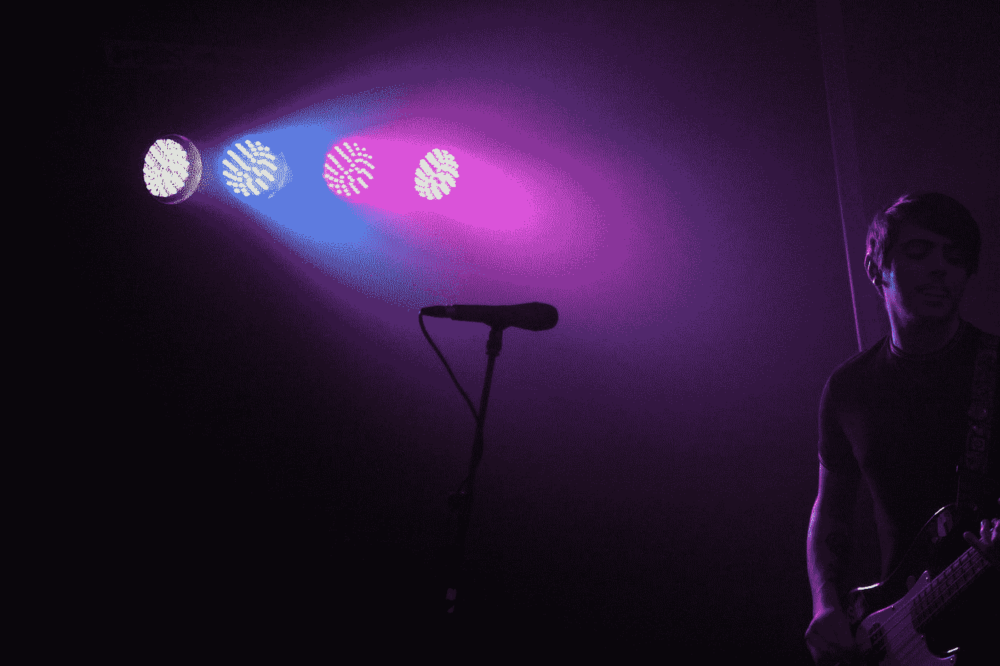
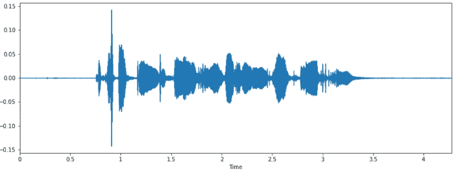
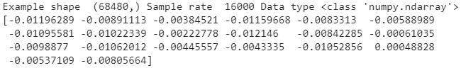
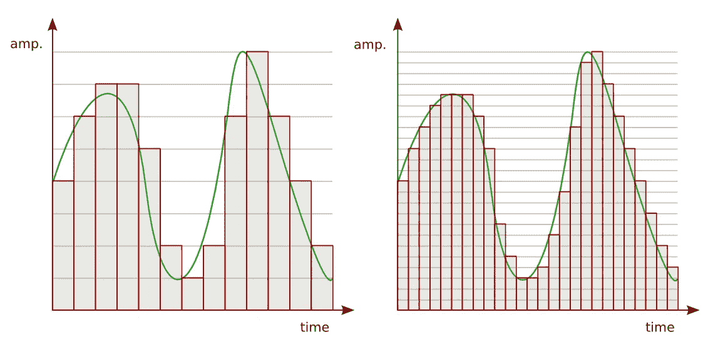
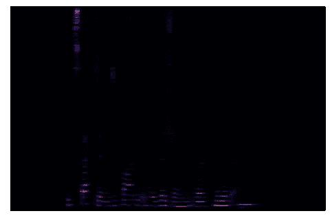
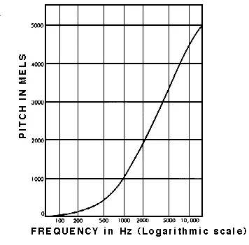
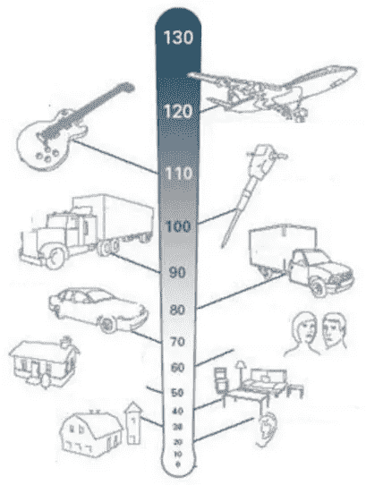
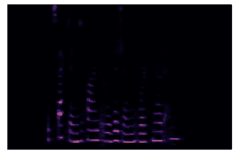
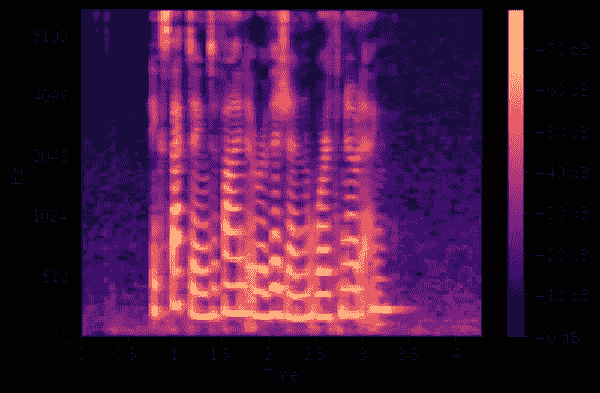

# 音频深度学习变得简单(第二部分):为什么 Mel 频谱图表现更好

> 原文：<https://towardsdatascience.com/audio-deep-learning-made-simple-part-2-why-mel-spectrograms-perform-better-aad889a93505?source=collection_archive---------1----------------------->

## 直观音频深度学习系列

## 用 Python 处理音频的简明指南。什么是 Mel 光谱图以及如何用简单的英语生成它们。

[乔丹](https://unsplash.com/@jordanmcdonald?utm_source=medium&utm_medium=referral)在 [Unsplash](https://unsplash.com?utm_source=medium&utm_medium=referral) 上的照片

这是我关于音频深度学习系列的第二篇文章。现在，我们知道了声音是如何以数字形式表示的，我们需要将其转换为声谱图以用于深度学习架构，让我们更详细地了解这是如何完成的，以及我们如何调整转换以获得更好的性能。

由于数据准备非常关键，尤其是在音频深度学习模型的情况下，这将是接下来两篇文章的重点。

下面是我计划在这个系列中发表的文章的简要总结。我的目标是不仅要理解事物是如何工作的，还要理解它为什么会这样工作。

1.  [最先进的技术](/audio-deep-learning-made-simple-part-1-state-of-the-art-techniques-da1d3dff2504) *(什么是声音，它是如何数字化的。音频深度学习在解决我们日常生活中的哪些问题。什么是光谱图，为什么它们都很重要。)*
2.  **为什么 Mel Spectrograms 性能更好—本文** *(用 Python 处理音频数据。什么是 Mel 光谱图以及如何生成它们)*
3.  [特性优化和增强](/audio-deep-learning-made-simple-part-3-data-preparation-and-augmentation-24c6e1f6b52) *(通过超参数调整和数据增强增强光谱图特性以获得最佳性能)*
4.  [声音分类](/audio-deep-learning-made-simple-sound-classification-step-by-step-cebc936bbe5) *(端到端的例子和架构对普通声音进行分类。一系列场景的基础应用。)*
5.  [自动语音识别](/audio-deep-learning-made-simple-automatic-speech-recognition-asr-how-it-works-716cfce4c706) *(语音转文本算法和架构，使用 CTC 丢失和解码进行序列对齐。)*
6.  [波束搜索](/foundations-of-nlp-explained-visually-beam-search-how-it-works-1586b9849a24)

# 音频文件格式和 Python 库

深度学习模型的音频数据通常会以数字音频文件的形式开始。通过听录音和音乐，我们都知道这些文件是根据声音的压缩方式以各种格式存储的。这些格式的例子有。wav、. mp3、。wma，。aac，。flac 等等。

Python 有一些很棒的音频处理库。Librosa 是最受欢迎的软件之一，拥有广泛的功能。scipy 也常用。如果您使用 Pytorch，它有一个名为 torchaudio 的配套库，与 Pytorch 紧密集成。它没有 Librosa 那么多的功能，但它是专门为深度学习而构建的。

它们都可以让你阅读不同格式的音频文件。第一步是加载文件。使用 librosa:

或者，您也可以使用 scipy 做同样的事情:

然后你可以想象声波:

将声波可视化(图片由作者提供)

听听吧。如果您使用的是 Jupyter 笔记本，您可以直接在单元格中播放音频。

在笔记本单元格中播放音频(图片由作者提供)

# 音频信号数据

正如我们在上一篇文章中看到的，音频数据是通过以固定的时间间隔对声波进行采样，并测量每个样本的声波强度或振幅而获得的。该音频的元数据告诉我们采样率，即每秒的样本数。

当音频以压缩格式保存在文件中时。当文件被加载时，它被解压缩并转换成一个 Numpy 数组。无论您从哪种文件格式开始，这个数组看起来都是一样的。

在内存中，音频以数字的时间序列表示，代表每个时间步长的幅度。例如，如果采样率是 16800，一秒钟的音频片段将有 16800 个数字。因为测量是以固定的时间间隔进行的，所以数据只包含振幅数字，而不包含时间值。给定采样速率，我们可以计算出每个幅度数测量是在哪个时刻进行的。

比特深度告诉我们每个样本的幅度测量可以取多少个可能值。例如，位深度为 16 意味着振幅数可以在 0 到 65535(2⁶-1)之间。位深度影响音频测量的分辨率，位深度越高，音频保真度越好。

位深度和采样率决定了音频分辨率([源](https://en.wikibooks.org/wiki/Sound_in_the_Digital_Domain#/media/File:SSampling.png))

# 光谱图

深度学习模型很少直接把这个原始音频作为输入。正如我们在[第 1 部分](/audio-deep-learning-made-simple-part-1-state-of-the-art-techniques-da1d3dff2504)中了解到的，通常的做法是将音频转换成声谱图。声谱图是声波的简明“快照”,因为它是图像，所以非常适合输入到为处理图像而开发的基于 CNN 的架构中。

频谱图是使用傅立叶变换从声音信号生成的。傅立叶变换将信号分解成其组成频率，并显示信号中每个频率的振幅。

声谱图将声音信号的持续时间分割成更小的时间片段，然后对每个片段进行傅立叶变换，以确定该片段中包含的频率。然后，它将所有这些部分的傅立叶变换组合成一个单一的图。

它绘制了频率(y 轴)与时间(x 轴)的关系，并使用不同的颜色来表示每个频率的幅度。颜色越亮，信号的能量越高。

简单的频谱图(图片由作者提供)

不幸的是，当我们展示这个光谱图时，没有太多的信息让我们看到。我们以前在科学课上看到的那些彩色光谱图都去哪了？

这是因为人类感知声音的方式。我们能够听到的大部分声音都集中在一个狭窄的频率和振幅范围内。让我们先探索一下，这样我们就能知道如何产生这些可爱的光谱图。

# 人类是如何听到频率的？

我们听到声音频率的方式被称为“音高”。这是对频率的主观印象。所以高音的频率比低音高。人类不会线性地感知频率。我们对低频之间的差异比对高频更敏感。

例如，如果你听不同的声音对，如下所示:

*   100 赫兹和 200 赫兹
*   1000 赫兹和 1100 赫兹
*   10000 赫兹和 10100 赫兹

你对每对声音之间的“距离”的*感知*是什么？你能区分每一对声音吗？

尽管在所有情况下，每对之间的实际频率差在 100 Hz 时完全相同，但 100Hz 和 200Hz 的那对*听起来比 1000Hz 和 1100Hz 的那对*更远。你很难区分 10000 赫兹和 10100 赫兹的频率对。

然而，如果我们认识到 200Hz 的频率实际上是 100Hz 的两倍，而 10100Hz 的频率只比 10000Hz 的频率高 1%,这似乎就不那么令人惊讶了。

这是人类感知频率的方式。我们听到的是对数标度，而不是线性标度。我们如何在数据中说明这一点？

## 梅尔标度

Mel 量表是通过对大量听众进行实验来考虑这一点的。这是一种音高标准，听众可以据此判断每个单元与下一个单元的音高距离相等。

梅尔标度测量人对音高的感知([来源](https://www.sfu.ca/sonic-studio-webdav/handbook/Graphics/Mel.gif)，经 Barry Truax 教授许可)

# 人类是如何听到振幅的？

人类对声音振幅的感知是声音的响度。类似于频率，我们听到的响度是对数的，而不是线性的。我们用分贝标度来说明这一点。

## 分贝标度

在这个范围内，0 dB 代表完全静音。从那里开始，测量单位呈指数增长。10 dB 比 0 dB 大 10 倍，20 dB 大 100 倍，30 dB 大 1000 倍。在这个范围内，超过 100 分贝的声音开始变得难以忍受。

常见声音的分贝水平(改编自[来源](https://commons.wikimedia.org/wiki/File:Decibel_scale.jpg)

我们可以看到，为了以现实的方式处理声音，在处理数据中的频率和振幅时，通过 Mel 标度和分贝标度使用对数标度是很重要的。

这正是 Mel 光谱图的目的。

# 梅尔光谱图

Mel 频谱图相对于绘制频率与时间关系的常规频谱图有两个重要变化。

*   它使用 Mel 标度，而不是 y 轴上的频率。
*   它使用分贝标度而不是振幅来表示颜色。

对于深度学习模型，我们通常使用这个而不是简单的声谱图。

让我们修改上面的谱图代码，用 Mel 标度代替频率。

使用 Mel 标度的光谱图(图片由作者提供)

这比以前好，但大多数光谱图仍然是暗的，没有携带足够的有用信息。所以我们修改一下，用分贝标度代替振幅。

梅尔光谱图(图片由作者提供)

终于！这是我们真正在寻找的东西😃。

# 结论

我们现在已经了解了如何预处理音频数据和准备 Mel 光谱图。但是在我们可以将它们输入深度学习模型之前，我们必须优化它们以获得最佳性能。

在下一篇文章中，我们将看看如何通过调整 Mel 光谱图来增强模型的数据，以及增加我们的音频数据来帮助我们的模型推广到更广泛的输入。

最后，如果你喜欢这篇文章，你可能也会喜欢我关于变形金刚、地理定位机器学习和图像字幕架构的其他系列。

</transformers-explained-visually-part-1-overview-of-functionality-95a6dd460452>  </leveraging-geolocation-data-for-machine-learning-essential-techniques-192ce3a969bc>  </image-captions-with-deep-learning-state-of-the-art-architectures-3290573712db>  

让我们继续学习吧！