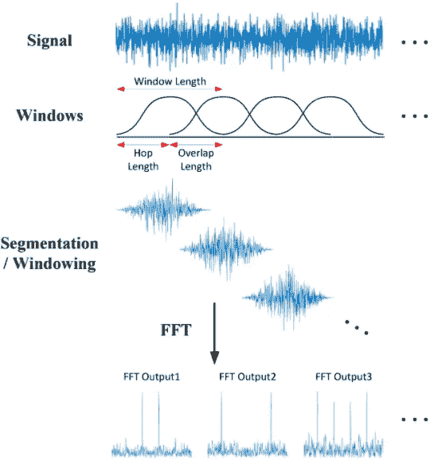
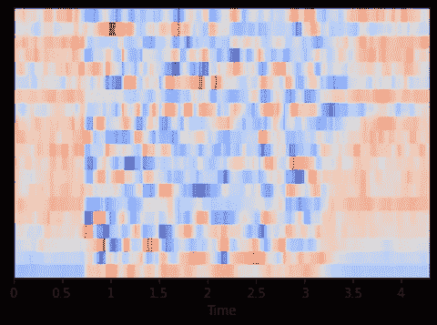
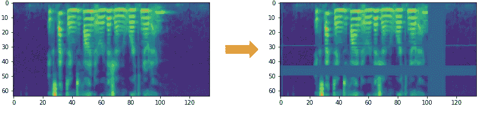
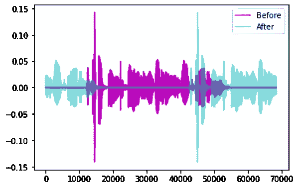
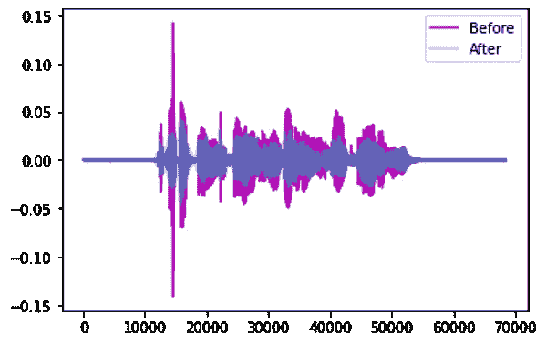
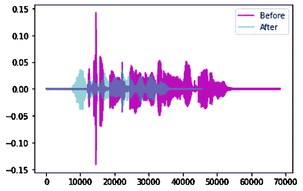
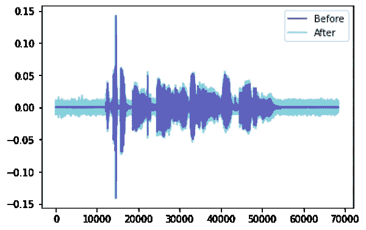

# 音频深度学习变得简单(第三部分):数据准备和增强

> 原文：<https://towardsdatascience.com/audio-deep-learning-made-simple-part-3-data-preparation-and-augmentation-24c6e1f6b52?source=collection_archive---------1----------------------->

## 直观音频深度学习系列

## 增强声谱图特性以获得最佳性能的简明指南。还有数据扩充，用简单的英语说

由[维达尔·诺德里-马西森](https://unsplash.com/@vidarnm?utm_source=medium&utm_medium=referral)在 [Unsplash](https://unsplash.com?utm_source=medium&utm_medium=referral) 上拍摄的照片

这是我关于音频深度学习系列的第三篇文章。到目前为止，我们已经了解了声音是如何数字化表示的，深度学习架构通常使用声音的声谱图。我们还看到了如何在 Python 中预处理音频数据以生成 Mel 光谱图。

在本文中，我们将更进一步，通过调整其超参数来增强我们的 Mel 谱图。我们还将研究音频数据的增强技术。这两者都是数据准备的重要方面，以便从我们的音频深度学习模型中获得更好的性能。

下面是我计划在这个系列中发表的文章的简要概述。我的目标是不仅要理解事物是如何工作的，还要理解它为什么会这样工作。

1.  [最先进的技术](/audio-deep-learning-made-simple-part-1-state-of-the-art-techniques-da1d3dff2504) *(什么是声音，它是如何数字化的。音频深度学习在解决我们日常生活中的哪些问题。什么是光谱图，为什么它们都很重要。)*
2.  [为什么 Mel Spectrograms 表现更好](/audio-deep-learning-made-simple-part-2-why-mel-spectrograms-perform-better-aad889a93505) *(用 Python 处理音频数据。什么是 Mel 光谱图以及如何生成它们)*
3.  **数据准备和扩充——本文** *(通过超参数调整和数据扩充增强光谱图特性以获得最佳性能)*
4.  [声音分类](/audio-deep-learning-made-simple-sound-classification-step-by-step-cebc936bbe5) *(端到端的例子和架构来分类普通的声音。一系列场景的基础应用。)*
5.  [自动语音识别](/audio-deep-learning-made-simple-automatic-speech-recognition-asr-how-it-works-716cfce4c706) *(语音转文本算法和架构，使用 CTC 丢失和解码进行序列对齐。)*
6.  [波束搜索](/foundations-of-nlp-explained-visually-beam-search-how-it-works-1586b9849a24) *(语音到文本和 NLP 应用程序常用的增强预测的算法)*

# 超参数调谐光谱图优化

在[第 2 部分](/audio-deep-learning-made-simple-part-2-why-mel-spectrograms-perform-better-aad889a93505)中，我们学习了什么是 Mel 光谱图，以及如何使用一些方便的库函数来创建一个。但是为了真正获得我们深度学习模型的最佳性能，我们应该针对我们试图解决的问题优化 Mel 光谱图。

我们可以使用许多超参数来调整声谱图的生成方式。为此，我们需要理解一些关于光谱图是如何构建的概念。(我会尽量保持简单直观！)

## 快速傅立叶变换

计算傅立叶变换的一种方法是使用一种称为 DFT(离散傅立叶变换)的技术。DFT 的计算非常昂贵，因此在实践中，使用 FFT(快速傅立叶变换)算法，这是实现 DFT 的有效方式。

然而，FFT 将给出音频信号整个时间序列的整体频率分量。它不会告诉您音频信号中的这些频率成分是如何随时间变化的。例如，您将看不到音频的第一部分具有高频率，而第二部分具有低频率，等等。

## 短时傅立叶变换(STFT)

为了获得更精细的视图并查看频率随时间的变化，我们使用 STFT 算法(短时傅立叶变换)。STFT 是傅立叶变换的另一种变体，它通过使用滑动时间窗口将音频信号分解成更小的部分。它对每个部分进行 FFT，然后将它们合并。因此，它能够捕捉频率随时间的变化。

STFT 沿着信号滑动一个重叠窗口，并对每个片段进行傅立叶变换([源](https://www.mdpi.com/2076-3417/10/20/7208/htm)

这将沿着时间轴将信号分成多个部分。其次，它还将信号沿频率轴分成几个部分。它获取整个频率范围，并将其划分为等间距的频段(在 Mel 音阶中)。然后，对于每个时间段，它计算每个频带的振幅或能量。

让我们用一个例子来说明这一点。我们有一个 1 分钟的音频剪辑，包含 0Hz 到 10000 Hz 之间的频率(在 Mel 范围内)。假设梅尔谱图算法:

*   选择窗口，以便将我们的音频信号分成 20 个时间段。
*   决定将我们的频率范围分成 10 个频段(即 0–1000 赫兹、1000–2000 赫兹、…9000–10000 赫兹)。

该算法的最终输出是形状为(10，20)的 2D Numpy 数组，其中:

*   20 列中的每一列代表一个时间段的 FFT。
*   10 行中的每一行代表一个频带的幅度值。

我们来看第一列，这是第一时间段的 FFT。它有 10 行。

*   第一行是 0–1000Hz 之间第一个频带的振幅。
*   第二行是 1000–2000Hz 之间第二频带的振幅。
*   …等等。

阵列中的每一列都成为 Mel 光谱图图像中的一个“列”。

## Mel 光谱图超参数

这为我们调谐 Mel 谱图提供了超参数。我们将使用 Librosa 使用的参数名。(其他库将具有等效的参数)

**频段**

*   fmin —最小频率
*   fmax —显示的最大频率
*   n_mels —频带的数量(即梅尔箱柜)。这是声谱图的高度

**时间段**

*   n_fft —每个时间段的窗口长度
*   hop_length —每步滑动窗口的样本数。因此，声谱图的宽度=样本总数/跳跃长度

您可以根据您拥有的音频数据类型和您正在解决的问题来调整这些超参数。

# MFCC(人类语言)

Mel Spectrograms 对于大多数音频深度学习应用来说效果很好。然而，对于处理人类语音的问题，如自动语音识别，您可能会发现 MFCC(梅尔频率倒谱系数)有时工作得更好。

这些基本上采用 Mel 光谱图并应用几个进一步的处理步骤。这从 Mel 频谱图中选择对应于人类说话的最常见频率的频带的压缩表示。

由音频生成的 MFCC(图片由作者提供)

上面，我们已经看到相同音频的梅尔频谱图具有形状(128，134)，而 MFCC 具有形状(20，134)。MFCC 从音频中提取与捕捉声音的基本质量最相关的小得多的特征集。

# 数据扩充

增加数据集多样性的一种常用方法是人工增加数据，尤其是在数据不足的情况下。我们通过小幅修改现有的数据样本来做到这一点。

例如，对于图像，我们可能会做一些事情，如稍微旋转图像，裁剪或缩放图像，修改颜色或光照，或者给图像添加一些噪声。由于图像的语义没有发生实质性的变化，因此来自原始样本的相同目标标签仍然适用于增强样本。例如，如果图像被标记为“猫”，则增强图像也将是“猫”。

但是，从模型的角度来看，这感觉像是一个新的数据样本。这有助于您的模型推广到更大范围的图像输入。

就像图像一样，也有几种技术来增强音频数据。这种增强既可以在产生声谱图之前对原始音频进行，也可以在生成的声谱图上进行。扩充频谱图通常会产生更好的结果。

## 光谱图增强

用于图像的常规变换不适用于光谱图。例如，水平翻转或旋转会显著改变声谱图及其代表的声音。

相反，我们使用一种称为 SpecAugment 的方法，在这种方法中，我们将声谱图的某些部分分离出来。有两种口味:

*   频率屏蔽—通过在谱图上添加水平条，随机屏蔽一系列连续频率。
*   时间掩码—类似于频率掩码，不同之处在于我们使用竖条随机从谱图中划出时间范围。

(图片由作者提供)

## 原始音频增强

有几个选项:

时移—将音频向左或向右移动一个随机量。

*   对于没有特定顺序的声音，如交通或海浪，音频可以环绕。

通过时移增强(图片由作者提供)

*   另一方面，对于像人类说话这种顺序很重要的声音，间隙可以用沉默来填充。

音高移位—随机修改声音各部分的频率。

通过音高变换增强(图片由作者提供)

时间延伸—随机减慢或加快声音。

通过时间拉伸增强(图片由作者提供)

添加噪声—向声音添加一些随机值。

通过添加噪声进行增强(图片由作者提供)

# 结论

我们现在已经看到了我们如何预处理和准备音频数据以输入到深度学习模型。这些方法通常应用于大多数音频应用。

我们现在准备探索一些真正的深度学习应用，并将在下一篇文章中涵盖一个音频分类示例，在那里我们将看到这些技术的实际应用。

最后，如果你喜欢这篇文章，你可能也会喜欢我关于变形金刚、地理定位机器学习和图像字幕架构的其他系列。

</transformers-explained-visually-part-1-overview-of-functionality-95a6dd460452>  </leveraging-geolocation-data-for-machine-learning-essential-techniques-192ce3a969bc>  </image-captions-with-deep-learning-state-of-the-art-architectures-3290573712db>  

让我们继续学习吧！