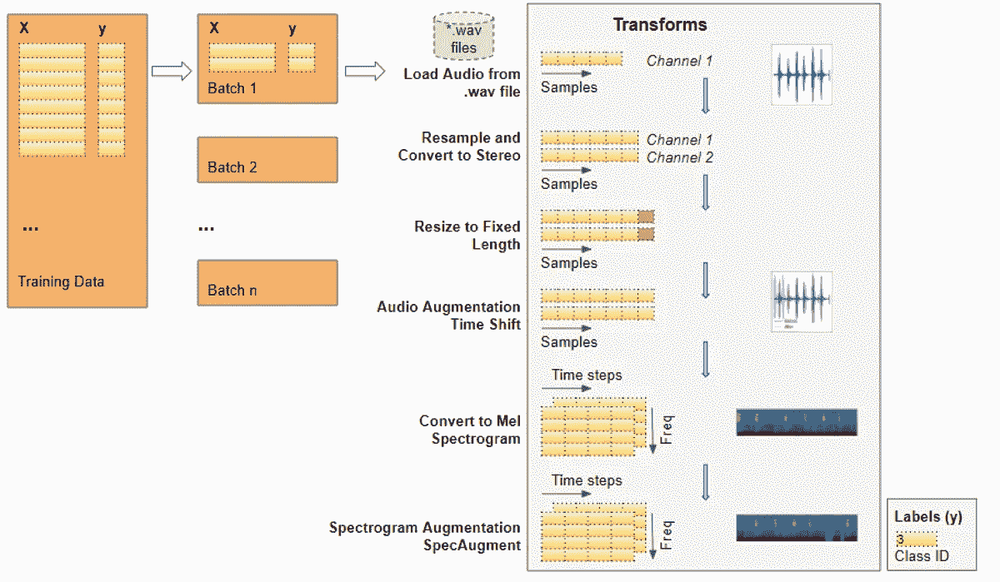

# 音频深度学习变得简单:声音分类，循序渐进

> 原文：<https://towardsdatascience.com/audio-deep-learning-made-simple-sound-classification-step-by-step-cebc936bbe5?source=collection_archive---------0----------------------->

## [动手教程](https://towardsdatascience.com/tagged/hands-on-tutorials)，直观音频深度学习系列

## 音频深度学习基础应用场景的端到端示例和架构，用简单的英语讲述。

照片由[布鲁斯·马尔斯](https://unsplash.com/@brucemars?utm_source=medium&utm_medium=referral)在 [Unsplash](https://unsplash.com?utm_source=medium&utm_medium=referral) 上拍摄

声音分类是音频深度学习中使用最广泛的应用之一。它包括学习对声音进行分类和预测声音的类别。这种类型的问题可以应用于许多实际场景，例如对音乐剪辑进行分类以识别音乐的流派，或者对一组说话者的简短话语进行分类以基于语音识别说话者。

在本文中，我们将通过一个简单的演示应用程序来理解用于解决此类音频分类问题的方法。我的目标是不仅要理解事物是如何工作的，还要理解它为什么会这样工作。

我的音频深度学习系列中还有几篇文章，你可能会觉得有用。他们探索了这一领域的其他有趣主题，包括我们如何为深度学习准备音频数据，为什么我们将 Mel 光谱图用于深度学习模型，以及它们是如何生成和优化的。

1.  [最先进的技术](/audio-deep-learning-made-simple-part-1-state-of-the-art-techniques-da1d3dff2504) *(什么是声音，它是如何数字化的。音频深度学习在解决我们日常生活中的哪些问题。什么是光谱图，为什么它们都很重要。)*
2.  [为什么 Mel Spectrograms 表现更好](/audio-deep-learning-made-simple-part-2-why-mel-spectrograms-perform-better-aad889a93505) *(用 Python 处理音频数据。什么是 Mel 光谱图以及如何生成它们)*
3.  [数据准备和扩充](/audio-deep-learning-made-simple-part-3-data-preparation-and-augmentation-24c6e1f6b52) *(通过超参数调整和数据扩充增强光谱图特征以获得最佳性能)*
4.  [自动语音识别](/audio-deep-learning-made-simple-automatic-speech-recognition-asr-how-it-works-716cfce4c706) *(语音转文本算法和架构，使用 CTC 丢失和解码进行序列对齐。)*
5.  [波束搜索](/foundations-of-nlp-explained-visually-beam-search-how-it-works-1586b9849a24) *(语音到文本和 NLP 应用程序常用的增强预测的算法)*

# 音频分类

就像使用 MNIST 数据集对手写数字进行分类被认为是计算机视觉的“Hello World”类型的问题一样，我们可以将这一应用视为音频深度学习的入门问题。

我们将从声音文件开始，将它们转换成频谱图，将它们输入到 CNN plus 线性分类器模型中，并对声音所属的类别进行预测。

音频分类应用程序(图片由作者提供)

有许多合适的数据集可用于不同类型的声音。这些数据集包含大量音频样本，每个样本都有一个类别标签，根据您要解决的问题来识别声音的类型。

这些类别标签通常可以从音频样本的文件名的某个部分或者从文件所在的子文件夹名称中获得。或者，类标签在单独的元数据文件中指定，通常是 TXT、JSON 或 CSV 格式。

# 示例问题—对普通城市声音进行分类

在我们的演示中，我们将使用城市声音 8K [数据集](https://urbansounddataset.weebly.com/urbansound8k.html)，它包含了从日常城市生活中记录的普通声音的语料库。这些声音取自 10 个类别，如钻井、狗叫和警笛声。每个声音样本都标有其所属的类别。

下载数据集后，我们看到它由两部分组成:

*   “ *audio* 文件夹中的**音频文件**:它有 10 个子文件夹，分别命名为“ *fold1* ”到“ *fold10* ”。每个子文件夹包含多个'*。wav* '音频样本等'*fold 1/103074–7–1–0 . wav*
*   “元数据”文件夹中的**元数据**:它有一个文件“ *UrbanSound8K.csv* ”，该文件包含关于数据集中每个音频样本的信息，例如其文件名、其类别标签、“文件夹”子文件夹位置等等。对于这 10 个类别中的每一个，类别标签是一个从 0 到 9 的数字类别 ID。数字 0 代表空调，1 代表汽车喇叭，等等。

样本长度约为 4 秒。这是一个样本的样子:

演习的音频样本(图片由作者提供)

采样速率、通道数量、位数和音频编码

数据集创建者的建议是使用折叠进行 10 重交叉验证，以报告指标并评估模型的性能。然而，由于本文中我们的目标主要是作为音频深度学习示例的演示，而不是获得最佳指标，因此我们将忽略折叠，并将所有样本简单地视为一个大型数据集。

# 准备培训数据

至于大多数深度学习问题，我们会按照以下步骤:

深度学习工作流程(图片由作者提供)

这个问题的训练数据相当简单:

*   特征(X)是音频文件路径
*   目标标签(y)是类名

因为数据集有一个包含这些信息的元数据文件，所以我们可以直接使用它。元数据包含关于每个音频文件的信息。

既然是 CSV 文件，我们可以用熊猫来读。我们可以从元数据中准备要素和标签数据。

这为我们提供了训练数据所需的信息。

带有音频文件路径和类别 id 的训练数据

## 元数据不可用时扫描音频文件目录

拥有元数据文件对我们来说很容易。我们如何为不包含元数据文件的数据集准备数据？

许多数据集仅由排列在文件夹结构中的音频文件组成，从该文件夹结构中可以导出类别标签。为了以这种格式准备我们的训练数据，我们将执行以下操作:

元数据不可用时准备训练数据(图片由作者提供)

*   扫描目录并准备好所有音频文件路径的列表。
*   从每个文件名或父子文件夹的名称中提取类别标签
*   将每个类名从文本映射到数字类 ID

不管有没有元数据，结果都是一样的——特征由一列音频文件名组成，目标标签由类 id 组成。

# 音频预处理:定义变换

这种带有音频文件路径的训练数据不能直接输入到模型中。我们必须从文件中加载音频数据，并对其进行处理，以便它是模型所期望的格式。

当我们读取和加载音频文件时，这种音频预处理将在运行时动态完成。这种方法类似于我们对图像文件所做的。由于音频数据和图像数据一样，可能相当大且占用大量内存，所以我们不想提前一次将整个数据集读入内存。因此，我们在训练数据中只保留音频文件名(或图像文件名)。

然后，在运行时，当我们一次训练一批模型时，我们将加载该批的音频数据，并通过对音频应用一系列转换来处理它。这样，我们一次只能在内存中保存一批音频数据。

对于图像数据，我们可能有一个转换管道，首先将图像文件作为像素读取并加载。然后，我们可能会应用一些图像处理步骤来调整数据的形状和大小，将它们裁剪为固定的大小，并将它们从 RGB 转换为灰度。我们可能还会应用一些图像增强步骤，如旋转、翻转等。

音频数据的处理非常相似。现在我们只是在定义函数，稍后当我们在训练期间向模型提供数据时，它们将会运行。

预处理输入到我们模型的训练数据(图片由作者提供)

## 从文件中读取音频

我们需要做的第一件事是读取并加载音频文件。wav”格式。因为我们在这个例子中使用 Pytorch，下面的实现使用 torchaudio 进行音频处理，但是 librosa 也可以。

从文件加载的音频波(图片由作者提供)

## 转换到两个频道

一些声音文件是单声道的(即 1 个音频通道),而它们中的大多数是立体声的(即 2 个音频通道)。由于我们的模型期望所有项目具有相同的尺寸，我们将通过将第一个通道复制到第二个通道来将单声道文件转换为立体声。

## 标准化采样率

一些声音文件以 48000Hz 的采样率进行采样，而大多数以 44100Hz 的采样率进行采样。这意味着对于一些声音文件，1 秒钟的音频将具有 48000 的数组大小，而对于其他声音文件，它将具有 44100 的较小数组大小。同样，我们必须将所有音频标准化并转换为相同的采样速率，以便所有阵列具有相同的维度。

## 调整到相同的长度

然后，我们调整所有音频样本的大小，使其具有相同的长度，方法是通过用静音填充来延长其持续时间，或者将其截断。我们将该方法添加到我们的 AudioUtil 类中。

## 数据扩充:时移

接下来，我们可以对原始音频信号进行数据扩充，方法是应用时移，将音频向左或向右移动一个随机量。在这篇[文章](/audio-deep-learning-made-simple-part-3-data-preparation-and-augmentation-24c6e1f6b52)中，我将更详细地介绍这种和其他数据增强技术。

声波的时移(图片由作者提供)

## 梅尔光谱图

然后，我们将增强的音频转换为 Mel 声谱图。它们捕捉音频的基本特征，通常是将音频数据输入深度学习模型的最合适的方式。为了获得更多关于这方面的背景知识，你可能想阅读我的文章([这里](/audio-deep-learning-made-simple-part-2-why-mel-spectrograms-perform-better-aad889a93505)和[这里](/audio-deep-learning-made-simple-part-3-data-preparation-and-augmentation-24c6e1f6b52))，这些文章用简单的语言解释了什么是 Mel 频谱图，为什么它们对音频深度学习至关重要，以及它们是如何生成的，以及如何调整它们以从你的模型中获得最佳性能。

一个声波的 Mel 声谱图(图片由作者提供)

## 数据扩充:时间和频率屏蔽

现在，我们可以进行另一轮增强，这次是在 Mel 声谱图上，而不是在原始音频上。我们将使用一种称为 SpecAugment 的技术，它使用这两种方法:

*   频率屏蔽—通过在谱图上添加水平条，随机屏蔽一系列连续频率。
*   时间掩码—类似于频率掩码，不同之处在于我们使用竖条随机从谱图中划出时间范围。

光谱增强后的 Mel 光谱图。请注意水平和垂直蒙版带(图片由作者提供)

# 定义自定义数据加载器

既然我们已经定义了所有预处理转换函数，我们将定义一个自定义 Pytorch 数据集对象。

要使用 Pytorch 将数据提供给模型，我们需要两个对象:

*   使用所有音频转换来预处理音频文件并一次准备一个数据项的自定数据集对象。
*   一个内置的 DataLoader 对象，它使用 Dataset 对象提取单个数据项并将它们打包成一批数据。

# 使用数据加载器准备批量数据

我们需要将数据输入到模型中的所有函数现在都已经定义好了。

我们使用自定义数据集从 Pandas 数据框架中加载要素和标签，并以 80:20 的比例将该数据随机分为训练集和验证集。然后，我们使用它们来创建我们的训练和验证数据加载器。

分割我们的数据用于训练和验证(图片由作者提供)

当我们开始训练时，数据加载器将随机获取一批包含音频文件名列表的输入特征，并对每个音频文件运行预处理音频转换。它还将获取一批包含类 id 的相应目标标签。因此，它将一次输出一批训练数据，这些数据可以直接作为输入输入到我们的深度学习模型中。

数据加载器应用转换并一次准备一批数据(图片由作者提供)

让我们从一个音频文件开始，逐步了解数据转换的步骤:

*   文件中的音频被加载到 shape 的 Numpy 数组中(num_channels，num_samples)。大多数音频以 44.1kHz 采样，持续时间约为 4 秒，结果是 44，100 * 4 = 176，400 个样本。如果音频有一个声道，数组的形状将是(1，176，400)。类似地，持续时间为 4 秒、具有 2 个声道并以 48kHz 采样的音频将具有 192，000 个样本和(2，192，000)的形状。
*   由于每个音频的通道和采样速率不同，接下来的两个转换会将音频重新采样为标准的 44.1kHz 和标准的 2 通道。
*   由于一些音频剪辑可能多于或少于 4 秒，我们也将音频持续时间标准化为 4 秒的固定长度。现在，所有项目的数组都具有相同的形状(2，176，400)
*   时移数据扩充现在随机地向前或向后移动每个音频样本。形状没有改变。
*   增强的音频现在被转换成 Mel 频谱图，产生(num_channels，Mel freq _ bands，time_steps) = (2，64，344)的形状
*   SpecAugment 数据增强现在可以将时间和频率遮罩随机应用于 Mel 光谱图。形状没有改变。

因此，每个批次将有两个张量，一个用于包含 Mel 光谱图的 *X* 特征数据，另一个用于包含数字类 id 的 *y* 目标标签。这些批次是从每个训练时期的训练数据中随机选取的。

每个批次都有一个形状(批次 _sz，数量 _ 通道，Mel 频率 _ 波段，时间 _ 步骤)

一批(X，y)数据

我们可以看到一批中的一个项目。我们看到带有垂直和水平条纹的 Mel 谱图，显示了频率和时间掩蔽数据增强。

数据现在可以输入到模型中了。

# 创建模型

我们刚刚完成的数据处理步骤是我们的音频分类问题中最独特的方面。从这里开始，模型和训练过程与标准图像分类问题中通常使用的非常相似，并且不特定于音频深度学习。

由于我们的数据现在由光谱图图像组成，我们构建了一个 CNN 分类架构来处理它们。它有四个卷积块来生成特征图。然后，这些数据被重新调整为我们需要的格式，以便可以输入到线性分类器层，最终输出 10 个类别的预测。

该模型采用一批预处理数据并输出类别预测(图片由作者提供)

关于模型如何处理一批数据的更多细节:

*   将一批图像输入到具有 shape (batch_sz，num_channels，Mel freq_bands，time_steps) ie 的模型中。(16, 2, 64, 344).
*   每个 CNN 层应用其过滤器来增加图像深度。频道数量。随着内核和步长的应用，图像的宽度和高度会减小。最后，经过四个 CNN 层，我们得到输出的特征地图 ie。(16, 64, 4, 22).
*   这将汇集并展平为(16，64)的形状，然后输入到线性层。
*   线性层为每个类别 ie 输出一个预测分数。(16, 10)

# 培养

我们现在准备创建训练循环来训练模型。

我们为优化器、损失和调度器定义函数，以随着训练的进行动态地改变我们的学习率，这通常允许训练在更少的时期内收敛。

我们为几个时期训练模型，在每次迭代中处理一批数据。我们跟踪一个简单的准确性度量，它测量正确预测的百分比。

# 推理

通常，作为训练循环的一部分，我们还会评估验证数据的度量。然后，我们将对看不见的数据进行推断，也许是通过从原始数据中保留一个测试数据集。但是，出于本演示的目的，我们将使用验证数据。

我们运行一个推理循环，小心禁用梯度更新。通过模型执行正向传递来获得预测，但是我们不需要反向传递或运行优化器。

# 结论

我们现在已经看到了声音分类的端到端示例，这是音频深度学习中最基础的问题之一。这不仅在广泛的应用中使用，而且我们在这里讨论的许多概念和技术将与更复杂的音频问题相关，例如自动语音识别，我们从人类语音开始，理解人们在说什么，并将其转换为文本。

最后，如果你喜欢这篇文章，你可能也会喜欢我关于变形金刚、地理定位机器学习和图像字幕架构的其他系列。

</transformers-explained-visually-part-1-overview-of-functionality-95a6dd460452>  </leveraging-geolocation-data-for-machine-learning-essential-techniques-192ce3a969bc>  </image-captions-with-deep-learning-state-of-the-art-architectures-3290573712db>  

让我们继续学习吧！