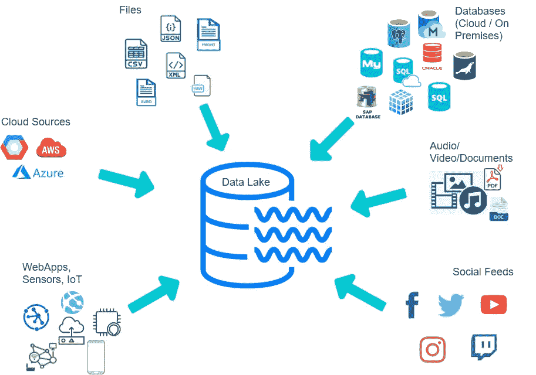
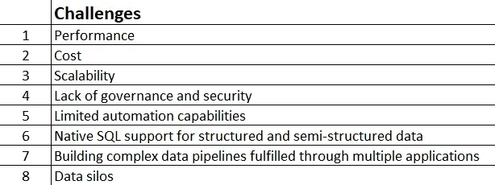
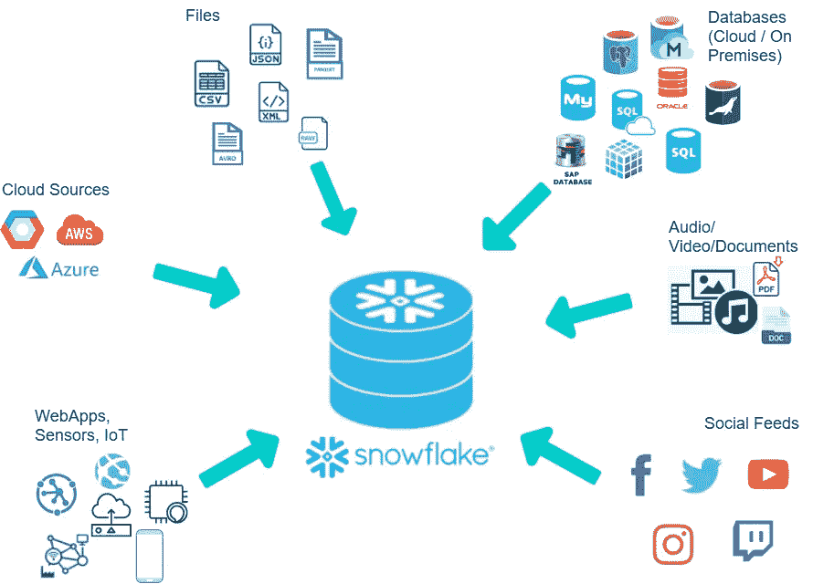
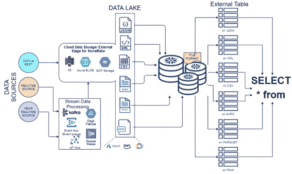
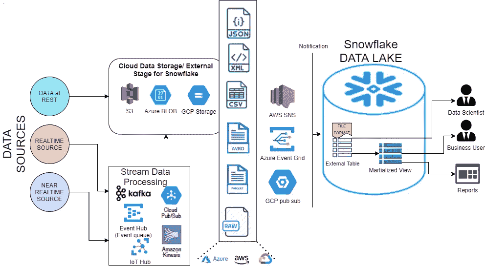
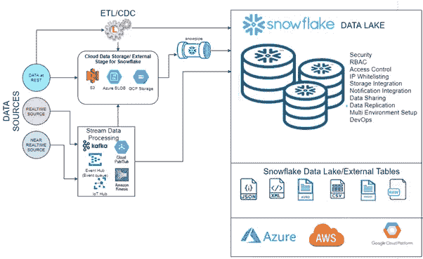
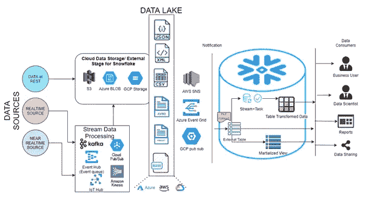

# 用雪花增强您的数据湖分析

> 原文：<https://towardsdatascience.com/augment-your-data-lake-analytics-with-snowflake-b417f1186615?source=collection_archive---------13----------------------->

凯利·西克玛在 [Unsplash](https://unsplash.com?utm_source=medium&utm_medium=referral) 上的照片

## 对雪花供电的数据湖的建议

M 如今，现代企业需要处理各种大规模、快速移动的数据源，这给数据团队带来了巨大的压力，他们需要持续提取、转换和加载数据以获得有意义的见解。除非出于分析目的对数据和信息进行战略性管理，否则它们不会提供切实的价值。

## 什么是数据湖？

虽然这是一个众所周知的概念，但对于门外汉来说,“数据湖”最简单的形式就是存储所有原始数据的仓库。

让我们更进一步；对于现代分析需求，数据湖是一个中央存储库，用于存储结构化数据(如本地或云数据库)、半结构化数据(如 json、avro、parquet、xml 和其他原始文件)以及非结构化数据(如从几个(甚至数百万个)批处理或连续数据流中获取的音频、视频和二进制文件)。

数据湖，作者图片

## 为什么是数据湖？

每个组织都以这样或那样的方式处理 SaaS(软件即服务)数据，因为 SaaS 应用程序易于配置和使用。因此，每秒钟都会产生指数级的数据量，这使得实时保护和存储数据变得非常困难。此外，如果不处理这些指数数据，就有可能失去从中获得的价值。

这就是数据湖出现的原因。数据湖平台强健、灵活且易于扩展，可为各种使用情形下的用户提供海量数据集的快速分析，包括维护单一真实来源。

让我们看看理想的数据湖需要解决的一些挑战:

挑战，作者图片

## 具有*数据湖工作负载*的雪花云数据平台

雪花——理想的数据湖，作者图片

雪花通过原生 SQL 支持实现快速数据访问、查询性能和复杂转换。它内置了数据访问控制和基于角色的访问控制(RBAC)来管理和监控数据访问安全性。

雪花为数据湖工作负载提供了灵活、弹性、健壮的大规模并行处理(MPP)架构，能够在单个 SQL 查询中加入各种数据格式(结构化和半结构化)。

*(*注:对非结构化数据的支持目前在* ***数据湖工作量*** *处于私下预览)*

1.  **用例:** *增强现有云数据湖功能*

企业在构建、设计和实现基于 S3、Blob 或 GCP 存储的数据湖方面花费了大量精力。为了实现简单性并利用雪花数据湖工作负载的高性能，企业应该扩大现有的数据湖。

**如何？**

外部表和简单的 SELECT 语句，按作者分类的图像

“雪花存储集成”功能将 AWS S3、Azure BLOB 或 GCP 存储上的云存储作为外部表(本质上是雪花生态系统之外的数据文件中的表)集成到雪花数据湖。

通过创建一个存储集成和一种文件格式(可以把它想象成一个决定文件格式配置的雪花对象)，来自雪花的查询可以使用简单和标准的 ANSI SQL(如 select 语句)直接选择数据。这并不需要先将数据从它的云位置文件加载到雪花中。此外，这有助于确定相关数据是否是分析所必需的，以及是否应该存储在数据湖中。

另一方面，为了提高查询性能，可以在外部表之上使用带有“部分”选项的物化视图。物化视图中的这些数据可以在“云通知服务”的基础上自动刷新，该服务在外部“阶段”创建新数据文件时通知雪花。

**优点？**

实体化视图和外部表，按作者排序的图像

以下优势直接取自雪花——[此处](https://www.snowflake.com/workloads/data-lake/):

*   雪花支持对数据湖执行并发查询，而不会影响性能。
*   使用外部表直接查询数据湖中的数据，而不必移动数据。
*   通过对外部表使用物化视图来提高查询性能。
*   将外部表与 Apache Hive metastore 同步。
*   使用分区自动刷新功能，从您的数据湖中自动注册新文件。
*   借助 Snowsight(雪花的内置可视化用户界面)加速数据探索。

2.**用例:** *雪花表(原始数据湖+数据管道上的自动化)*

雪花和数据管道，作者图片

使用雪花作为数据湖工作负载，从所有来源将所有数据按原样接收到雪花数据湖表**中。轻松地同时对结构化和半结构化数据执行 SQL 操作。**

> 矢量化拼花扫描仪的最新 GA **功能将拼花文件的性能提高了 8 倍。**

利用雪花作为数据湖有助于使数据存储更便宜、压缩和高度安全。

**使用外部表格的自动化数据管道**

使用外部表格的自动化数据管道，按作者分类的图像

“流”、“数据共享”的可用性以及半结构化数据文件(如 parquet、avro 等)的增强性能。，您可以为云存储中的外部数据构建自动化的数据管道。

**如何自动化？**

当一个新文件进入云存储时，一个通知会在外部表上触发一个流。流和“任务”执行加载(通过转换)到雪花表格中。最后，通过外部(现在可能)和内部表的数据共享可以用来共享数据。或者我们可以简单地将内部表中的数据(丰富的数据)卸载到云存储中。这里的亮点是，***加载- >转换- >卸载过程不需要人工干预***。

**优点？**

以下优势直接取自雪花— [此处](https://www.snowflake.com/workloads/data-lake/):

*   我们应该用雪花来扩充现有的数据湖，以提供免维护的自动化。
*   通过使用云通知和“Snowpipe”的连续数据管道，自动接收数据并支持变更数据捕获(CDC)。
*   我们使用标准的 ANSI SQL 高效地转换数据，并通过利用雪花的自动扩展、缩小、内扩或外扩计算将丰富的数据加载到雪花中。
*   我们使用针对“变体”数据类型和不同摄取风格的流和任务来构建和编排数据管道。
*   使用 RBAC 模型实现粒度访问控制。
*   轻松实现数据屏蔽、行列级过滤访问，增强数据安全性。
*   使用扩展功能，如数据共享和市场。
*   利用雪花压缩数据存储来减少数据量并最终降低成本。
*   使用单一云数据平台满足您的所有数据需求，加快数据接收、转换和消费。
*   向所有数据用户提供您的数据的一个副本—真实的单一来源。
*   通过将所有数据放入雪花中，最大限度地减少外部数据湖管理、调优和优化的任务。

总而言之，考虑使用*雪花数据湖工作负载*进行高效的数据接收、转换和编排。

如果您想要更多信息或帮助扩充或迁移您现有的数据湖，或者完全在雪花上构建一个新的数据湖，请随时联系我们。

<https://www.indigochart.com/>  

或者发送电子邮件至[hello@indigochart.com](mailto:hello@indigochart.com)并在 LinkedIn 上关注我们:

<https://www.linkedin.com/company/indigochart/>  

**参考文献:**

[1] [雪花文件](https://docs.snowflake.com/en/)，雪花公司。

[2] [雪花为数据湖](https://www.snowflake.com/workloads/data-lake/)，雪花公司。

[3] [自动化数据管道](https://www.snowflake.com/blog/external-tables-are-now-generally-available-on-snowflake/)，雪花公司。

[4] [雪花数据湖](https://www.snowflake.com/#data-lake)，雪花公司。