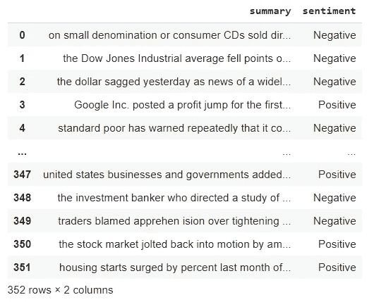
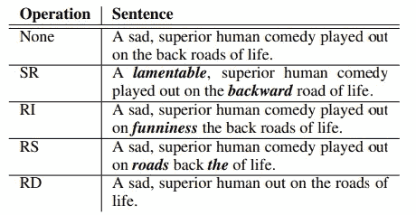
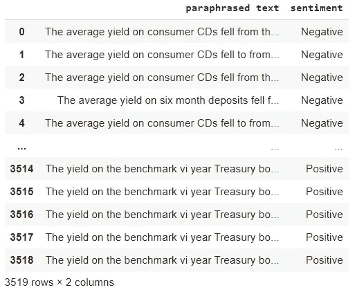
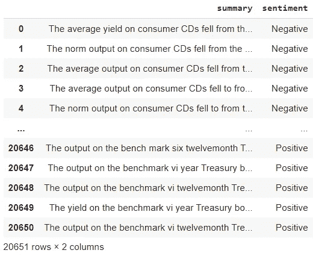

# 使用情感分析的转换器和同义词替换来扩充您的小型数据集(第 1 部分)

> 原文：<https://towardsdatascience.com/augment-your-small-dataset-using-transformers-synonym-replacement-for-sentiment-analysis-part-1-87a838cd0baa?source=collection_archive---------11----------------------->

## 如何增加数据集的大小，以便稍后用于 NLP 分类任务。


作家创造的形象。

现在是 2021 年 1 月，一场风暴正在 Reddit 上酝酿。一群个人投资者，即 sub Reddit '[*wall street bets*](https://en.wikipedia.org/wiki/R/wallstreetbets)的成员，开始谈论一家公司，行业专业人士和机构投资者认为这家公司正在走下坡路。而且理由很充分——他们的业务正在被在线零售商侵蚀。

但这些“流氓”个人投资者并不认同业内专业人士的观点。许多人用有意义的分析支持的金融术语来表达他们的观点。散户投资者对机构投资者前所未有的异议，以及 Reddit 用户的集体交易行为，导致 ***GameStop*** 股票暴涨。短短几天内，股价从 17.25 美元飙升至 500 多美元，创造了历史上最大的“空头挤压”之一。

为什么个人投资者战胜了大机构，为什么没有人预见到这一天的到来？

因为没人在听。

## 输入情感分析:

情感分析是*自然语言处理*(*)的一种形式。它识别和量化文本数据、情感状态以及其中的主题、人物和实体的主观信息。**情感分析**使用 NLP 方法和算法，这些方法和算法或者是基于规则的，或者是混合的，或者是依靠机器学习技术从**数据集中学习数据。**因此，it 最具挑战性的一个方面是在大规模范围内寻找并标记有意义的数据。*

*回到我们最初的案子。如果机构将人气作为分析指标，GameStop 的反弹不会让任何人感到意外。但是，要实现这一目标，还需要克服一些挑战。*

## *魔鬼就在数据中:*

*首先，存在金融术语独特的问题。这个行业充满了术语，大多数情绪分析工具训练的数据不一定能够理解。然后是它的领域限制的本质和整体缺乏可用的结构化数据(分类)的问题。让我们现实一点，用 IMDb 电影评论或推特数据集的公共数据来训练 NLP 模型是不会成功的。综上所述，这些挑战导致大多数用于金融的现成 NLP 工具表现参差不齐。*

*我们需要的是来自声誉良好的金融领域来源的标记数据。尽管有大量的非结构化数据，但没有足够多的标记源来训练一个监督模型，以解决植根于金融情绪分析的内在挑战。*

*传统上，解决这一需求意味着手动通读成千上万的文档，对它们进行分类并相应地进行标记。这将是一个漫长而痛苦的过程，并不能保证很快给我们想要的结果。*

*幸运的是**变形金刚**及其通过迁移学习执行**数据扩充和分类的能力可以改变这一切。***

*在这篇文章中，我们将基于我从网上收集和标记的金融文章的小样本建立一个大型数据集，我们随后将使用它来建立一个情感分析模型，该模型可以测量金融数据的情感。*

**

*照片由[罗文·辛普森](https://unsplash.com/@nzrhan?utm_source=medium&utm_medium=referral)在 [Unsplash](https://unsplash.com?utm_source=medium&utm_medium=referral) 上拍摄*

## *什么是变形金刚和迁移学习？*

*简而言之 **Transformers** 是预先训练好的机器学习模型，主要用于文本数据。谷歌在 2017 年的论文'*中首次介绍了注意力是你所需要的'*，它们已经取代了 NLP 任务中的其他神经网络框架。*

*变形金刚的性能远远超过其他型号，这正是我们手头任务所需要的。在这个练习中，我们将使用 **HuggingFace** (一个提供用于下载预训练模型的 API 的包)。*

***迁移学习**是一种*监督学习，*将为特定任务训练的现有模型应用于一组不同的类别，这些类别中的数据要少得多。理论上，原始模型已经从原始数据中学到了足够的东西，通过重新训练它的一部分，它可以应用于我们的新任务。迁移学习是通过用与我们的任务相关的新数据训练所述模型的最终层来完成的，从而使模型适应新的领域。*

## *挑战:*

*对金融新闻等领域进行情感分析面临多重挑战。在金融领域可能有负面含义的词在其他领域不一定被认为是不好的。*

*处理财务数据时需要注意的另一个因素是在一个句子中处理多个身份。例如，常见的句子有*‘在该机构的历史性裁决中，X 机构对 Y 公司罚款数百万美元’。这使得任何对情绪进行分类的尝试都变得困难，因为这取决于我们关注的是哪个实体。**

*这个问题有很多有趣的解决方法；然而，在这篇文章中，我已经精心挑选了数据来避免这个问题，所以我们不会涉及它。如果你想了解更多如何处理这个问题，可以在[这里](https://www.acl-bg.org/proceedings/2017/RANLP%202017/pdf/RANLP094.pdf)找到一个方法。*

*在这个练习中，我使用了手动标记的 352 条财经新闻，我将它加载到一个熊猫数据框架中，删除了所有数字字符，单词被压缩(“s to is”)，每篇文章的情绪要么被标记为积极，要么被标记为消极。*

**

*数据视图*

## *我们写点代码吧！*

*数据扩充是一种创建新数据的方法，方法是对原始源进行多处小的更改，从而扩展可用于训练模型的数据。它广泛应用于图像分类任务，也已经成功地应用于文本分类任务。*

*在我们能够扩充数据之前，我们需要解决使用转换器的分类任务的一个主要瓶颈，它对可以训练的文本大小的限制，一些文章和金融文档可能有多页长，试图对它们训练模型可能会导致内存问题。为了解决这个问题，我们将使用名为 T5 的 transformer 模型来总结我们的文本数据。T5 是在非监督和监督任务的多任务混合上预先训练的编码器-解码器模型，并且对于该模型，每个任务被转换成文本到文本格式。T5 是开箱即用的总结任务的最佳表现者之一(无需对我们的数据进行训练),因此我们将在这里使用它。*

*函数'**summary _ article**'将我们的文章编码、汇总并解码回比源材料小得多的人类可读文本，超参数' ***min_length*** '和' ***max_length*** '将确保摘要的大小在标准阈值之间，同时保持其信息完整。一旦完成，输出将被传递到我们的增强管道的下一个步骤。*

```
****Before Summarization:***
*len(data_source['text'].max().lower().split()) =* ***520***
***After Summarization:***
*len(data_source['text'].max().lower().split()) =* ***60****
```

*有多种方法来为 NLP 执行数据扩充。有些技术比其他技术更复杂，而且都有优缺点。NLP 绝不是一门精确的科学，当涉及到扩充数据时，理解你的领域和任务是至关重要的。*

## ***“简约是极致**世故**——老子:***

*我发现关于数据增强的一篇论文很有趣，是的 Jason Wei 的[*【EDA:提高文本分类任务性能的简单数据增强技术】*](https://arxiv.org/abs/1901.11196) 。*

*在这篇文章中，Jason 和 Kai 探讨了**同义词替换 *(SR)* 、随机插入 *(RI)* 、随机交换 *(RS)* 和随机删除 *(RD)*** 如何成为轻量级且高效的数据扩充方式，何时以及如何实现，以及与其他方法相比，它们在 NLP 任务中的表现如何。*

**

*来自 Jason Wei 论文的子集。*

## *飞马座的飞行；*

**“用提取的间隙句进行抽象概括的预训练”*，又名 ***飞马*** 。它的独特性在于它的“自我监督”，预训练目标架构。与其他通过提取句子的小部分来推断句子意思的模型不同，Pegasus 完全“屏蔽”了句子，并试图通过阅读句子前后的文本来找到它。*

*Pegasus 确实擅长数据总结，但也非常擅长转述句子。该模型非常易于使用，不需要很多依赖关系，只需几行代码，我们就可以为训练准备好我们的扩充数据集。*

## ***任务:***

*为了能够有效地利用我们的小数据集，我们将执行文本释义和同义词替换，以获得足够大和唯一的数据集来训练我们的情感分析模型。*

*型号名称为' **pegasus_paraphrase** '，更多信息请点击此处。首先，我们将获得我们的依赖项，并下载模型和‘tokenizer’。记号赋予器将句子分解成更小的块，这些块的大小和形状取决于任务和模型。*

*我们需要做的就是编写一个方法，使用我们的记号化器将我们的文本转换为一个序列，它将截断长句，填充小句，并返回一个张量结构，模型将使用它来生成释义的句子。*

*每个句子都将通过模型，超参数值是通过试错法选择的。这里看到的超参数是:*

*   ****【num _ beam】***，模型将在一个序列中搜索最优后续词的次数*
*   ****‘num _ return _ sequences’***模型将生成的句子数量(我们将超过 50)*
*   ****【温度】*** 调节高概率词出现的机会，减少低概率词在世代中出现的机会。*

*Pegasus 将生成新的句子，这些句子将作为新的系列返回到我们的数据帧中，其中每一行都是生成的文本列表。然后，我们将通过使用 Pandas 的“explode”功能将列表中的每个元素变成一行来使它们变平。*

*在模型遍历了每个句子之后，我们最终得到了一个比源材料大 11 倍的新数据集。然而，这个数据有一个问题。每一行中大约有一半(见下图)以非常相似的文本开始，忽略这一点可能会导致我们稍后付出代价，因为我们可能会过度拟合模型，破坏我们的努力。*

**

*项目中间输出:大多数作品都以非常相似的措辞开始*

*因此，我们将执行数据扩充任务的第二部分。同义词替换。这个过程将扩展文本，并进一步推广它。*

*首先，扩充的数据通过一个名为' **find_synonym** 的方法传递，在这个方法中，在前半部分文本中找到的任何停用词和数值都被过滤掉。*

*然后把剩下的单词一分为二地分组。每一个新句子将会把每一组中的两个单词替换成它们各自的同义词。为了找到同义词，我们将利用一个名为自然语言工具包的包，更好的说法是'***【nltk '，*** 一套用于符号和统计自然语言处理的库和程序。具体来说它的语料库阅读器' ***wordnet*** '包含了浩如烟海的词汇信息和同义词。*

*最后，在函数遍历了数据集的每一行之后，我们将确保没有任何重复或空值，新的语料库将被保存以备后用。*

*在模型遍历了每个句子并且数据被正确格式化之后，我们最终得到了一个比源材料大 50 多倍的新数据集，它仍然保留了原始数据的含义、风格和上下文。*

**

*项目最终产出*

## *结论:*

*在本文中，我们介绍了如何使用转换器和同义词替换技术来执行数据扩充，使用少量数据带来的挑战以及如何克服这些挑战，以及如何创建一个由足够大的带标签的金融文章组成的数据集来执行有意义的分析。*

*如果你好奇如何使用这些数据进行情感分析，点击[这里](https://medium.com/p/70fbf70a6137/edit)跳转到本系列的第二部分: [*如何使用变形金刚进行情感分析&迁移学习*](https://medium.com/p/70fbf70a6137/edit)*

## *来源:*

*   *本项目回购:[https://github.com/cmazzoni87/ComputerVisionRegression](https://github.com/cmazzoni87/SentimentAnalysis)*
*   *[*【EDA:提升文本分类任务性能的简易数据增强技术】*](https://arxiv.org/abs/1901.11196) 贾森·魏，。*
*   *飞马变形金刚文档:[https://huggingface.co/transformers/model_doc/pegasus.html](https://huggingface.co/transformers/model_doc/pegasus.html)*
*   *T5 变压器文档:[https://huggingface.co/transformers/model_doc/t5.html](https://huggingface.co/transformers/model_doc/t5.html)*