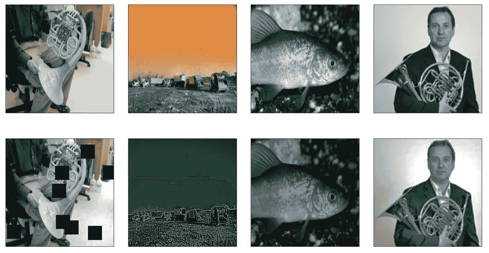
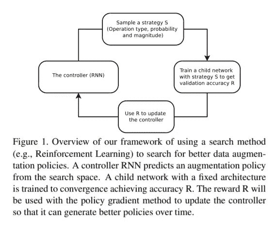
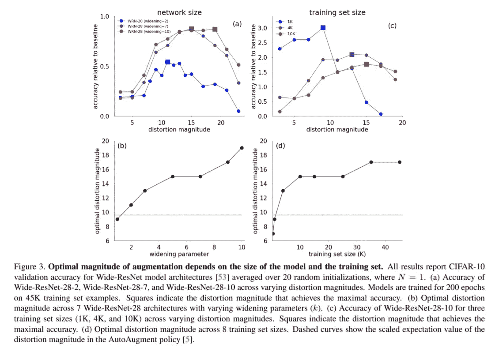

# 使用白蛋白和 PyTorch 的扩增方法

> 原文：<https://towardsdatascience.com/augmentation-methods-using-albumentations-and-pytorch-35cd135382f8?source=collection_archive---------21----------------------->

## 增强管道

## 讨论最新的增强研究和使用所讨论的方法的新颖实现



作者图片

自从深度神经网络在 20 世纪 90 年代末成名以来，有限的数据一直是一块绊脚石。缺少数据会导致*过拟合，*尤其是对于具有大量参数的架构。幸运的是，增强对于数据有限的机器学习任务来说是一个启示。它提供了两个主要优势。

首先，您可以通过创建原始数据集的多个扩充副本来增加数据量，这些副本也可用于平衡倾斜的数据集。

第二，它迫使模型对于样本中的不相关特征是不变的，例如，人脸检测任务中的背景。这有助于模型更好地概括。

在本帖中，我们将探索最新的数据扩充方法，以及使用所讨论方法的新颖实现。我们将主要讨论两种方法，自动增强和随机增强。所以，让我们从简单介绍这两种方法开始，然后继续讨论实现。

# 自动增强

在“ [**中介绍的自动增强:从数据中学习增强策略**](https://arxiv.org/abs/1805.09501) ”试图自动选择应用于样本的变换的类型和幅度。他们提出了一种强化学习方法，通过离散化搜索问题来找到有效的数据扩充策略。所提出的方法找到增强策略 **S** ，其具有关于变换、变换的幅度以及使用这些变换的概率的信息。

让我们看看算法的一些细节。

## 搜索空间

策略 **S** 包含五个子策略，每个子策略有两个变换，每个变换有一个幅度和一个概率参数。

> **注意**这里的子策略对转换的顺序很敏感，如果应用程序的顺序颠倒了，则被视为不同的子策略。

有 16 种增强转换可供控制器选择(将在实现部分讨论)。每个变换的幅度和应用概率的范围分别被离散成 10 和 11 个均匀间隔的值。

## 搜索算法

搜索算法有两个组成部分:一个控制器，这是一个递归神经网络(RNN)，和训练算法，这是最接近的政策优化算法。



来源:自动增强纸

控制器(RNN)从搜索空间预测增强策略 **S** ，然后预测的策略用于训练小得多的子模型。子模型在通过对训练集应用 5 个预测子策略而生成的扩充数据上被训练。对于小批量中的每个示例，随机选择 5 个子策略中的一个来扩充图像。然后，子模型在一个单独的保留验证集上进行评估，以测量精确度 **R** ，它被用作训练 RNN 控制器的奖励信号。

你可以在这里阅读全文[了解所有细节。](https://arxiv.org/abs/1805.09501)

AutoAugment 是第一批有效实现数据扩充自动化方法的论文之一，并显示出比以前的自动化方法好得多的结果。然而，单独的优化过程和非常大的搜索空间具有很高的计算成本。此外，该方法作出了一个强有力的假设，即来自一个较小网络的结果可以转移到一个大得多的网络。事实证明，这一假设并不完全正确，RandAugment 论文中指出，该论文提出了一种更快且在某些情况下性能更好的数据扩充方法，我们将在接下来讨论该方法。

# 随机扩增

像 AutoAugment 这样的大多数已学习的增强算法创建一个代理任务，该代理任务在较小的网络上为最佳增强策略进行优化，如前一部分所述。这种方法有一些需要解决的基本缺陷。在“ [**RandAugment:具有减少的搜索空间的实用自动数据扩充**](https://arxiv.org/abs/1909.13719) ”中介绍的 RandAugment 试图绕过这种代理任务，并且还极大地减少了搜索空间，以减轻训练过程的计算负荷。该方法将参数的数量减少到两个， **N** 和 **M** (将在随后的小节中详细讨论)，并在训练过程中将它们视为超参数。

## 搜索空间

RandAugment 不是学习策略，而是以 1/ **K** 的统一概率从一组 **K** 转换中随机挑选一个转换。要挑选的转换数量由超参数 **N** 给出，这将搜索空间中的总策略减少到 **K pow N** 。学习增强方法的主要好处来自增加样本的多样性，RandAugment 采用的均匀概率方法保持了样本的多样性，但搜索空间显著减小。



资料来源:RandAugment Paper

最后，类似于自动增强的每个变换的幅度范围被离散成由 **M** 给出的 10 个均匀间隔的值，然而，与已知的方法相反，所有的变换都遵循用于 **M** 的相同的时间表，这将幅度的搜索空间减少到仅仅一个。这是因为增强的最佳幅度取决于模型和训练集的大小，更大的网络需要更大的数据失真(请参考上图)，这在直觉上是有意义的。该论文还指出，更大的数据集需要更大的数据失真，这似乎很奇怪，作者提出的一个假设是，小数据集的激进增强可能会导致低信噪比。在任何情况下，基于模型大小和训练集大小，所有变换都遵循最佳幅度的明确模式，这暴露了使用较小网络来估计所有任务的变换幅度的已有增强方法中的基本缺陷。

## 搜索算法

RandAugment 使用简单的网格搜索来寻找 **N** 和 **M** 的最优值，这是通过为两个超参数选择一组值并在单独的验证集上测试这些组的所有排列来完成的。最后，选择对验证集有最佳改进的组合。可以对每个样品、每个批次或每个时期执行该程序。

现在，我们已经对算法有了相当好的理解，让我们向实现前进。如前所述，RandAugment 是一种更好的算法，但是，AutoAugment 论文中的一些关键发现可以与 RandAugment 结合使用，以进一步降低计算成本。

你可以从[这里](https://github.com/Varun9213/Blog_machine_learing/blob/main/Augmentaion_blog_3.ipynb)下载这篇文章的笔记本，笔记本上有所有必要的代码来设置增强算法，并在 fastai 提供的一小部分 Imagenet 数据集上用 Resnet50 进行测试。然而，在这篇文章中，我们将只关注笔记本中与增强相关的部分。

# 履行

让我们从笔记本上的自定义 RandAugment 函数开始，然后对其进行分解。

```
def randAugment(N, M, p, mode="all", cut_out = False): **# Magnitude(M) search space**  shift_x = np.linspace(0,150,10)
  shift_y = np.linspace(0,150,10)
  rot = np.linspace(0,30,10)
  shear = np.linspace(0,10,10)
  sola = np.linspace(0,256,10)
  post = [4,4,5,5,6,6,7,7,8,8]
  cont = [np.linspace(-0.8,-0.1,10),np.linspace(0.1,2,10)]
  bright = np.linspace(0.1,0.7,10)
  shar = np.linspace(0.1,0.9,10)
  cut = np.linspace(0,60,10) **# Transformation search space** Aug =[#0 - geometrical
        A.ShiftScaleRotate(shift_limit_x=shift_x[M], rotate_limit=0,   shift_limit_y=0, shift_limit=shift_x[M], p=p),
        A.ShiftScaleRotate(shift_limit_y=shift_y[M], rotate_limit=0, shift_limit_x=0, shift_limit=shift_y[M], p=p),
        A.IAAAffine(rotate=rot[M], p=p),
        A.IAAAffine(shear=shear[M], p=p),
        A.InvertImg(p=p),
        #5 - Color Based
        A.Equalize(p=p),
        A.Solarize(threshold=sola[M], p=p),
        A.Posterize(num_bits=post[M], p=p),
        A.RandomContrast(limit=[cont[0][M], cont[1][M]], p=p),
        A.RandomBrightness(limit=bright[M], p=p),
        A.IAASharpen(alpha=shar[M], lightness=shar[M], p=p)] **# Sampling from the Transformation search space** if mode == "geo": 
    ops = np.random.choice(Aug[0:5], N)
  elif mode == "color": 
    ops = np.random.choice(Aug[5:], N)
  else:
    ops = np.random.choice(Aug, N)

  if cut_out:
    ops.append(A.Cutout(num_holes=8, max_h_size=int(cut[M]),   max_w_size=int(cut[M]), p=p)) transforms = A.Compose(ops)
  return transforms, ops
```

该功能大致可分为以下两部分。

## 量值搜索空间

本节将星等范围离散为 10 个均匀分布的值。

## 变换搜索空间

" **Aug** "是变换搜索空间，算法可以从中以均匀的概率挑选出 **N 个**变换。请花点时间看看这些单独的转换做了什么，以便更好地创建这个搜索空间。

> 注意该功能有三种模式“**地理**”、**颜色**、**全部**”。“地理”模式适用于基于颜色的特征定义图像中感兴趣对象的任务，例如火灾探测。类似地,“颜色”模式适用于形状定义感兴趣对象的任务，例如人脸检测、汽车检测等。然而，“全部”模式使用所有的转换。

AutoAugment 论文中的作者表明，不同的数据集对正向和负向的不同变换都很敏感。因此,“没有免费的午餐”定理也适用于数据扩充，你需要为每个项目调整算法。


来源:自动增强纸

> **注意**上表中给出的幅度范围是针对 PIL 库中的函数，然而，我们在 randAugment()函数中使用白蛋白，主要是因为白蛋白库使用的 open cv 比 PIL 快。您必须进行实验，并为您喜欢使用的库计算出每个变换的幅度范围。

现在让我们来看看训练期间的转变幅度的时间表。

```
def train_model(model, criterion, optimizer, scheduler, **aug_mode="all"**, **cut_out=False**, **max_M=9**, num_epochs=25): best_model_wts = copy.deepcopy(model.state_dict())
  best_acc = 0.0 **N=2;M=0;p=0.5** for epoch in range(num_epochs):
        print('Epoch {}/{}'.format(epoch, num_epochs - 1))
        print('-' * 10)

        **transforms, ops = randAugment(N=N, M=M, p=p, mode=aug_mode, cut_out=cut_out)**
        dataloaders, dataset_sizes = create_dataloaders(root, train_df, valid_df, label_dict, bs=32, **transforms=transforms**) # Each epoch has a training and validation phase
        for phase in ['train', 'val']:
            if phase == 'train':
                model.train()  # Set model to training mode
            else:
                model.eval()   # Set model to evaluate mode running_loss = 0.0
            running_corrects = 0 # Iterate over data.
            for inputs, labels in dataloaders[phase]:
                inputs = inputs.to(device)
                labels = labels.to(device) # zero the parameter gradients
                optimizer.zero_grad() # forward
                # track history if only in train
                with torch.set_grad_enabled(phase == 'train'):
                    outputs = model(inputs)
                    preds = torch.argmax(input = outputs, dim = 1)
                    loss = criterion(outputs, labels) # backward + optimize only if in training phase
                    if phase == 'train':
                        loss.backward()
                        optimizer.step() # statistics
                running_loss += loss.item() * inputs.size(0)
                running_corrects += torch.sum(preds ==          torch.argmax(input = labels, dim = 1))
            if phase == 'train':
                scheduler.step() epoch_loss = running_loss / dataset_sizes[phase]
            epoch_acc = running_corrects.double() /  dataset_sizes[phase] print('{} Loss: {:.4f} Acc: {:.4f}'.format(
                phase, epoch_loss, epoch_acc)) # deep copy the model
            if phase == 'val' and epoch_acc > best_acc:
                best_acc = epoch_acc
                best_model_wts = copy.deepcopy(model.state_dict())
            **elif phase == 'val' and epoch_acc < best_acc:
                stp = int((9-M)*((best_acc-epoch_acc)/best_acc))
                M += max(1,stp)
                M = min(M, max_M)
                if M < max_M:
                  print("Augmentaion Magnitude Changed To : {}\n".format(M))** print('Best val Acc: {:4f}'.format(best_acc)) # load best model weights
    model.load_state_dict(best_model_wts)
    return model
```

在上面的代码块中，与时间表相关的代码行被加粗。

在这个示例中，我为 **M** 使用了预定的时间表，每当历元精度低于验证集上的最佳精度时， **M** 就递增。根据最大可能值(9)和当前值 **M** 之间的差值计算出 **M** 将增加的数量，当前值由两个精度和最佳精度之间的差值的比率缩放。

> **注意**该时间表不会产生额外成本，但是非常严格，RandAugment paper 在每批之后对 N 和 M 进行网格搜索，以找到它们的最佳值。然而，即使与自动增强相比计算成本大幅降低，对于大多数机器学习项目来说，网格搜索对于具有适度设置和单个 gpu 的人来说仍然是不可行的。

此实现中使用的时间表不是唯一可用的时间表，您可以试验每个子策略的转换数量 **N** 以及这些转换的概率 **p.** 增强不是一门精确的科学，每个锁都有不同的密钥，您需要通过试验和创造性思维来找到匹配的密钥。

# 参考

自动增强纸:[https://arxiv.org/abs/1805.09501](https://arxiv.org/abs/1805.09501)

RandAugment 论文:[https://arxiv.org/abs/1909.13719](https://arxiv.org/abs/1909.13719)