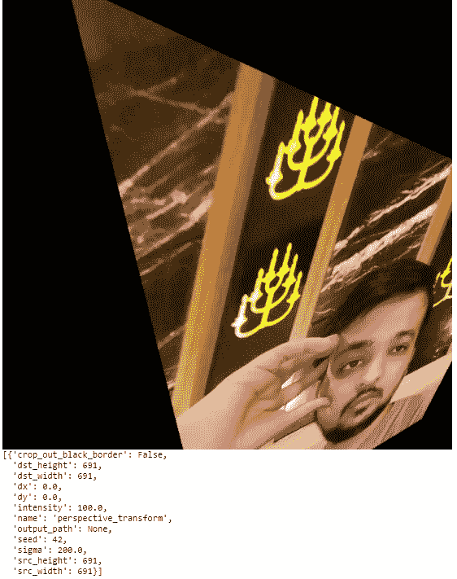
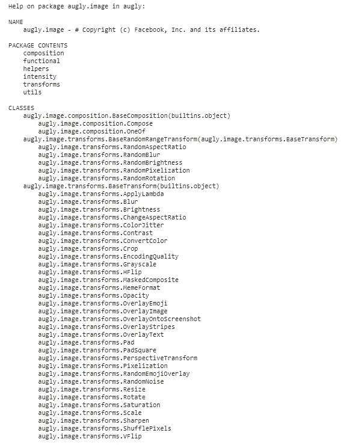

# 使用 AugLy 扩充数据

> 原文：<https://towardsdatascience.com/augmenting-data-using-augly-a5c275bfa6ce?source=collection_archive---------30----------------------->

## 使用 AugLy 增强文本、图像、音频和视频


马库斯·斯皮斯克在 [Unsplash](https://unsplash.com?utm_source=medium&utm_medium=referral) 上的照片

当我们使用的数据集不包含太多信息时，数据扩充是一个重要的部分，因此我们不能单独使用这些数据来建立模型，因为模型不会因训练数据中缺乏信息而被一般化。让我们试着通过一个例子来理解这一点。

假设我们正在尝试建立一个图像分类模型。我们使用的数据集包含 10 个类和每个类的 100 幅图像。现在我们可以构建模型了，但问题是它是否能被泛化和优化到足以用于新数据集的预测。这个问题可能会出现，因为一个类中仅有 100 个图像可能无法捕获该类的所有信息。所以，我们能做的就是克服这一点，我们需要每一个类有更多的图像。

数据扩充通过处理图像来帮助生成数据。现在我们可以在训练本身中使用这些数据，或者用它来检查模型的稳健性。数据扩充通过稍微修改数据集影像的副本来创建更多影像。

AugLy 是由脸书研究团队创建的开源 python 库，它有助于数据扩充，并支持不同类型的数据，如音频、视频、图像和文本。它包含 100 多种可以相应使用的增强功能。

在本文中，我们将使用 AugLy 探索一些数据扩充技术。

# 安装所需的库

我们将从使用 pip 安装 AugLy 开始。下面给出的命令可以做到这一点。

```
!pip install augly
!sudo apt-get install python3-magic
```

# 导入所需的库

在这一步中，我们将导入加载图像和执行数据扩充所需的库。

```
import augly.image as imaugs
import augly.utils as utils
from IPython.display import display
```

导入库后，下一步是加载映像。

# 正在加载图像

对于本文，我们可以采用任何图像或图像数据集。我拍了自己的照片来进行数据扩充。为了使图像看起来更清晰而不覆盖所有屏幕，我们将使用 AugLy Scaler 缩放它。

```
input_img_path = "/content/img1.jpg"
input_img = imaugs.scale(input_img_path, factor=0.2)
```

# 执行增强

现在，我们将开始放大过程，并应用不同的图像放大。

1.  **模因格式**

```
display(
    imaugs.meme_format(
        input_img,
        text="LOL",
        caption_height=70,
        meme_bg_color=(0, 0, 0),
        text_color=(250, 200, 150),
    )
)
```


迷因(来源:作者)

在这里，您可以使用不同类型的文本并设置它们的颜色，您选择的文本将显示在您正在使用的图像上。

**2。饱和度**

```
display(
    imaugs.saturation(
        input_img,
        factor=1.5
    )
)
```


饱和度(来源:作者)

这里你可以看到饱和度是如何使图像变亮的，因子变量是可以改变的，你可以使用不同的饱和度值。

**3。透视变换**

```
aug = imaugs.PerspectiveTransform(sigma=200.0)
display(aug(input_img, metadata=meta))
```



观点(来源:作者)

西格玛值决定标准差的值，西格玛值越大，转换越剧烈。

类似地，AugLy 中提供了大量不同的增强功能，您可以使用下面的命令查看所有这些功能，并阅读它们，然后在您的图像中使用它们。

```
help(imaugs)
```



转换(来源:作者)

继续尝试不同的图像/图像数据集。如果您发现任何困难，请在回复部分告诉我。

本文是与 [Piyush Ingale](https://medium.com/u/40808d551f5a?source=post_page-----a5c275bfa6ce--------------------------------) 合作完成的。

# 在你走之前

***感谢*** *的阅读！如果你想与我取得联系，请随时联系我在 hmix13@gmail.com 或我的* [***LinkedIn 简介***](http://www.linkedin.com/in/himanshusharmads) *。可以查看我的*[***Github***](https://github.com/hmix13)**简介针对不同的数据科学项目和包教程。还有，随意探索* [***我的简介***](https://medium.com/@hmix13) *，阅读我写过的与数据科学相关的不同文章。**