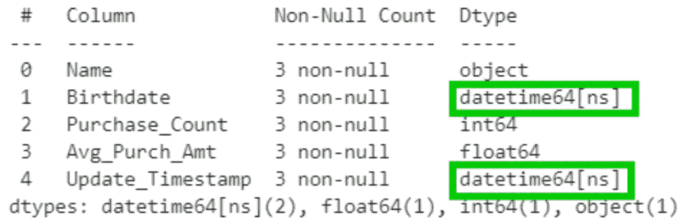
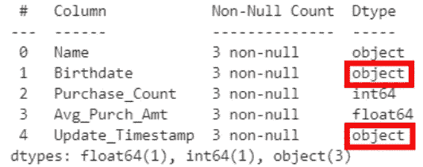
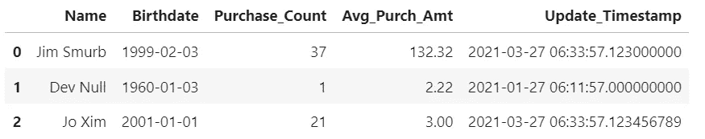

# 如何在 Pandas 中读取 CSV 文件时自动检测日期/日期时间列并设置它们的数据类型

> 原文：<https://towardsdatascience.com/auto-detect-and-set-the-date-datetime-datatypes-when-reading-csv-into-pandas-261746095361?source=collection_archive---------15----------------------->

## [小窍门](https://towardsdatascience.com/tagged/tips-and-tricks)

## 例如，当 read_csv()将“2021-03-04”和“2021-03-04 21:37:01.123”读取为单纯的“对象”数据类型时，通常可以简单地将它们一次性自动转换为真正的日期时间数据类型，如下所示:



假设我有一个 CSV 数据文件，我想将它读入 Pandas 数据帧，它的一些列是日期或日期时间，但是我不想预先识别/指定这些列的名称。相反，我想自动获取上面图中*、*的`df.info()`输出中显示的数据类型，其中适当的列已经被*自动*给定了日期时间数据类型(绿色轮廓框)。以下是实现这一点的方法:

```
from dt_auto import read_csv
df=read_csv('myfile.csv')
```

注意，我没有**而不是**直接调用上面的 PD . read _ CSV(read _ CSV 的熊猫版本)。我的 dt_auto.read_csv 函数(参见下面的代码)调用了 pd.read_csv()本身，然后自动检测并转换两个检测到的 datetime 列的数据类型。(此 df 的内容将在下面显示。)

如果我使用了常规的 Pandas pd.read_csv()，那么默认情况下，我将只获得通用的对象数据类型，如下所示(红色外框):

```
from pandas import read_csv
df=read_csv('myfile.csv')
df.info()
```



请注意，与原始代码的唯一区别是在导入语句中，我将“from dt_auto”改为“from pandas”。只要您始终只使用“=read_csv()”，而不是将其限定为“=pd.read_csv()”或“=dt_auto.read_csv()”，这就足够了。

下面是我的`dt_auto.py`(“日期时间自动”)的内容:

```
import pandas as pd
def dt_inplace(df):
    """Automatically detect and convert (in place!) each
    dataframe column of datatype 'object' to a datetime just
    when ALL of its non-NaN values can be successfully parsed
    by pd.to_datetime().  Also returns a ref. to df for
    convenient use in an expression.
    """
    from pandas.errors import ParserError
    for c in df.columns[df.dtypes=='object']: #don't cnvt num
        try:
            df[c]=pd.to_datetime(df[c])
        except (ParserError,ValueError): #Can't cnvrt some
            pass # ...so leave whole column as-is unconverted
    return df
def read_csv(*args, **kwargs):
    """Drop-in replacement for Pandas pd.read_csv. It invokes
    pd.read_csv() (passing its arguments) and then auto-
    matically detects and converts each column whose datatype
    is 'object' to a datetime just when ALL of the column's
    non-NaN values can be successfully parsed by
    pd.to_datetime(), and returns the resulting dataframe.
    """
    return dt_inplace(pd.read_csv(*args, **kwargs))
```

但是这不是很冒险吗？如果其中一个列不完全是日期时间列，会怎么样？当然，您可能会有一些看起来像日期但实际上不是日期的模糊字符串，但是这段代码不会盲目转换或丢失非日期时间字符串，原因有二:

1.  除非 pd.to_datetime 可以成功地解析该列中的每个非 NaN 值并将其转换为日期时间，否则该代码不会转换该列中的任何值。换句话说，我们不会让它将字符串转换成 pd。NaT(“失败”结果),因为它不能将其理解为日期时间。
2.  它将**而不是**尝试转换已经被解释为除 object 以外的任何类型的列，即任何特定类型，如 int64 或 float64，即使 pd.to_datetime 会很乐意(但很可能不希望)将类似 2000 的数字转换为日期 2000-01-01。

根据我目前的经验，dt_auto.read_csv 函数在典型的数据帧上运行并不需要很长时间。即使有许多非 datetime 对象(字符串)列，它几乎总是很快遇到每个此类列顶部附近的一个值，它无法将其解析为 datetime，因此放弃并继续处理下一列，而不尝试解析该列的其余值。

下面是 dt_auto.read_csv()产生的 dataframe 的外观，尽管您不一定能通过查看它来判断这两个适当的列是否确实是 datetime 数据类型。碰巧的是，CSV 文件在 Update_Timestamp 中的秒有不同的小数位数(三位、零位和九位)，但是 datetime 数据类型本身显示了九位这样的数字。csv 文件中的 Birthdate 实际上只有日期(没有时间),但存储为完整的日期时间，小时、分钟和秒都是零(包括小数部分的零),但是列中的所有时间部分都是零导致 Pandas 只显示该列的日期(年-月-日)。



当然，pd.to_datetime 以及 dt_auto.read_csv 在默认情况下不能处理所有可能的日期和日期时间格式，但它可以处理许多常见的明确(通常是年、月、日)格式，例如 dataframe.to_csv 方法和许多其他工具编写的格式，包括许多 ISO 日期时间格式(通常用“T”而不是空格来分隔日期和时间)。我没有试验过包含时区信息的 datetimes，因为我通常不会看到这样的数据，但是请在回复评论中让我知道是否可以通过进一步修改代码来更好地处理这些数据。

你怎么想呢?你觉得这篇小文章有用吗？Pandas 本身是否应该添加(例如 pd.read_csv 函数本身？)为我们选择这样做的能力，这样你就不需要复制/导入我上面的 dt_auto.py 代码了？我很乐意在这里看到你的评论和问题作为回应。