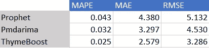

# 用 Python 中的百里香 Boost 实现自动预测

> 原文：<https://towardsdatascience.com/auto-forecasting-in-python-with-thymeboost-8bc9bd466998?source=collection_archive---------10----------------------->

## 比较百里香增强剂、Pmdarima 和 Prophet


图片由[皮埃特罗·马蒂亚](https://unsplash.com/@pietromattia)在 [Unsplash](https://unsplash.com/) 上拍摄

**TLDR:** 当我们将百里香与其他一些流行的时间序列方法进行比较时，我们发现它可以生成非常有竞争力的预测。 ***剧透警告:*** 百里助推胜。但除了胜利，我们看到了百里香框架的许多好处，即使在它失败的情况下。

更多例子你可以查看百里香增强 [Github](https://github.com/tblume1992/ThymeBoost) 。

系列第一帖:[用百里香 Boost 进行时间序列预测](/thymeboost-a0529353bf34)。如果你还没有看过，那就去看看吧！

# 介绍

本次竞赛中使用的示例相当流行，但是用于数据争论的一些代码摘自本文(感谢 Tomonori Masui！).您应该看看这篇文章，看看其他一些模型在这些数据集上的表现如何。

第一个例子是一个相当著名的时间序列:航空乘客数据集。这些数据来源广泛，其中一个来源来自 [Kaggle](https://www.kaggle.com/rakannimer/air-passengers) 或 [Github](https://github.com/tblume1992/ThymeBoost/blob/main/ThymeBoost/Datasets/AirPassengers.csv) 。确保你有最新的百里香增强包，可以通过 pip 安装:

```
pip install ThymeBoost --upgrade
```

既然是最新的，那就来看看吧！

# 航空乘客数据集

```
import numpy as np
import pandas as pd
from matplotlib import pyplot as plt
from ThymeBoost import ThymeBoost as tb
import seaborn as sns
sns.set_style("darkgrid")#Airlines Data, if your csv is in a different filepath adjust this
df = pd.read_csv('AirPassengers.csv')
df.index = pd.to_datetime(df['Month'])
y = df['#Passengers']
plt.plot(y)
plt.show()
```


作者图片

这个时间序列挺有意思的！明显的趋势和倍增的季节性。绝对是任何预测方法的好基准。

为了判断预测方法，我们将把数据分割成标准的训练/测试分割，其中保留最后 30%的数据。测试程序的结果可能会因这种分裂而改变。为了保持不偏不倚，将使用上述文章中的训练/测试分割。

任何调整或模型选择都将在训练集上完成，而测试集将用于判断方法。目标(至少对我来说)是看看百里香增强疗法是否能与其他经过审查的方法竞争。如果您要在生产中实现一个预测模型，那么您可能想要使用一个更健壮的方法来判断模型，例如[时间序列交叉验证](https://otexts.com/fpp3/tscv.html)。

```
test_len = int(len(y) * 0.3)
al_train, al_test = y.iloc[:-test_len], y.iloc[-test_len:]
```

首先，让我们尝试一个自动 Arima 实现: [Pmdarima](http://alkaline-ml.com/pmdarima/) 。

```
import pmdarima as pm
# Fit a simple auto_arima model
arima = pm.auto_arima(al_train,
                      seasonal=True,
                      m=12,
                      trace=True,
                      error_action='warn',
                      n_fits=50)pmd_predictions = arima.predict(n_periods=len(al_test))
arima_mae = np.mean(np.abs(al_test - pmd_predictions))
arima_rmse = (np.mean((al_test - pmd_predictions)**2))**.5
arima_mape = np.sum(np.abs(pmd_predictions - al_test)) / (np.sum((np.abs(al_test))))
```

接下来，我们会给先知一个机会。

```
from fbprophet import Prophetprophet_train_df = al_train.reset_index()
prophet_train_df.columns = ['ds', 'y']prophet = Prophet(seasonality_mode='multiplicative')
prophet.fit(prophet_train_df)
future_df = prophet.make_future_dataframe(periods=len(al_test), freq='M')
prophet_forecast = prophet.predict(future_df)
prophet_predictions = prophet_forecast['yhat'].iloc[-len(al_test):]prophet_mae = np.mean(np.abs(al_test - prophet_predictions.values))
prophet_rmse = (np.mean((al_test - prophet_predictions.values)**2))**.5
prophet_mape = np.sum(np.abs(prophet_predictions.values - al_test)) / (np.sum((np.abs(al_test))))
```

最后，实现百里香增强。这里我们使用了一种新的方法:从最新版本的包中“自动调整”。考虑到可能的季节性，该方法将尝试几种简单的实现。这是一个实验性的特性，只适用于传统的时间序列。当前的一个问题是，它尝试了几个冗余的参数设置，这将在未来的版本中得到解决，以加快进程！此外，如果您打算传递外部因素，我们建议使用在[自述文件](https://github.com/tblume1992/ThymeBoost)中找到的优化方法。

```
boosted_model = tb.ThymeBoost(verbose=0)output = boosted_model.autofit(al_train,
                               seasonal_period=12)
predicted_output = boosted_model.predict(output, len(al_test))
tb_mae = np.mean(np.abs(al_test - predicted_output['predictions']))
tb_rmse = (np.mean((al_test - predicted_output['predictions'])**2))**.5
tb_mape = np.sum(np.abs(predicted_output['predictions'] - al_test)) / (np.sum((np.abs(al_test))))
```

通过在构建该类时设置 verbose=0，它将每个单独模型的日志记录静音。相反，将显示一个进度条，指示不同参数设置以及找到的“最佳”设置的进度。默认情况下，百里香的自动拟合方法将进行 3 轮拟合和预测。该过程遍历训练集的最后 6 个值，以选择“最佳”设置。对于该数据，找到的最佳设置是:

```
Optimal model configuration: {'trend_estimator': 'linear', 'fit_type': 'local', 'seasonal_period': [12, 0], 'seasonal_estimator': 'fourier', 'connectivity_constraint': True, 'global_cost': 'maicc', 'additive': False, 'seasonality_weights': array([1., 1., 1., 1., 1., 1., 1., 1., 1., 1., 1., 1., 1., 1., 1., 1., 1.,
       1., 1., 1., 1., 1., 1., 1., 1., 1., 1., 1., 1., 1., 1., 1., 1., 1.,
       1., 1., 1., 1., 1., 1., 1., 1., 1., 1., 1., 1., 1., 1., 1., 1., 1.,
       1., 1., 1., 1., 1., 1., 1., 1., 1., 1., 1., 1., 1., 1., 1., 1., 1.,
       1., 1., 1., 1., 1., 1., 1., 1., 1., 5., 5., 5., 5., 5., 5., 5., 5.,
       5., 5., 5., 5., 5., 5., 5., 5., 5., 5., 5., 5., 5., 5., 5., 5.]), 'exogenous': None}
Params ensembled: False
```

一些需要注意的重要事项:

1.  “加法”设置为 false，这意味着整个过程是“乘法”，即从输入序列中提取对数。正常的“倍增”季节性尚未实现。
2.  有一个“季节性权重”数组，其中最后两个“季节性周期”被设置为 5，这意味着这些周期对季节性成分的影响是其他周期的 5 倍。
3.  “季节性周期”是[12，0]，因此它在衡量季节性和不衡量季节性之间来回循环。这是一个有趣的行为，但它本质上给季节性因素增加了一些规律性。

说到组件，我们来看看:

```
boosted_model.plot_components(output, predicted_output)
```


作者图片

总而言之，ThymeBoost 决定采用输入序列的对数，拟合一个线性变点模型，并在季节性成分中添加一个“变点”。

这些决定是正确的吗？让我们来看看误差指标:


作者图片

这些误差指标不言自明，百里香增强优于其他方法全面。但是预测实际上是什么样的呢？

```
plt.plot(pmd_predictions, label='Pmdarima')
plt.plot(al_test.values, label='Actuals')
plt.plot(prophet_predictions.values, label='Prophet')
plt.plot(predicted_output['predictions'].values, label='ThymeBoost')
plt.legend()
plt.show()
```


作者图片

显然，所有的方法都获得了非常相似的信号。就季节形状而言，百里香似乎略胜一筹，这可能是因为它决定使用季节权重。

# WPI 数据集

下一个数据集是从 1960 年到 1990 年的美国批发价格指数(WPI ),这个例子再次取自前面提到的文章。

不幸的是，这个数据集**没有**附带百里香增强，但我们可以通过 Statsmodels 访问它:

```
from  statsmodels.datasets import webusedta = webuse('wpi1')
ts_wpi = dta['wpi']
ts_wpi.index = pd.to_datetime(dta['t'])
test_len = int(len(ts_wpi) * 0.25)
ts_wpi = ts_wpi.astype(float)
wpi_train, wpi_test = ts_wpi.iloc[:-test_len], ts_wpi.iloc[-test_len:]
plt.plot(ts_wpi)
plt.show()
```


作者图片

这个时间序列与以前的有很大不同。它似乎缺乏任何季节性，因此这些设置将被禁用(尽管如果我们不小心将季节性设置添加到百里香增强中，它不会发生太大变化)。

让我们按照与之前相同的过程，首先安装 Pmdarima:

```
import pmdarima as pm
# Fit a simple auto_arima model
arima = pm.auto_arima(wpi_train,
                      seasonal=False,
                      trace=True,
                      error_action='warn',
                      n_fits=50)
pmd_predictions = arima.predict(n_periods=len(wpi_test))
arima_mae = np.mean(np.abs(wpi_test - pmd_predictions))
arima_rmse = (np.mean((wpi_test - pmd_predictions)**2))**.5
arima_mape = np.sum(np.abs(pmd_predictions - wpi_test)) / (np.sum((np.abs(wpi_test))))
```

接下来，先知:

```
from fbprophet import Prophetprophet_train_df = wpi_train.reset_index()
prophet_train_df.columns = ['ds', 'y']prophet = Prophet(yearly_seasonality=False)
prophet.fit(prophet_train_df)
future_df = prophet.make_future_dataframe(periods=len(wpi_test))
prophet_forecast = prophet.predict(future_df)
prophet_predictions = prophet_forecast['yhat'].iloc[-len(wpi_test):]prophet_mae = np.mean(np.abs(wpi_test - prophet_predictions.values))
prophet_rmse = (np.mean((wpi_test - prophet_predictions.values)**2))**.5
prophet_mape = np.sum(np.abs(prophet_predictions.values - wpi_test)) / (np.sum((np.abs(wpi_test))))
```

最后，百里香增强剂:

```
boosted_model = tb.ThymeBoost(verbose=0)output = boosted_model.autofit(wpi_train,
                               seasonal_period=0)predicted_output = boosted_model.predict(output, forecast_horizon=len(wpi_test))
tb_mae = np.mean(np.abs((wpi_test.values) - predicted_output['predictions']))
tb_rmse = (np.mean((wpi_test.values - predicted_output['predictions'].values)**2))**.5
tb_mape = np.sum(np.abs(predicted_output['predictions'].values - wpi_test.values)) / (np.sum((np.abs(wpi_test.values))))
```

最佳设置，也可以通过以下方式直接访问:

```
print(boosted_model.optimized_params)
```

它返回:

```
{'trend_estimator': 'linear', 'fit_type': 'local', 'seasonal_period': 0, 'seasonal_estimator': 'fourier', 'connectivity_constraint': False, 'global_cost': 'mse', 'additive': True, 'exogenous': None}
```

像上次一样，百里香选择了一个局部拟合的线性模型，也就是趋势分量的线性变点模型。除了这次‘connectivity _ constraint’被设置为 False，这放松了趋势线在变点的连接。

让我们来看看误差指标:



作者图片

百里香增强再次胜过其他两种方法。

预测是:

```
plt.plot(pmd_predictions, label='Pmdarima')
plt.plot(wpi_test.values, label='Actuals')
plt.plot(prophet_predictions.values, label='Prophet')
plt.plot(predicted_output['predictions'].values, label='ThymeBoost')
plt.legend()
plt.show()
```


作者图片

# 结论

这篇文章的目的是看看百里香是否能与其他流行的方法竞争，在这些例子中它显然可以。但是不要被骗以为百里香是万能药(虽然我也希望是！).它有很多次被超越，然而，一个主要的好处是任何超越百里香增强的方法都有可能被添加到框架中。一旦添加了一个方法，它就可以通过提升过程访问一些有趣的特性。

这方面的一个例子可以在已经引用的[文章](/multi-step-time-series-forecasting-with-arima-lightgbm-and-prophet-cc9e3f95dfb0)中找到。对于太阳黑子数据集，ThymeBoost 的 autofit 没有做任何 ARIMA 建模，因此与 sktime 发现的 ARIMA(8，0，1)相比，它的结果很差。然而，如果我们使用标准拟合方法，并通过局部拟合传递 ARIMA 订单(因此我们允许变点)，我们会优于 sktime 的自动 ARIMA。

我将把它作为一个练习留给您来尝试，只需使用这些设置:

```
output = boosted_model.fit(sun_train.values,
                           trend_estimator='arima',
                           arima_order=(8, 0, 1),
                           global_cost='maicc',
                           seasonal_period=0,
                           fit_type='local'
                           )
```

如前所述，这个包仍处于早期开发阶段。大量可能的配置使得调试成为一个复杂的过程，所以使用时风险自担。但是，请在 [GitHub](https://github.com/tblume1992/ThymeBoost) 上讨论和公开你遇到的任何问题！