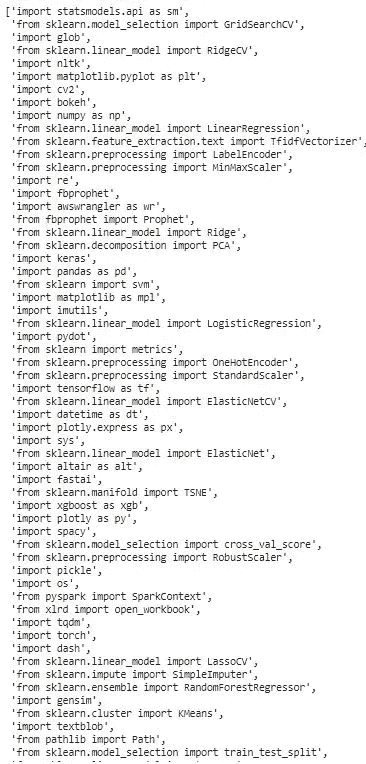

# 自动导入 Python 库

> 原文：<https://towardsdatascience.com/auto-import-python-libraries-d095a11b4cca?source=collection_archive---------14----------------------->

## 使用 Pyforest 导入重要的 python 库


克里斯里德在 [Unsplash](https://unsplash.com?utm_source=medium&utm_medium=referral) 上的照片

在用 python 编码时，你是否也陷入了导入库的困境？我们中的大多数人都会在编码时忘记导入我们将使用的库，我们陷入了导入不同库的困境，这很令人沮丧，而且我必须说，作为一个懒惰的程序员，我想一劳永逸地解决这个导入问题。

PyForest 是一个开源的 python 库，对于像我这样懒惰的程序员来说真的很有帮助，因为它导入了 python 编程所需的所有主要库，包括机器学习和深度学习。

在本文中，我们将探索 PyForest，看看我们如何使用它。

让我们开始吧…

# 安装所需的库

我们将从使用 pip 安装 PyForest 开始。下面给出的命令可以做到这一点。

```
!pip install pyforest
```

# 导入所需的库

在这一步中，我们将只导入 PyForest，这是唯一需要的库。

```
from pyforest import *
```

# 探索 PyForest

神奇的事情开始了，让我们看看我们在一行代码中导入了多少 python 库。

```
lazy_imports()
```



来源:作者

你可以看到我们多么容易地导入了所有主要的 python 库，包括深度学习、机器学习、图像处理等库。如果你像我一样是一个懒惰的程序员，这些库真的很有帮助。

在本文中，我们看到了 PyForest 对于导入重要的库是多么有用。继续尝试在一行中导入库，并让我知道您在回复部分的评论。

本文是与[皮尤什·英格尔](https://medium.com/u/40808d551f5a?source=post_page-----d095a11b4cca--------------------------------)合作完成的。

# 在你走之前

***感谢*** *的阅读！如果你想与我取得联系，请随时通过 hmix13@gmail.com 联系我或我的* [***LinkedIn 个人资料***](http://www.linkedin.com/in/himanshusharmads) *。可以查看我的*[***Github***](https://github.com/hmix13)**简介针对不同的数据科学项目和包教程。还有，随意探索* [***我的简介***](https://medium.com/@hmix13) *，阅读我写过的与数据科学相关的不同文章。**