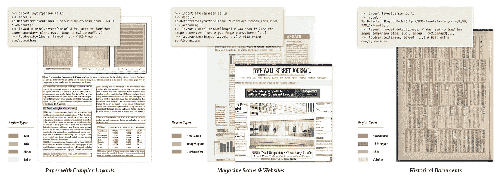
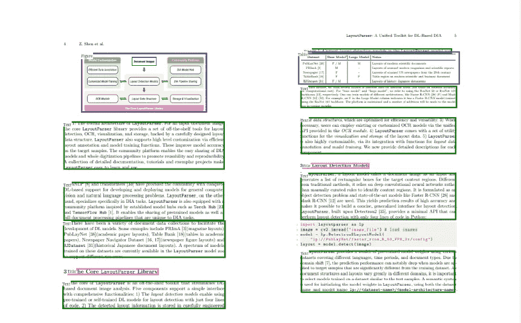

# 自动解析任何文档

> 原文：<https://towardsdatascience.com/auto-parse-and-understand-any-document-5d72e81b0be9?source=collection_archive---------17----------------------->

## 用于文档布局解析的基于 Train Detectron2 的定制模型

图片由 [GitHub](https://github.com/Layout-Parser/layout-parser/blob/master/.github/example.png) 上的[布局解析器](https://layout-parser.github.io/)解析

自从人类首次开发出书面文字以来，文档就无处不在。杂志、协议、历史档案、当地商店的小册子、税单、房契、大学申请表等等。到目前为止，处理这些文档一直是一项相当手工的任务，自动化只是在最近几十年才开始接管。这一自动化之旅在很大程度上受到了一个致命缺陷的阻碍——计算机无法像人类那样直观地理解布局。

随着现代计算机视觉的出现，这一切都改变了。我们现在有了[模型](https://github.com/Layout-Parser/layout-parser/blob/master/docs/notes/modelzoo.md)，它可以准确地定位、表示和理解文档布局的组件。但是对于一般的自动化爱好者来说，这些模型相当抽象，通常需要全面的 Python 知识才能理解文档，更不用说在项目中使用它了。

学分:[布局解析器](https://layout-parser.github.io/)

在这种程度上，[布局解析器](https://pypi.org/project/layoutparser/)，正如在他们非常酷的[论文](https://arxiv.org/pdf/2103.15348.pdf)中所解释的，通过一个干净的 API 减轻了这种复杂性，该 API 允许并实现完整的端到端布局检测、解析和理解，只需要几行代码(我的意思是非常少，比如 5 行)。他们有一堆可以直接开箱使用的[型号](https://github.com/Layout-Parser/layout-parser/blob/master/docs/notes/modelzoo.md)。总之是一个超级酷的工具。

# **现在，除了预训练模型的功能之外，如何使用该工具来理解和处理定制布局？**

作者图片

> 显而易见的想法是在您的定制布局上微调现有的布局模型。

你是对的，这是最好的办法，特别是考虑到我们并不是所有人都有从头开始训练这种模型所需的硬件火力。

虽然微调过程比仅仅使用预先训练的模型在技术上更复杂一些，但是由[布局解析器](https://pypi.org/project/layoutparser/)的作者创建的一个方便的[库](https://github.com/Layout-Parser/layout-model-training)，通过大量处理训练/微调活动中不合理的部分，有助于缓解这些问题。

Gareth Fowler 在 Tumblr[上发布的 GIF](https://gifsofprocesses.tumblr.com/post/160274145124/nautilus-gears)

**在接下来的章节中，我们将通过一个全面的教程来使用** [**这个库**](https://github.com/Layout-Parser/layout-model-training) **来训练你自己的定制模型。**

# 先决条件

图片由[纳万舒·阿加瓦尔](https://www.linkedin.com/in/navanshu-agarwal/)

1.  Python ≥ 3.6
2.  [探测器 2](https://github.com/facebookresearch/detectron2) 从[主分支](https://github.com/facebookresearch/detectron2)分叉或克隆而来。*
3.  最新版本的[布局解析器](https://pypi.org/project/layoutparser/)及其依赖项。
4.  Pytorch (Linux: 1.6+或 Windows: 1.6)**
5.  CUDA 工具包:10+(与 Pytorch 兼容)***
6.  数据集:以 [COCO](https://cocodataset.org/#home) 格式标注。

## 警告

* [Detectron2](https://github.com/facebookresearch/detectron2) 不容易安装在 Windows 系统上，请参考 *ivanapp* 的这篇[精彩帖子](https://ivanpp.cc/detectron2-walkthrough-windows/#step3installdetectron2)以获得基于 Windows 的安装过程的指导。

* *尽管[官方文档](https://detectron2.readthedocs.io/tutorials/install.html)中推荐使用 1.8，但 Windows 用户应该坚持使用 1.6。

***CUDA 不是强制性的，理论上也可以在 CPU 上训练。尽管如此，这样的训练尝试将会非常缓慢。

# 步骤 1:基本设置

*   将[布局模型训练](https://github.com/Layout-Parser/layout-model-training)库克隆或分支到您的系统中。
*   打开命令/anaconda 提示符并激活环境，其中安装了[布局解析器](https://pypi.org/project/layoutparser/)和[检测器 2](https://www.google.com/url?sa=t&rct=j&q=&esrc=s&source=web&cd=&cad=rja&uact=8&ved=2ahUKEwjx2tnXp7zxAhXVvp4KHQYJAbgQFjAJegQIBRAD&url=https%3A%2F%2Fai.facebook.com%2Fblog%2F-detectron2-a-pytorch-based-modular-object-detection-library-%2F&usg=AOvVaw1LG6fe39i41xY1II3rd3GJ) 。
*   将工作目录更改为保存[布局-模型-训练](https://github.com/Layout-Parser/layout-model-training)报告的位置。

# 步骤 2:拆分数据集(可选)

*   打包在[布局-模型-训练](https://github.com/Layout-Parser/layout-model-training) repo 中的是一个内置脚本(`utils\cocosplit.py`)，用于将数据集分割成测试和训练子集。
*   该脚本确保在数据集中不存在标记区域的图像的情况下，训练和测试子集中标记图像与未标记图像的比率将是相等的。
*   使用以下命令分割数据集(假设工作目录与上一步中的指示一致)。

*请注意，以上命令是在基于 Windows 10 的系统上执行的，请根据操作系统更改路径分隔符。*

## 论据解释

*   *annotation_path* :合并数据集所在的路径。
*   *训练*和*测试*:训练/测试数据集应该保存的路径。
*   *分割比*:分配给训练的合并数据集的分数。

# 步骤 3:下载预训练模型

*   从布局解析器的 [**模型动物园**](https://github.com/Layout-Parser/layout-parser/blob/master/docs/notes/modelzoo.md) 下载一个预先训练好的模型及其相关配置文件。
*   下载包含两个文件:

1.  *model_final.pth* :这是预训练模型的权重。
2.  *config.yaml* :这是预训练模型的配置。有关配置文件的信息，请参考 [*检测器 2 文档*](https://detectron2.readthedocs.io/en/latest/modules/config.html#config-references) *。*

# 步骤 4:训练模型

既然数据集已被分割，预训练的模型权重也已下载，让我们进入有趣的部分: ***模型训练*** (或者更确切地说是微调)。

*   使用`tools\train_net.py`处的训练脚本完成训练
*   使用下面的命令来训练模型。

*请注意，以上命令是在基于 Windows 10 的系统上执行的，请根据操作系统更改路径分隔符。*

## 论据解释

*   *dataset_name* :自定义数据集的名称(可以随意命名)。
*   *json_annotation_train* :训练标注的路径。
*   *json_annotation_val* :测试注释的路径。
*   *图像 _ 路径 _ 训练*:训练图像的路径。
*   *image_path_val* :测试图像的路径。
*   *config-file* :步骤 3 下载的模型配置文件的路径。

*注意，其余的参数-值对实际上是配置修改，并且特定于用例(有时)。为了清楚地了解如何使用和设置它们，请参考* [*检测器 2 文档*](https://detectron2.readthedocs.io/en/latest/modules/config.html#config-references) *。*

*   微调后的模型及其配置文件、训练指标和日志将保存在输出路径中，如上面命令中的`OUTPUT_DIR`所示。

# 第五步:推理

有了 finetuned 模型，使用它来解析文档就成了一项简单的任务。

*   在[布局解析器](https://pypi.org/project/layoutparser/)的演示中，用以下代码替换模型初始化。

*请注意，以上路径基于基于 Windows 10 的系统，请根据操作系统更改路径分隔符。*

*   `custom_label_map`是`int_label -> text_label`的映射。这种映射是根据训练数据的 [COCO Json](https://cocodataset.org/#home) 中存在的`'categories'`字段以如下方式进行的:每个`category`对应`{'id': 'name'}`。例如:

`custom_label_map = {0: "layout_class_1", 1: "layout_class_2"}`

# 结论

总而言之，可以使用[布局-模型-训练](https://github.com/Layout-Parser/layout-model-training) repo 轻松训练任何数据集上的定制模型。这种模型可以用于解析和理解各种各样的文档，并且在训练后相对容易。

# 参考

[1] Y. Wu，a . a .，F. Massa，W. Y. Lo 和 R. Girshick， [Detectron2](https://ai.facebook.com/blog/-detectron2-a-pytorch-based-modular-object-detection-library-/) :提供最先进的检测和分割算法的人工智能研究的下一代库(2019)， [GitHub Repo](https://github.com/facebookresearch/detectron2)

[2]沈，张，戴尔，李，卡尔森和李，【LayoutParser:一个基于深度学习的文档图像分析的统一工具包】(T5)(2021)，arXiv 预印本 arXiv:2103.15348

[3] T. S. Lin，M. Maire，S. Belongie，L. Bourdev，R. Girshick，J. Hays，p .佩罗娜，D. Ramanan，C. L. Zitnick 和 P. Dollár，[微软 COCO:上下文中的共同对象](https://arxiv.org/abs/1405.0312) (2015)，arXiv 预印本 arXiv:1405.0312v3