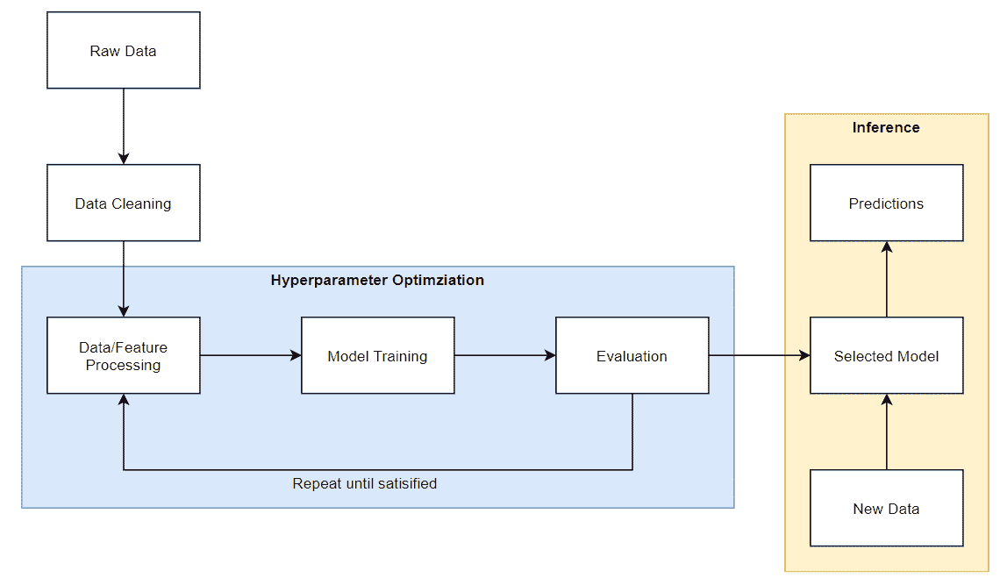
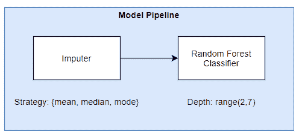
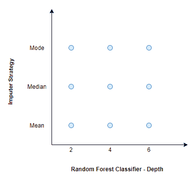
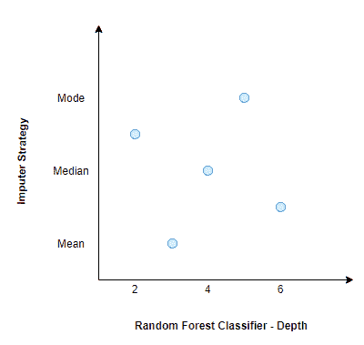
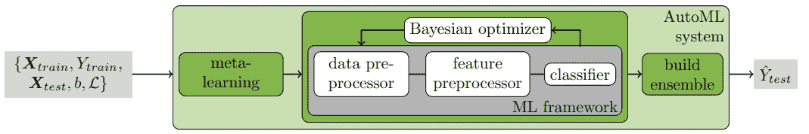
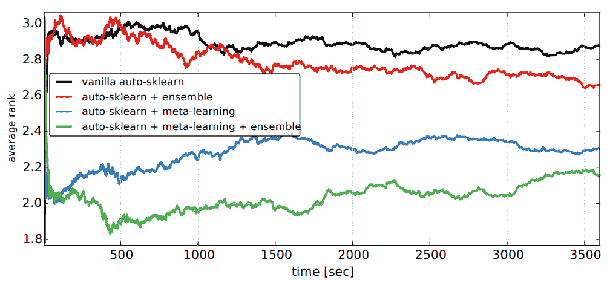
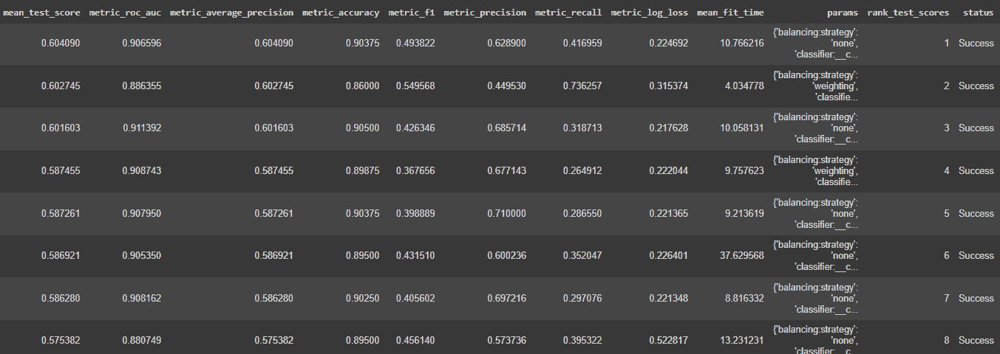
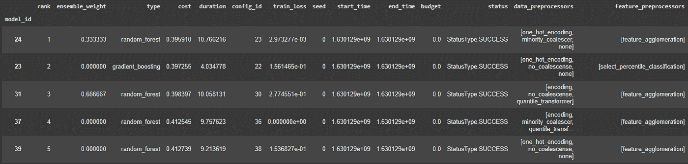

# 自动 Sklearn:sci kit-学习类固醇

> 原文：<https://towardsdatascience.com/auto-sklearn-scikit-learn-on-steroids-42abd4680e94?source=collection_archive---------11----------------------->

## 自动化“无聊”的东西。加速您的模型开发生命周期。


亚历山大·雷德尔在 [Unsplash](https://unsplash.com?utm_source=medium&utm_medium=referral) 上拍摄的照片

# 动机

典型的机器学习工作流是数据处理、特征处理、模型训练和评估的迭代循环。想象一下，在我们获得令人满意的模型性能之前，必须试验数据处理方法、模型算法和超参数的不同组合。这项费力费时的任务通常在超参数优化过程中执行。



模型开发生命周期。图片作者。

## 超参数优化

超参数优化的目标是找到最佳模型管线组件及其相关的超参数。让我们假设一个简单的模型管道，它有两个模型管道组件:一个估算步骤，后面跟着一个随机森林分类器。



作者图片

插补步骤有一个名为“策略”的超参数，用于确定如何进行插补，例如使用均值、中值或众数。随机森林分类器有一个称为“深度”的超参数，它确定森林中单个决策树的最大深度。我们的目标是找到跨模型管道组件的超参数的哪个组合提供最佳结果。进行超参数调整的两种常见方法是使用网格搜索或随机搜索。

## 网格搜索

对于每个超参数，我们列出一个可能值的列表，并尝试所有可能的值组合。在我们的简单例子中，我们有 3 种估算策略和 3 种不同的随机森林分类器深度可以尝试，因此总共有 9 种不同的组合。



网格搜索。图片作者。

## 随机搜索

在随机搜索中，我们定义每个超参数的范围和选择，并且在这些边界内随机选择超参数集。在我们的简单示例中，深度的范围在 2 到 6 之间，估算策略的选择有均值、中值或众数。



随机搜索。图片作者。

请注意，网格和随机搜索中的超参数集是彼此独立选择的。这两种方法都不使用先前训练和评估试验的结果来改进下一次试验的结果。进行超参数优化的一个更有效的方法是利用先前试验的结果来改进下一次试验的超参数选择。这种方法被用于贝叶斯优化。

## 贝叶斯优化

贝叶斯优化存储先前搜索的超参数和预定义目标函数的结果(例如，二进制交叉熵损失)，并使用它来创建代理模型。代理模型的目的是在给定一组特定的候选超参数的情况下，快速估计实际模型的性能。这允许我们决定是否应该使用候选超参数集来训练实际模型。随着试验次数的增加，用附加试验结果更新的替代模型得到改进，并开始推荐更好的候选超参数。

贝叶斯优化存在冷启动问题，因为它需要试验数据来建立替代模型，然后才能为下一次试验推荐好的候选超参数。代理模型在开始时没有要学习的历史试验，因此候选超参数是随机选择的，这导致在寻找性能良好的超参数时启动缓慢。

为了克服冷启动问题，Auto-Sklearn，一个开源的 AutoML 库，通过一个称为元学习的过程，将热启动合并到贝叶斯优化中，以获得比随机更好的超参数的实例化。

# 自动 Sklearn

自动机器学习(AutoML)是机器学习管道中自动化任务的过程，例如数据预处理、特征预处理、超参数优化、模型选择和评估。Auto-Sklearn 使用流行的 Scikit-Learn 机器学习框架自动执行上述任务。下图简单展示了 Auto-Sklearn 的工作原理。



自动 Sklearn。图片来自[1]。

Auto-Sklearn 使用带有热启动(元学习)的贝叶斯优化来寻找最佳模型管道，并在最后从各个模型管道构建集成。让我们检查一下 Auto-Sklearn 框架中的不同组件。

## 元学习

元学习的目的是为贝叶斯优化找到好的超参数实例，以便它在开始时比随机的表现更好。元学习背后的直觉很简单:具有相似元特征的数据集在同一组超参数上表现相似。Auto-Sklearn 作者定义的元特征是*“可以有效计算的数据集特征，有助于确定对新数据集使用哪种算法”。*

在离线训练期间，对来自 OpenML 的 140 个参考数据集，共列出了 38 个元特征，如偏度、峰度、特征数、类别数等。使用贝叶斯优化过程训练每个参考数据集，并对结果进行评估。为每个参考数据集给出最佳结果的超参数被存储，并且这些超参数充当具有相似元特征的新数据集的贝叶斯优化器的实例。

在新数据集的模型训练期间，新数据集的元特征被制成表格，并且根据元特征空间中到新数据集的 L1 距离对参考数据集进行排序。来自前 25 个最接近的参考数据集的存储的超参数被用于实例化贝叶斯优化器。

作者在参考数据集上实验了 Auto-Sklearn 的不同变体，并使用不同训练持续时间的平均排名对它们进行了比较。等级越低表示性能越好。由于贝叶斯优化器的良好初始化，元学习的变体(蓝色和绿色)在开始时显示排名急剧下降。



图 1:不同 Auto-Sklearn 变体的比较。图片来自[1]。

## 数据预处理程序

Auto-Sklearn 按以下顺序预处理数据[2]。

1.  分类特征的一种热编码
2.  使用平均数、中位数或众数的插补
3.  重新缩放要素
4.  使用类权重平衡数据集

## 特色预处理器

在数据预处理之后，可以选择使用一个或多个以下类别的特征预处理程序对特征进行预处理[2]。

1.  使用 PCA、截断 SCV、核 PCA 或 ICA 的矩阵分解
2.  单变量特征选择
3.  基于分类的特征选择
4.  特征聚类
5.  核近似
6.  多项式特征扩展
7.  特征嵌入
8.  稀疏表示和变换

## 全体

在训练过程中，Auto-Sklearn 训练多个单独的模型，这些模型可用于构建集合模型。集成模型组合多个训练模型的加权输出，以提供最终预测。众所周知，它们不容易过度拟合，并且通常优于单个模型。

从图 1 中，作者显示了使用集成的变体比没有集成的变体性能更好(黑色对红色和绿色对蓝色)。具有元学习和集成的变体(绿色)表现最好。

# 密码

让我们来看看 Auto-Sklearn 的一些实际例子。

**安装包**

```
pip install auto-sklearn==0.13
```

**进口包装**

```
import pandas as pd
import sklearn.metrics
from sklearn.model_selection import train_test_split, StratifiedKFoldfrom autosklearn.classification import AutoSklearnClassifierfrom autosklearn.metrics import (accuracy,
                                 f1,
                                 roc_auc,
                                 precision,
                                 average_precision,
                                 recall,
                                 log_loss)
```

**加载数据集**

我们将使用来自 UCI 的数据集，该数据集描述了一家银行向客户提供定期存款的营销活动。如果客户同意，目标变量为是；如果客户决定不定期存款，目标变量为否。你可以在这里找到原始数据集[。](https://archive.ics.uci.edu/ml/datasets/bank+marketing)

我们将数据集作为熊猫数据帧来读取。

```
df = pd.read_csv('bank-additional-full.csv', sep = ';')
```

**准备数据**

Auto-Sklearn 要求我们在 pandas 数据帧中识别一个列是否是数字分类的，或者我们可以稍后在`fit`函数中完成。让我们现在转换它。

```
num_cols = ['ge', 'duration', 'campaign', 'pdays', 'previous', 'emp.var.rate', 'cons.price.idx', 'cons.conf.idx', 'euribor3m', 'nr.employed']
cat_cols = ['job', 'marital', 'education', 'default', 'housing', 'loan', 'contact', 'month', 'day_of_week', 'poutcome']df[num_cols] = df[num_cols].apply(pd.to_numeric)
df[cat_cols] = df[cat_cols].apply(pd.Categorical)y = df.pop('y')
X = df.copy()X_train, X_test, y_train, y_test = train_test_split(X, y, test_size = 0.2, random_state=1, stratify=y)
```

**实例化分类器**

```
skf = StratifiedKFold(n_splits=5)

clf = AutoSklearnClassifier(time_left_for_this_task=600,
                            max_models_on_disc=5,
                            memory_limit = 10240,
                            resampling_strategy=skf,
                            ensemble_size = 3,
                            metric = average_precision,
                            scoring_functions=[roc_auc, average_precision, accuracy, f1, precision, recall, log_loss])
```

以下是`AutoSklearnClassifier`中使用的一些参数。

`time_left_for_this_task`:限制总训练时间(秒)

`max_models_on_disc`:限制保留的型号数量

`memory_limit`:我们想要使用的内存量(MB)

`resampling_strategy`:维持或不同种类的交叉验证。请参考本[文档](https://automl.github.io/auto-sklearn/master/api.html)。

`ensemble_size`:服装系列中包含的模特数量。Auto-Sklearn 提供了一个选项，通过以加权方式取最大的`ensemble_size`个模型，在创建单个模型后创建集合。

`metric`:我们想要优化的指标

`scoring_function`:我们想要评估模型的一个或多个指标

**安装分类器**

```
clf.fit(X = X_train, y = y_train)
```

在引擎盖下，Auto-Sklearn 在每次试验期间都构建了一个 Scikit-Learn 管道。Scikit-Learn 管道用于组装一系列执行数据处理、特征处理和估计器(分类器或回归器)的步骤。`fit`函数触发整个 Auto-Sklearn 构建、拟合和评估多个 Scikit-Learn 流水线，直到满足停止标准`time_left_for_this_task`。

**结果**

我们可以查看结果和选择的超参数。

```
df_cv_results = pd.DataFrame(clf.cv_results_).sort_values(by = 'mean_test_score', ascending = False)
df_cv_results
```



交叉验证结果和参数。图片作者。

我们还可以在排行榜上查看所有试验之间的比较

```
clf.leaderboard(detailed = True, ensemble_only=False)
```



排行榜。图片作者。

我们可以使用以下命令查看哪些管道被选择用于集合

```
clf.get_models_with_weights()
```

该方法返回元组列表`[(weight_1, model_1), …, (weight_n, model_n)]`。`weight`表示它给每个模型的输出多少权重。所有`weight`值的总和将为 1。

我们还可以查看其他培训统计数据。

```
clf.sprint_statistics()
```

**用所有训练数据改装**

在 k-fold 交叉验证期间，Auto-Sklearn 在数据集上拟合每个模型管道 k 次，仅用于评估，它不保留任何已训练的模型。因此，我们需要调用`refit`方法，用所有的训练数据来拟合交叉验证期间找到的模型管道。

```
clf.refit(X = X_train, y = y_train)
```

**保存模型**

```
dump(clf, 'model.joblib')
```

**负荷模型和预测**

让我们加载保存的模型管道进行推理。

```
clf = load('model.joblib')
y_probas = clf.predict_proba(X_test)
pos_label = 'yes'
y_proba = y_probas[:, clf.classes_.tolist().index(pos_label)]
```

# 结论

搜索最佳模型管线组件和超参数是一项重要的任务。幸运的是，有 AutoML 解决方案，如 Auto-Sklearn，可以帮助自动化这个过程。在本文中，我们研究了 Auto-Sklearn 如何使用元学习和贝叶斯优化来找到最佳模型管道并构建模型集成。Auto-Sklearn 是众多 AutoML 软件包中的一个。查看其他备选方案，如 [H2O 汽车](https://medium.com/@edwintan/automated-machine-learning-with-h2o-258a2f3a203f)。

</automated-machine-learning-with-h2o-258a2f3a203f>  

你可以在这里找到本文[中使用的演示代码。](https://colab.research.google.com/drive/1IaM7Zj8z5lMoTX20qusekGPfd05tl1nL?usp=sharing)

# 参考

[1] [高效而健壮的自动化机器学习](https://papers.nips.cc/paper/5872-efficient-and-robust-automated-machine-learning.pdf)

[2] [高效稳健的自动化机器学习补充材料](https://ml.informatik.uni-freiburg.de/wp-content/uploads/papers/15-NIPS-auto-sklearn-supplementary.pdf)

[3] [Auto-Sklearn API 文档](https://automl.github.io/auto-sklearn/master/api.html)