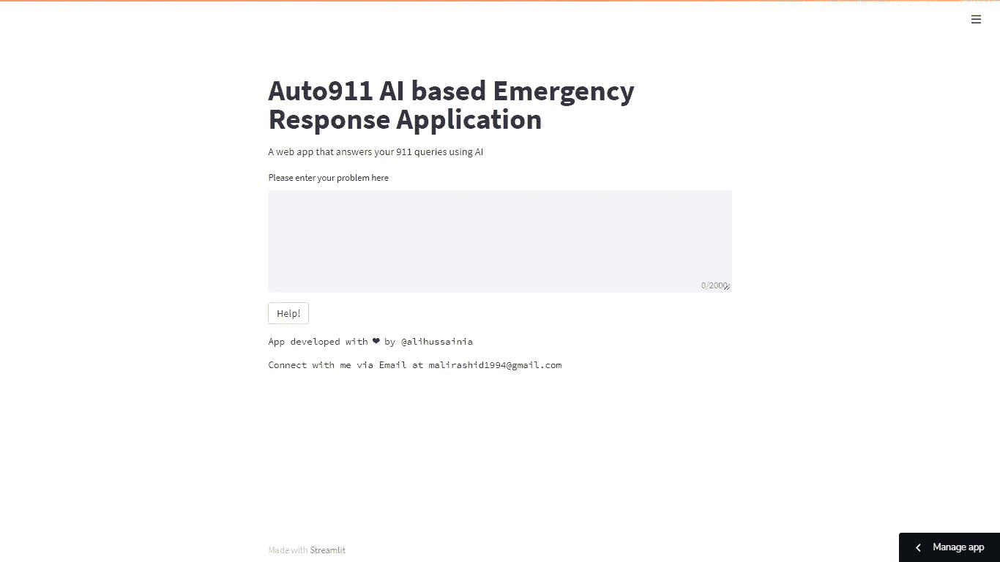
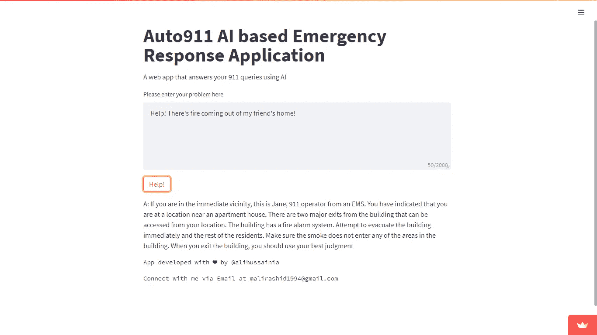

# 汽车 911:让我们用人工智能自动化 2.4 亿次 911 查询

> 原文：<https://towardsdatascience.com/auto911-lets-automate-240-million-911-queries-using-ai-b4e92010a68e?source=collection_archive---------18----------------------->

## 革新传统 911 紧急响应的一步


由[法斯汗](https://unsplash.com/@fasbytes?utm_source=unsplash&utm_medium=referral&utm_content=creditCopyText)在 [Unsplash](https://unsplash.com/s/photos/ambulance?utm_source=unsplash&utm_medium=referral&utm_content=creditCopyText) 拍摄的照片

平均每年，仅在美国就有大约 2.4 亿个 911 呼叫，全国平均每天超过 60 万个呼叫；由于新冠肺炎，911 紧急响应呼叫中心人手不足，导致紧急情况下等待时间更长。[【1】](#d2ce)现在，想象一下，如果我们利用人工智能的力量自动化呼叫响应，并允许人们对他们的问题做出自由、直接和即时的响应，会怎么样？

这就是 [**Auto911**](https://share.streamlit.io/alihussainia/auto_911/main) 闪耀的地方🌟

# 📑目录

```
1\. [🚑 What is Auto911?](#c3ae)2\. [😍 How does it look?](#cf5e)3\. [❓ How does it Work?](#43ca) 3.1 [🎰 Exploring GPT-J API](#92fb) 3.2 [📃 Making requirements.txt](#65d7) 3.3 [🐍 Creating streamlit_app.py](#aed4) 3.4 [🍎 Check the output!](#e3d5)4\. [💡 Other Use Cases](#d0df)5\. [👊 Limitations and Considerations](#5328)6\. [🎆 Conclusion](#1a88)7\. [✏️ About Author](#be77)8\. [✅ References](#826f)
```

现在，在投入工作之前，我们先简单了解一下这个项目和这个 app 的用途。

# 🚑什么是 Auto911？

Auto911 是一个 **AI for Good solution，旨在通过使用尖端开源 [GPT-J](https://github.com/kingoflolz/mesh-transformer-jax/#gpt-j-6b) 这一 60 亿参数的人工智能模型和 [Streamlit Sharing](https://share.streamlit.io/) 这一部署、管理和共享应用程序的平台来自动化 911 紧急响应，从而通过提供直接、免费和即时的支持**来帮助处于紧急情况下的人们。

# 😍看起来怎么样？

厉害！既然现在您已经熟悉了什么是 Auto911 及其目标，我相信这也是一个了解应用程序的好时机。这是应用程序的链接:

> [https://share.streamlit.io/alihussainia/auto_911/main](https://share.streamlit.io/alihussainia/auto_911/main)



作者截图

# ❓:它是如何工作的？

## 🎰**探索 GPT-J API**

如上所述，它使用了两个东西:1.GPT J 模型和 2。简化共享。所以让我们从 GPT-J 模型开始。承蒙维克多·加莱戈的好意，我使用了 GPT J 的免费公共 API。现在，如果您想自己探索这个 API，请随意访问**GPT-j-API**Github repository[【2】](#3b21)或者如果您喜欢简单的方法，下面是在您自己的项目中使用它的 Pythonic 方法:

作者代码示例

让我们一个变量一个变量地分解它😅

1.  **上下文**:描述对话的字符串
2.  **payload** :以模型参数为关键字，自变量为值的字典
    **+ context** : Context 变量将作为值
    **+ token_max_length** :输出响应的最大长度
    **+Temperature**:Temperature 控制模型的随机性
    **+Top _ p**:Top probability 是控制模型随机性的另一种方法
3.  **响应**:模型生成输出文本

有关每个参数的更多信息，请查看 GPT-J API 文档[【3】](#1a30)。

## 📃制作要求. txt

从上面这段代码中，你可以看到该应用程序需要**请求** python 包，因为我们即将在 Streamlit 上部署该应用程序，我们也将需要它。

在云实例上运行我们的应用程序之前，让 Streamlit Sharing 知道我们想要安装哪些库的一个简单方法是创建一个 requirements.txt 文件。所以，下面是如何做到这一点:

1.  创建一个简单的文本文件，并将其命名为 **requirements.txt**
2.  将下面提到的两个库名复制并粘贴到 requirements.txt 文件中

作者代码示例

现在就到此为止，让我们进入下一个任务！

## 🐍正在创建 streamlit_app.py

现在这是你的应用程序布局和逻辑将驻留在。Streamlit Sharing 将使用这个 python 脚本来创建您在上面看到的漂亮的应用程序布局。好的，所以我当然不想让你因为阅读这篇文章而感到遗憾，所以让我们避免像如何放置按钮或制作标题这样的微小的前端细节😅为此，您可以阅读我的 streamlit101 文章

<https://medium.com/omdena/streamlit101-deploying-an-automl-model-using-streamlit-e86c6508b5c2>  

好了，开始说主要的吧！

下面是我创建 streamlit_app.py 文件的步骤:

1.  创建一个名为 streamlit_app having 的文件。py 扩展。
2.  像这样在文件中导入 streamlit 库:

作者代码示例

3.在文件中定义一些上下文、有效负载和响应请求，如下所示:

由 [Víctor Gallego](https://github.com/vicgalle) 编写的代码示例

5.使用以下内容打印出上述回复:

作者代码示例

# 🍎检查输出！

太棒了！现在，让我们自己尝试一下这个应用程序，看看输出结果。所以，我在输入提示中输入了一条随机的 911 紧急短信，然后按下*帮助！*按钮。以下是输出结果:



作者截图

可以说，结果对我来说非常直观！😎

# 💡其他使用案例

由于 GPT-J 是一种语言模型，它的应用仅限于我们的想象。它可以用于从给定的要点生成文本，如电子邮件，或从一些角色对话中生成电影脚本，或根据一些标签对情感进行分类，等等。我个人对使用 GPT-J 感兴趣的是创建一个基于开源人工智能的代码完成引擎，就像 Github 的 Copilot 或 OpenAI 的 Codex 的替代品一样。就像我说的，唯一的限制是你的想象力，尽情发挥吧！

但是就像人类和所有与他们相关的事物一样，它也有自己的局限性，所以为什么不在下一个标题中讨论它们呢😅

# 👊限制和注意事项

GPT J 的第一个问题是，除了 Eleuther 之外，它没有其他组织的支持，这在资源方面特别是计算、数据和专业人力资源方面严重限制了它。由于没有重要的财政支持，它在 60 亿个参数上进行训练，比 GPT-3 少得多，但看看其他可用的选项。

公开可用的 GPT-2 在 15 亿个参数上进行训练，这大大少于 GPT-J 的 60 亿个参数。此外，拥有 60 亿个参数有助于它的性能与 GPT-3 相当，后者是在 67 亿个参数上训练的。因此，由于这些因素，它可以被认为是迄今为止最准确的公开可用模型。

GPT J 也是像 GPT 3 一样基于大型变压器的模型，这就是为什么它没有长期记忆。因此，它不像人那样从长期的互动中学习。

GPT J 也不例外，所有的模型都是由用来训练它们的数据决定的。[本文](https://arxiv.org/pdf/2101.05783.pdf)举例说明，反穆斯林偏见存在于 GPT-3 和其他大的语言模型中。[ [4](#461d)

在这方面，伊柳瑟在 GPT J 号中做得很好，试图消除 GPT 3 号中存在的偏见。Eleuther 的数据集比 GPT-3 更加多样化，它避免了一些像 Reddit 这样的网站，这些网站更有可能包含有问题的内容。[ [5](#e086)

最后，关于我们是否应该或可以依靠让人工智能完全处理紧急反应是一个进一步研究和广泛测试的问题。但就目前而言，我可以说，人工智能像其他任何工具一样，可以帮助人类处理紧急响应等情况，提供应该做什么的即时指导，但同样，这是基于人类的判断力，以验证和确认响应对他们来说是否足够，或者他们应该进一步寻求人类的支持。汽车 911 是漫长旅程的第一步，但我希望最终结果会值得努力😇

# 🎆结论

恭喜你！您刚刚不仅了解了 Auto911，还了解了 GPT-J 和 Streamlit 共享，以及如何使用它们来创建和部署一个使用最复杂和公开可用的 transformer 模型之一的全功能 AI 应用程序。我希望这篇文章能给你必要的知识来理解、创建和部署你自己的基于 GPT-J 模型的应用程序。

如果你想更多地了解 911，这里有一个很好的简短总结。

我还建议查看 [GPT-J 的文档](http://api.vicgalle.net:5000/docs)，以了解更多关于 GPT-J 的其他应用

您可以在 Victor 的官方 GPT-J-API github 存储库中随意查看样本 streamlit_app 示例

  

# ✏️关于作者

[穆罕默德·阿里](https://www.linkedin.com/in/alihussainia)是欧洲最大的创业中心数字产品学校的人工智能工程师。他喜欢学习、教授和撰写关于数据科学和机器学习现实世界的应用和项目。他的主要爱好是玩很酷的开源工具，并用它们来解决现实世界的问题。也可以在 [LinkedIn](https://www.linkedin.com/in/alihussainia) 上和他联系。

**通过 Medium** 关注他，了解他最新的最先进和最前沿的技术文章，就像你上面读到的那篇。

# ✅参考

[1]Jiovanni lie ggi[911 呼叫中心人手不足导致紧急情况下等待时间延长](https://www.foxnews.com/person/l/jiovanni-lieggi) (2021)，福克斯新闻频道警察和执法科

[2]维克多·加莱戈 [gpt-j-api](https://github.com/vicgalle/gpt-j-api) (2021)，Github

[3]维克多·加莱戈 [gpt-j-api 文件](https://github.com/vicgalle/gpt-j-api/blob/main/docs/generate.md) (2021)，Github

[4] Abubakar Abid，Maheen Farooqi，James Zou [大型语言模型中持续的反穆斯林偏见](https://arxiv.org/pdf/2101.05783.pdf) (2021)，Arxiv

[5]赫里蒂克·罗伊 [GPT-J: GPT-3 民主化](https://www.p3r.one/gpt-j/) (2021)，P3r

[6] Elana Pearl Ben-Joseph [如何使用 911](https://kidshealth.org/en/kids/911.html) (2018)，KidsHealth，Nemours 基金会