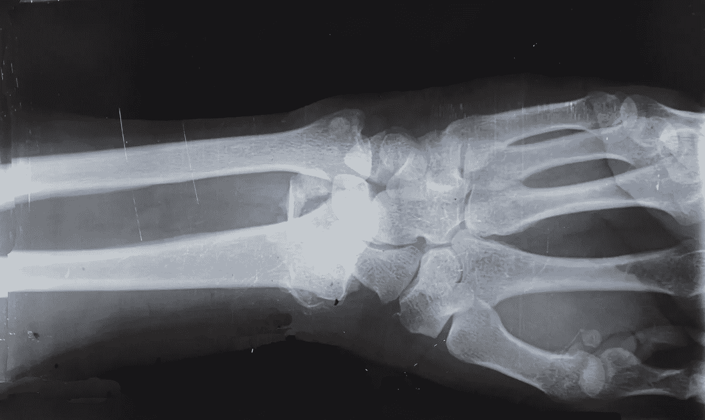
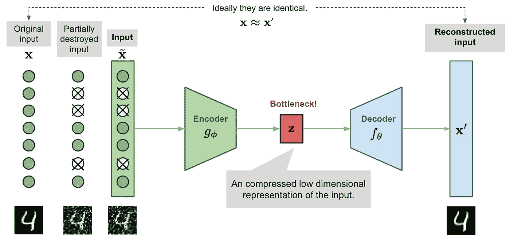
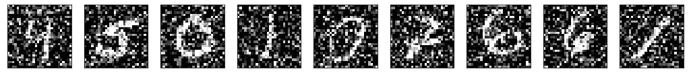
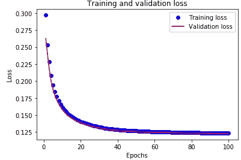
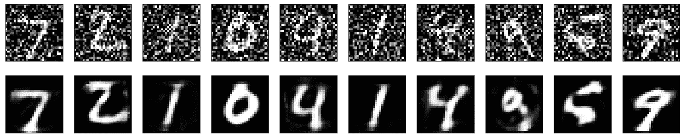
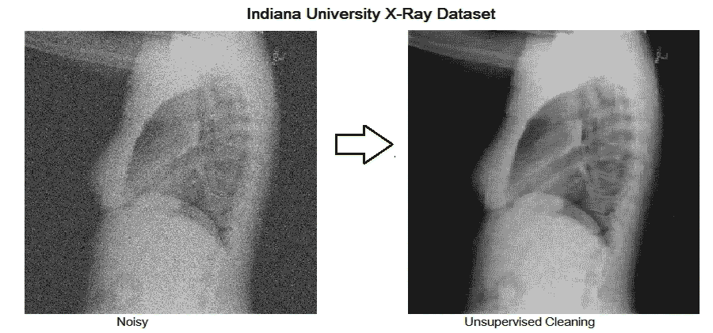

# 用于图像去噪的自动编码器

> 原文：<https://towardsdatascience.com/autoencoder-for-denoising-images-7d63a0831bfd?source=collection_archive---------4----------------------->

## 包含动手 Python 代码的实施指南

图片由 [Cara Shelton](https://unsplash.com/@socalcaral) 在 Unsplash 上拍摄

在这篇文章中，你将了解到自动编码器是如何工作的，以及为什么它们被用于医学图像去噪。

正确理解图像信息在医学等领域至关重要。去噪可以专注于清理旧的扫描图像，或者有助于癌症生物学中的特征选择工作。噪音的存在可能会干扰疾病的识别和分析，从而导致不必要的死亡。因此，医学图像去噪是一项必不可少的预处理技术。

所谓的*自动编码器*技术已经被证明对图像去噪非常有用。

自动编码器由一对两个相连的人工神经网络组成:一个*编码器*模型和一个*解码器*模型。自动编码器的目标是找到一种将输入图像编码成压缩形式(也称为潜在空间)的方法，使得解码图像版本尽可能接近输入图像。

# 自动编码器如何工作

网络提供原始图像 *x* ，以及它们的嘈杂版本 *x~* 。网络试图重建其输出*x’*以尽可能接近原始图像 *x* 。通过这样做，它学会了如何去噪图像。

[来源](https://lilianweng.github.io/lil-log/2018/08/12/from-autoencoder-to-beta-vae.html)

如图所示，编码器模型将输入转换为小型密集表示。解码器模型可以被视为能够生成特定特征的生成模型。

编码器和解码器网络通常作为一个整体来训练。损失函数惩罚网络产生不同于原始输入 *x* 的输出*x’*。

通过这样做，编码器学会在潜在空间的限制中保留尽可能多的相关信息，并巧妙地丢弃不相关的部分，例如噪声。解码器学习获取压缩的潜在信息，并将其重构为完全无错误的输入。

# 如何实现自动编码器

让我们实现一个自动编码器来消除手写数字的噪声。输入是 28x28 灰度图像，构建 784 元素向量。

编码器网络是具有 64 个神经元的单一密集层。因此，潜在空间将具有尺寸 64。整流单元(ReLu)激活函数被附加到该层中的每个神经元，并且基于每个神经元的输入是否与自动编码器的预测相关来确定它是否应该被激活(“激发”)。激活函数还有助于将每个神经元的输出标准化到 1 到 0 之间的范围。

解码器网络是具有 784 个神经元的单个密集层，对应于 28×28 灰度输出图像。sigmoid 激活函数用于比较编码器输入和解码器输出。

二进制交叉熵用作损失函数，Adadelta 用作最小化损失函数的优化器。

[MNIST](http://yann.lecun.com/exdb/mnist/) 数据集是一个著名的手写数字数据库，广泛用于机器学习领域的训练和测试。我们在这里使用它，通过应用高斯噪声矩阵并在 0 和 1 之间裁剪图像来生成合成噪声数字。

你仍然可以识别数字，但是很难。因此，我们想使用我们的自动编码器来学习恢复原始数字。我们通过在 100 个时期内拟合自动编码器来实现这一点，同时使用有噪声的数字作为输入，并将原始去噪的数字作为目标。

因此，自动编码器将最小化噪声图像和干净图像之间的差异。通过这样做，它将学习如何从任何看不见的手写数字中去除噪声，这些数字是由类似的噪声产生的。

# 如何用自动编码器去噪

现在，我们可以使用经过训练的 autoencoder 来清理看不见的噪声输入图像，并根据清理后的图像绘制它们。

*   总的来说，噪音消除得非常好。在输入图像上人为引入的白点已经从清洗后的图像中消失。数字可以被视觉识别。例如，有噪声的数字“4”根本不可读，现在，我们可以读取它的干净版本。
*   去噪对信息质量有负面影响。重建的数字有些模糊。解码器添加了一些原始图像中不存在的特征，例如，下面的第 8 位和第 9 位数字几乎无法识别。

图片由[印第安纳大学](https://openi.nlm.nih.gov/detailedresult?img=CXR111_IM-0076-1001&req=4)(开放访问)

在本文中，我描述了一种图像去噪技术，并提供了如何用 Python 构建自动编码器的实用指南。放射科医生通常使用自动编码器对 MRI、US、X 射线或皮肤病变图像进行去噪。这些自动编码器在大型数据集上接受训练，例如由 7470 张胸部 x 光图像组成的印第安纳大学的胸部 x 光数据库。降噪自动编码器可以用卷积层来增强，以产生更有效的结果。

感谢阅读。