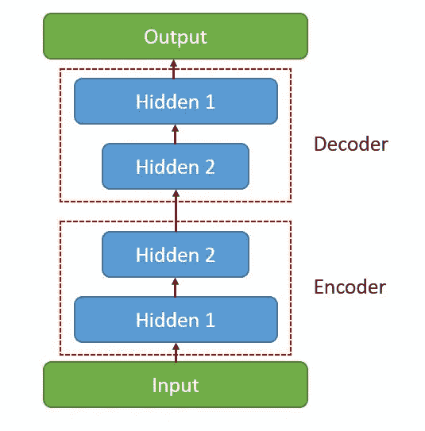
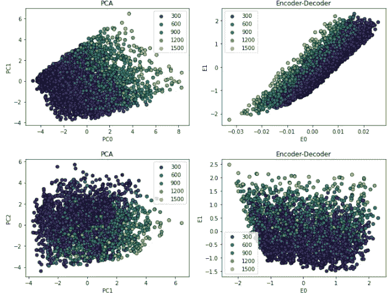
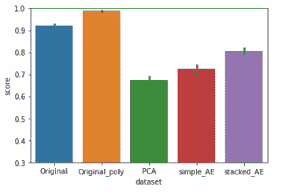
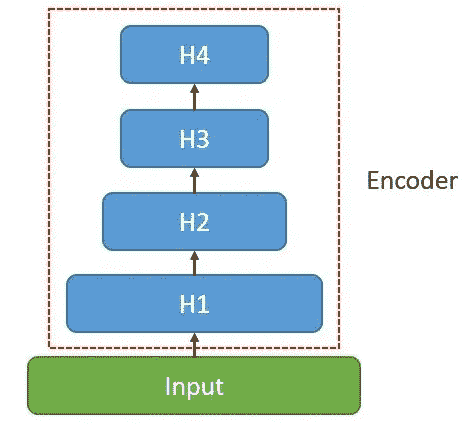
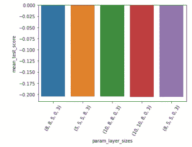
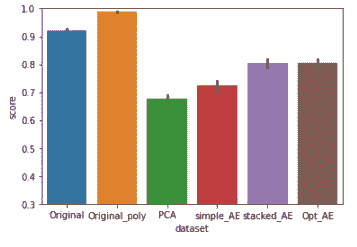
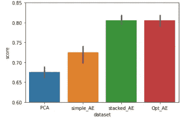

# 用于降维的自动编码器网络优化

> 原文：<https://towardsdatascience.com/autoencoder-network-optimization-for-dimensionality-reduction-67922ccc6889?source=collection_archive---------21----------------------->

## 如何优化隐藏层数和大小？

在[之前的文章](/dimensionality-reduction-with-autoencoders-versus-pca-f47666f80743)中，我们看到了如何通过使用线性激活函数和“mse”作为损失度量，利用自动编码器网络(AE)模拟 PCA 降维。

在一个合成数据集上，我们比较了基于分类分数和潜在变量的降维性能。我们看到了如何通过修改网络(添加更多层，堆叠自动编码器)或最终允许激活函数为非线性来改善结果。然而，这些变化是任意的。在这篇文章中，我想进行同样的基本分析，但这一次使用一种随机搜索的方法来寻找最佳的网络结构。我们将通过使用方便的 KerasRegressor 包装器来实现这一点

```
from tensorflow.keras.wrappers.scikit_learn import KerasRegressor
```

与前一篇文章不同的是，我们将从一个新的数据集开始:我们将使用一个严格非线性的数据集，它由来自 sk learn . datasets:make _ friendman 2 的 4 个变量组成。为了增加维度，我们也将使用 sklearn 的多项式特征(order=2，interactions_only=True)。这可能会稍微减轻主成分分析的工作，但我们会将 11 个变量的系统减少到 3 个。

在第一部分中，我们将使用浅网络的性能作为起点，就像我们在上一篇文章中所做的那样。在第二部分，我们将优化参数。第一个尝试是优化隐藏层的数量和形状(最多 4 层)。



自动编码器网络结构。图片作者。

# 基线性能

为了理解优化效果如何，我们将比较自动编码器和 PCA(主成分分析)的维数减少。
我们建立了包含 4 个特征的数据集。我们引入了多项式特征来增加维数，然后我们对所有这些特征应用标准缩放。最后，我们将把数据集的维数减少到 3。

主成分分析解释了该数据集约 77%的方差。



PCA 和编码器前 3 个组件。颜色显示要预测的值。

使用具有*最大深度 3* 的 *RandomForestRegressor* ，我们在具有原始 4 个特征的数据集上获得了 0.92 的回归分数。在具有多项式和缩放要素的数据集上为 0.98。
使用具有 3 个成分的 PCA，我们得到 0.67 的回归分数。使用简单的线性自动编码器，1 级 a 分数约为 0.7。使用简单的堆叠 AE:10–10–3，我们可以达到 0.77。

从这些数据中我们已经了解到，构成结果 y 的非线性特征强烈地影响着潜在变量的预测能力。自动编码器已经比 PCA 执行得更好，我们仍然使用线性激活函数。



对不同结构的回归结果进行评分。

# 优化层数

我们现在要优化堆栈编码器。我们通过导入一个新的库来实现:KerasRegressor。它将允许我们使用 scikit-learn 中的 RandomizedSearchCV。

```
from tensorflow.keras.wrappers.scikit_learn import KerasRegressor
```

要生成层的组合，有几种方法。直截了当的方法是用简单的列表理解一些条件句。最终我们可以决定定义一个函数，它的形状与我们数据的输入形状相关联。

```
output_dim = 3
sizes = [10,10,5,5,0]
shapes = [(i,j,k,q,output_dim) for i in sizes for j in sizes for k in sizes for q in sizes if (i>=j>=2*k>=output_dim)]
```

以下是从前面的列表理解中输出的一些形状:正如你在代码中注意到的，我们确保最终的维度总是我们的潜在空间维度。

```
(10, 10, 5, 10, 3),
 (10, 10, 5, 10, 3),
 (10, 10, 5, 5, 3),
 (10, 10, 5, 5, 3),
 (10, 10, 5, 0, 3),
 (10, 10, 5, 10, 3),
 (10, 10, 5, 10, 3),
 (10, 10, 5, 5, 3),
 (10, 10, 5, 5, 3),
 (10, 10, 5, 0, 3),
 (10, 10, 5, 10, 3),
 (10, 10, 5, 10, 3), ... ]
```

层结构现在变成如下图所示:



将被优化的堆叠编码器结构。图片作者。

我们定义一个函数，它将使用我们刚刚定义的图层大小作为参数。我们将像上一篇文章一样构建编码器，但这次我们也将解码器的重量与编码器的重量联系起来。这样，我们将减少可训练参数，搜索将会更快。最后，它将连接两个模型，就像我们之前在堆栈自动编码器中所做的那样。

既然我们已经定义了构建自动编码器的函数，我们就定义了参数搜索网格，并利用 RandomizedSearchCV 功能来执行搜索。

请注意，我们正在寻找最能减少重建损失的网络结构。我们不是在寻找最佳的网络参数来改善我们的回归得分问题！

经过一番搜索，最佳结果似乎是(8，8，5，3)层网络。尽管如此，分数都是可比的。看起来至少有一些额外的层会有所帮助，但不会太复杂。



不同网络的平均测试分数。

结果报告如下。左边是到目前为止我们考虑的所有结果。右边是从 0.6 开始的(奇怪的)柱状图。即使在这种规模下，搜索的好处也不明显。



# 结论

在这篇短文中，我们看到了如何构建一个用于降维的自动编码器，并将其与上一篇文章中的 PCA 等标准算法进行比较，但使用的是强非线性数据集。在这种情况下，我们做了一个回归问题。

我们试图通过使用多项式特征来帮助 PCA 更好地执行，但是与原始数据集结果相比，信息损失仍然很大。一个简单的欠完整自动编码器已经开始比 PCA 表现得更好，增加层数和将解码器的权重与编码器的权重联系起来会使它甚至更好。

我们在 scikit-learn RandomizedSearchCV 和 GridSearchCV 中使用了 Keras 序列模型的包装器。在这个数据集上没有观察到更大的改进。很可能，由于原始维度只有 11，搜索效率并不高。

# 文献学

[1] A. Géron，用 Scikit-Learn 进行机器学习的实践，Keras & TensorFlow(第二版)。真的吗？
[2] A. Gulli，A. Kapoor，S. Pal，深度学习用 TensorFlow 2 和 Keras。(第二版)。打包。
【3】[sk learn . datasets . make _ Friedman 1—scikit-learn 0 . 24 . 1 文档(scikit-learn.org)](https://scikit-learn.org/stable/modules/generated/sklearn.datasets.make_friedman1.html#sklearn.datasets.make_friedman1)
【4】[用自动编码器降维](/dimensionality-reduction-with-autoencoders-versus-pca-f47666f80743)