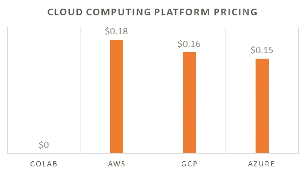
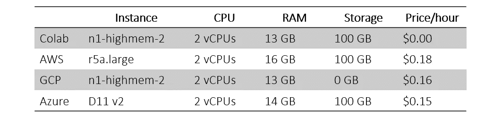
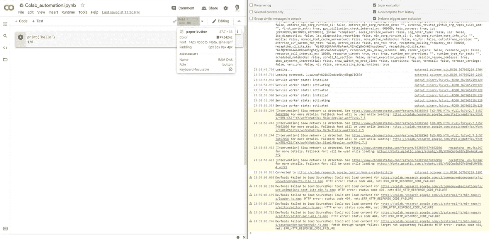
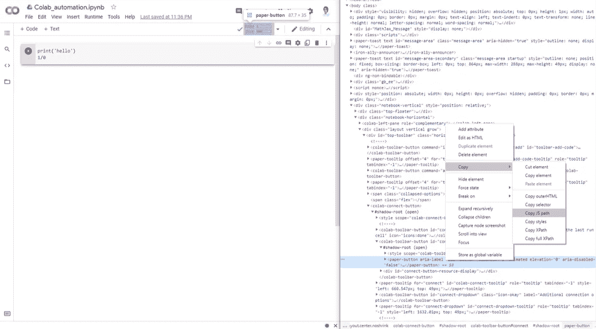
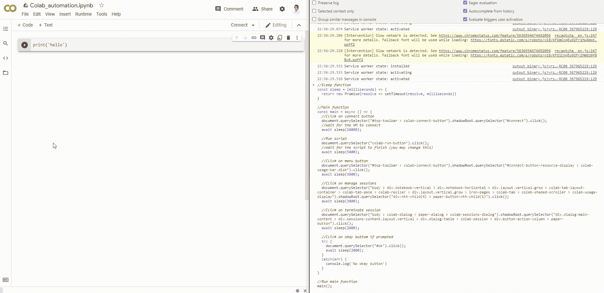
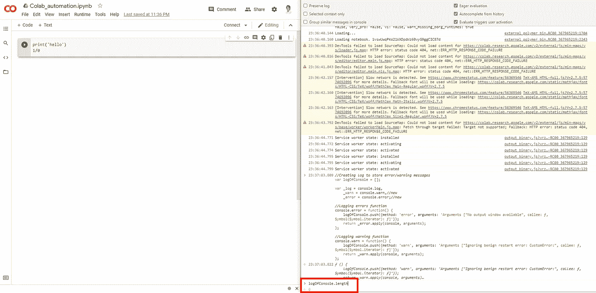
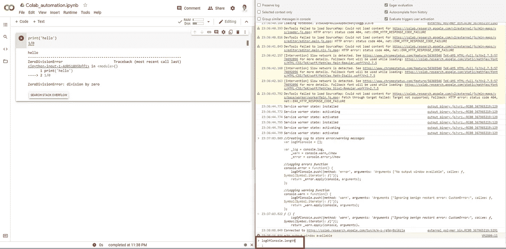
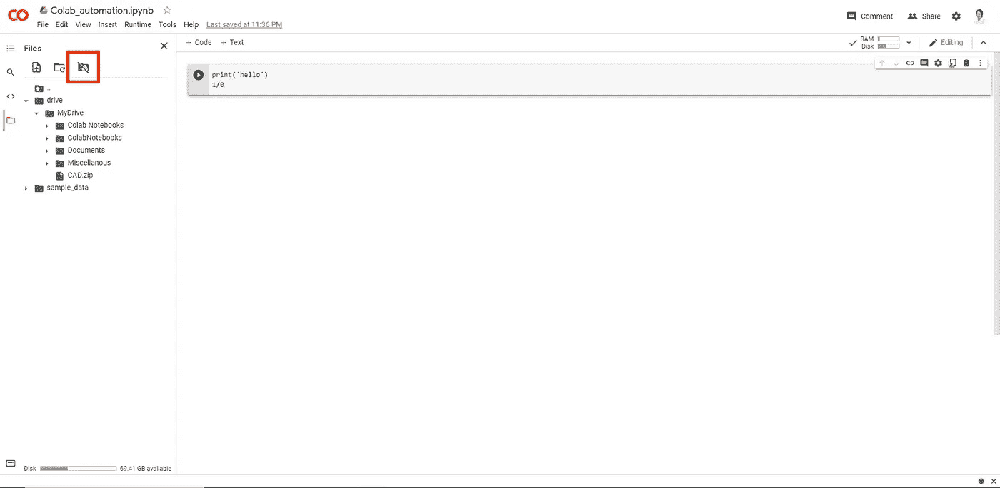

# 使用 JavaScript 自动化和增强 Google Colab

> 原文：<https://towardsdatascience.com/automate-and-supercharge-google-colab-with-javascript-9f494d98489d?source=collection_archive---------15----------------------->

## 在 Colab 上运行预先安排的 Python 脚本，并在您自己的驱动器上访问结果


Jean-Philippe Delberghe 在 [Unsplash](https://unsplash.com?utm_source=medium&utm_medium=referral) 上拍摄的照片

## 介绍

云计算正迅速成为数据科学家和公司的首选武器，这也是有充分理由的。有了提供给你的资源和与之相关的极小的费用，辨别云和本地计算实际上只是一个基本的算术问题。多年来，像亚马逊网络服务、微软 Azure、谷歌云平台和其他平台都竞相向客户提供最复杂、最先进、但最实惠的服务。具有讽刺意味的是，谷歌作为科技行业的先驱之一，在这场游戏中姗姗来迟，他们仍在弥补失去的时间。但是随着几年前 Google Colab 的推出，他们已经向全世界提供了一种服务，这种服务是无与伦比的，因为你没有为它付费。



可比虚拟机—每小时定价。图片作者。

从资源分配的角度快速查看一下最近的产品，就会发现使用 Colab 每一小时平均可以节省 16.3 美分。事实上，如果您自己进行调配，为每个 Colab 会话调配的实际虚拟机本身每小时会花费您 0.16 美元。下表显示了 Amazon Web Services、Microsoft Azure 和 Google Cloud Platform 提供的与 Colab 最具可比性的虚拟机及其各自的规格和价格。



换句话说，Colab 是一个不花钱的好东西。更不用说 Colab 还为您提供了对 GPU 和 TPU 的访问，这意味着您实际上每小时节省了 16 美分以上。最棒的是，实际上，世界上任何地方的任何人都可以按需访问它。请注意，这种善良也有局限性。您最多可以运行 12 个小时的会话，空闲超时大约为半小时。此外，如果您被发现过度使用 Colab 的一些资源，如 GPU 和 TPU，您可能会面临编程瓶颈。尽管如此，这样的限制还是过于宽松了。然而，为了更好地衡量，我们鼓励您有效地使用资源，不要过度使用，以避免任何服务中断。

## Colab 自动化

人们想要自动化 Colab 的原因有很多:

*   运行 Python 脚本时要留出时间间隔，以避免过度利用可用资源。
*   您的脚本是一个时间关键的程序，需要在预先安排的时间运行。
*   确保您的程序在完成时或系统超时/关闭前关闭。

不管有什么原因，您确实可以通过编写 JavaScript 的小片段来自动化 Colab，这些小片段将在您的浏览器控制台上运行，以在 Colab 界面上交互和模拟按钮按压，从而在特定时间或通过特定触发来启动和/或停止您的会话。

要插入并运行 JavaScript 代码片段，请在您选择的浏览器上按 F12 打开控制台。然后将 JavaScript 片段粘贴到命令窗口中，并按 enter 键。随后，浏览器将运行代码，通过模拟按钮点击来自动化 Google Colab。要查找需要点击的按钮的 JavaScript 路径，请右键单击按钮并选择“检查”,或者使用浏览器控制台中的“选择一个元素”光标查找相关路径，如下所示。请注意，Google 可能会动态更改这些路径。



使用“选择一个元素”光标定位按钮元素。图片作者。



右键单击按钮元素复制 JavaScript 路径。图片作者。

**场景 1:** 在预先安排的时间运行/终止会话

对于我们的第一个场景，我们将立即运行我们的 Python 脚本(或者如果需要，在一定的秒数之后)，然后我们将在指定的秒数之后终止会话。为此，我们将实施以下步骤:

1.  激活 Colab 会话
2.  运行脚本(在预先安排的时间)
3.  终止会话(在预先安排的时间)

下面的视频展示了自动化 Google Colab 的 JavaScript 代码。



作者视频。

请在下面找到该场景的 JavaScript 代码:

**场景 2:** 迭代地运行/终止会话

对于我们的第二个场景，我们将使用以下步骤根据需要多次迭代运行 Python 脚本:

1.  激活 Colab 会话
2.  如果迭代次数小于指定次数，则运行脚本
3.  终止会话

请在下面找到该场景的 JavaScript 代码:

**场景 3:** 动态运行/终止会话

对于最后一个场景，我们将动态运行 Python 脚本，直到它提示我们终止它。这对于具有动态或未知运行时的脚本很有用。将为此用例实施以下步骤:

1.  激活 Colab 会话
2.  运行脚本，直到执行完成
3.  向控制台日志发送消息以触发终止
4.  终止会话

为了提示我们的 JavaScript 程序终止会话，我们将在 Python 脚本的末尾添加一行，这将产生一个错误。例如，我们可以尝试除以 0，这将提示 Colab 显示一条错误消息，该消息也将记录在浏览器的控制台中。然后，我们可以使用相同的 JavaScript 程序不断检查日志的长度是否超过 0，一旦超过，就会终止会话。



空日志允许程序无限期运行。图片作者。



完整日志将触发 JavaScript 终止会话。图片作者。

请在下面找到该场景的 JavaScript 代码:

## 持久保存结果

Google Colab 无缝连接到 Google Drive，这使我们能够将执行结果持久保存到我们自己的驱动器中。此外，您可以通过从 Google Drive 中的 csv 文件读取 Python 脚本来进一步自动化您的程序，该文件可以指导您的程序执行某些操作。例如，每次运行脚本时，它将首先检查 Google Drive 电子表格中的第一行，告诉它要操作数据帧中的哪一列，一旦执行完成，Python 脚本将删除第一行并重新保存电子表格，以便下次运行时将移动到数据帧中的下一列。



将 Google Drive 连接到 Colab。图片作者。

使用以下代码从您的 Google Drive 访问“指南”文件。

```
guide = pd.read_csv('drive/MyDrive/ColabNotebooks/guide.csv')
column_to_manipulate = guide.iloc[0][0]
```

执行完成后，只需忽略第一行，将文件重新保存到 Google Drive:

```
guide = guide.iloc[1:]
guide.to_csv('drive/MyDrive/ColabNotebooks/guide.csv',index=False)
```

## 结论

Google Colab 和云计算总体上提供了对大量计算资源的无与伦比的访问，直到最近许多人还无法访问这些资源。这样的功能加上一些使用 JavaScript 的自动化可以创造无限的机会，同时以更有效的方式利用资源。具体来说，在 Colab 的情况下，这样一种优秀的产品最好不要过量使用，以使社区中的每个人都能平等地受益于这样一包好东西。

[](https://github.com/mkhorasani/colab_automation) [## mkhorasani/colab _ 自动化

### 使用 JavaScript 自动运行 Google Colab，以运行预先安排的动态 Python 脚本

github.com](https://github.com/mkhorasani/colab_automation) 

# 新到中？您可以在此订阅和解锁无限文章[。](https://khorasani.medium.com/membership)