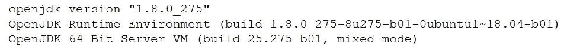
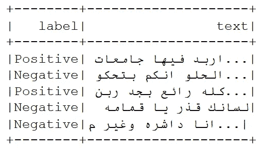
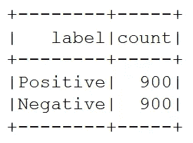
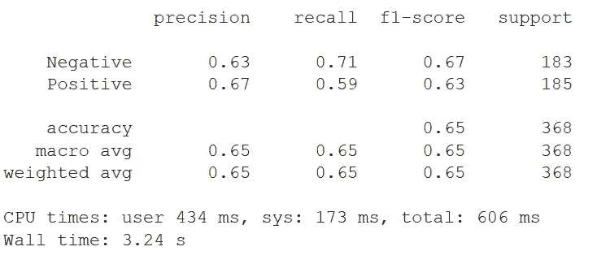
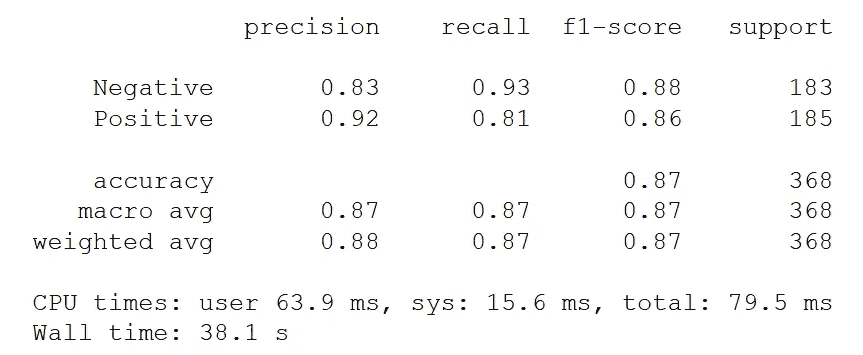
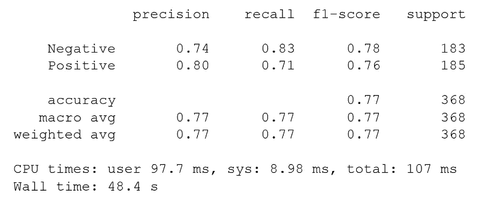

# 使用 Apache Spark 实现阿拉伯语自然语言处理自动化

> 原文：<https://towardsdatascience.com/automate-arabic-nlp-with-apache-spark-fdcc2eedade5?source=collection_archive---------50----------------------->

## 带代码的教程，使用 Apache Spark 和 Spark NLP 将大数据与阿拉伯语自然语言处理结合起来进行分布式计算


[杰瑞米·托马斯](https://unsplash.com/@jeremythomasphoto?utm_source=medium&utm_medium=referral)在 [Unsplash](https://unsplash.com?utm_source=medium&utm_medium=referral) 上拍照

很难概念化“大数据”实际上有多大，以及它对试图利用大数定律进行社会研究的数据科学家来说意味着什么。在《反乌托邦 2020》开始的时候，世界经济论坛估计全世界的数据量是 44 zettabytes(一个 zettabyte 有 21 个零)；这个数字大约是可观测宇宙中恒星数量的 40 倍。在全球范围内，到 2025 年，估计每天将产生 463 艾字节(一个艾字节有 18 个零)。对社会研究感兴趣的数据科学家应该为这一现实做好计划；目前专注于使用大数据工具应对未来是一个务实的决定。

[在这个关于阿拉伯语 NLP 的三部分系列的第一篇文章](/machine-learning-advancements-in-arabic-nlp-c6982b2f602b)中，我提到了对阿拉伯语特定语言资源日益增长的需求，并介绍了一些可用的前沿工具。这第二部分重点关注在使用像阿拉伯语这样的低资源语言时所必需的创造性，特别是因为最有前途的大数据工具都是为英语构建的。目前， [Apache Spark](https://spark.apache.org/) 显然是大数据领域的领跑者，John Snow Labs 的流行开源项目 [Spark NLP 提供了构建自动化大数据管道所需的免费 NLP 工具。此外，](https://nlp.johnsnowlabs.com/) [Apache Spark MLib](https://spark.apache.org/mllib/) 提供了可扩展的机器学习算法，可以无缝融入 Spark 的 API，为 Spark NLP 提供了必要的扩展。

在本文中，我将探讨如何使用这些大数据工具来创建 NLP 管道，以实现阿拉伯语 NLP 的自动化。具体来说，我比较了来自 Spark NLP 的三个预训练嵌入，它们与深度学习文本分类器结合使用，创建了一个阿拉伯语[情感分析](/sentiment-analysis-of-social-media-with-python-45268dc8f23f)管道，可以在 Spark 集群中运行，用于[分布式计算](https://en.wikipedia.org/wiki/Distributed_computing)。

# **面向大数据的 Apache Spark】**

Spark 将自己定位为“大规模数据处理的统一分析引擎”。关键卖点是速度(内存比 Apache Hadoop 快 100 倍)以及与其他数据需求的广泛集成，如 SQL、流、机器学习和图形。实际上，Spark 作为数据处理框架的强大之处在于可伸缩性和并行性。Spark 可以在大数据集上快速执行处理任务，重要的是将这些数据处理任务分布在多台计算机上。这种批处理并行化可以通过 Spark 单独完成，也可以与其他分布式计算工具协同完成。例如，它可以与谷歌开发的 [kubernetes](https://kubernetes.io/) 和其他 Apache 产品集成，如 [Hadoop](https://hadoop.apache.org/) 、 [Cassandra](https://cassandra.apache.org/) 、 [Mesos](http://mesos.apache.org/) 和 [HBase](https://hbase.apache.org/) 。

Medium 上有几个有用的快速入门指南，用于设置 Spark 集群:[与 Kubernetes](/quickstart-apache-spark-on-kubernetes-18d01ea5df7d) 一起使用，[与 Databricks](/quick-start-guide-to-spark-with-databricks-d2d24a2f995d) 一起使用，[与 Hadoop](https://medium.com/@jootorres_11979/how-to-install-and-set-up-an-apache-spark-cluster-on-hadoop-18-04-b4d70650ed42) 一起使用，[与 PySpark 和 Spark-submit](https://medium.com/hackernoon/get-a-quick-start-with-pyspark-and-spark-submit-da16bd7e75c) 一起使用。Spark 框架的核心构建块是*弹性分布式数据集* (RDD)，本质上是一个可以并行操作的数据集。Spark 在 [RDD 编程指南](https://spark.apache.org/docs/latest/rdd-programming-guide.html)中提供了大量利用 RDD 的文档。当使用 Python 时，我使用 PySpark，[这本全面的指南](https://medium.com/edureka/pyspark-rdd-ef9edd060a25)对于 PySpark 和 RDD 初学者来说是一个很好的起点。对于一个更短的、专注于代码的教程，我建议在 [Neptune.ai](https://neptune.ai/) 博客上发布这个[可访问的帖子](https://neptune.ai/blog/apache-spark-tutorial)。

Spark 是用 Scala 编写的，它有一个 Java 虚拟机(JVM)运行时，运行速度比 Python 快 10 倍。此外，Scala 作为静态类型语言还有额外的运行时优势，这意味着代码是在运行时之前编译的，而 Python 是动态类型语言，因此速度较慢，因为代码必须在运行时进行解释。由于速度的原因，Spark 最好与 Scala 一起使用，但是我建议在选择一种语言之前，先阅读[这篇比较 Scala 和 Python for Spark 的文章](https://www.kdnuggets.com/2018/05/apache-spark-python-scala.html)。出于本教程的目的，我将利用 Python 例子来提高可访问性，但是我建议在为生产编写管道时使用 Scala。

# **Spark NLP for Arabic NLP**

Spark NLP 是 John Snow Labs 的一个开源项目，作为第三方产品，成功地将 NLP 集成到 Spark 生态系统中。这是一个很好的做法，以简化效率和质量保证的共同进程，和火花 NLP 的管道，使这成为可能，为经常性的 NLP 任务。Spark NLP 有许多预训练的管道、模型和嵌入，可用于几种不同的语言，用于命名实体识别、依存解析和情感分类等任务。

特别是对于阿拉伯语，Spark NLP 提供了一个阿拉伯语分类器，一个停用字词清洁器和字词嵌入。不幸的是，在撰写本文时(2021 年 1 月), lemmatizer 和单词嵌入是错误的和不可靠的。就个人而言，我发现在使用阿拉伯语时，最有用的 Spark NLP 工具是多语言工具。对于本文，我构建了几个深度学习阿拉伯情感分类器，测试了两种类型的多语言句子嵌入和一种多语言单词嵌入。

## **阿拉伯情感分类**

为了判断前述多语言嵌入的质量，我使用[阿拉伯语约旦语通用推文(AJGT)语料库](https://github.com/komari6/Arabic-twitter-corpus-AJGT)进行二元情感分类。这允许与 [AraBERT](https://github.com/aub-mind/arabert) 情感分类器的结果进行直接比较，我在[我的上一篇阿拉伯语 NLP 文章](/machine-learning-advancements-in-arabic-nlp-c6982b2f602b)中介绍了该分类器。提醒一下，AJGT 数据集由 1800 条现代标准阿拉伯语或约旦方言的推文组成，标注为正面或负面。当用于训练 AraBERT 模型时，该数据集产生 93.8%的准确率。我测试的三个嵌入包括如下:[通用句子编码器句子嵌入(USE)](https://arxiv.org/abs/1803.11175) ，[语言不可知的 BERT 句子嵌入(LaBSE)](https://arxiv.org/abs/2007.01852) 和[多语言 BERT 单词嵌入(M-BERT)](https://github.com/google-research/bert/blob/master/multilingual.md) 。

## **句子嵌入**

句子嵌入是一种将句子映射到向量的文本处理方法，作为一种用适合机器学习的实数表示文本的方法。关于如何训练和部署基于 Transformer 的句子嵌入(如 LaBSE)的更多细节，我建议阅读我关于*基于 Transformer 的句子嵌入*的文章。

[](https://medium.com/swlh/transformer-based-sentence-embeddings-cd0935b3b1e0) [## 基于转换器的句子嵌入

### 深度学习自然语言处理教程分析与摘录文本摘要的文件集，利用…

medium.com](https://medium.com/swlh/transformer-based-sentence-embeddings-cd0935b3b1e0) 

Spark NLP 提供了两个 [Tensorflow Hub 的通用句子编码器模型](https://tfhub.dev/google/universal-sentence-encoder/1)，默认选项是用深度平均网络(DAN)编码器训练的模型，这是最初使用论文的研究人员提供的两个选项中最受欢迎的一个。关于如何实现 USE 语句嵌入的更多细节，我推荐这篇讨论生产选项的[中型文章。](/use-cases-of-googles-universal-sentence-encoder-in-production-dd5aaab4fc15)

## **多语言 BERT 单词嵌入**

根据我的经验，句子嵌入的主要优势是速度和适合语义文本相似性任务。然而，对于文本分类任务，例如情感分析，BERT 型单词嵌入通常产生更好的结果。Spark NLP 没有用于多语言或阿拉伯语情感分析的预训练管道，用于文本分类的管道组件需要句子嵌入。因此，为了比较 M-BERT 嵌入，我决定修改单词 embedding，以便它们可以以类似于多语言句子嵌入的方式使用。明确地说，我怀疑这种非常规的方法不如预先训练的句子嵌入，因为[研究表明这对于语义相似性任务](https://arxiv.org/abs/1908.10084)来说是正确的。然而，据我所知，这种比较还没有用于文本分类任务，因此我很好奇。

## 【Spark NLP 入门

首先，要使用 Spark NLP for Python，需要安装 Spark NLP 和 PySpark。这是通过以下代码行完成的:

```
pip install spark-nlp==2.6.5 pyspark==2.4.4
```

下一个需求是为 Spark NLP 安装正确的 Java 环境。这一步可能比较棘手，所以如果在设置 Java 8 运行时环境时遇到困难，我建议使用 Google Colab 而不是本地 IDE。

成功安装后，输出应为:



最后，必须初始化一个 Spark NLP 会话，只需使用下面的代码片段即可完成。

```
import sparknlpspark = sparknlp.start()
```

检查是否使用了正确版本的 Spark 和 Spark NLP 是可行的，因此我建议运行以下两个命令作为健全性检查。

```
Spark.versionsparknlp.version()
```

最后一步，从 Spark NLP 和 Spark MLib 导入必要的模块。

```
from pyspark.ml import Pipeline
from sparknlp.annotator import *
from sparknlp.common import *
from sparknlp.base import *
from sparknlp.embeddings import *
from pyspark.sql.functions import *
```

## **在 Spark NLP 中使用 rdd**

Spark NLP 会话运行后，可以将不同类型的数据加载到 Spark 数据帧(RDD)中。以下命令用于将 json 读入 PySpark RDD:

```
df_spark = spark.read.option("header",True).json("AJGT_labels.json")
```



AJGT 数据集中的前五个条目读作 RDD。图片作者。

快速分组命令显示二进制标签的分布。

```
df_spark.groupBy("label").count().show()
```



来自 AJGT 数据集的标签计数显示了平衡分布。图片作者。

在准备训练时，有必要分割数据集，对于 RDDs，可以使用以下命令:

```
df_train, df_test = df_spark.randomSplit([0.8, 0.2], seed=42)
```

## **构建 Spark NLP 管道**

如前所述，Spark NLP 提供了一个深度学习文本分类器，需要句子嵌入作为输入。对于两个多语言句子嵌入，通过简单地切换出嵌入，可以使用相同的 NLP 管道。我为 M-BERT 单词嵌入构建了一个单独的 NLP 管道，它基于平均池策略产生句子嵌入。管道构建组件包括转换器(不要与转换器架构混淆)和注释器，其细节在 Spark NLP [文档](https://nlp.johnsnowlabs.com/docs/en/concepts)和[这篇文章的第三部分](/introduction-to-spark-nlp-foundations-and-basic-components-part-i-c83b7629ed59)中讨论。

如下面的代码片段所示，要构建一个阿拉伯情感分类器，第一步是使用一个名为 DocumentAssembler()的转换器。接下来，标记化和清理(删除停用词)的基本预处理步骤由标记化器()和停用词清理器()注释器处理。请注意，清洁工使用了阿拉伯停用词。

对于 LaBSE 句子嵌入，使用 BERTSentenceEmbeddings()注释器，而一个单独的注释器 UniversalSentenceEncoder()用于使用嵌入。两种嵌入都显示在下面的代码片段中，只需根据所需的管道注释掉不需要的代码块。

对于 M-BERT 单词嵌入，BERTEmbeddings()注释器用于创建单词嵌入，然后用 sentence embeddings()注释器将单词嵌入转换成句子嵌入。

当使用 ClassiferDLApproach()设置文本分类深度学习方法时，可以为深度神经网络的训练分配参数。在下面的代码片段中，我将最大历元数设置为 6，验证拆分为 50%，丢弃为 20%，学习率设置为 5^-4.我选择这些参数是为了避免由于小数据集而导致的过度拟合，并希望提高泛化能力。根据所使用的数据集，可能有必要调整这些参数。

构建管道的最后一步是按照指定的顺序组装组件，用分类器打包预处理步骤。在下面的代码片段中，我展示了两条管道，第一条管道用于 USE 和 LaBSE 嵌入，第二条管道用于 M-BERT 嵌入。如图所示，对于 M-BERT，唯一的区别是将单词嵌入和句子嵌入放在一起。

## **NLP 管道培训**

为了用 NLP 管道训练分类器，我使用了下面的单行代码:

```
classification_model = nlp_pipeline.fit(df_train)
```

下面的代码片段显示了访问培训日志和显示培训报告所需的两个命令。培训日志中的每个报告条目都将打上时间戳，并可通过十二位字母数字代码进行识别。

```
!cd ~/annotator_logs && ls -l# select a report log from output of previous command 
!cat ~/annotator_logs/ClassifierDLApproach_xxxxxxxxxxxx.log
```

最后，为了评估结果，在拆分数据集时，有必要在搁置维持数据的情况下测试模型。下面的代码片段显示了如何在测试 Spark 数据帧上运行预测，将其转换为 Pandas 数据帧，然后使用 Scikit-Learn 构建一个简单的分类报告。

当使用 AJGT 数据集来训练阿拉伯情感分类器时，Spark NLP 提供的预训练嵌入都没有 AraBERT 模型的准确度高。对于 USE、LaBSE 和 M-BERT 嵌入，如下所示的结果分别为 65%、87%和 77%。



使用**通用语句编码器** **嵌入训练的阿拉伯情感分类器的分类报告。**



使用**语言不可知的 BERT 句子嵌入**训练的阿拉伯情感分类器的分类报告。



使用**多语言 BERT 单词嵌入**训练的阿拉伯情感分类器的分类报告。

有趣的是，观察到与使用嵌入相比，M-BERT 嵌入导致显著更高的准确度，假定 M-BERT 嵌入旨在作为单词嵌入而不是句子嵌入。对于 LaBSE 嵌入，测试嵌入实现的最高准确度是 87%。然而，正如之前证明的，直接在阿拉伯语上训练的 AraBERT 模型表现得非常好，对于这个特定的情感分类任务，报告的准确率为 93.8%。

此外，从上述结果中可以看出，三种分类报告的计算墙时间存在明显差异。使用报告耗时 3.24 秒，而 LaBSE 和 M-BERT 报告分别耗时 38.1 秒和 48.4 秒。虽然使用嵌入产生了最差的准确度分数，但是使用管道比其他两个管道快 10 倍以上。

# **最终想法**

本教程中的实验允许在 AraBERT 和 Spark NLP 已经采用的最先进的句子嵌入之间进行比较。看起来特定于阿拉伯语的语言模型比 Spark-NLP 提供的多语言选项表现得更好。事实上，AraBERT 背后的研究人员已经针对 M-BERT 单词嵌入对他们的模型进行了基准测试，[结果显示 AraBERT](https://arxiv.org/abs/2003.00104) 的准确率更高。不幸的是，Spark NLP 尚未将 AraBERT 添加到其预训练模型的阵容中。因此，根据我的结果，最好的选择是保存 LaBSE 管道和经过训练的分类器，以便部署在自动化 Spark 工作流中，用于可扩展和可并行的阿拉伯情感分类。准确性的牺牲将得到可靠而高效地处理大数据的能力的回报。我的希望是 Spark NLP 将为低资源语言添加额外的预训练模型，不仅仅是多语言模型或双语翻译模型，而是针对像阿拉伯语这样学习不足的语言的特定语言模型。