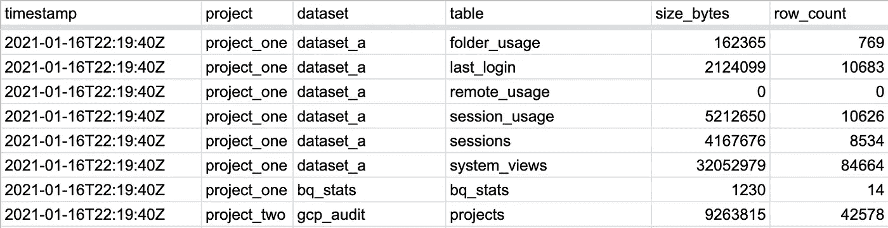

# 使用 BigQuery 或 Google Sheets 自动生成 BigQuery 数据集和表大小报告

> 原文：<https://towardsdatascience.com/automate-bigquery-dataset-table-size-reporting-using-bigquery-or-google-sheets-c0d43c3db30?source=collection_archive---------23----------------------->

## 从 BigQuery 项目中自动收集表格大小和行数，并将其全部存储在 BigQuery 和/或 Google Sheets 中。

多说说…？

2021 年 1 月 18 日更新:更新了流程和回购代码，因此您只需指定您的 GCP 项目 id，而无需手动输入您的所有项目和数据集 id。所以…现在更容易了！

我想看看是否有可能轻松地自动化跟踪不同的 BigQuery 数据集和表如何随时间变化的过程。在某个时候，我还会添加在阈值被突破时接收电子邮件或 Google Chat 通知的功能(表格在两次检查之间增加/减少太多)，但那是另外一天的事了。今天，我们只是收集关于表的信息，以便于报告和可视化。

显然有很多不同的方法可以做到这一点，包括 BigQuery 本身的预定查询，但这也不能处理将数据自动推入 Google Sheet 的过程。另外…我想看看这在 AppScript 中是否可行，因为现在我可以重新调整查询函数的用途，以便在将来执行其他事情。

以下是我们要用到的所有东西:

1.  BigQuery 数据集/表—跨多个项目检查它们的大小
2.  AppScript —处理代码并安排检查自动运行
3.  BigQuery 表——存储我们收集的数据，如果我们不想使用工作表
4.  Google Sheet——存储我们收集的信息，如果我们不想使用 BQ 的话

让我们开始吧。

# 创建 appscript 项目

*   去 script.google.com[创建一个新项目](http://script.google.com)
*   因为没有与 appscript 的 git 集成，所以您只需要手动复制文件(文件的内容)
*   从这里分享的 github 库复制文件内容:【https://github.com/usaussie/appscript-bigquery-reporter 
*   您应该得到 3 个文件——jobs . GS、Helpers.gs、Config.gs(根据提供的示例重命名)

# 更新项目以使用您的 BigQuery / Sheet 信息

*   更新 Config.gs 文件以指向您自己的 BQ 项目和您想要跟踪的数据集，然后还提供一个 BQ 表来存储结果=，最后是一个 google sheet url。

```
// BigQuery Project ID - all lowercase
const BQ_PROJECT_ID = 'your-gcp-project-id';// Create a dataset in the BigQuery UI (https://bigquery.cloud.google.com)
const BQ_DATASET_ID = 'your-gcp-dataset-id';// Table ID to store the collected stats
const BQ_TABLE_ID = 'your-gcp-table-id';// for storing the metrics in google sheets tooconst SHEET_URL = "https://docs.google.com/spreadsheets/d/your-google-sheet/edit";const MAIN_SHEET_TAB_NAME = "Sheet1";// these are the tables & datasets that you
function project_dataset_list() {  
    return [    
        ['gcp-project-id-a', 'dataset_one'],
        ['gcp-project-id-a', 'dataset_two'],
        ['gcp-project-id-b', 'dataset_one'],
        ['gcp-project-id-c', 'dataset_one']
    ];
}
```

*   就是这样…这就是你要自己编码的所有东西…它甚至真的没有编码…它只是指向您已经管理的 id。
*   如果您还没有 BQ 表来存储结果，不要担心，您也可以从这个项目中这样做。

# 设置完毕，让我们开始吧…

*   首先，让我们创建 BQ 表—打开 Jobs.gs 文件，运行一次 create_tables_one_time()函数和 set_sheet_headers()函数。

```
/**
 * Only run this once to create the initial tables to hold the collected data.
 */

**function create_tables_one_time() {**

  var my_tables = tables_to_create();

  for (i = 0; i < my_tables.length; i++) {

    // generate correct function / table info from detected string
    var tableFunction;
    tableFunction = new Function('return ' + my_tables[i]);
    var thisTable = tableFunction()();

    var tableJson = constructTableJson(thisTable, BQ_PROJECT_ID, BQ_DATASET_ID);
    createTable(thisTable.tableId, BQ_PROJECT_ID, BQ_DATASET_ID, tableJson);

  }

**}**/*
*
* ONLY RUN THIS ONCE TO SET THE HEADER ROWS FOR THE GOOGLE SHEETS
*/
**function set_sheet_headers() {**

  var sheet = SpreadsheetApp.openByUrl(SHEET_URL).getSheetByName(MAIN_SHEET_TAB_NAME);
  sheet.appendRow(["timestamp","project","dataset","table", "size_bytes", "row_count"]);

**}**
```

*   这将使 Google 弹出并提示允许您的新 appscript 项目代表您连接到 BigQuery，并写入 Google Drive/Sheets。注意，这是你的项目…所以你只是授予许可给…你自己:-)

授予自我许可！

*   运行 job_get_bq_stats()函数，并等待几秒钟(取决于您正在检查多少个表)。

```
**function job_get_bq_stats() {** 
  var this_timestamp = Utilities.formatDate(new Date(), "UTC", "yyyy-MM-dd'T'HH:mm:ss'Z'");

  var projects = project_dataset_list();

  // loop the outer array
  var stats_array = []
  for (let i = 0; i < projects.length; i++) {

      var my_query = construct_select_query(projects[i][1]);
      var query_data = runQuery(projects[i][0], my_query);

      // if there are results, add the extra info (timestamp, project etc) ready for storage/insert into our sheet/bq table
      if(query_data.length > 0) {

        for (let q = 0; q < query_data.length; q++) {

          stats_array.push([
            this_timestamp,
            projects[i][0],
            projects[i][1],
            query_data[q][0],
            query_data[q][1],
            query_data[q][2],
          ]);

        }

      }

  }

  // write to bigquery
  var insert_query = construct_insert_query(stats_array);
  runQuery(BQ_PROJECT_ID, insert_query);

  //write to google sheet now
  // write collected rows arrays to the sheet in one operation (quicker than individual appends)
  var ss = SpreadsheetApp.openByUrl(SHEET_URL).getSheetByName(MAIN_SHEET_TAB_NAME);
  ss.getRange(ss.getLastRow() + 1, 1, stats_array.length, stats_array[0].length).setValues(stats_array);

**}**
```

*   函数执行完毕后，您可以检查 BigQuery 表或 google sheet 来查看结果。



带有收集的 BQ 数据的 Google Sheets 截图

*   现在您应该看到包含项目 ID、数据集 ID、表 ID 的行，然后是表大小(字节)和行数。

我有数据！

# 安排它自动运行

*   单击 appscript 项目中的 triggers 部分，按照提示每天(或根据需要每小时)运行 job_get_bq_stats()函数。


在 appscript 中设置触发器以自动运行此作业的屏幕截图

我被触发了！

# 就是这样！

详述一下…

我想补充的下一点是，当数据集在两次检查之间增长/变化“太多”时会发出警报。

请注意，您显然可以将它连接到 Google Datastudio 仪表板，以绘制一段时间内的表格数据，并识别异常值等。

最后…这是代码的 git repo 的另一个链接……您可以根据自己的需要随意使用、增强、扩充。

[https://github.com/usaussie/appscript-bigquery-reporter](https://github.com/usaussie/appscript-bigquery-reporter/blob/main/README.md)

我喜欢分享:-)