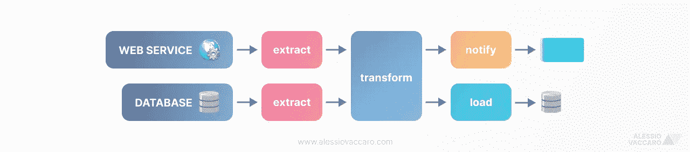
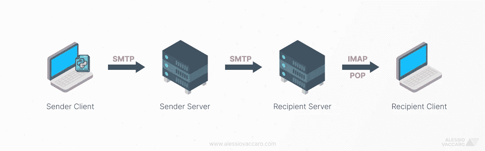
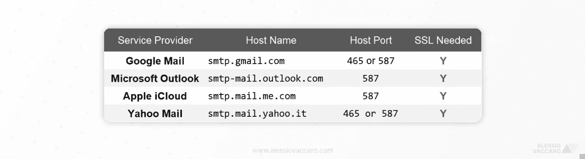
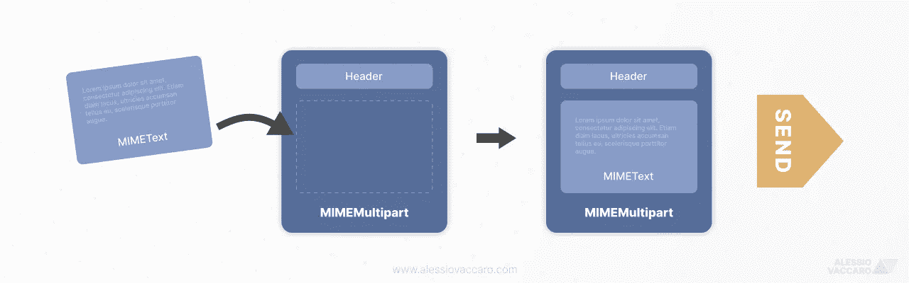
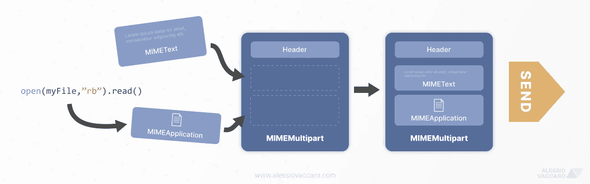

# 📧使用 Python 自动发送电子邮件

> 原文：<https://towardsdatascience.com/automate-email-sending-with-python-74128c7ca89a?source=collection_archive---------4----------------------->

## ETL 管道的权威代码片断集合

作者图片[A.Vaccaro]

# 0.介绍

通常，当执行复杂的 ETL 管道或简单的脚本时，我们需要从邮箱甚至 ***中读取，自动发送带有任何类型附件( *CSV、PDF、JPEG 等)的**** 。)*图一*。

图 1——一个简单的 ETL 管道可能以给涉众的电子邮件通知结束。[图片由作者 A.Vaccaro 提供]

正如我们可以想象的， ***Python 是在有或没有我们监督的情况下自动发送任何种类电子邮件的理想伴侣*** 。

问题是，尽管有一个简单的 ***包来处理这一切*** ，但我们在网络上找到的指南往往是支离破碎、不完整的。

有了这篇文章我想 ***收集并展示*** 你一劳永逸的 ***最简单的方法*** ***自动发送邮件*** ( *HTML 或不* ) ***带或不带附件*** 。

🔖所以…请随意将这篇文章添加到您的 ***书签中，以备将来使用*** ！

# 1.在后台

我们当中有谁从未需要配置自己的邮箱来阅读电脑/智能手机上的电子邮件？

在那一刻，我们当然意识到发送、接收和存储电子邮件需要使用服务提供商 。其中最常见的当然是谷歌邮件、微软 Outlook 和苹果 iTunes。

因此，不可避免地要谈一下描述电子邮件服务提供商特征的 ***3 个著名协议*** :

*   ***SMTP*** :是用于发送邮件的 ***协议。*** 其首字母缩写代表*简单邮件传输协议*。这就是我们将在本文中使用的。
*   另一方面， ***IMAP*** 和 ***POP*** 是另外两个流行的协议，分别用于从/在我们的客户端中 ***读取*** 和 ***下载*** 电子邮件。

# 2.流动

图 2 —电子邮件生命周期。[图片由作者 A.Vaccaro 提供]

我们即将实施的流程非常简单:

1.  使用 Python，我们将实例化一个与服务提供商的 ***加密连接***(STARTTLS)；
2.  收到我们的邮件后，我们的服务商(*发件人服务器*)会通过 SMTP 发送 ***给收件人服务商(*收件人服务器*)；***
3.  收件人的客户端可以使用收件人的服务器 ***通过 IMAP 或 POP 阅读电子邮件*** 。

# 3.我们需要什么

这就是我们所需要的:

*   **smtplib**:Python 的*标准库*包之一，用很少几行代码发送电子邮件。我们不需要安装这个软件包。
*   **SMTP 设置**:让我们看看我们的服务提供商(*，我们打算从那里发送邮件*)的文档，寻找 ***SMTP 主机名*** 和 ***SMTP 主机端口*** 。下面我给你留了一个表格，总结了最常见的设置:

图 3 — TODO ( [谷歌邮箱](https://support.google.com/mail/answer/7126229)、[微软 Outlook](https://support.microsoft.com/it-it/office/impostazioni-pop-imap-e-smtp-per-outlook-com-d088b986-291d-42b8-9564-9c414e2aa040) 、[苹果 iCloud](https://support.apple.com/it-it/HT202304) e [雅虎邮箱](https://it.aiuto.yahoo.com/kb/o-IMAP-sln4075.html))【图片由作者提供— A.Vaccaro】

在继续之前，让 ***定义参数*** :

*注意:收件人和发件人是一样的，因为就本文的目的而言，我们最好给自己发邮件*😅*。*

让我们从 ***代码片段*** 开始吧！

# 4.如何发送不带附件的电子邮件

让我们从最简单的例子开始:发送一封没有附件的文本邮件。

在这个例子中，像在其他例子中一样，我们将使用***MIME Multipart***格式，这将允许我们一次组合电子邮件的一部分。

图 4-带有 MIMEText 对象的简单电子邮件。[图片由作者 A.Vaccaro 提供]

让我们从导入`smptlib`包以及`MIMEMultipart`和`MIMEText`模块开始。然后，我们可以通过输入我们的凭证来实例化与服务提供者的连接。

在创建 MIMEMultipart()对象之后，我们用关于发送者、接收者和主题的数据填充它的头部。

最后，让我们定义并填充 MIMEText()和 ***发送消息*** 。

搞定了。极其简单！

# 5.如何发送不带附件的 HTML 电子邮件

这与前面的例子非常相似。

唯一的区别？MIMEText 对象类型必须是“html ”, mime multipart 必须是“alternative”。

图 5-用 MIMEText 对象实现的 HTML 电子邮件。[图片由作者 A.Vaccaro 提供]

让我们像以前一样重写所有内容，插入刚才提到的两个属性。

超级简单。让我们继续附件…

# 6.如何发送带附件的电子邮件

MIMEMultipart 的 ***模块化*** 终将浮出水面。

图 6 —包含文本和附件的电子邮件。[图片由作者 A.Vaccaro 提供]

在这种情况下，实际上，为文本组件实例化一个 ***MIMEText*** 和为附件实例化一个(或多个)***mime application***就足够了。

我们最后将 ***把它们放在一起*** 在一个 MIMEMultipart 对象中。

我们可以看到，要将**文件*正确地附加到*文件**中，就必须以“*字节*格式打开它。因此在`open()`函数中需要“ *rb* ”。

最后，为了正确地构造 MIME 对象，我们还向 MIMEApplication 对象添加了“Content-Disposition”属性，以指示附件的名称。

# 7.结论

IT 工具发展非常迅速。尽管如此，电子邮件仍然是任何一种交流方式的基础(或多或少有些复杂)。

此外，正如我们在本文中看到的，使用 Python 自动发送电子邮件极其简单。

我希望已经阐明了你的想法，并能够适当地综合任何需要。

为了其他的一切…让我们保持联系吧！

[🤝](https://emojipedia.org/handshake/) *如有任何疑问、反馈或协作要求，请随时* ***联系我***[***Linkedin***](http://bit.ly/alessiovaccaroLinkedIn)*。我会很高兴和你聊天！*

[👉](https://emojipedia.org/backhand-index-pointing-right/)要获得更多像这样的内容，并保持对即将到来的文章的更新，不要忘记 ***在 Medium*** 上关注我。

🙏如需参考本文，请联系我。谢谢你。