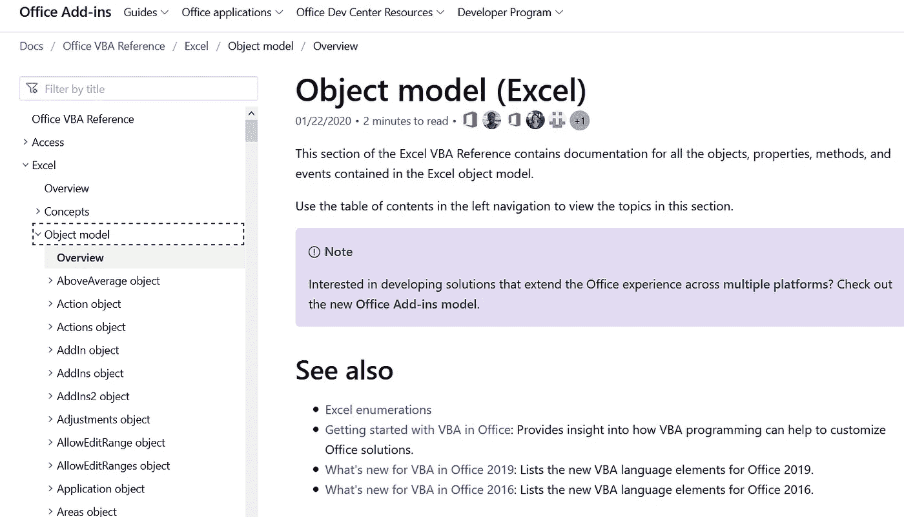
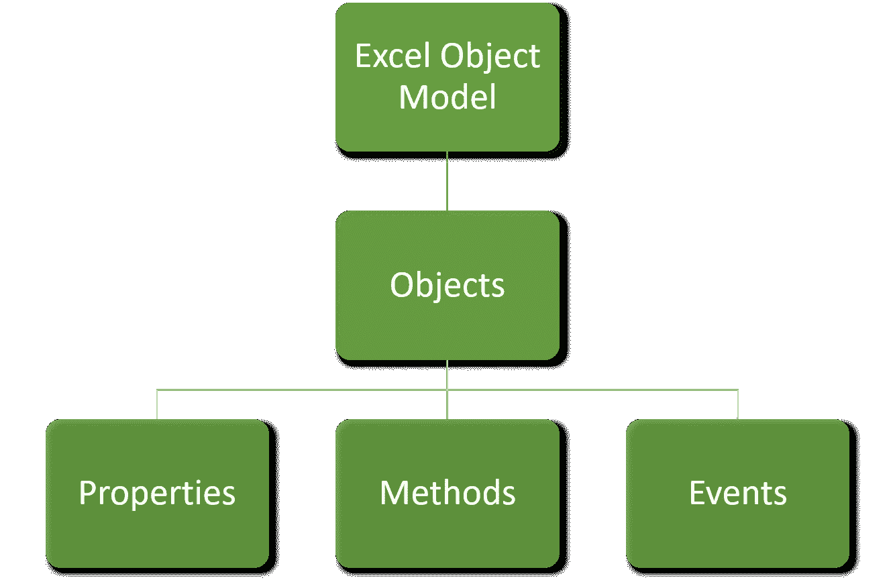
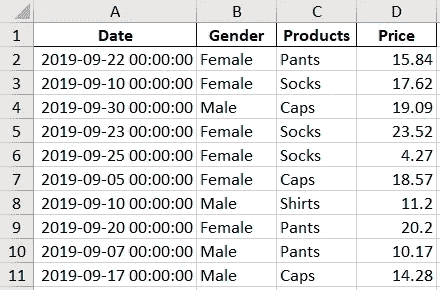
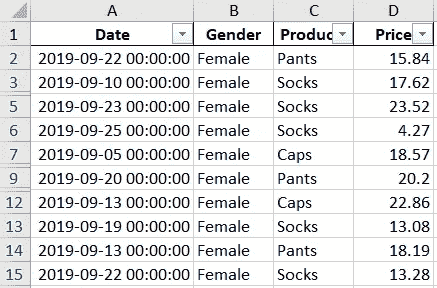
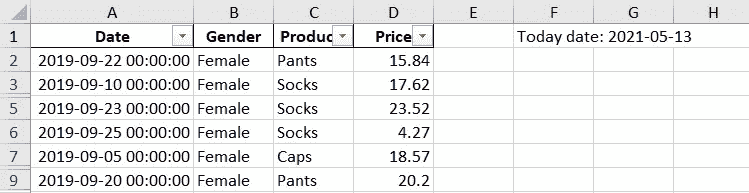
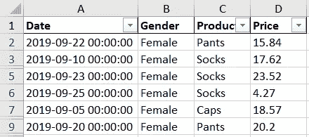
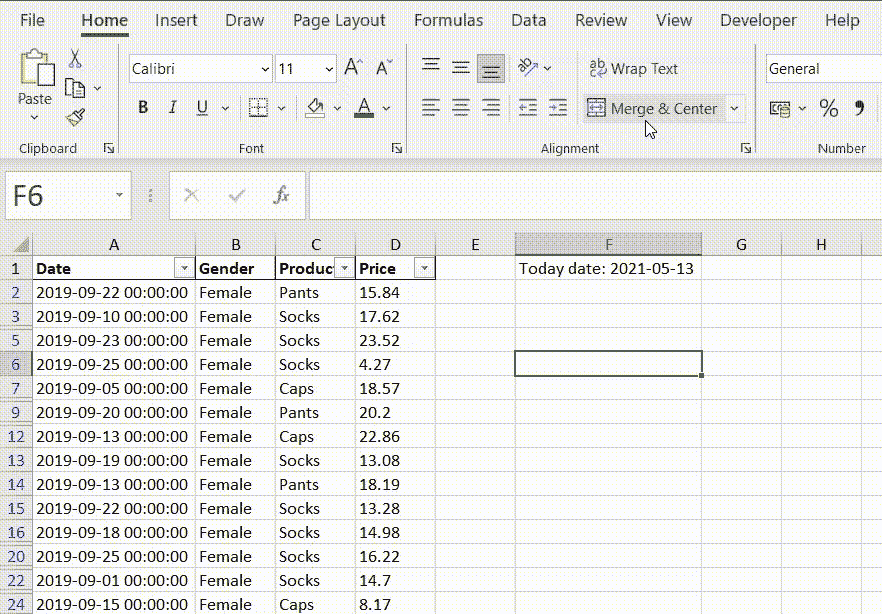

# 使用 Python 自动化 Excel

> 原文：<https://towardsdatascience.com/automate-excel-with-python-7c0e8c7c6256?source=collection_archive---------0----------------------->

## [使用 PyWin32 实现自动化](https://towardsdatascience.com/tagged/automation-with-pywin32)

## 用 Python 自动处理无聊的事情，腾出手来喝咖啡


照片由[布里吉特·托姆](https://unsplash.com/@brigittetohm?utm_source=unsplash&utm_medium=referral&utm_content=creditCopyText)在 [Unsplash](https://unsplash.com/s/photos/coffee?utm_source=unsplash&utm_medium=referral&utm_content=creditCopyText) 上拍摄

大多数情况下，一个组织会有多个数据源，数据科学家或数据分析师必须在执行分析或创建模型之前，将不同数据源中的数据提取并编译到一个 Excel 文件中。如果我们手动执行，这将是一项复杂且耗时的任务。

用最著名的 Python 库`pandas`来做这件事会缩短时间，但是硬编码的 Excel 文件可能不会受到直接访问 Excel 文件的其他领域用户的青睐。因此，创建一个格式良好的交互式 Excel 文件将减轻领域用户的工作，并启发他们。

> Excel 允许您以透明的方式处理数据，这意味着当打开 Excel 文件时，数据立即可见，并且数据处理的每个步骤也可见。—周红[1]

此外，Excel 很棒，因为我们可以看到报告是如何生成的，以及各列之间的关系。Excel 文件本身是不言自明的。而`pandas`生成的硬编码 Excel 文件不具备这些特性。

所以，这就是`pywin32`的用武之地。`Pywin32` 允许我们从 Python 访问 Microsoft Excel。我们可以通过`pywin32`访问 Excel 中的所有对象、方法和属性。(在此查看所有 Excel 对象、方法和属性[。)](https://docs.microsoft.com/en-us/office/vba/api/overview/excel)

# Excel VBA 参考

`pywin32`没有官方文档，所以我必须参考 Excel VBA 的官方文档来了解可用的对象、属性和方法。



截图来自[微软文档](https://docs.microsoft.com/en-us/office/vba/api/overview/excel/object-model)

## Excel 对象模型

对象、属性、方法和事件包含在 Excel 对象模型中*(我现在不处理事件，所以在本文中，我将只关注对象、属性和方法)*。下面的流程图说明了它们之间的关系。



作者创建的图像

我经常使用的一个对象是**范围对象**。区域是指 Excel 工作表中的单元格。Range 对象包含如下图所示的方法和属性。


截图来自[微软文档](https://docs.microsoft.com/en-us/office/vba/api/overview/excel/object-model)

该文档包含 Excel VBA 的基本语法。幸运的是，将 Excel VBA 中的语法翻译成 Python 是很容易的。在我们进入示例之前，我们需要了解五个项目:

*   Excel 对象
*   Excel 对象方法
*   Excel 对象属性
*   Excel 常量
*   Excel 宏

## **Excel 对象**

**Excel 对象**类似于 **Python 类模块。**

当我们想调用一个定义在类模块中的函数时，我们会调用类模块，后跟一个点，然后是函数名。我们需要导入 class 模块来使用它的函数，但是对于`pywin32` 模块来说，它已经导入了一切，所以我们可以直接调用任何 Excel 对象、方法和属性。

以下部分是对 Excel 对象、方法和属性的详细解释，并附有示例。为了提供更清晰的信息，该示例将使用由下面的脚本生成的 Excel 文件来运行。

1.  定义创建 Excel 文件的函数

```
def create_test_excel_file(f_path: Path, f_name: str, sheet_name: str):

    filename = f_path / f_name
    random.seed(365)
    np.random.seed(365)
    number_of_data_rows = 1000

    # create list of 31 dates
    dates = pd.bdate_range(datetime(2019, 9, 1), freq='1d', periods=31).tolist()data = {'Date': [random.choice(dates) for _ in range(number_of_data_rows)],
            'Gender': [random.choice(['Female', 'Male']) for _ in range(number_of_data_rows)],
            'Products': [random.choice(['Shirts', 'Pants', 'Caps', 'Socks']) for _ in range(number_of_data_rows)],
            'Price': np.random.normal(15, 5, size=(1, number_of_data_rows))[0]}# create the dataframe and save it to Excel
    pd.DataFrame(data).to_excel(filename, index=False, sheet_name=sheet_name, float_format='%.2f')
```

2.定义参数并执行功能

```
# sheet name 
sheet_name = 'example'  # update with sheet name from your file
# file path
f_path = Path.cwd()  # file in current working directory
# f_path = Path(r'c:\...\Documents')  # file located somewhere else
# excel file name
f_name = 'example.xlsx'
create_test_excel_file(f_path, f_name, sheet_name)
```

为您创建的 Excel 文件的屏幕截图。



作者创建的图像

## Excel 对象方法

Excel 对象模型中的**方法**与 Python 中的**函数**相同，都是可调用的，执行任务。用 python 编写函数应该**总是以一对包含关键字参数**的括号结束，如下面的 Python 脚本所示，函数`greet`以一对包含名为“name”的参数的括号结束。

```
# Python Functions:
# create a function
def greet(name):
    print(f"Hello {name}")greet(name = "Alisa")
```

下面的脚本显示了如何在 Excel 中使用一种方法，通过使用`pywin32`来**自动筛选**。它与 Python 函数语法非常相似，除了我们不需要定义方法，我们**将对象放在方法**的前面，就像我们将类模块名称放在我们在类模块中定义的函数之前一样。*(这里使用的 Excel 文件是前面章节创建的 Excel 文件。)*

```
import pandas as pd
from pathlib import Path
import win32com.client as win32

f_path = Path.cwd() # change to the path to the Excel file
f_name = 'example.xlsx' # Excel File name
filename = f_path/f_name
sheetname = 'example' # change to the name of the worksheet

# create Excel object
excel = win32.gencache.EnsureDispatch('Excel.Application')
# excel can be visible or not
excel.Visible = True 
# open Excel Workbook   
wb = excel.Workbooks.Open(filename)# create filter in Excel Worksheet
wb.Sheets(sheetname).Range("A1").AutoFilter(Field = 2, Criteria1="Female", VisibleDropDown=False)
```

在上面的例子中，`wb.Sheets(sheetname).Range(“A1”)`是指对象，`AutoFilter()`是方法，`Field = 2, Criteria1="Female", VisibleDropDown=False`是参数。字段是指要筛选的列。`Field = 2`指左数第二列，即 B 列['性别']。该脚本的结果如下图所示，数据根据“性别”过滤，当我们将**标准**设置为女性时，仅显示“女性”记录。



作者创建的图像

将 Excel VBA 写入 Python 的标准语法是以这种方式组织代码:

> 对象。方法(参数=参数)

当您查看 Excel VBA 文档时，总会有一些如下的脚本示例(下面的脚本是根据上面提到的 Excel VBA 参考中的示例修改的)。

```
Worksheets("Sheet1").Range("A1").AutoFilter _
 Field:=2, _
 Criteria1:="Female", _
 VisibleDropDown:=False
```

Excel VBA 和 Python 的语法只有微小的区别，其中 **Excel VBA 不保存括号**中的参数，而在 **Python 中，**我们必须**创建 Excel 对象并显式定义工作簿路径和名称**。因此，从 Excel VBA 转换到 Python 是可能且容易的。

## Excel 对象属性

Excel 对象模型中的**属性**与 Python 中的**变量**相同，不可调用，只返回赋值。例如，Excel 表中某列的列宽是用来存储该列的列宽的属性。另一个例子，Excel 表中单元格的值。你可以把它想象成一个变量，你可以改变它的值，就像你在 python 中改变变量的值一样。

```
# Python Variable: 
# assign a value to a variable
x = 5
# change the value assigned to the variable
x = 6
```

上面显示了如何在 Python 中更新变量值的简单示例。下面的脚本展示了如何使用`pywin32`来更新 Excel 中单元格的值。

```
import pandas as pd
from pathlib import Path
import win32com.client as win32
import datetime
today = datetime.date.today()f_path = Path.cwd() # change to the path to the Excel file
f_name = 'example.xlsx' # Excel File name
filename = f_path/f_name
sheetname = 'example' # change to the name of the worksheet

# create Excel object
excel = win32.gencache.EnsureDispatch('Excel.Application')
# excel can be visible or not
excel.Visible = True 
# open Excel Workbook   
wb = excel.Workbooks.Open(filename)# update value in Excel Worksheet
wb.Sheets(sheetname).Range("F1").Value = f"Today date: {today}"
```

在上面的例子中，`wb.Sheets(sheetname).Range(“F1”)`指的是对象，`Value`是属性，而`f”Today date: {today}”`是分配给对象的值。简而言之，我们将一个值放入一个单元格中。当我们用 Python 编写脚本时，我们可以应用一些 Python 脚本。在这种情况下，使用 **f 字符串**。下图显示了脚本的结果。



作者创建的图像

当我运行这个脚本时，从前面的脚本创建的过滤器没有被清除，所以过滤器仍然在文件中。清除过滤器的方法将在下一节中解释。

将 Excel VBA 写入 Python 的标准语法是以这种方式组织代码:

> 对象。属性=值

下面是根据 Excel VBA 参考修改的脚本。

```
Worksheets("Sheet1").Range("F1").Value = "2021-05-13"
```

对于属性，Excel VBA 中的语法在大多数情况下与 Python 中的语法相同。当要分配的值是 Excel 常量时，语法会稍有不同。

## Excel 常数

一些对象方法和属性只接受常量列表作为它们的参数。Excel 常量通常以“xl”开头。在这种情况下，我们必须在使用 Python 时导入常量(在使用 Excel VBA 时这是不必要的)。

```
import pandas as pd
from pathlib import Path
import win32com.client as win32
**win32c = win32.constants**f_path = Path.cwd() # change to the path to the Excel file
f_name = 'example.xlsx' # Excel File name
filename = f_path/f_name
sheetname = 'example' # change to the name of the worksheet

# create Excel object
excel = win32.gencache.EnsureDispatch('Excel.Application')
# excel can be visible or not
excel.Visible = True 
# open Excel Workbook   
wb = excel.Workbooks.Open(filename)# set cell horizontal alignment
wb.Worksheets("example").Columns("A:D").HorizontalAlignment = **win32c**.xlLeft
```

在上面的例子中，赋值为`xlLeft`，因为它是 Excel 常量，我们必须在常量前面添加 **win32c** (因为我将`win32.constants`保存为 win32c)。上面脚本的结果如下图所示。



作者创建的图像

标题的水平对齐方式是居中，现在向左对齐。

将 Excel VBA 写入 Python 的标准语法是以这种方式组织代码:

> 对象。Property = win32c。ExcelConstant

## Excel 宏

pywin32 的语法类似于将 Excel VBA 翻译成 Python 语法。因此，您可以随时参考 Excel VBA 文档，了解 Excel 中可用的对象、方法和属性。当文档不够时，您可以简单地记录特定过程的宏并参考步骤信息。

在我的工作中，我使用 Excel 宏来获取特定列的字体颜色(`*expression*.Columns.Font.Color`)和单元格填充颜色(`*expression*.Columns.Interior.Color`)的颜色代码。



作者创建的 GIF

在上面的 GIF 中，255 代表红色的颜色代码，我们可以在 Python 脚本中使用它来改变单元格的颜色。

当我们不确定在某种情况下使用哪些方法或属性时，我们总是可以记录 Excel 宏。

# 例子

在这一节中，我将分享我经常使用的方法和属性。与上面的例子一样，在运行任何执行 excel 方法或修改 Excel 属性的脚本之前，我们需要导入库并创建 Excel 对象。以下示例中使用的 Excel 文件仍然是我们在前面部分创建的文件。

```
import pandas as pd
from pathlib import Path
import win32com.client as win32
win32c = win32.constantsf_path = Path.cwd() # change to the path to the Excel file
f_name = 'example.xlsx' # Excel File name
filename = f_path/f_name
sheetname = 'example' # change to the name of the worksheet

# create Excel object
excel = win32.gencache.EnsureDispatch('Excel.Application')
# excel can be visible or not
excel.Visible = True 
# open Excel Workbook   
wb = excel.Workbooks.Open(filename)
```

## 方法

1.  **自动滤镜**

向每列添加筛选器。

```
wb.Sheets(sheetname).Range("A1").AutoFilter(Field = 1)
```

**2。自动调整**

根据单词长度调整列宽。

```
wb.Sheets(sheetname).Columns("A:I").AutoFit()
```

**3。复制**

将单元格区域的值复制到另一个位置。

```
wb.Sheets(sheetname2).Range("A1:E10").Copy(Destination = wb.Sheets(sheetname).Range("F1"))
```

**4。复制+选择性粘贴**

将一个工作表的格式复制到另一个工作表。

```
# copy paste FORMAT only, which include font colour, fill colour, and border
wb2.Sheets(sheetname).Range("A:D").Copy()
wb.Sheets(sheetname).Range("A1").PasteSpecial(Paste=win32c.xlPasteFormats)
```

**5。向下填充(向左填充、向右填充、向上填充)**

将公式填入单元格区域。例如，从单元格 A2 填充到 A1000，如下面的脚本所示。

```
wb.Sheets(sheetname).Range("A2:A1000").FillDown()
```

**6。插入**

通过向下移动原始列*(到后面的索引，例如，从 C 列到 D 列)*插入新列。

```
# insert a new row by shifting the original row down
wb.Sheets(sheetname).Rows("1:2").Insert(win32c.xlShiftDown)
```

## 性能

1.  **列宽**

调整列宽。

```
wb.Sheets(sheetname).Columns("A").ColumnWidth = 10
```

**2。字体/内部颜色**

**字体**包含更多属性，例如字体颜色、字体大小和字体名称。

分配颜色有两种方法，颜色代码和颜色索引。对于颜色代码，它是一个很长的数字，只能通过查阅 Excel 宏步骤信息来获得。而对于颜色索引，您可以在 Excel 中创建一个颜色表，并找到您想要的颜色索引。

```
wb.Worksheets(sheetname).Columns("K:K").Font.Color = -4165632
wb.Worksheets("sheetname").Columns("K:K").Interior.Color = 10092492
```

**3。公式**

将公式分配给单元格。

```
wb.Sheets(sheetname).Range(f"{column_insert}2").Formula = "=A2+B2"# if you wish to create a function
column1 = "A"
column2 = "B"
operation = "+" # math operation to perform between 2 columnsdef math_op(column1, column2, operation):
  wb.Sheets(sheetname).Range(f"{column_insert}2").Formula =   f"={column1}2{operation}{column2}2"math_op(column1, column2, operation)
```

`{column1}`和`{operation}`之间的‘2’，`{column2}`后的‘2’表示第 2 行。

**4。水平对齐**

调整单元格水平对齐。对准有三种类型，分别是`xlLeft`、`xlCenter` 和`xlRight`。

```
wb.Worksheets("sheetname").Rows("1:1").HorizontalAlignment = win32c.xlLeft
```

**5。数字格式**

设置数值的格式。对于`NumberFormat`值，可以通过 Excel 宏获取。

```
wb.Worksheets("sheetname").Columns("O:O").NumberFormat= '_("$"* #,##0_);_("$"* (#,##0);_("$"* "-"_);_([@_](http://twitter.com/_))'
```

# **结论**

Pywin32 允许我们像手工一样设置 Excel 报表。我们可以用引用单元格设置公式(例如:O2 = P2+Q2)，创建数据透视表，设置单元格格式(例如:单元格颜色、字体颜色、列宽等)。)，设置滤镜等等。

我们可以通过`pywin32`自动生成定期生成的格式报告。我们只需在 Python 脚本中创建所有方法或设置属性一次。

此外，我们可以扩大这种自动化。例如，我们可能需要在完成后通过电子邮件发送这份 Excel 报告。我们可以简单地添加脚本的另一行来发送报告。

最后，每当你进退两难时，记住 Python **pywin32** 的标准语法如下。

> 对象。方法(参数= *参数*
> 
> 对象。属性=值
> 
> 对象。Property = win32c。ExcelConstant

如果您是一个视频爱好者，这里有一个视频，介绍了您应该知道的使用 PyWin32 库自动生成 Excel 报表的关键概念。

# 保持联系

在 [YouTube](https://www.youtube.com/channel/UCiMtx0qbILP41Ot-pkk6eJw) 上订阅

## 一些旁注

如果您有兴趣了解如何自动化**创建数据透视表并从数据透视表中提取过滤后的数据到 pandas DataFrame** ，[用 Python 自动化数据透视表(创建、过滤和提取)](https://kahemchu.medium.com/automate-excel-with-python-pivot-table-899eab993966)。

如果你有兴趣用 Python 创建图表或数据透视图，并自动导出为图像，那么[用 Python 自动化 Excel 图表](https://kahemchu.medium.com/automate-excel-chart-with-python-d7bec97df1e5#eb8b-f75b97c49234)。

如果你的工作使用的是 Google Sheet 而不是 Microsoft Excel，你可以参考这篇文章，“[自动化 Google Sheet Report](/automate-google-sheet-reporting-in-5-minutes-8bbdc1f8e293) ”来了解可能的自动化。

如果你有兴趣知道如何使用`pywin32`访问 Microsoft Outlook 邮件和下载附件，你可以参考这篇文章“用 Python 自动下载邮件附件[”。](/automatic-download-email-attachment-with-python-4aa59bc66c25)

# 文献学

[1] H .周，通过 Excel 学习数据挖掘:理解机器学习方法的逐步方法，纽约:新闻媒体，2020 .

[2] [如何用 Python win32com 模块在 Excel 中创建数据透视表](https://trenton3983.github.io/files/solutions/2020-06-22_pivot_table_win32com/create_pivot_table_with_win32com.html) —用 Python 在 Excel 中创建数据透视表的完整示例。

[3] [Excel VBA 参考](https://docs.microsoft.com/en-us/office/vba/api/overview/excel) —关于 Microsoft Excel 中的对象、方法、属性和事件的完整参考。

*祝贺并感谢你阅读到最后。希望你喜欢这篇文章。* ☺️


[Caleb Chen](https://unsplash.com/@calebchen?utm_source=unsplash&utm_medium=referral&utm_content=creditCopyText) 在 [Unsplash](https://unsplash.com/s/photos/thank-you?utm_source=unsplash&utm_medium=referral&utm_content=creditCopyText) 上拍摄的照片