# 使用 Python 自动化数据透视表(创建、过滤和提取)

> 原文：<https://towardsdatascience.com/automate-excel-with-python-pivot-table-899eab993966?source=collection_archive---------1----------------------->

## [使用 PyWin32 实现自动化](https://towardsdatascience.com/tagged/automation-with-pywin32)

## 自动化数据透视表并从过滤后的数据透视表中提取数据。省点时间喝杯茶吧。


[黄茉莉](https://unsplash.com/@thejasmine?utm_source=unsplash&utm_medium=referral&utm_content=creditCopyText)在 [Unsplash](https://unsplash.com/s/photos/tea?utm_source=unsplash&utm_medium=referral&utm_content=creditCopyText) 上的照片

在[使用 Python 自动化 Excel](/automate-excel-with-python-7c0e8c7c6256)中，包含对象、属性、方法和事件的 Excel 对象模型的概念是共享的。用 Python `pywin32` 库访问 Excel 中的对象、属性和方法的技巧也用例子进行了解释。

现在，让我们用**透视表**来利用 Excel 报表的自动化，这是 Excel 中最精彩的功能之一！

# 为什么选择 PyWin32？

你可能会好奇为什么我们不用`pandas` 库中的`pandas.DataFrame.pivot` 或`pandas.DataFrame.pivot_table`来代替呢？这是一个内置的库，我们甚至不需要安装它。

嗯，上面提到的两个`pandas`函数可以很容易地创建数据透视表，但是如果你正在准备一个其他域用户可以访问的 Excel 报表，创建的硬编码数据透视表可能不适合他们，因为他们不能修改数据透视表字段。

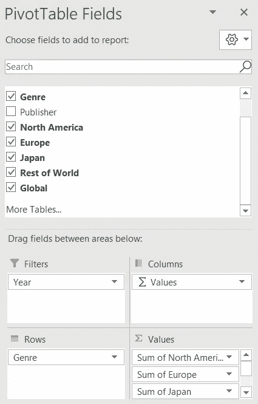

数据透视表字段。图片作者。

上图显示了 Excel 中数据透视表的数据透视表字段，数据透视表根据游戏类型显示了不同地区的视频游戏销售额。使用交互式 Excel 数据透视表，领域用户可以自由选择任意数量的国家显示在数据透视表中，而由`pandas`创建的硬编码数据透视表不能这样做。

在下面的例子中，使用的数据集是来自 Kaggle 的 [PS4 游戏销售](https://www.kaggle.com/sidtwr/videogames-sales-dataset?select=PS4_GamesSales.csv)数据。那么，用来创建数据透视表的脚本就是参考 Trenton McKinney 创建的笔记本，[如何用 Python win32com 模块](https://trenton3983.github.io/files/solutions/2020-06-22_pivot_table_win32com/create_pivot_table_with_win32com.html)在 Excel 中创建数据透视表。在 McKinney 的笔记本中，他定义了用 Python 创建综合数据、数据透视表和 Excel com 对象的函数(他还展示了如何用 Excel VBA 实现)。

他很好地优化了脚本，因此，在下面的例子中，McKinney 的脚本将用于在 Excel 中创建数据透视表。然后，我将解释如何访问数据透视表的组件，修改数据透视表的过滤器，并使用 Python 提取过滤后的数据以供进一步分析。

为了更清楚地描述我们在下面的例子中要做的事情，让我解释一下这个例子的输入和输出。输入是 CSV 格式的 PS4 游戏销售额，如下图所示。

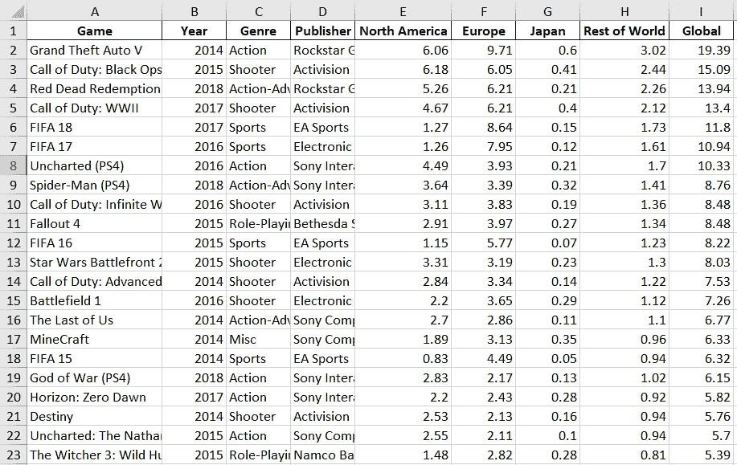

数据快照。作者创建的图像。

这些属性包括游戏的名称、出版年份、游戏类型、出版商以及游戏在北美、欧洲、日本、世界其他地区的销量和全球销量。基于这些数据，我们将创建一个数据透视表，根据游戏类型来展示 PS4 游戏在每个地区的总销售额。下图显示了我们将使用 Python `pywin32`库创建的数据透视表。

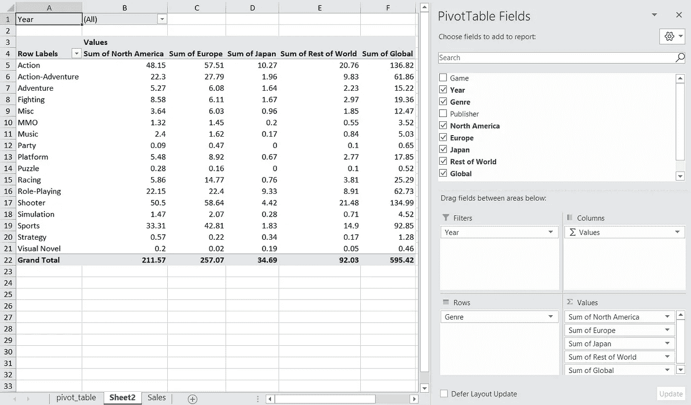

在 Excel 中创建的数据透视表。作者创建的图像。

# 创建数据透视表并用 pywin32 操作它

以下部分有五个部分:

1.  导入库
2.  读取和处理数据集
3.  创建数据透视表
4.  访问数据透视表的方法和属性
5.  修改数据透视表的过滤器并提取过滤后的数据

# 导入库

```
import win32com.client as win32
import pandas as pd
import numpy as np
from pathlib import Path
import re
import sys
win32c = win32.constants
```

# 读取和处理数据集

```
df = pd.read_csv("PS4_GamesSales.csv", encoding = 'unicode_escape', engine ='python')# remove null values
df = df.dropna()# write the csv file to xlsx File to create Pivot Table
df.to_excel("PS4_GamesSales.xlsx", sheet_name = 'Sales', index = False)
```

由于数据集中存在特殊字符，在读取 CSV 文件时需要定义`encoding` 。有兴趣的话，[这里有编码](https://stackoverflow.com/questions/61264795/pandas-unicodedecodeerror-utf-8-codec-cant-decode-bytes-in-position-0-1-in#61267213)的参考。

需要注意的一点是，当我们导出以后要用来创建透视表的数据时，我们必须设置`index = False`。如果没有，我们可能会在创建数据透视表时遇到问题，因为该函数无法判断哪一行是标签行还是标题行。

# 创建数据透视表

创建数据透视表的脚本修改自 McKinney 的[笔记本。脚本包含三个函数，分别是 `pivot_table()`、`run_excel()`和`main()`。](https://trenton3983.github.io/files/solutions/2020-06-22_pivot_table_win32com/create_pivot_table_with_win32com.html)

`pivot_table()`函数用于将数据字段分配到各自的透视表字段中(过滤器、列、行和值)。

该函数的最后一部分用于修改 Excel 对象模型的透视表对象的属性“行总计”和“列总计”值的可见性，其他属性请参见此处的。

下一个功能是`run_excel()`。该函数用于创建 Excel 对象，然后为透视表创建新的工作表。将添加到数据透视表字段的数据字段(筛选器、列、行和值)将在此定义。

透视表创建后，`wb.Save()`将保存 Excel 文件。如果不包含这一行，创建的数据透视表将会丢失。如果您正在运行此脚本以在后台或计划的作业中创建数据透视表，您可能希望分别通过`wb.Close(True)`和`excel.Quit()`关闭 Excel 文件并退出 Excel 对象。这样，您就不需要在作业完成后手动关闭 Excel 文件。或者，您可以设置`excel.Visible = False`，那么 Excel 文件将不会从头开始打开。

`main()`函数为主函数，它会调用`run_excel()`函数，然后`run_excel()`函数会执行`pivot_table()`函数。

如果您运行该函数两次，将会出现错误，因为数据透视表被编程为在名为“pivot_table”的工作表中创建，而该工作表已在第一次运行中创建，您可以更改 pt_name 或删除在第一次执行中创建的工作表。

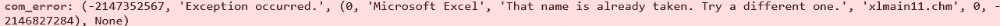

错误消息。作者创建的图像。

# 访问数据透视表的属性

可以通过操作数据透视表对象([数据透视表对象](https://docs.microsoft.com/en-us/office/vba/api/excel.pivottable)引用)的两个方法和五个属性来研究或修改数据透视表:

## 方法

1.  清除所有过滤器
2.  透视项目

## 性能

1.  当前页面(分组在数据透视字段对象下)
2.  页面范围
3.  行字段
4.  列字段
5.  表格范围 1

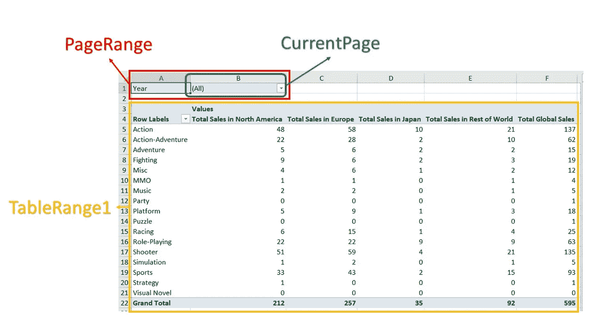

数据透视表的属性。作者创建的图像。

上图显示了数据透视表的 CurrentPage、PageRange 和 TableRange1。数据透视表字段的行字段和列字段如下图所示。

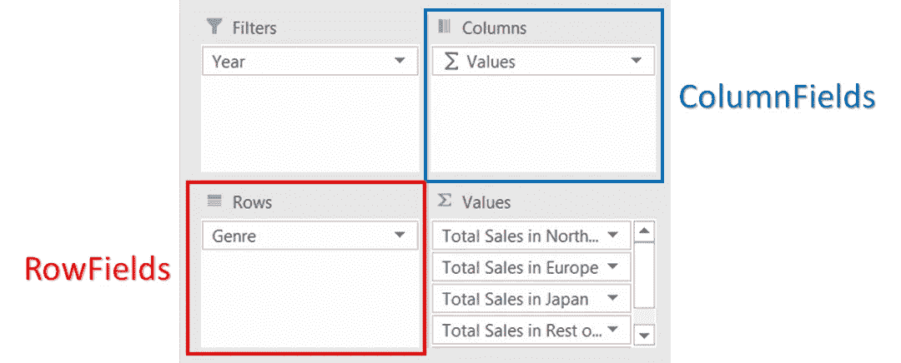

数据透视表属性。作者创建的图像。

上面提到的数据透视表方法和属性将在示例中使用，以提取过滤后的数据透视表的数据并保存到 DataFrame 中。

首先，创建 Excel 对象。虽然 Excel 对象是在创建数据透视表的过程中创建的，但我们仍然需要再次创建它，因为 Excel 对象是在函数中创建的，不能结转。

```
f_path = Path.cwd()
f_name = 'PS4_GamesSales.xlsx'
filename = f_path / f_name
# create excel object
excel = win32.gencache.EnsureDispatch('Excel.Application')# excel can be visible or not
excel.Visible = True  # False
wb = excel.Workbooks.Open(filename)  
pvtTable = wb.Sheets("pivot_table").Range("A3").PivotTable
```

## 页面范围和当前页面属性，清除所有过滤器方法

**页范围**指的是透视表的筛选字段(字段名和值)，如下图所示。


PageRange 和 CurrentPage。作者创建的图像。

**CurrentPage** 是指过滤器的值，用于设置一个过滤器**的值，而 **Page Range** 返回当前过滤器及其值。**

下面的脚本打印页面范围，然后清除所有过滤器。

```
page_range_item = []
for i in pvtTable.PageRange:
    page_range_item.append(str(i))

print(page_range_item)pvtTable.PivotFields("Year").ClearAllFilters()
```

为了提供更清晰的信息，下面的 GIF 显示了运行上面脚本的结果。我在开始时手动设置过滤器，然后打印页面范围。之后，脚本清除了所有过滤器，然后再次打印页面范围。GIF 还展示了`pywin32`有多棒，因为我们可以**立即看到对 Excel 的更改**。

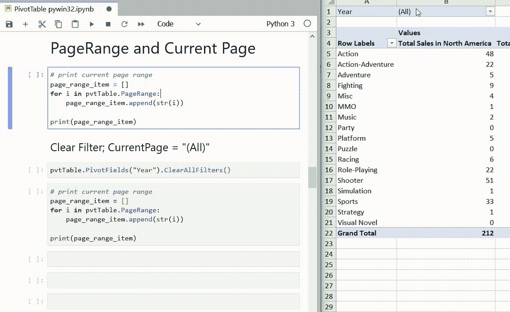

作者创建的 GIF。

```
pvtTable.PivotFields("Year").CurrentPage = "2020"
page_range_item = []
for i in pvtTable.PageRange:
    page_range_item.append(str(i))

print(page_range_item)
```

现在，让我们使用当前页面的透视字段属性来修改过滤器。

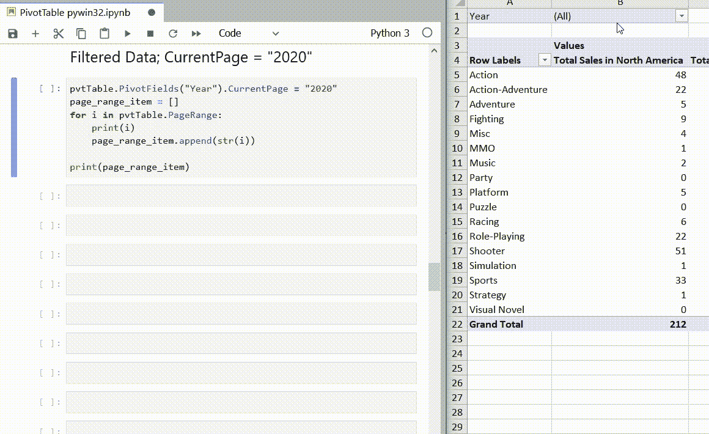

作者创建的 GIF。

因为我们必须在修改当前页面时指定 Pivot 字段，所以它只能用于一次修改一个过滤器的值。

在本例中，我们仅使用一个值进行过滤。过滤多个值的方法显示在最后一个示例中，这也是修改数据透视表过滤器然后提取过滤数据的完整示例。

## **行字段/列字段**

行字段和列字段将列出创建透视表时透视表字段中添加到行字段或列字段的所有字段。

```
row_fields_item = []
for i in pvtTable.RowFields:
    row_fields_item.append(str(i))

print(row_fields_item)column_fields_item = []
for i in pvtTable.ColumnFields:
    column_fields_item.append(str(i))

print(column_fields_item)
```

在我们的例子中，行字段是“类型”,而列字段是自动生成的“值”。但是，我们可以用下面的脚本禁用它。

```
wb.Sheets("pivot_table").PivotTables("example").DisplayFieldCaptions = False
```

下面的 GIF 说明了上面脚本的结果。

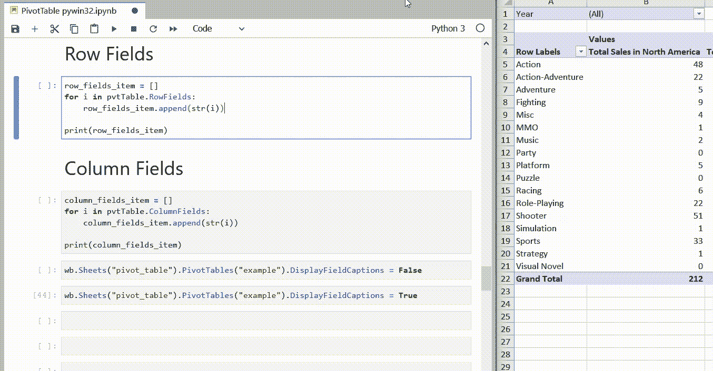

作者创建的 GIF。

“值”和“行标签”是字段标题，而不是数据字段。脚本与下面的操作相同。

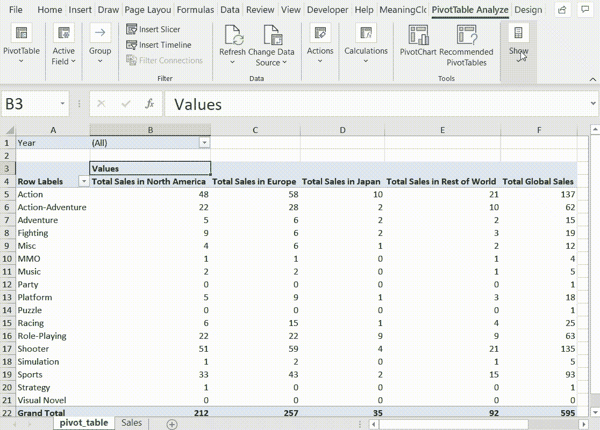

作者创建的 GIF。

## **表格范围 1**

TableRange1 打印不带页范围的数据，如果还想打印页字段，可以参考透视表的 TableRange2 属性。

```
table_data = []
for i in pvtTable.TableRange1:
    #print(i)
    table_data.append(str(i))

print(table_data)
```

表区域 1 属性以列表形式返回结果。

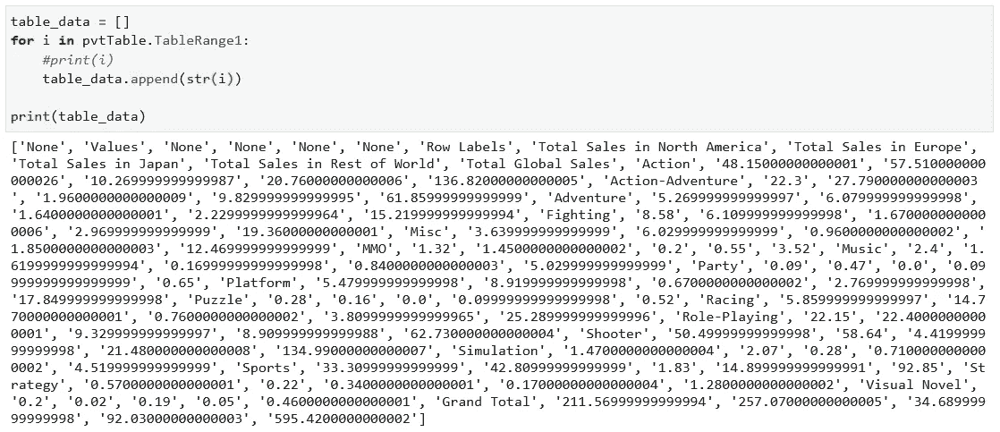

要将列表转换成数据帧，我们需要知道数据透视表的实际维度。通过在创建透视表的脚本中添加`pt_fields`并为行项目的列添加 1，可以很容易地确定列的数量。在本例中，`pt_fields`中有五个项目，“北美总销售额”、“欧洲总销售额”、“日本总销售额”、“世界其他地区总销售额”、“全球总销售额”。所以有了`number of columns = 5 + 1 = 6`。

复杂的部分是确定行数。在本文的示例中，有三行**是根据列字段标题(“值”)、数据透视表字段行(“北美总销售额”、“欧洲总销售额”、“日本总销售额”、“世界其他地区总销售额”、“全球总销售额”)和列的总计构建的。其他行是经过过滤后的行字段中的**项。****

**我通过使用 RegEx 删除列字段(" Values ")和`pt_fields`项、其他标签(如"行标签"、"列标签"、"总计"和"无")以及数据透视表中的所有数值，获得了行字段中的项数。**

**在获得数据透视表的列数和行数之后，可以将表范围 1 中的列表整形为 DataFrame。**

**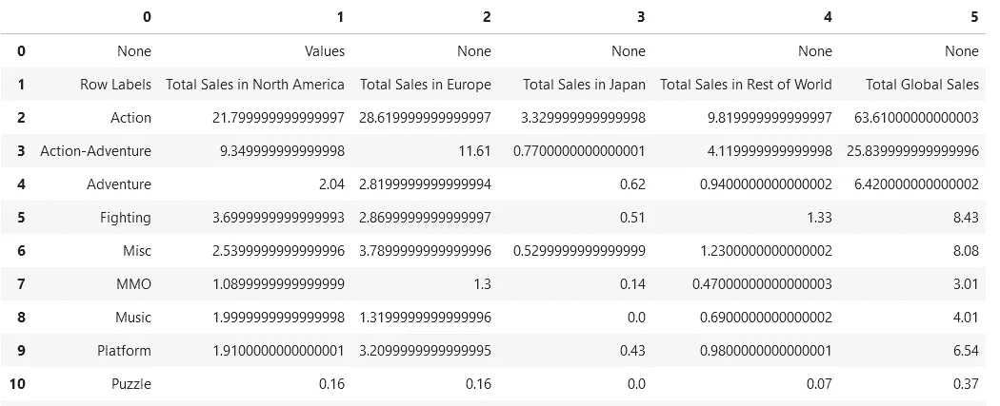**

**将列表重塑为作者创建的数据帧图像。**

**在这个阶段，数据帧不能检测到正确的标题，即表格的第二行。因此，我们将第二行(row index = 1)设置为 header，然后删除前两行。有多种方法可以做到这一点，您可以重命名该列，然后删除前两行。**

```
df.columns=df.iloc[1]
df = df.drop(index = 0)
df = df.drop(index = 1)
```

# **修改数据透视表的过滤器并提取过滤后的数据**

**现在，让我们将所有内容结合起来，根据条目列表修改过滤器，然后提取过滤后的数据透视表数据并将其保存为 DataFrame。**

```
# Find all items in Year
year_items = []
for item in pvtTable.PivotFields("Year").PivotItems():
    year = str(item)
    year_items.append(year)year_to_include = ['2013','2014','2015']
year_to_exclude = [x for x in year_items if x not in year_to_include]
```

**在我们修改过滤器之前，知道过滤器中包含的项目的确切数量是很重要的。在我们的例子中，过滤器是“年”。这一步可以通过使用 Pivot Table 方法来完成，Pivot Items()如上面的脚本所示。**

**下面是修改过滤器的完整函数，然后将过滤后的数据透视表提取为 DataFrame。**

**让我们在下面的 GIF 中见证这一点。**

**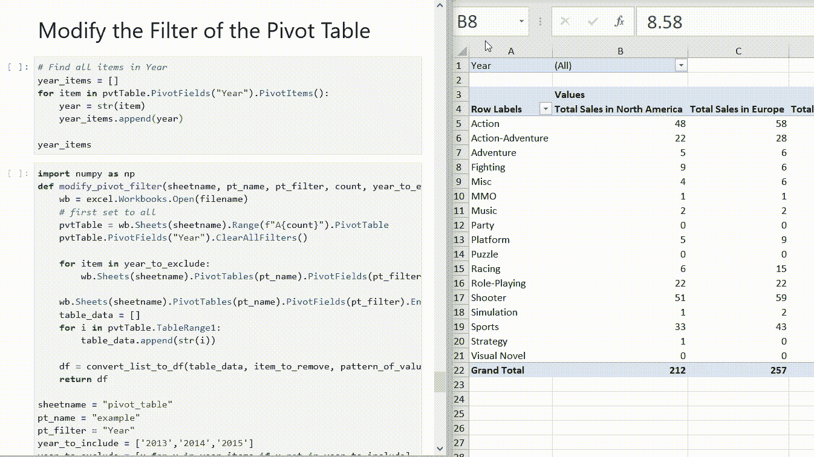**

**作者创建的 GIF**

# **额外收获:创建不同数据透视表的多个工作表**

**收到关于如何创建不同数据透视表的多个工作表的询问。我们可以修改`run_excel()`函数来实现。**

**我们只需要复制脚本中设置和调用`pivot_table()`函数的部分。记得根据需要修改细节。最重要的是，我们需要更改保存新工作表标题和新工作表对象的变量名。如果没有，您可能想知道为什么在工作簿中只创建了一个数据透视表。😂我在下面的代码中加粗了您可能需要注意的变量名。**

```
# Setup second pivot table and call pivot_table**ws3_name** = 'pivot_table_2'
wb.Sheets.Add().Name = **ws3_name**
**ws3** = wb.Sheets(**ws3_name**)pt_name = 'example'  # must be a string
pt_rows = ['expense']  # must be a list
pt_cols = ['products']  # must be a list
pt_filters = ['date']  # must be a list# [0]: field name [1]: pivot table column name [3]: calulation method [4]: number format
pt_fields = [['price', 'price: mean', win32c.xlAverage, '$#,##0.00']]  # must be a list of listspivot_table(wb, ws1, **ws3**, **ws3_name**, pt_name, pt_rows, pt_cols, pt_filters, pt_fields)
```

**谢谢你读到这里，这是我知道的一篇长文。这之后还有一点，如果你想在工作中使用`pywin32`，这是必不可少的。**

# **你可能面临的错误**

****

**错误。作者图片**

**在执行创建数据透视表的脚本时，我遇到过几次这样的错误。幸运的是，我在[栈溢出](https://stackoverflow.com/questions/52889704/python-win32com-excel-com-model-started-generating-errors)上找到了解决方案。解决办法很简单。我们只需要删除下面脚本返回的路径中的文件夹标题“00020813–0000–0000–C000–00000000046 x 0x 1 x 9”。**

```
import win32com
print(win32com.__gen_path__)
```

**由于这是一个周期性(不是每天)出现的重复问题，我建议您运行以下脚本，在显示错误时直接删除文件夹。**

```
import win32com
import shutil
path = win32com.__gen_path__
shutil.rmtree(path)
```

# **边注**

**如果你对 Excel 对象模型的对象、方法和属性感到困惑，或者想知道如何将 Excel VBA 的脚本翻译成 Python，可以看看[用 Python](/automate-excel-with-python-7c0e8c7c6256) 自动化 Excel。**

**如果您有兴趣使用 Python 创建图表或数据透视图，并将其自动导出为图像，请使用 Python 自动制作 Excel 图表。**

**如果你有兴趣知道如何使用`pywin32`访问 Microsoft Outlook 邮件和下载附件，你可以参考这篇文章“用 Python 自动下载邮件附件[”。](/automatic-download-email-attachment-with-python-4aa59bc66c25)**

**如果您的工作使用 Google Sheet 而不是 Microsoft Excel，您可以参考这篇文章“自动化 Google Sheet Report[”以了解可能的自动化。](/automate-google-sheet-reporting-in-5-minutes-8bbdc1f8e293)**

# **保持联系**

**在 YouTube[上订阅](https://www.youtube.com/channel/UCiMtx0qbILP41Ot-pkk6eJw)**

# **参考**

1.  **[如何用 Python win32com 模块在 Excel 中创建透视表](https://trenton3983.github.io/files/solutions/2020-06-22_pivot_table_win32com/create_pivot_table_with_win32com.html)**
2.  **[Excel VBA 参考](https://docs.microsoft.com/en-us/office/vba/api/overview/excel)**

***祝贺并感谢你阅读到最后。希望你喜欢这篇文章。* ☺️**

****

**亚历山大·莱多戈罗夫在 [Unsplash](https://unsplash.com/s/photos/peace?utm_source=unsplash&utm_medium=referral&utm_content=creditCopyText) 上的照片**